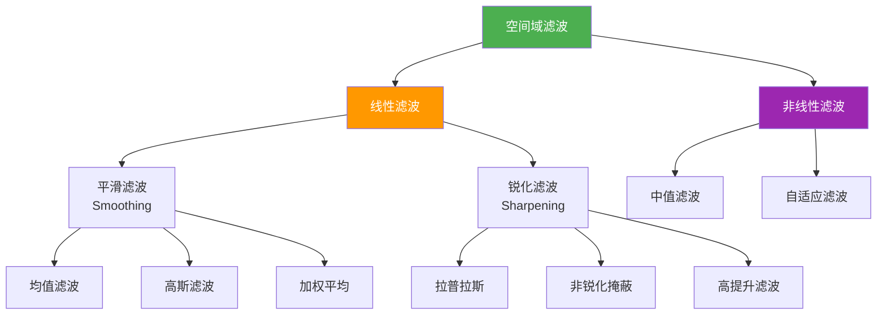
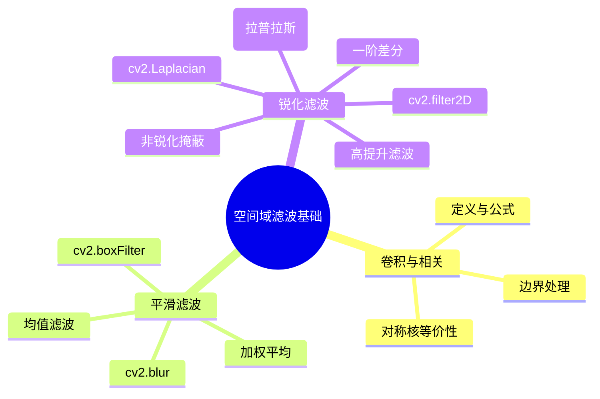

# 2.3 空间域滤波基础

## 📖 基本概念

空间域滤波（Spatial Filtering）是在图像像素空间直接进行的卷积/相关运算，通过邻域像素的加权组合来改变中心像素的值。滤波器（Kernel/Filter Mask）定义了邻域内各像素的权重。

### 滤波分类体系



## 🔬 卷积与相关运算

### 相关运算（Correlation）

相关运算直接将滤波器核在图像上滑动，不进行翻转：

$$w(x,y) = \sum_{m=-a}^{a} \sum_{n=-b}^{b} w(m,n) \cdot f(x+m, y+n)$$

其中 $w(m,n)$ 为滤波器核，$f(x,y)$ 为输入图像，输出在位置 $(x,y)$ 的响应为邻域内像素的加权和。

### 卷积运算（Convolution）

卷积运算在相关运算的基础上，将滤波器核翻转 $180°$（即 $w(m,n) \rightarrow w(-m,-n)$）：

$$w(x,y) = \sum_{m=-a}^{a} \sum_{n=-b}^{b} w(m,n) \cdot f(x-m, y-n)$$

**等价写法**：

$$w(x,y) = (w * f)(x,y) = \sum_{m} \sum_{n} w(m,n) \cdot f(x-m, y-n)$$

### 卷积 vs 相关

| 对比项 | 相关（Correlation） | 卷积（Convolution） |
|--------|---------------------|---------------------|
| 核的使用 | 直接使用 | 翻转 180° 后使用 |
| 公式 | $\sum w(m,n) \cdot f(x+m, y+n)$ | $\sum w(m,n) \cdot f(x-m, y-n)$ |
| 计算复杂度 | 相同 | 相同 |
| 适用场景 | 模板匹配 | 滤波理论分析 |

**重要结论**：当滤波器核是**对称核**时，卷积与相关的结果完全相同。多数实用滤波器核（均值、高斯、拉普拉斯等）都是对称核，因此两者可以互换使用。

### 边界处理

滤波运算涉及邻域像素，图像边界处的像素没有完整邻域，需要特殊处理：

| 方法 | 描述 | OpenCV 参数 |
|------|------|-------------|
| 常数填充 | 用常数填充边界 | `BORDER_CONSTANT` |
| 复制填充 | 复制边界像素 | `BORDER_REPLICATE` |
| 反射填充 | 镜像反射 | `BORDER_REFLECT` |
| 对折反射 | 镜像反射（不重复边缘） | `BORDER_REFLECT_101` |
| 周期填充 | 周期性扩展 | `BORDER_WRAP` |

### Python 实现

```python
import cv2
import numpy as np
from scipy import signal

img = cv2.imread('input.jpg', cv2.IMREAD_GRAYSCALE)

# 手动实现相关运算
def correlation_manual(image, kernel):
    h, w = image.shape
    kh, kw = kernel.shape
    pad_h, pad_w = kh // 2, kw // 2
    padded = np.pad(image, ((pad_h, pad_h), (pad_w, pad_w)), mode='reflect')
    output = np.zeros_like(image, dtype=np.float64)
    for i in range(h):
        for j in range(w):
            region = padded[i:i+kh, j:j+kw].astype(np.float64)
            output[i, j] = np.sum(region * kernel)
    return np.uint8(np.clip(output, 0, 255))

# 使用 scipy.signal.correlate
kernel = np.ones((3, 3)) / 9.0
result_scipy = signal.correlate(img.astype(np.float64), kernel, mode='same', method='auto')
result_scipy = np.uint8(np.clip(result_scipy, 0, 255))

# 使用 OpenCV
result_cv = cv2.filter2D(img, -1, kernel)
```

## 🌊 平滑滤波器

平滑滤波器（Smoothing Filter）用于减少图像噪声，也称为**低通滤波器**（Low-pass Filter）。

### 均值滤波（Mean Filter）

$$w(x,y) = \frac{1}{MN} \sum_{(m,n) \in R_{xy}} f(m,n)$$

滤波器核：

$$\frac{1}{9} \begin{bmatrix} 1 & 1 & 1 \\ 1 & 1 & 1 \\ 1 & 1 & 1 \end{bmatrix}$$

**特点**：
- 最简单的平滑滤波器
- 对椒盐噪声（Salt-and-pepper）效果差
- 会模糊边缘

### 加权平均滤波器

$$w(x,y) = \frac{\sum_{(m,n) \in R_{xy}} w(m,n) \cdot f(m,n)}{\sum_{(m,n) \in R_{xy}} w(m,n)}$$

中心像素权重通常设为最大（如 2），距离中心越远权重越小：

$$\frac{1}{10} \begin{bmatrix} 1 & 1 & 1 \\ 1 & 2 & 1 \\ 1 & 1 & 1 \end{bmatrix}$$

### OpenCV 实现

```python
import cv2
import numpy as np

img = cv2.imread('noisy_image.jpg', cv2.IMREAD_GRAYSCALE)

# 均值滤波
img_blur = cv2.blur(img, (5, 5))

# 归一化方框滤波
img_box = cv2.boxFilter(img, -1, (5, 5), normalize=True)

# 非归一化方框滤波
img_box_raw = cv2.boxFilter(img, -1, (5, 5), normalize=False)

# 自定义加权滤波
kernel_weighted = np.array([[1, 1, 1],
                            [1, 2, 1],
                            [1, 1, 1]], dtype=np.float64) / 10.0
img_weighted = cv2.filter2D(img, -1, kernel_weighted)

# 可视化
fig, axes = plt.subplots(1, 4, figsize=(20, 5))
titles = ['Original', 'Mean Filter', 'Box Filter', 'Weighted']
images = [img, img_blur, img_box, img_weighted]
for ax, title, im in zip(axes, titles, images):
    ax.imshow(im, cmap='gray')
    ax.set_title(title)
    ax.axis('off')
plt.tight_layout()
plt.show()
```

## 🔥 锐化滤波器

锐化滤波器（Sharpening Filter）用于增强图像的边缘和细节，也称为**高通滤波器**（High-pass Filter）。

### 一阶差分算子

$$\nabla f = \frac{\partial f}{\partial x} + \frac{\partial f}{\partial y}$$

#### 差分算子

**水平差分**：

$$\frac{\partial f}{\partial x} \approx f(x+1, y) - f(x, y)$$

核：$\begin{bmatrix} -1 & 1 \end{bmatrix}$ 或 $\begin{bmatrix} -1 & 0 \\ 1 & 0 \end{bmatrix}$

**垂直差分**：

$$\frac{\partial f}{\partial y} \approx f(x, y+1) - f(x, y)$$

核：$\begin{bmatrix} -1 \\ 1 \end{bmatrix}$ 或 $\begin{bmatrix} -1 & -1 \\ 0 & 0 \end{bmatrix}$

### 二阶差分算子 — 拉普拉斯（Laplacian）

$$\nabla^2 f = \frac{\partial^2 f}{\partial x^2} + \frac{\partial^2 f}{\partial y^2}$$

离散形式：

$$\nabla^2 f(x,y) = f(x+1,y) + f(x-1,y) + f(x,y+1) + f(x,y-1) - 4f(x,y)$$

核 1（4-邻域）：

$$\begin{bmatrix} 0 & 1 & 0 \\ 1 & -4 & 1 \\ 0 & 1 & 0 \end{bmatrix}$$

核 2（8-邻域）：

$$\begin{bmatrix} 1 & 1 & 1 \\ 1 & -8 & 1 \\ 1 & 1 & 1 \end{bmatrix}$$

### 非锐化掩蔽（Unsharp Masking）

$$g(x,y) = f(x,y) + k \cdot [f(x,y) - \bar{f}(x,y)]$$

其中 $f(x,y)$ 为原始图像，$\bar{f}(x,y)$ 为平滑图像，$k$ 为增益系数（通常取 1.0 ~ 2.0）。

**算法步骤**：

1. 对原始图像做平滑（如高斯模糊），得到 $\bar{f}$
2. 计算掩蔽（mask）：$f - \bar{f}$
3. 将掩蔽叠加到原图：$g = f + k \cdot (f - \bar{f})$

### OpenCV 实现

```python
import cv2
import numpy as np

img = cv2.imread('input.jpg', cv2.IMREAD_GRAYSCALE)

# 1. 拉普拉斯锐化
laplacian = cv2.Laplacian(img, cv2.CV_64F)
laplacian_uint = cv2.convertScaleAbs(laplacian)

# 2. 非锐化掩蔽
img_blur = cv2.GaussianBlur(img, (5, 5), 1.0)
mask = cv2.subtract(img, img_blur)
k = 1.5
unsharp = cv2.add(img, cv2.convertScaleAbs(mask, alpha=k))

# 3. 高提升滤波（High-boost）
A = 1.5
high_boost = cv2.subtract(
    cv2.convertScaleAbs(img, alpha=A),
    img_blur
)

# 可视化
fig, axes = plt.subplots(1, 4, figsize=(20, 5))
titles = ['Original', 'Laplacian', 'Unsharp Masking', 'High-boost']
images = [img, laplacian_uint, unsharp, high_boost]
for ax, title, im in zip(axes, titles, images):
    ax.imshow(im, cmap='gray')
    ax.set_title(title)
    ax.axis('off')
plt.tight_layout()
plt.show()
```

### 各锐化方法对比

| 方法 | 核大小 | 特点 | 适用场景 |
|------|--------|------|----------|
| 差分算子 | 2×2 | 最简单，噪声敏感 | 理想（无噪声）图像 |
| 拉普拉斯 | 3×3 | 二阶差分，对噪声敏感 | 需要二值化边缘 |
| 非锐化掩蔽 | 可调 | 效果自然，参数 $k$ 可控 | 通用锐化增强 |
| 高提升滤波 | 可调 | 强调高频成分 | 需要增强细节 |

## 💻 完整示例：平滑 + 锐化对比

```python
import cv2
import numpy as np
import matplotlib.pyplot as plt

img = cv2.imread('input.jpg', cv2.IMREAD_GRAYSCALE)

# 添加高斯噪声
noise = np.random.normal(0, 25, img.shape).astype(np.float64)
noisy = np.clip(img.astype(np.float64) + noise, 0, 255).astype(np.uint8)

# 平滑滤波
mean = cv2.blur(noisy, (5, 5))
box = cv2.boxFilter(noisy, -1, (5, 5), normalize=True)

# 锐化滤波
lap = cv2.convertScaleAbs(cv2.Laplacian(img, cv2.CV_64F))
blur = cv2.GaussianBlur(img, (5, 5), 1.0)
unsharp = cv2.add(img, cv2.convertScaleAbs(cv2.subtract(img, blur), alpha=1.5))

# 展示
fig, axes = plt.subplots(2, 3, figsize=(18, 10))
titles = ['Original', 'Noisy', 'Mean Smooth', 'Box Smooth', 'Laplacian', 'Unsharp']
images = [img, noisy, mean, box, lap, unsharp]
for ax, title, im in zip(axes.flatten(), titles, images):
    ax.imshow(im, cmap='gray')
    ax.set_title(title)
    ax.axis('off')
plt.tight_layout()
plt.show()
```

## ❓ 常见问题

### Q1：为什么平滑滤波能去噪？

图像中的噪声通常表现为高频成分（灰度值的剧烈跳变）。平滑滤波器（低通滤波器）通过邻域平均的方式，将高频成分"平滑掉"，从而去除噪声。但同时也会损失边缘细节。

### Q2：锐化滤波为什么会放大噪声？

锐化滤波器（高通滤波器）本质上是对邻域像素做差分运算，强调灰度值的变化。噪声恰好是灰度值剧烈变化的部分，因此在增强边缘的同时也放大了噪声。

**解决方案**：先做平滑去噪，再做锐化；或使用带噪点抑制的锐化方法（如双边滤波 + 锐化）。

### Q3：`cv2.filter2D` 和 `cv2.blur` 的关系？

- `cv2.blur` 是均值滤波的专用函数，内部调用 `filter2D` 实现
- `cv2.filter2D` 是通用的滤波器，可使用任意核
- 对于均值滤波，`blur` 比 `filter2D` 更简洁高效

### Q4：为什么拉普拉斯核的和为 0？

拉普拉斯算子是二阶差分的近似，对于恒定灰度区域（$f=const$），二阶导数为 0，因此核的权重之和必须为 0，确保对恒定区域无响应。$\sum w_i = 0$ 是高通滤波器的必要条件。

## 📊 知识总结



> 📌 **关键总结**：空间域滤波是图像处理中最基础也是最重要的技术之一。平滑滤波去除噪声但模糊边缘，锐化滤波增强边缘但放大噪声。实际应用中常将两者结合使用，如"先平滑去噪，再锐化增强"。理解卷积/相关运算的数学本质，是掌握后续频域滤波的基础。