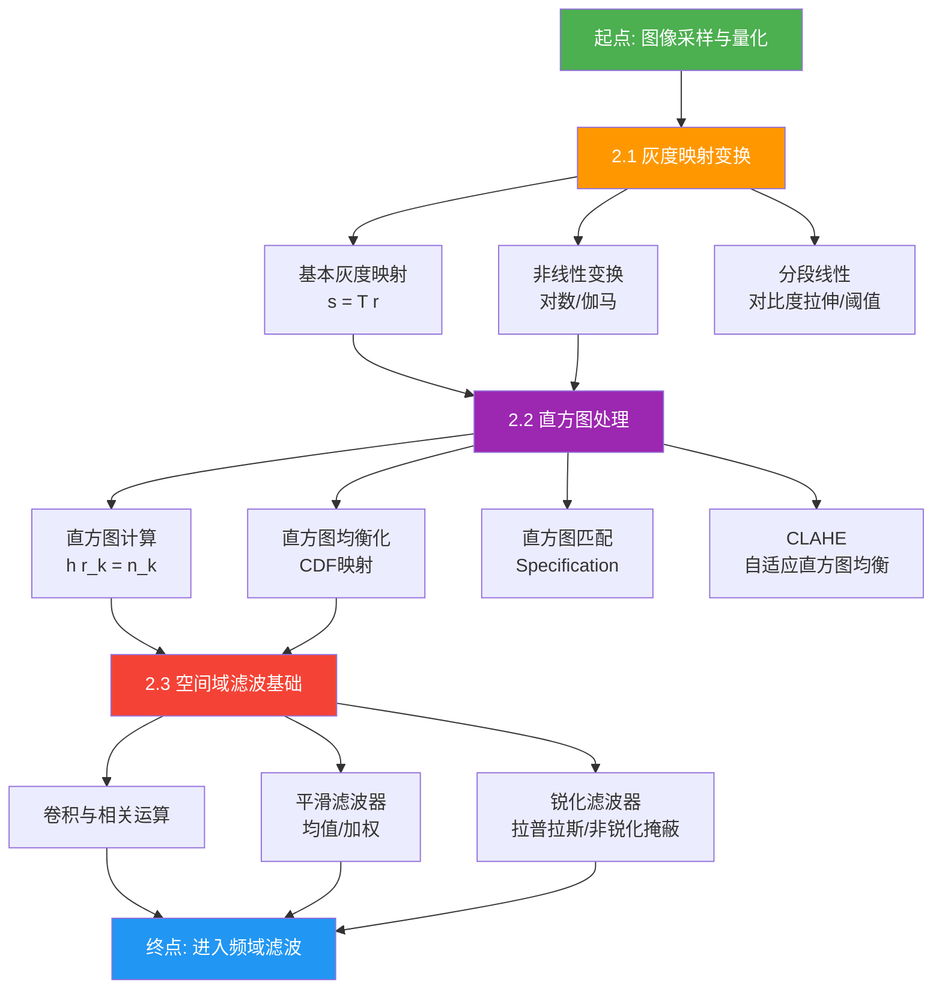
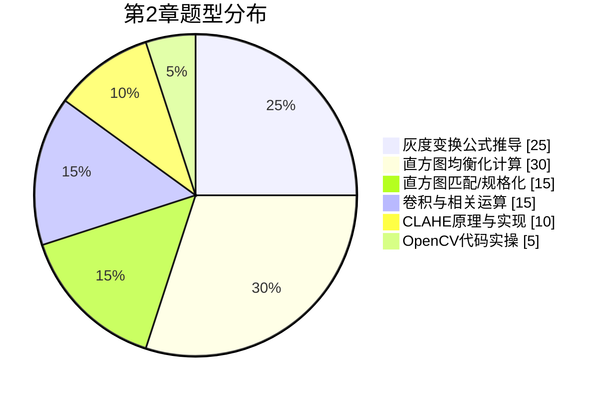
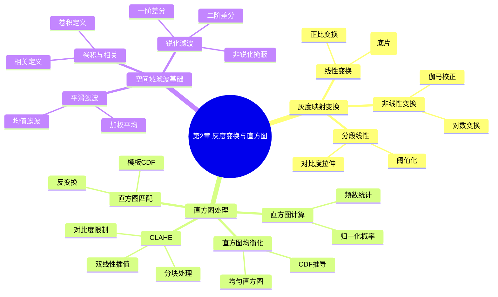

# 第2章 图像灰度变换与直方图处理 — 思维导图总览

## 📌 章节导航

| 知识点 | 核心内容 | 重要度 | 推荐学时 |
|--------|----------|--------|----------|
| [2.1 灰度映射变换](./2.1%20灰度映射变换.md) | 线性/非线性变换、对数变换、伽马校正、分段线性 | ⭐⭐⭐⭐ | 3h |
| [2.2 直方图处理](./2.2%20直方图处理.md) | 直方图计算、直方图均衡化、直方图匹配、CLAHE | ⭐⭐⭐⭐⭐ | 4h |
| [2.3 空间域滤波基础](./2.3%20空间域滤波基础.md) | 卷积/相关运算、平滑滤波、锐化滤波入门 | ⭐⭐⭐⭐ | 3h |

## 🗺️ 学习路线图

## 🎯 核心考点

### 高频考点（考研408 & 视觉竞赛）

1. **灰度变换公式推导**：线性变换 $s = a \cdot r + b$，对数变换 $s = c \cdot \log(1+r)$，幂次变换 $s = c \cdot r^\gamma$
2. **直方图均衡化**：CDF 推导均衡化映射函数，$\Delta s_k = f(r_k) = \frac{(MN-1)}{MN} \sum_{j=0}^{k} p(r_j)$
3. **直方图匹配**：先对输入和模板分别做均衡化，再通过反变换实现匹配
4. **卷积运算**：$(f * g)(x,y) = \sum_{m} \sum_{n} f(m,n) \cdot g(x-m, y-n)$，注意与相关运算的区别
5. **CLAHE 原理**：限制对比度因子 clip limit，分块处理 + 双线性插值

### 典型题型分布

## 📝 自测题

### 基础题

1. 给定图像灰度级 $r$ 范围 $[0, L-1]$，写出将灰度范围线性映射到 $[s_{\min}, s_{\max}]$ 的变换公式。

2. 解释为什么对数变换适合于显示动态范围很大的图像（如医学 X 光片）。

3. 对一幅 $64 \times 64$ 的 8-bit 图像做直方图均衡化，已知原始直方图，写出均衡化后第 $k$ 级灰度的映射公式。

### 进阶题

4. 证明：直方图均衡化后得到的直方图并非完全均匀（理想情况下是均匀的，但实际由于灰度级离散性会有偏差）。

5. 简述直方图匹配（Specification）的步骤。若希望将输入图像的直方图匹配到一个特定的模板直方图，写出完整的数学流程。

6. 对比卷积（Convolution）与相关（Correlation）的区别，写出两者的公式，并说明在滤波场景下应如何选择。

### 应用题

7. 给定一幅受低对比度影响的图像，设计一个基于分段线性变换的方案，要求：
   - 保持暗部细节（灰度 $0 \sim 50$ 不变）
   - 拉伸中间调（灰度 $50 \sim 150$ 映射到 $50 \sim 200$）
   - 压缩高光（灰度 $150 \sim 255$ 映射到 $200 \sim 255$）
   写出变换公式并用 Python/OpenCV 实现。

8. 使用 OpenCV 的 `cv2.createCLAHE` 对一幅低对比度图像做 CLAHE 处理，调节 `clipLimit` 和 `tileGridSize` 参数，观察并分析不同参数下的效果差异。

## 📚 章节知识结构图

## 🔗 关联知识点

- **前置知识**：[[第1章 数字图像处理基础]]（像素、分辨率、位深度）
- **后续知识**：[[第3章 图像空间域滤波]]（平滑/锐化的深入讨论）、[[第4章 频域滤波]]（傅里叶变换）
- **跨学科关联**：概率论（CDF、概率密度）、线性代数（卷积矩阵表示）