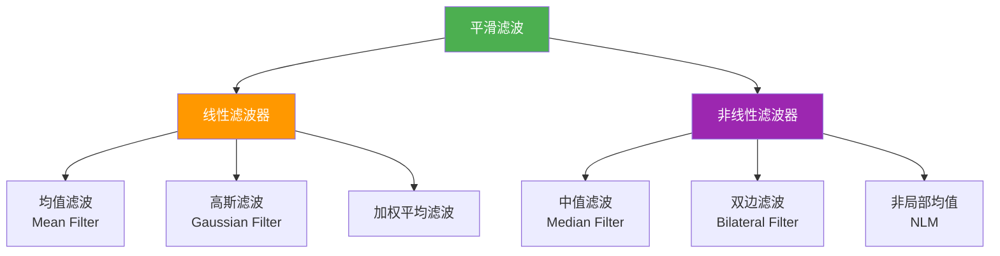
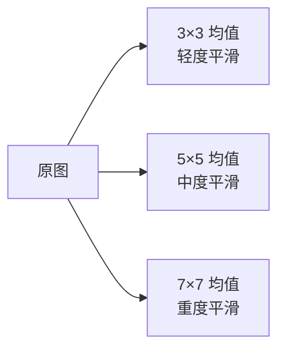
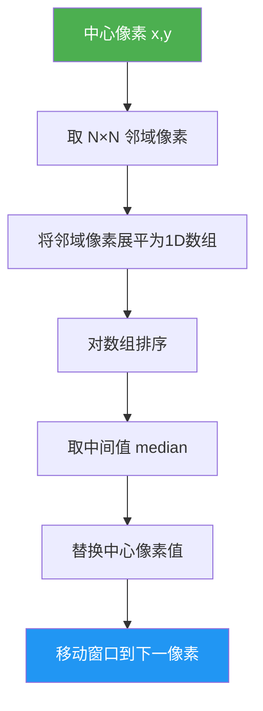
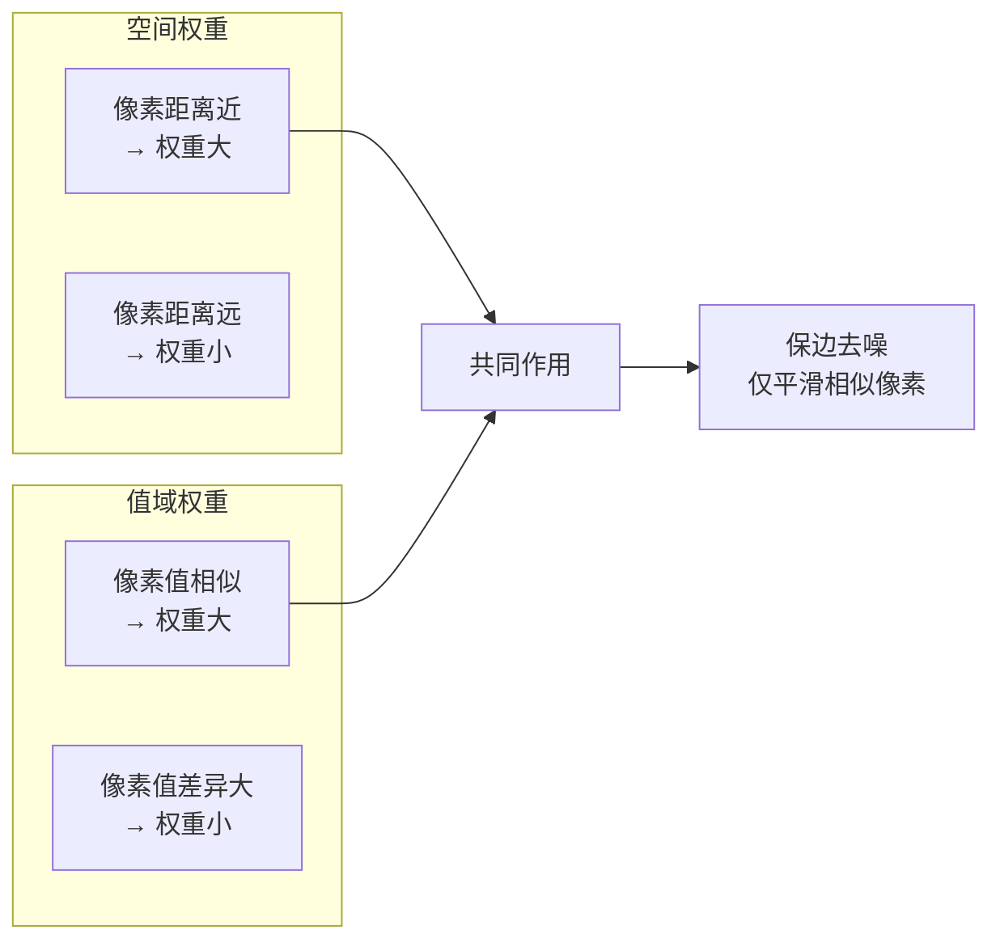

# 3.1 平滑滤波

## 📖 基本概念

平滑滤波（Smoothing Filter），也称**低通滤波**（Low-pass Filter），通过对邻域像素进行加权平均来减少图像中的高频成分（噪声、边缘细节）。滤波器核越大，平滑效果越强，但细节损失也越大。

### 平滑滤波分类体系



## 🔬 均值滤波（Mean Filter）

### 定义

均值滤波用邻域内所有像素的算术平均值代替中心像素值：

$$g(x,y) = \frac{1}{MN} \sum_{(m,n) \in R_{xy}} f(m,n)$$

其中 $R_{xy}$ 为以 $(x,y)$ 为中心的邻域，$M \times N$ 为邻域大小。

### 滤波器核

$3 \times 3$ 均值核：

$$w = \frac{1}{9} \begin{bmatrix} 1 & 1 & 1 \\ 1 & 1 & 1 \\ 1 & 1 & 1 \end{bmatrix}$$

$5 \times 5$ 均值核：

$$w = \frac{1}{25} \begin{bmatrix} 1 & 1 & 1 & 1 & 1 \\ 1 & 1 & 1 & 1 & 1 \\ 1 & 1 & 1 & 1 & 1 \\ 1 & 1 & 1 & 1 & 1 \\ 1 & 1 & 1 & 1 & 1 \end{bmatrix}$$

### 特点

- ✅ 实现简单，计算速度快
- ❌ 对椒盐噪声效果差（极端值会严重影响均值）
- ❌ 会模糊图像边缘和细节
- ❌ 核越大，模糊越严重

### OpenCV 实现

```python
import cv2
import numpy as np

img = cv2.imread('noisy_image.jpg', cv2.IMREAD_GRAYSCALE)

# 3×3 均值滤波
img_mean_3 = cv2.blur(img, (3, 3))

# 5×5 均值滤波
img_mean_5 = cv2.blur(img, (5, 5))

# 7×7 均值滤波
img_mean_7 = cv2.blur(img, (7, 7))

# 使用 boxFilter 实现（等价于 blur）
kernel_size = 5
img_box = cv2.boxFilter(img, -1, (kernel_size, kernel_size), normalize=True)
```

### 效果对比图



## 📈 高斯滤波（Gaussian Filter）

### 定义

高斯滤波使用高斯函数（正态分布）作为滤波器权重，是最常用的平滑滤波器之一。

### 二维高斯函数

$$G(x,y) = \frac{1}{2\pi\sigma^2} \cdot e^{-\frac{x^2 + y^2}{2\sigma^2}}$$

其中：
- $\sigma$ 为标准差，控制高斯曲线的宽度（平滑程度）
- $\sigma^2$ 为方差
- $\frac{1}{2\pi\sigma^2}$ 为归一化系数，保证积分为 1

### 高斯核生成

以 $3 \times 3$ 核，$\sigma = 1.0$ 为例：

$$
G = \frac{1}{2\pi \cdot 1^2}
\begin{bmatrix}
e^{-2/2} & e^{-1/2} & e^{-2/2} \\
e^{-1/2} & e^{0}     & e^{-1/2} \\
e^{-2/2} & e^{-1/2} & e^{-2/2}
\end{bmatrix}
=
\frac{1}{2\pi}
\begin{bmatrix}
0.135 & 0.242 & 0.135 \\
0.242 & 0.383 & 0.242 \\
0.135 & 0.242 & 0.135
\end{bmatrix}
$$

归一化后（约）：

$$\begin{bmatrix} 0.061 & 0.124 & 0.061 \\ 0.124 & 0.598 & 0.124 \\ 0.061 & 0.124 & 0.061 \end{bmatrix}$$

### σ 参数的影响

| σ 值 | 核大小 | 平滑程度 | 适用场景 |
|------|--------|----------|----------|
| 0.5 | 3×3 | 轻度平滑 | 微小噪声去除 |
| 1.0 | 3×3 / 5×5 | 中度平滑 | 通用去噪 |
| 2.0 | 5×5 / 7×7 | 重度平滑 | 强噪声去除 |
| 4.0+ | 11×11+ | 极强平滑 | 极端噪声 |

### 高斯核的生成代码

```python
import numpy as np

def gaussian_kernel(size, sigma):
    kernel = np.zeros((size, size), dtype=np.float64)
    center = size // 2
    for i in range(size):
        for j in range(size):
            x = i - center
            y = j - center
            kernel[i, j] = np.exp(-(x**2 + y**2) / (2 * sigma**2))
    kernel /= (2 * np.pi * sigma**2)
    kernel /= kernel.sum()
    return kernel

kernel_3 = gaussian_kernel(3, 1.0)
kernel_5 = gaussian_kernel(5, 1.4)
kernel_7 = gaussian_kernel(7, 2.0)
```

### OpenCV 实现

```python
import cv2
import numpy as np

img = cv2.imread('noisy_image.jpg', cv2.IMREAD_GRAYSCALE)

# 3×3 高斯，σ=0.5
img_gauss_3 = cv2.GaussianBlur(img, (3, 3), 0.5)

# 5×5 高斯，σ=1.0
img_gauss_5 = cv2.GaussianBlur(img, (5, 5), 1.0)

# 7×7 高斯，σ=2.0
img_gauss_7 = cv2.GaussianBlur(img, (7, 7), 2.0)

# 自定义核
custom_kernel = gaussian_kernel(5, 1.4)
img_custom_gauss = cv2.filter2D(img, -1, custom_kernel)
```

### 特点

- ✅ 权重随距离中心递减，比均值滤波更自然
- ✅ 频响特性好，等效于低通滤波器
- ❌ 对椒盐噪声效果不佳
- ❌ 仍会模糊边缘（虽然比均值滤波好）

## 🧂 椒盐噪声与中值滤波

### 椒盐噪声（Salt-and-Pepper Noise）

椒盐噪声由随机的黑白像素点组成，通常是传感器故障或传输错误导致：

$$f_{noisy}(x,y) = \begin{cases} 0 & \text{with probability } p \\ 255 & \text{with probability } q \\ f(x,y) & \text{otherwise} \end{cases}$$

### 中值滤波（Median Filter）

中值滤波是基于**排序统计**的非线性滤波器，取邻域内像素的中值代替中心像素：

$$g(x,y) = \text{median}\{f(x-m, y-n), \quad (m,n) \in R_{xy}\}$$

#### 算法步骤



#### 3×3 窗口示意

$$
\begin{bmatrix}
f(x-1,y-1) & f(x,y-1) & f(x+1,y-1) \\
f(x-1,y)   & f(x,y)   & f(x+1,y)   \\
f(x-1,y+1) & f(x,y+1) & f(x+1,y+1)
\end{bmatrix}
\rightarrow
\text{sort} \rightarrow
\text{median}
$$

#### OpenCV 实现

```python
import cv2
import numpy as np

img = cv2.imread('salt_pepper_noise.jpg', cv2.IMREAD_GRAYSCALE)

# 3×3 中值滤波
img_median_3 = cv2.medianBlur(img, 3)

# 5×5 中值滤波
img_median_5 = cv2.medianBlur(img, 5)

# 手动实现中值滤波
def manual_median(image, kernel_size):
    h, w = image.shape
    result = np.zeros_like(image)
    pad = kernel_size // 2
    padded = np.pad(image, pad, mode='reflect')
    for i in range(h):
        for j in range(w):
            window = padded[i:i+kernel_size, j:j+kernel_size].flatten()
            result[i, j] = np.median(window)
    return result

img_manual_median = manual_median(img, 3)
```

#### 特点

- ✅ 对椒盐噪声**特别有效**（中值不受极端值影响）
- ✅ 比均值/高斯滤波更好地保留边缘
- ❌ 对高斯噪声效果不佳
- ❌ 计算量较大（排序操作）
- ❌ 核大小必须为奇数

## 🌈 双边滤波（Bilateral Filter）

### 动机

均值、高斯、中值滤波都会模糊边缘。**双边滤波**通过同时考虑空间距离和像素值差异，实现保边去噪。

### 数学公式

$$g(x,y) = \frac{\sum_{m,n} w(x,y,m,n) \cdot f(m,n)}{\sum_{m,n} w(x,y,m,n)}$$

权重函数：

$$w(x,y,m,n) = w_s(x,y,m,n) \cdot w_r(x,y,m,n)$$

其中：
- **空间权重**（Spatial Weight）：

$$w_s(x,y,m,n) = e^{-\frac{(x-m)^2 + (y-n)^2}{2\sigma_d^2}}$$

- **值域权重**（Range Weight）：

$$w_r(x,y,m,n) = e^{-\frac{(f(x,y) - f(m,n))^2}{2\sigma_r^2}}$$

### 权重分析



**关键理解**：
- 在平坦区域，像素值相似，值域权重接近 1，退化为高斯滤波
- 在边缘处，两侧像素值差异大，值域权重变小，边缘得以保留

### OpenCV 实现

```python
import cv2
import numpy as np

img = cv2.imread('noisy_image.jpg', cv2.IMREAD_GRAYSCALE)

# 双边滤波
img_bilateral = cv2.bilateralFilter(
    img,
    d=9,           # 邻域直径
    sigmaColor=75, # 颜色空间的标准差
    sigmaSpace=75  # 坐标空间的标准差
)

# 不同参数对比
fig, axes = plt.subplots(2, 3, figsize=(15, 10))
params = [
    (9, 10, 10),
    (9, 75, 75),
    (9, 150, 150),
    (15, 75, 75),
    (15, 150, 150),
    (15, 100, 100)
]
for ax, (d, sc, ss) in zip(axes.flatten(), params):
    result = cv2.bilateralFilter(img, d, sc, ss)
    ax.imshow(result, cmap='gray')
    ax.set_title(f'd={d}, σc={sc}, σs={ss}')
    ax.axis('off')
plt.tight_layout()
plt.show()
```

### 参数选择

| 参数 | 推荐范围 | 含义 | 影响 |
|------|----------|------|------|
| `d` | 5 ~ 15 | 邻域直径 | 越大计算量越大 |
| `sigmaColor` | 10 ~ 150 | 颜色标准差 | 越大颜色平滑越强 |
| `sigmaSpace` | 10 ~ 150 | 空间标准差 | 越大平滑范围越广 |

## 📊 各滤波器综合对比

### 性能对比表

| 滤波器 | 噪声类型 | 边缘保留 | 计算速度 | 典型应用 |
|--------|----------|----------|----------|----------|
| 均值滤波 | 高斯噪声（弱） | ❌ 差 | ⭐⭐⭐⭐⭐ 极快 | 简单去噪 |
| 高斯滤波 | 高斯噪声 | ⚠️ 一般 | ⭐⭐⭐⭐ 快 | 通用去噪 |
| 中值滤波 | 椒盐噪声 | ✅ 好 | ⭐⭐ 较慢 | 椒盐噪声去除 |
| 双边滤波 | 混合噪声 | ✅ 优秀 | ⭐ 慢 | 保边去噪 |

### 效果对比代码

```python
import cv2
import numpy as np
import matplotlib.pyplot as plt

img = cv2.imread('input.jpg', cv2.IMREAD_GRAYSCALE)

# 添加椒盐噪声
noise_img = img.copy()
noise_prob = 0.05
noise_mask = np.random.random(img.shape)
noise_img[noise_mask < noise_prob/2] = 0
noise_img[noise_mask > 1 - noise_prob/2] = 255

# 添加高斯噪声
gauss_noise = np.random.normal(0, 25, img.shape).astype(np.float64)
gauss_img = np.clip(img.astype(np.float64) + gauss_noise, 0, 255).astype(np.uint8)

# 各种滤波结果
results = {
    'Mean (3×3)': cv2.blur(gauss_img, (3, 3)),
    'Gaussian (5×5, σ=1)': cv2.GaussianBlur(gauss_img, (5, 5), 1.0),
    'Median (3×3)': cv2.medianBlur(noise_img, 3),
    'Bilateral': cv2.bilateralFilter(gauss_img, 9, 75, 75),
}

# 计算 PSNR
def calc_psnr(original, filtered):
    mse = np.mean((original.astype(np.float64) - filtered.astype(np.float64))**2)
    if mse == 0:
        return float('inf')
    return 20 * np.log10(255.0 / np.sqrt(mse))

fig, axes = plt.subplots(2, 3, figsize=(18, 12))
axes[0, 0].imshow(img, cmap='gray')
axes[0, 0].set_title('Original')
axes[0, 1].imshow(noise_img, cmap='gray')
axes[0, 1].set_title('Salt-and-Pepper Noise')
axes[0, 2].imshow(gauss_img, cmap='gray')
axes[0, 2].set_title('Gaussian Noise')

for ax, (name, result) in zip(axes[1], results.items()):
    ax.imshow(result, cmap='gray')
    psnr = calc_psnr(img, result)
    ax.set_title(f'{name}\nPSNR={psnr:.2f}dB')

for ax in axes.flatten():
    ax.axis('off')
plt.tight_layout()
plt.show()
```

## ❓ 常见问题

### Q1：高斯滤波和均值滤波的本质区别？

均值滤波给所有像素相同权重，高斯滤波给中心像素更大权重。高斯滤波的频率响应更平滑，不会产生振铃效应。从信号处理角度看，高斯滤波是标准的低通滤波器，而均值滤波的频率响应有旁瓣。

### Q2：中值滤波为什么能去除椒盐噪声？

椒盐噪声的特点是随机出现的极端值（0 或 255）。在一个 $3 \times 3$ 窗口中，即使有 1~2 个噪声点，中值仍然是正常像素的值。而均值滤波中这些极端值会严重影响平均值。

### Q3：双边滤波和引导滤波的区别？

双边滤波的权重仅依赖于像素值差异，计算量较大。引导滤波（Guided Filter）利用引导图像的线性变换来加速，速度更快且可用于保边平滑。

### Q4：实际工程中如何选择平滑滤波器？

```
如果噪声类型是椒盐噪声 → 中值滤波
如果需要保边去噪（如人像美颜） → 双边滤波 / 引导滤波
如果是实时场景（如视频流） → 高斯滤波（速度快）
如果预处理（如边缘检测前） → 高斯滤波
```

## 📊 知识总结

```mermaid
mindmap
  root((平滑滤波))
    均值滤波
      核: 1/N·ones
      实现: cv2.blur
      特点: 简单快速，模糊边缘
    高斯滤波
      核: G(x,y)=1/(2πσ²)·e^(-r²/(2σ²))
      实现: cv2.GaussianBlur
      参数: ksize, sigmaX, sigmaY
      特点: 加权平滑，自然
    中值滤波
      核: 排序统计
      实现: cv2.medianBlur
      特点: 椒盐噪声克星
    双边滤波
      核: 空间权重×值域权重
      实现: cv2.bilateralFilter
      特点: 保边去噪，计算慢
```

> 📌 **关键总结**：平滑滤波的选择取决于噪声类型和应用需求。均值和高斯滤波适合高斯噪声，中值滤波擅长椒盐噪声，双边滤波在需要保留边缘时效果最佳。实际工程中，通常先根据噪声类型选择滤波器，再通过调整核大小和参数来平衡去噪效果和边缘保留。