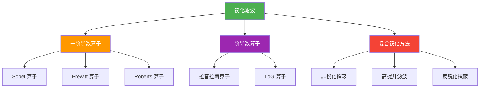
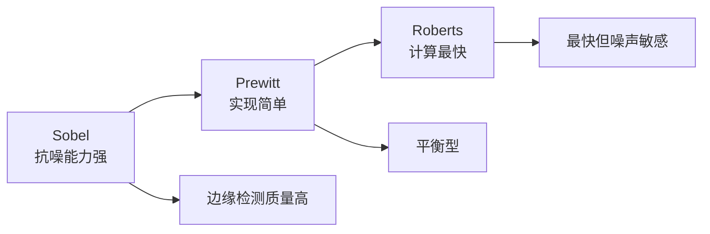
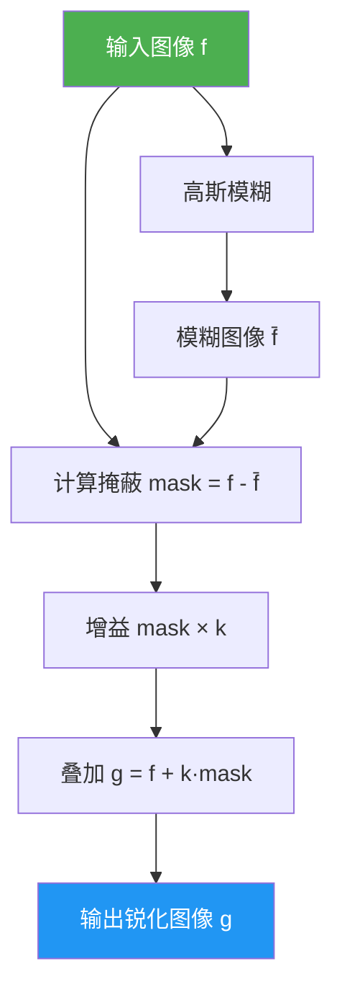
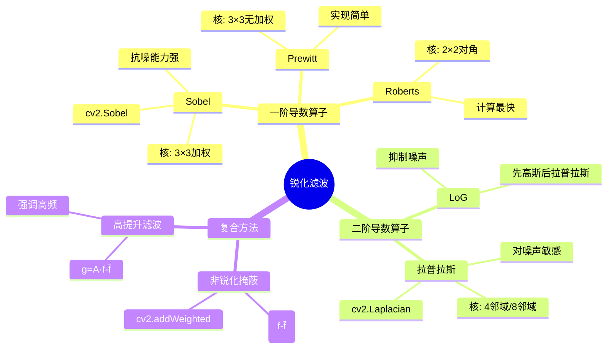

# 3.2 锐化滤波

## 📖 基本概念

锐化滤波（Sharpening Filter），也称**高通滤波**（High-pass Filter），通过增强图像的高频成分（边缘、细节、纹理）来改善图像的清晰度。锐化滤波本质上是对像素邻域进行差分运算。

### 锐化滤波分类体系



## 🧮 一阶导数算子

一阶导数算子通过计算图像灰度的**梯度**来检测边缘。

### 梯度的定义

图像 $f(x,y)$ 在位置 $(x,y)$ 的梯度定义为：

$$\nabla f(x,y) = \frac{\partial f}{\partial x} \vec{i} + \frac{\partial f}{\partial y} \vec{j}$$

**梯度幅值**：

$$|\nabla f| = \sqrt{\left(\frac{\partial f}{\partial x}\right)^2 + \left(\frac{\partial f}{\partial y}\right)^2}$$

**梯度方向**：

$$\theta = \arctan\left(\frac{\partial f}{\partial y} / \frac{\partial f}{\partial x}\right)$$

### Sobel 算子

Sobel 算子是最常用的一阶导数算子，使用 $3 \times 3$ 邻域内的加权差分。

**水平方向（$x$ 方向）核**：

$$G_x = \begin{bmatrix} -1 & 0 & 1 \\ -2 & 0 & 2 \\ -1 & 0 & 1 \end{bmatrix}$$

**垂直方向（$y$ 方向）核**：

$$G_y = \begin{bmatrix} -1 & -2 & -1 \\ 0 & 0 & 0 \\ 1 & 2 & 1 \end{bmatrix}$$

**工作原理**：
- $G_x$：检测垂直方向的边缘（灰度水平方向的变化）
- $G_y$：检测水平方向的边缘（灰度垂直方向的变化）
- 中心行/列权重为 2，增强对直接相邻像素的响应
- 均值为 0，对均匀区域无响应

**梯度计算**：

$$G = \sqrt{G_x^2 + G_y^2}$$

或简化为 $G = |G_x| + |G_y|$。

#### OpenCV 实现

```python
import cv2
import numpy as np

img = cv2.imread('input.jpg', cv2.IMREAD_GRAYSCALE)

# Sobel x 方向（检测垂直边缘）
sobel_x = cv2.Sobel(img, cv2.CV_64F, 1, 0, ksize=3)
sobel_x = cv2.convertScaleAbs(sobel_x)

# Sobel y 方向（检测水平边缘）
sobel_y = cv2.Sobel(img, cv2.CV_64F, 0, 1, ksize=3)
sobel_y = cv2.convertScaleAbs(sobel_y)

# 合成梯度幅值
sobel_mag = cv2.addWeighted(sobel_x, 0.5, sobel_y, 0.5, 0)

# 梯度方向
sobel_x_f = cv2.Sobel(img, cv2.CV_64F, 1, 0, ksize=3)
sobel_y_f = cv2.Sobel(img, cv2.CV_64F, 0, 1, ksize=3)
sobel_dir = np.arctan2(sobel_y_f, sobel_x_f)

# 手动实现 Sobel
def manual_sobel(image):
    h, w = image.shape
    gx = np.zeros((h, w), dtype=np.float64)
    gy = np.zeros((h, w), dtype=np.float64)
    padded = np.pad(image, 1, mode='reflect').astype(np.float64)
    sobel_x_kernel = np.array([[-1, 0, 1], [-2, 0, 2], [-1, 0, 1]])
    sobel_y_kernel = np.array([[-1, -2, -1], [0, 0, 0], [1, 2, 1]])
    for i in range(h):
        for j in range(w):
            region = padded[i:i+3, j:j+3]
            gx[i, j] = np.sum(region * sobel_x_kernel)
            gy[i, j] = np.sum(region * sobel_y_kernel)
    mag = np.sqrt(gx**2 + gy**2)
    return np.uint8(np.clip(mag, 0, 255))

sobel_manual = manual_sobel(img)
```

### Prewitt 算子

Prewitt 算子与 Sobel 类似，但中心行/列的权重为 1 而非 2。

**水平方向核**：

$$G_x = \begin{bmatrix} -1 & 0 & 1 \\ -1 & 0 & 1 \\ -1 & 0 & 1 \end{bmatrix}$$

**垂直方向核**：

$$G_y = \begin{bmatrix} -1 & -1 & -1 \\ 0 & 0 & 0 \\ 1 & 1 & 1 \end{bmatrix}$$

**OpenCV 实现**：

```python
# Prewitt 算子
prewitt_x = cv2.filter2D(img, cv2.CV_64F,
    np.array([[-1, 0, 1], [-1, 0, 1], [-1, 0, 1]], dtype=np.float64))
prewitt_y = cv2.filter2D(img, cv2.CV_64F,
    np.array([[-1, -1, -1], [0, 0, 0], [1, 1, 1]], dtype=np.float64))
prewitt_mag = cv2.convertScaleAbs(np.sqrt(prewitt_x**2 + prewitt_y**2))
```

### Roberts 算子

Roberts 算子使用 $2 \times 2$ 核，是最简单的一阶导数算子，采用**对角差分**。

**核 1（检测 $\pi/4$ 方向边缘）**：

$$G_1 = \begin{bmatrix} 1 & 0 \\ 0 & -1 \end{bmatrix}$$

**核 2（检测 $-\pi/4$ 方向边缘）**：

$$G_2 = \begin{bmatrix} 0 & 1 \\ -1 & 0 \end{bmatrix}$$

**OpenCV 实现**：

```python
# Roberts 算子
roberts_1 = cv2.filter2D(img, cv2.CV_64F,
    np.array([[1, 0], [0, -1]], dtype=np.float64))
roberts_2 = cv2.filter2D(img, cv2.CV_64F,
    np.array([[0, 1], [-1, 0]], dtype=np.float64))
roberts_mag = cv2.convertScaleAbs(np.sqrt(roberts_1**2 + roberts_2**2))
```

### 一阶导数算子对比

| 算子 | 核大小 | 优点 | 缺点 | 适用场景 |
|------|--------|------|------|----------|
| Sobel | 3×3 | 加权，抗噪能力强 | 边缘较粗 | 通用边缘检测 |
| Prewitt | 3×3 | 实现简单 | 抗噪能力弱于Sobel | 教学演示 |
| Roberts | 2×2 | 计算量最小 | 对噪声敏感 | 无噪声场景 |



## 🔬 二阶导数算子

二阶导数算子通过计算图像灰度的二阶差分来检测边缘，对细节的响应更强，但对噪声也更敏感。

### 拉普拉斯算子（Laplacian）

拉普拉斯算子是最常用的二阶导数算子：

$$\nabla^2 f = \frac{\partial^2 f}{\partial x^2} + \frac{\partial^2 f}{\partial y^2}$$

离散形式：

$$\nabla^2 f(x,y) = f(x+1,y) + f(x-1,y) + f(x,y+1) + f(x,y-1) - 4f(x,y)$$

**4-邻域核**：

$$w_4 = \begin{bmatrix} 0 & 1 & 0 \\ 1 & -4 & 1 \\ 0 & 1 & 0 \end{bmatrix}$$

**8-邻域核**：

$$w_8 = \begin{bmatrix} 1 & 1 & 1 \\ 1 & -8 & 1 \\ 1 & 1 & 1 \end{bmatrix}$$

#### 拉普拉斯锐化公式

$$g(x,y) = f(x,y) + c \cdot \nabla^2 f(x,y)$$

- $c = -1$：原始图像减去二阶导数，实现锐化
- $c = 1$：原始图像加上二阶导数，同样锐化
- 拉普拉斯核的和为 0，保证对恒定区域无响应

#### OpenCV 实现

```python
import cv2
import numpy as np

img = cv2.imread('input.jpg', cv2.IMREAD_GRAYSCALE)

# 拉普拉斯变换
laplacian = cv2.Laplacian(img, cv2.CV_64F)
laplacian_uint = cv2.convertScaleAbs(laplacian)

# 拉普拉斯锐化
c = -1.0
sharpened = cv2.convertScaleAbs(
    img.astype(np.float64) + c * laplacian
)

# 自定义 4-邻域拉普拉斯核
laplacian_kernel = np.array([[0, 1, 0], [1, -4, 1], [0, 1, 0]], dtype=np.float64)
laplacian_custom = cv2.filter2D(img, cv2.CV_64F, laplacian_kernel)

# 8-邻域核
laplacian_8 = np.array([[1, 1, 1], [1, -8, 1], [1, 1, 1]], dtype=np.float64)
laplacian_8_result = cv2.filter2D(img, cv2.CV_64F, laplacian_8)
```

### LoG 算子（Laplacian of Gaussian）

LoG 算子先用高斯滤波平滑图像，再用拉普拉斯检测边缘，有效抑制噪声：

$$\text{LoG}(x,y) = \nabla^2 [G(x,y) * f(x,y)]$$

**OpenCV 实现**：

```python
# LoG 算子
img_blurred = cv2.GaussianBlur(img, (3, 3), 0.5)
log_result = cv2.Laplacian(img_blurred, cv2.CV_64F)
log_uint = cv2.convertScaleAbs(log_result)
```

## 🎯 复合锐化方法

### 非锐化掩蔽（Unsharp Masking）

非锐化掩蔽是最常用的锐化方法，通过将模糊后的图像从原始图像中减去，得到"掩蔽"信息，再加回原图。

#### 数学公式

$$g(x,y) = f(x,y) + k \cdot [f(x,y) - \bar{f}(x,y)]$$

等价于：

$$g(x,y) = (1 + k) \cdot f(x,y) - k \cdot \bar{f}(x,y)$$

其中：
- $f(x,y)$：原始图像
- $\bar{f}(x,y)$：平滑（模糊）后的图像
- $k$：增益系数，控制锐化程度（通常 $0.5 \sim 2.0$）

#### 算法流程图



#### OpenCV 实现

```python
import cv2
import numpy as np

img = cv2.imread('input.jpg', cv2.IMREAD_GRAYSCALE)

def unsharp_masking(image, sigma=1.0, amount=1.5, threshold=0):
    blurred = cv2.GaussianBlur(image, (0, 0), sigma)
    sharpened_img = cv2.addWeighted(image, 1 + amount, blurred, -amount, 0)
    if threshold > 0:
        diff = cv2.absdiff(image, blurred)
        _, mask = cv2.threshold(diff, threshold, 255, cv2.THRESH_BINARY)
        sharpened_img = cv2.bitwise_and(sharpened_img, sharpened_img, mask=mask)
    return sharpened_img.astype(np.uint8)

# 不同参数对比
fig, axes = plt.subplots(1, 4, figsize=(20, 5))
amounts = [0.5, 1.0, 1.5, 2.0]
for ax, amount in zip(axes, amounts):
    result = unsharp_masking(img, sigma=1.0, amount=amount)
    ax.imshow(result, cmap='gray')
    ax.set_title(f'amount={amount}')
    ax.axis('off')
plt.tight_layout()
plt.show()
```

### 高提升滤波（High-boost Filtering）

高提升滤波是锐化的推广形式，通过对原图乘以系数 $A$ 来增强高频成分：

$$g(x,y) = A \cdot f(x,y) - \bar{f}(x,y)$$

等价于：

$$g(x,y) = (A-1) \cdot f(x,y) + [f(x,y) - \bar{f}(x,y)]$$

**与非锐化掩蔽的关系**：当 $A = 1 + k$ 时，高提升滤波等价于非锐化掩蔽。

#### OpenCV 实现

```python
A = 1.5
blurred = cv2.GaussianBlur(img, (5, 5), 1.0)
high_boost = cv2.convertScaleAbs(
    A * img.astype(np.float64) - blurred.astype(np.float64)
)
```

## 📊 锐化方法综合对比

### 性能对比表

| 方法 | 噪声敏感性 | 锐化效果 | 实现复杂度 | 典型应用 |
|------|------------|----------|------------|----------|
| Sobel | 低 | 中等 | 低 | 通用边缘检测 |
| Prewitt | 中 | 中等 | 低 | 教学演示 |
| Roberts | 高 | 较弱 | 最低 | 无噪声场景 |
| Laplacian | 极高 | 强 | 低 | 强锐化 |
| LoG | 低 | 强 | 中 | 边缘检测 |
| 非锐化掩蔽 | 低 | 自然 | 中 | 通用锐化增强 |
| 高提升滤波 | 低 | 可调 | 中 | 需要调节的场景 |

### 效果对比代码

```python
import cv2
import numpy as np
import matplotlib.pyplot as plt

img = cv2.imread('input.jpg', cv2.IMREAD_GRAYSCALE)

# 添加少量噪声
noise = np.random.normal(0, 10, img.shape).astype(np.float64)
noisy = np.clip(img.astype(np.float64) + noise, 0, 255).astype(np.uint8)

# 各种锐化方法
sobel = cv2.convertScaleAbs(
    cv2.Sobel(noisy, cv2.CV_64F, 1, 0, ksize=3) +
    cv2.Sobel(noisy, cv2.CV_64F, 0, 1, ksize=3)
)

laplacian = cv2.convertScaleAbs(cv2.Laplacian(noisy, cv2.CV_64F))

unsharp = cv2.addWeighted(noisy, 1.5,
    cv2.GaussianBlur(noisy, (5, 5), 1.0), -0.5, 0)

high_boost = cv2.convertScaleAbs(
    1.5 * noisy.astype(np.float64) -
    cv2.GaussianBlur(noisy, (5, 5), 1.0).astype(np.float64)
)

# 展示
fig, axes = plt.subplots(2, 3, figsize=(18, 10))
titles = ['Original', 'Noisy', 'Sobel', 'Laplacian', 'Unsharp', 'High-boost']
images = [img, noisy, sobel, laplacian, unsharp, high_boost]
for ax, title, im in zip(axes.flatten(), titles, images):
    ax.imshow(im, cmap='gray')
    ax.set_title(title)
    ax.axis('off')
plt.tight_layout()
plt.show()
```

## ❓ 常见问题

### Q1：Sobel 算子为什么比 Prewitt 算子更常用？

Sobel 算子的中心权重为 2（Prewitt 为 1），等效于对邻域像素做加权平均，因此对噪声的抑制能力更强。在噪声环境下，Sobel 的边缘检测结果更稳定。

### Q2：拉普拉斯算子为什么对噪声敏感？

拉普拉斯算子是二阶差分，而二阶差分对噪声的响应是一阶差分的 $\sim2$ 倍。因此拉普拉斯前通常需要先做高斯平滑（LoG 算子），或直接使用非锐化掩蔽等复合方法。

### Q3：非锐化掩蔽中 $k$ 的取值范围？

- $k = 0$：无锐化，输出等于原图
- $0 < k \leq 1$：适度锐化，推荐范围
- $k > 1$：强锐化，可能产生振铃效应
- $k \geq 2$：通常过于激进，会出现黑白光晕

### Q4：锐化滤波在实际中的应用？

```
1. 摄影后期：增强照片细节
2. 医学影像：增强 X 光/CT 图像的骨骼和组织边缘
3. 工业检测：检测产品表面缺陷
4. 遥感图像：增强地形纹理
5. 人脸识别：增强五官特征
```

## 📊 知识总结



> 📌 **关键总结**：锐化滤波通过增强图像的高频成分来提升清晰度。一阶导数算子（Sobel/Prewitt/Roberts）基于梯度，适合边缘检测；二阶导数算子（拉普拉斯）响应更强但噪声敏感；复合方法（非锐化掩蔽/高提升）在实际应用中效果最自然。选择锐化方法时需要平衡锐化强度和噪声抑制。