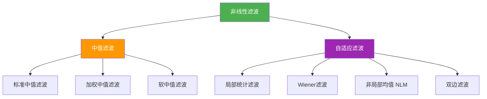
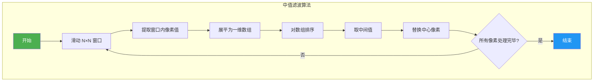
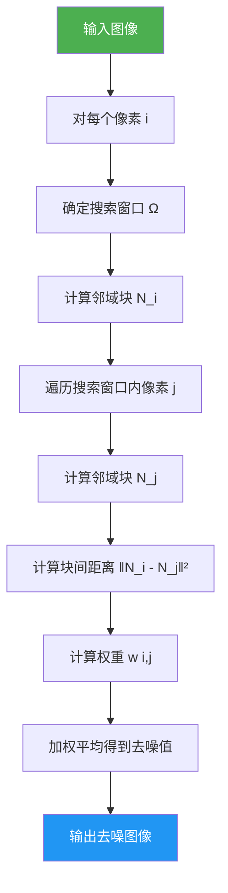
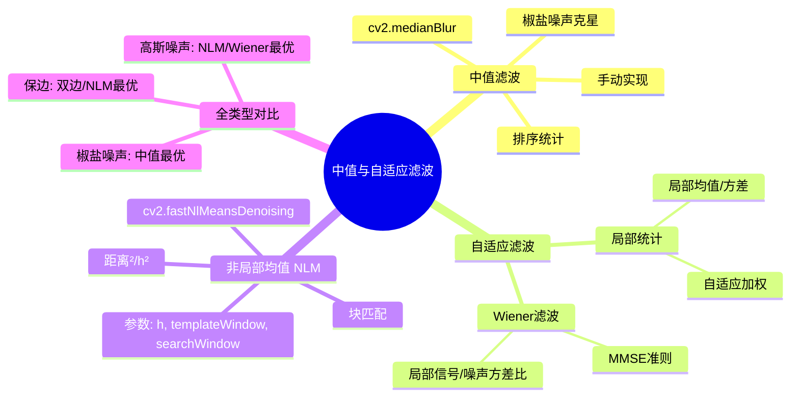

# 3.3 中值与自适应滤波

## 📖 基本概念

中值滤波和自适应滤波属于**非线性滤波**范畴，它们不依赖于固定的线性核卷积，而是基于邻域内像素值的统计特性或自适应权重进行处理。

### 滤波器分类总览



## 🧮 中值滤波

### 定义

中值滤波将窗口内像素的**中值**作为输出值，属于**排序统计滤波器**（Order Statistic Filter）：

$$g(x,y) = \text{median}\{f(x-m, y-n) \mid (m,n) \in R_{xy}\}$$

对于窗口大小为 $N$（$N$ 为奇数），中值为排序后第 $(N+1)/2$ 个值。

### 算法步骤



### 手动实现

```python
import cv2
import numpy as np

img = cv2.imread('salt_pepper.jpg', cv2.IMREAD_GRAYSCALE)

def median_filter_manual(image, kernel_size):
    h, w = image.shape
    result = np.zeros_like(image)
    pad = kernel_size // 2
    padded = np.pad(image, pad, mode='reflect')
    for i in range(h):
        for j in range(w):
            window = padded[i:i+kernel_size, j:j+kernel_size]
            result[i, j] = np.median(window)
    return result

img_median = median_filter_manual(img, 3)
img_median_5 = median_filter_manual(img, 5)
```

### OpenCV 高效实现

```python
# OpenCV 内置实现（高度优化）
img_median_3 = cv2.medianBlur(img, 3)
img_median_5 = cv2.medianBlur(img, 5)
img_median_7 = cv2.medianBlur(img, 7)
```

### 对椒盐噪声的去噪原理

椒盐噪声由随机的极值像素（0 或 255）组成。在一个 $3 \times 3 = 9$ 像素的窗口中：

- 若有 1 个噪声点：8 个正常值 + 1 个极值 → 中值仍是正常值
- 若有 2 个噪声点：7 个正常值 + 2 个极值 → 中值仍是正常值
- 只有在超过半数像素被污染时，中值才会受到影响

对比均值滤波：1 个极值就会显著影响平均值。

### 加权中值滤波

加权中值滤波给每个像素分配不同的权重，权重越大的像素对中值的影响越大：

$$g(x,y) = \text{weighted-median}\{f_i, w_i\}$$

实现方式是将每个像素重复 $w_i$ 次再取中值。

## 🎯 自适应滤波器

自适应滤波器根据图像局部统计特性（如均值、方差）动态调整滤波行为。

### 局部统计滤波

#### 原理

根据局部窗口内的均值 $m$ 和方差 $\sigma^2$，自适应地平滑图像：

$$g(x,y) = m + \frac{\sigma^2}{\sigma^2 + \sigma_n^2} \cdot (f(x,y) - m)$$

其中 $\sigma_n^2$ 为噪声方差（假设为常数）。

**物理含义**：
- 局部方差大（边缘/纹理区域）：$\sigma^2 \gg \sigma_n^2$，保留原始值
- 局部方差小（平坦区域）：$\sigma^2 \ll \sigma_n^2$，趋近于均值

#### Python 实现

```python
def local_statistics_filter(image, kernel_size=5, noise_var=200):
    img_float = image.astype(np.float64)
    h, w = image.shape
    pad = kernel_size // 2
    padded = np.pad(img_float, pad, mode='reflect')

    local_mean = np.zeros((h, w), dtype=np.float64)
    local_var = np.zeros((h, w), dtype=np.float64)

    for i in range(h):
        for j in range(w):
            window = padded[i:i+kernel_size, j:j+kernel_size]
            local_mean[i, j] = np.mean(window)
            local_var[i, j] = np.var(window)

    result = local_mean + \
        (local_var / (local_var + noise_var)) * (img_float - local_mean)
    return np.uint8(np.clip(result, 0, 255))

img_adaptive = local_statistics_filter(img, kernel_size=5, noise_var=200)
```

### Wiener 滤波（维纳滤波）

#### 原理

Wiener 滤波是基于**最小均方误差（MMSE）**的最优滤波器，假设信号和噪声均为平稳随机过程：

$$\hat{f}(x,y) = \mu + \frac{\sigma^2_f}{\sigma^2_f + \sigma^2_n} \cdot (f(x,y) - \mu)$$

其中：
- $\mu$：局部均值
- $\sigma^2_f$：局部信号方差
- $\sigma^2_n$：噪声方差

#### 特点

- ✅ 在频域中实现时计算高效
- ✅ 理论上最优（MMSE 意义下）
- ❌ 需要已知/估计噪声方差
- ❌ 对非平稳信号效果下降

#### OpenCV 实现

```python
import cv2
import numpy as np

img = cv2.imread('noisy.jpg', cv2.IMREAD_GRAYSCALE)

# Wiener 滤波（scipy 实现）
from scipy.ndimage import uniform_filter

def wiener_filter(image, kernel_size=5, noise_var=None):
    img_float = image.astype(np.float64)
    pad = kernel_size // 2

    # 计算局部均值
    local_mean = uniform_filter(img_float, size=kernel_size, mode='reflect')
    local_mean_sq = uniform_filter(img_float**2, size=kernel_size, mode='reflect')

    # 计算局部方差
    local_var = local_mean_sq - local_mean**2

    # 估计噪声方差（使用全局方差的较小部分）
    if noise_var is None:
        noise_var = np.mean(local_var) * 0.1

    result = local_mean + \
        np.maximum(local_var - noise_var, 0) / \
        (local_var + 1e-10) * (img_float - local_mean)

    return np.uint8(np.clip(result, 0, 255))

img_wiener = wiener_filter(img, kernel_size=5)
```

## 🌊 非局部均值去噪（NLM）

### 原理

非局部均值（Non-Local Means, NLM）滤波利用图像中**相似的像素块**进行去噪，而不仅仅是局部邻域：

$$\hat{u}(i) = \frac{1}{Z(i)} \sum_{j \in \Omega} w(i,j) \cdot u(j)$$

权重函数：

$$w(i,j) = \frac{1}{Z(i)} \exp\left(-\frac{\|u(N_i) - u(N_j)\|^2}{h^2}\right)$$

其中：
- $\Omega$：搜索窗口（通常比滤波窗口大）
- $N_i, N_j$：以像素 $i, j$ 为中心的邻域块
- $h$：衰减参数，控制权重衰减速度
- $Z(i)$：归一化因子

### 算法流程



### OpenCV 实现

```python
import cv2
import numpy as np

img = cv2.imread('noisy.jpg', cv2.IMREAD_GRAYSCALE)

# NLM 去噪
img_nlm = cv2.fastNlMeansDenoising(
    img,
    h=10,          # 滤波强度
    templateWindowSize=7,  # 模板窗口大小
    searchWindowSize=21    # 搜索窗口大小
)

# 彩色图像 NLM
img_color = cv2.imread('noisy_color.jpg')
img_nlm_color = cv2.fastNlMeansDenoisingColored(
    img_color,
    h_luminance=10,
    h_color=10,
    templateWindowSize=7,
    searchWindowSize=21
)

# 参数说明
# h: 滤波强度，建议 3~20
# templateWindowSize: 模板窗口，奇数，建议 7~13
# searchWindowSize: 搜索窗口，奇数，建议 21~31
```

### 参数选择指南

| 参数 | 推荐值 | 说明 |
|------|--------|------|
| `h` | 5 ~ 20 | 噪声越大，$h$ 越大；过大会导致过度平滑 |
| `templateWindowSize` | 7 | 模板块大小，影响相似性计算 |
| `searchWindowSize` | 21 | 搜索范围，越大找到的相似块越多 |

### NLM 的优缺点

| 优点 | 缺点 |
|------|------|
| ✅ 去噪效果极佳 | ❌ 计算量较大 |
| ✅ 保留纹理和细节 | ❌ 搜索窗口大时速度慢 |
| ✅ 对各类噪声有效 | ❌ 参数调节需要经验 |
| ✅ 无伪影 | ❌ 对重复纹理效果更好 |

## 📊 全类型滤波器对比

### 综合性能对比表

| 滤波器 | 类型 | 椒盐噪声 | 高斯噪声 | 边缘保留 | 计算速度 | 典型应用 |
|--------|------|----------|----------|----------|----------|----------|
| 均值滤波 | 线性 | ❌ 差 | ⚠️ 中 | ❌ 差 | ⭐⭐⭐⭐⭐ | 预处理 |
| 高斯滤波 | 线性 | ❌ 差 | ✅ 好 | ⚠️ 中 | ⭐⭐⭐⭐ | 通用去噪 |
| Sobel/Prewitt | 线性 | ❌ 差 | ❌ 差 | — | ⭐⭐⭐⭐ | 边缘检测 |
| Laplacian | 线性 | ❌ 差 | ❌ 差 | — | ⭐⭐⭐⭐ | 强锐化 |
| 中值滤波 | 非线性 | ✅ 极佳 | ⚠️ 中 | ✅ 好 | ⭐⭐ | 椒盐噪声 |
| 双边滤波 | 非线性 | ⚠️ 中 | ✅ 好 | ✅ 极佳 | ⭐ | 保边去噪 |
| Wiener 滤波 | 自适应 | ⚠️ 中 | ✅ 极佳 | ✅ 好 | ⭐⭐ | 高斯噪声 |
| NLM | 非局部 | ✅ 好 | ✅ 极佳 | ✅ 极佳 | ⭐ | 高质量去噪 |

### 效果对比可视化

```python
import cv2
import numpy as np
import matplotlib.pyplot as plt

img = cv2.imread('input.jpg', cv2.IMREAD_GRAYSCALE)

# 添加混合噪声
noisy = img.copy().astype(np.float64)
noisy += np.random.normal(0, 15, img.shape)
noise_mask = np.random.random(img.shape)
noisy[noise_mask < 0.01] = 0
noisy[noise_mask > 0.99] = 255
noisy = np.clip(noisy, 0, 255).astype(np.uint8)

# 各种滤波
results = {
    'Mean': cv2.blur(noisy, (5, 5)),
    'Gaussian': cv2.GaussianBlur(noisy, (5, 5), 1.0),
    'Median': cv2.medianBlur(noisy, 5),
    'Bilateral': cv2.bilateralFilter(noisy, 9, 75, 75),
    'Wiener': wiener_filter(noisy, 5),
    'NLM': cv2.fastNlMeansDenoising(noisy, h=15),
}

# 计算 PSNR
def calc_psnr(original, filtered):
    mse = np.mean((original.astype(np.float64) - filtered.astype(np.float64))**2)
    if mse == 0:
        return float('inf')
    return 20 * np.log10(255.0 / np.sqrt(mse))

# 展示
fig, axes = plt.subplots(2, 4, figsize=(20, 10))
axes[0, 0].imshow(img, cmap='gray')
axes[0, 0].set_title('Original')
axes[0, 1].imshow(noisy, cmap='gray')
axes[0, 1].set_title('Noisy')

for ax, (name, result) in zip(axes[1], results.items()):
    psnr = calc_psnr(img, result)
    ax.imshow(result, cmap='gray')
    ax.set_title(f'{name}\nPSNR={psnr:.2f}dB')

for ax in axes.flatten():
    ax.axis('off')
plt.tight_layout()
plt.show()
```

## 🎓 考研/竞赛高频考点

### 核心公式（必背）

1. **中值滤波**：$g(x,y) = \text{median}\{f_i \mid i \in R_{xy}\}$
2. **Wiener 滤波**：$\hat{f} = \mu + \frac{\sigma^2_f}{\sigma^2_f + \sigma^2_n}(f - \mu)$
3. **NLM 权重**：$w(i,j) = \exp(-\|u(N_i) - u(N_j)\|^2 / h^2) / Z(i)$

### 典型题型

1. **简答题**：简述中值滤波对椒盐噪声特别有效的原因（3 分）
2. **计算题**：给定 $3 \times 3$ 邻域像素值，计算中值滤波输出（5 分）
3. **对比分析**：对比 Wiener 滤波和 NLM 的优缺点（5 分）
4. **设计题**：设计一个混合噪声（高斯+椒盐）的去噪方案（10 分）

### 答题要点

```
中值滤波对椒盐噪声有效的原因：
1. 椒盐噪声是随机极值，中值不受极值影响
2. 排序统计天然免疫少量异常值
3. 相比均值滤波，中值无需对噪声做任何假设

Wiener vs NLM：
- Wiener：基于局部统计量，速度快，需要噪声模型
- NLM：基于非局部相似性，效果好，计算量大
```

## ❓ 常见问题

### Q1：中值滤波的窗口大小如何选择？

- 3×3：轻度椒盐噪声，细节保留好
- 5×5：中度椒盐噪声，平衡去噪和细节
- 7×7+：重度噪声，但会损失更多细节
- 建议从小到大尝试，选择去噪效果满意且细节可接受的最小窗口

### Q2：为什么 NLM 去噪效果比双边滤波更好？

双边滤波仅使用空间邻域内的像素，而 NLM 在整幅图像中搜索相似的像素块。当图像存在重复纹理时（如天空、墙面），NLM 能找到更多相似块，从而实现更好的去噪。

### Q3：Wiener 滤波和局部统计滤波的关系？

局部统计滤波是 Wiener 滤波的局部窗口版本。Wiener 滤波基于全局统计假设（平稳随机过程），而局部统计滤波在每个局部窗口内独立计算统计量，适应性更强。

### Q4：实际工程中的去噪方案建议？

```
场景1：椒盐噪声 → 中值滤波 (cv2.medianBlur)
场景2：高斯噪声 → Wiener 滤波或 NLM
场景3：混合噪声 → 先中值去椒盐，再 NLM/双边
场景4：视频去噪 → 帧间 NLM（cv2.fastNlMeansDenoisingMulti）
场景5：实时性要求 → 高斯滤波或双边滤波
场景6：高质量要求 → NLM + 后处理
```

## 📊 知识总结



> 📌 **关键总结**：中值滤波是非线性滤波的代表，对椒盐噪声有独特优势；自适应滤波（Wiener）基于统计模型，对高斯噪声效果好；NLM 是目前最先进的去噪方法之一，利用图像自相似性实现高质量去噪。实际应用中需要根据噪声类型、去噪质量要求和计算资源综合选择。