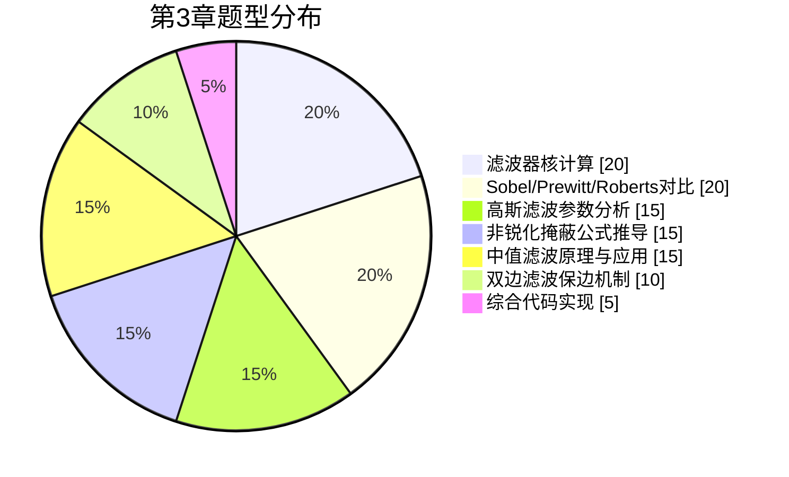

# 第3章 图像空间域滤波 — 思维导图总览

## 📌 章节导航

| 知识点 | 核心内容 | 重要度 | 推荐学时 |
|--------|----------|--------|----------|
| [3.1 平滑滤波](./3.1%20平滑滤波.md) | 均值、高斯、中值、双边滤波，椒盐噪声去除 | ⭐⭐⭐⭐⭐ | 4h |
| [3.2 锐化滤波](./3.2%20锐化滤波.md) | Sobel/Prewitt/Roberts、拉普拉斯、非锐化掩蔽 | ⭐⭐⭐⭐⭐ | 4h |
| [3.3 中值与自适应滤波](./3.3%20中值与自适应滤波.md) | 中值滤波算法、自适应滤波、Wiener、NLM | ⭐⭐⭐⭐ | 3h |

## 🗺️ 学习路线图

```mermaid
flowchart TD
    A[起点: 卷积/相关运算] --> B[3.1 平滑滤波]
    B --> B1[均值滤波<br/>Mean Filter]
    B --> B2[高斯滤波<br/>Gaussian Filter]
    B --> B3[中值滤波<br/>Median Filter]
    B --> B4[双边滤波<br/>Bilateral Filter]
    B2 --> B5["核心公式<br/>G(x,y) = 1/(2πσ²)·e^(-(x²+y²)/(2σ²))"]
    B3 --> B6["适合椒盐噪声<br/>Salt-and-Pepper"]
    B4 --> B7["保边去噪<br/>边缘不模糊"]
    C[3.2 锐化滤波] --> C1[一阶导数算子]
    C1 --> C1a[Sobel]
    C1 --> C1b[Prewitt]
    C1 --> C1c[Roberts]
    C --> C2[二阶导数<br/>拉普拉斯]
    C --> C3[非锐化掩蔽<br/>g = f + k·(f - f̄)]
    C --> C4[高提升滤波<br/>High-boost]
    B --> C
    C --> D[3.3 中值与自适应滤波]
    D --> D1[中值滤波<br/>排序统计]
    D --> D2[自适应滤波<br/>局部统计]
    D --> D3[Wiener滤波]
    D --> D4[NLM<br/>非局部均值]
    D1 --> E[终点: 频域滤波]
    D2 --> E
    D3 --> E
    D4 --> E

    style A fill:#4CAF50,color:#fff
    style E fill:#2196F3,color:#fff
    style B fill:#FF9800,color:#fff
    style C fill:#9C27B0,color:#fff
    style D fill:#F44336,color:#fff
```

## 🎯 核心考点

### 高频考点（考研408 & 视觉竞赛）

1. **各滤波器核的推导与对比**：均值核、高斯核、Sobel核、Prewitt核、拉普拉斯核
2. **高斯滤波器**：$G(x,y) = \frac{1}{2\pi\sigma^2} e^{-(x^2+y^2)/(2\sigma^2)}$，$\sigma$ 对滤波效果的影响
3. **Sobel vs Prewitt vs Roberts**：三个一阶导数算子的核结构和性能对比
4. **非锐化掩蔽公式**：$g(x,y) = f(x,y) + k \cdot [f(x,y) - \bar{f}(x,y)]$，各变量含义
5. **中值滤波原理**：排序统计思想，对椒盐噪声的独特优势
6. **双边滤波**：空间域权重 + 值域权重，实现保边去噪

### 典型题型分布



## 📝 自测题

### 基础题

1. 写出 $3 \times 3$ 均值滤波器的核，并说明其工作原理。

2. 给定 $\sigma = 1.0$，计算 $3 \times 3$ 高斯滤波器的核（保留两位小数）。

3. 写出 Sobel 算子的 $x$ 和 $y$ 方向核，并解释为什么 Sobel 算子能抑制噪声。

4. 描述中值滤波的基本步骤，说明它为什么对椒盐噪声特别有效。

### 进阶题

5. 非锐化掩蔽公式 $g = f + k \cdot (f - \bar{f})$ 中，当 $k$ 取何值时会得到原始图像？当 $k$ 过大时会出现什么现象？

6. 对比均值滤波、高斯滤波、中值滤波对高斯噪声和椒盐噪声的去噪效果，完成下表：

| 滤波器 | 高斯噪声 | 椒盐噪声 | 边缘保留 |
|--------|----------|----------|----------|
| 均值滤波 | | | |
| 高斯滤波 | | | |
| 中值滤波 | | | |
| 双边滤波 | | | |

7. 解释双边滤波的两个权重函数（空间距离权重和像素值差异权重）的物理含义，并说明它们如何共同实现"保边去噪"。

### 应用题

8. 给定一幅含椒盐噪声的图像，设计一个去噪方案，要求：
   - 先使用中值滤波去除椒盐噪声
   - 再使用双边滤波平滑剩余噪声
   - 对比单独使用均值/高斯/中值/双边的效果
   - 用 Python/OpenCV 实现并分析 PSNR 值

9. 使用 Sobel 算子实现边缘检测，分别计算 $G_x$ 和 $G_y$ 方向梯度，合成幅值图 $G = \sqrt{G_x^2 + G_y^2}$ 和方向图 $\theta = \arctan(G_y / G_x)$。

## 📚 章节知识结构图

```mermaid
mindmap
  root((第3章 空间域滤波))
    平滑滤波
      均值滤波
        核: 1/9·ones(3,3)
        简单快速
        模糊边缘
      高斯滤波
        核: G(x,y)=1/(2πσ²)·e^(-r²/(2σ²))
        σ控制平滑程度
        加权平滑
      中值滤波
        排序统计
        椒盐噪声克星
        cv2.medianBlur
      双边滤波
        空间权重+值域权重
        保边去噪
        cv2.bilateralFilter
    锐化滤波
      一阶导数
        Sobel算子
          3×3核
          噪声抑制
        Prewitt算子
          3×3核
          无加权
        Roberts算子
          2×2核
          对角差分
      二阶导数
        拉普拉斯
          4邻域/8邻域
          对噪声敏感
      复合方法
        非锐化掩蔽
          g=f+k·(f-f̄)
        高提升滤波
          A·f - f̄
    中值与自适应
      中值滤波算法
        窗口滑动
        排序取中值
      自适应滤波
        局部统计量
        Wiener滤波
      非局部均值
        NLM算法
        块匹配
```

## 🔗 关联知识点

- **前置知识**：[[第2章 2.3 空间域滤波基础]]（卷积/相关、平滑/锐化入门）
- **后续知识**：[[第4章 频域滤波]]（傅里叶变换、频域滤波）、[[第5章 图像形态学处理]]
- **跨学科关联**：概率论（高斯分布、Wiener 滤波）、统计学（排序统计、局部方差）、最优化（NLM 的能量最小化）