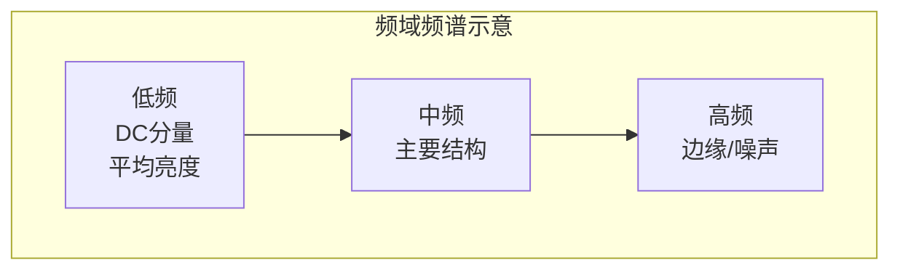

# 4.1 傅里叶变换基础

## 🌊 引言：为什么需要傅里叶变换？

傅里叶变换是数字图像处理中最重要的数学工具之一。它的核心思想是：**任何周期信号都可以表示为不同频率的正弦波的叠加**。通过傅里叶变换，我们可以将图像从**空域（空间域）**变换到**频域**，在频域中分析图像的频率成分。

```mermaid
flowchart LR
    subgraph 空域["空间域 (Spatial Domain)"]
        A[f(x,y) 像素值]
    end
    subgraph 频域["频域 (Frequency Domain)"]
        B[F(u,v) 频率成分]
    end
    A -->|傅里叶变换 F| B
    B -->|逆傅里叶变换 F⁻¹| A
```

## 一、一维连续傅里叶变换 (CTFT)

### 1.1 定义

设一维连续信号 \( f(x) \)，其傅里叶变换定义为：

$$
F(u) = \int_{-\infty}^{+\infty} f(x) \cdot e^{-j2\pi u x} \, dx
$$

其中：
- \( u \) 为空间频率（单位：cycles/mm 或 cycles/pixel）
- \( j = \sqrt{-1} \) 为虚数单位
- \( e^{-j2\pi u x} = \cos(2\pi u x) - j\sin(2\pi u x) \)

### 1.2 逆变换

$$
f(x) = \int_{-\infty}^{+\infty} F(u) \cdot e^{j2\pi u x} \, du
$$

### 1.3 傅里叶变换对

$$
f(x) \stackrel{\mathcal{F}}{\longleftrightarrow} F(u)
$$

## 二、二维连续傅里叶变换

### 2.1 定义

对于二维图像 \( f(x,y) \)，二维连续傅里叶变换定义为：

$$
F(u,v) = \int_{-\infty}^{+\infty} \int_{-\infty}^{+\infty} f(x,y) \cdot e^{-j2\pi (ux + vy)} \, dx \, dy
$$

### 2.2 逆变换

$$
f(x,y) = \int_{-\infty}^{+\infty} \int_{-\infty}^{+\infty} F(u,v) \cdot e^{j2\pi (ux + vy)} \, du \, dv
$$

其中 \( u \) 和 \( v \) 分别为水平和垂直方向的空间频率。

## 三、离散傅里叶变换 (DFT)

### 3.1 一维 DFT

对于 N 点离散信号 \( f(x), x = 0, 1, \ldots, N-1 \)，其DFT定义为：

$$
F(u) = \sum_{x=0}^{N-1} f(x) \cdot e^{-j\frac{2\pi}{N} u x}, \quad u = 0, 1, \ldots, N-1
$$

逆DFT：

$$
f(x) = \frac{1}{N} \sum_{u=0}^{N-1} F(u) \cdot e^{j\frac{2\pi}{N} u x}, \quad x = 0, 1, \ldots, N-1
$$

### 3.2 二维 DFT（核心公式）

对于 \( M \times N \) 的图像 \( f(x,y) \)，二维DFT定义为：

$$
\boxed{F(u,v) = \sum_{x=0}^{M-1} \sum_{y=0}^{N-1} f(x,y) \cdot e^{-j2\pi \left( \frac{ux}{M} + \frac{vy}{N} \right)}}
$$

其中：
- \( f(x,y) \)：输入图像在坐标 \( (x,y) \) 处的像素值
- \( F(u,v) \)：变换后的频域系数
- \( M, N \)：图像的高和宽
- \( u = 0, 1, \ldots, M-1 \)；\( v = 0, 1, \ldots, N-1 \)

**重要**：DFT是图像从空域到频域的精确映射，每个频域系数 \( F(u,v) \) 都是复数。

### 3.3 DFT的矩阵形式

$$
\begin{bmatrix}
F(0,0) & F(0,1) & \cdots & F(0,N-1) \\
F(1,0) & F(1,1) & \cdots & F(1,N-1) \\
\vdots & \vdots & & \vdots \\
F(M-1,0) & F(M-1,1) & \cdots & F(M-1,N-1)
\end{bmatrix}
$$

### 3.4 频谱的物理含义

| 频率分量 | 物理含义 | 对应图像特征 |
|----------|----------|-------------|
| \( F(0,0) \) (DC分量) | 图像的平均亮度 | 全局亮度 |
| 低频分量 | 图像的缓慢变化部分 | 平滑区域、整体结构 |
| 高频分量 | 图像的快速变化部分 | 边缘、纹理、噪声 |



## 四、傅里叶变换的性质

### 4.1 线性性质

$$
\mathcal{F}\{a \cdot f_1(x,y) + b \cdot f_2(x,y)\} = a \cdot F_1(u,v) + b \cdot F_2(u,v)
$$

### 4.2 平移性质

**空域平移：**

$$
\mathcal{F}\{f(x-x_0, y-y_0)\} = F(u,v) \cdot e^{-j2\pi(ux_0/M + vy_0/N)}
$$

**频域平移：**

$$
\mathcal{F}\{f(x,y) \cdot e^{j2\pi(ux_0/M + vy_0/N)}\} = F(u-u_0, v-v_0)
$$

> 💡 **应用**：在空域平移图像不改变频谱的幅度，只改变相位。

### 4.3 旋转性质

若图像 \( f(x,y) \) 旋转角度 \( \theta_0 \)，则其傅里叶变换也旋转相同角度 \( \theta_0 \)：

$$
\mathcal{F}\{f(r\cos\theta, r\sin\theta)\} = F(\rho\cos\phi, \rho\sin\phi)
$$

### 4.4 卷积定理（核心性质）

这是傅里叶变换最重要的性质之一，建立了空域卷积与频域乘积的关系：

$$
\boxed{\mathcal{F}\{f(x,y) * h(x,y)\} = F(u,v) \cdot H(u,v)}
$$

即：**两个信号在空域的卷积 = 它们在频域的乘积**

逆形式：

$$
\mathcal{F}\{f(x,y) \cdot h(x,y)\} = F(u,v) * H(u,v)
$$

> 💡 **意义**：将复杂的卷积运算转化为简单的乘法运算，这是频域滤波的理论基础。

### 4.5 对称性

对于实数图像 \( f(x,y) \)，其DFT具有共轭对称性：

$$
F(u,v) = F^*(-u,-v)
$$

因此频谱具有对称性，通常只需分析一半即可。

### 4.6 周期性

DFT在频率域是周期的，周期为 \( M \) 和 \( N \)：

$$
F(u+M, v) = F(u, v+N) = F(u,v)
$$

### 4.7 尺度变换

$$
\mathcal{F}\{f(ax, by)\} = \frac{1}{|ab|} F\left(\frac{u}{a}, \frac{v}{b}\right)
$$

## 五、频谱中心化 (fftshift)

### 5.1 问题

在原始DFT输出中：
- DC分量 \( F(0,0) \) 位于矩阵的**左上角**
- 低频分散在四周，高频在中间
- 由于周期性，频谱会出现四象限对称

```mermaid
graph TD
    subgraph 原始频谱["原始DFT输出"]
        direction TB
        subgraph Row1[""]
            A1["F(0,0) DC"] --- A2["低频"] --- A3["F(0,N-1)"]
        end
        subgraph Row2[""]
            B1["中频"] --- B2["高频"] --- B3["中频"]
        end
        subgraph Row3[""]
            C1["F(M-1,0)"] --- C2["低频"] --- C3["F(M-1,N-1)"]
        end
    end
```

### 5.2 中心化变换

通过 `fftshift` 将DC分量移到**矩阵中心**：

$$
F_{shifted}(u,v) = F\left(\left(u + \frac{M}{2}\right) \mod M, \left(v + \frac{N}{2}\right) \mod N\right)
$$

```mermaid
graph TD
    subgraph 中心化频谱["fftshift后"]
        direction TB
        subgraph Row1[""]
            A1["高频"] --- A2["中频"] --- A3["高频"]
        end
        subgraph Row2[""]
            B1["中频"] --- B2["F(M/2,N/2) DC✨"] --- B3["中频"]
        end
        subgraph Row3[""]
            C1["高频"] --- C2["中频"] --- C3["高频"]
        end
    end
```

### 5.3 可视化频谱

频谱的幅度谱（Magnitude Spectrum）定义为：

$$
|F(u,v)| = \sqrt{Re^2[F(u,v)] + Im^2[F(u,v)]}
$$

相位谱（Phase Spectrum）定义为：

$$
\phi(u,v) = \arctan\left(\frac{Im[F(u,v)]}{Re[F(u,v)]}\right)
$$

## 六、OpenCV 实战

### 6.1 核心函数

| 函数 | 功能 | 备注 |
|------|------|------|
| `cv2.dft(src, flags)` | 正向傅里叶变换 | `src` 需为 `np.float32` |
| `cv2.idft(src, flags)` | 逆傅里叶变换 | 返回复数数组 |
| `cv2.magnitude(x, y)` | 计算幅度谱 | \( \sqrt{x^2 + y^2} \) |
| `cv2.phase(x, y)` | 计算相位谱 | 可选 |

### 6.2 完整示例代码

```python
import cv2
import numpy as np
import matplotlib.pyplot as plt

# 1. 读取图像
img = cv2.imread('image.jpg', cv2.IMREAD_GRAYSCALE)
img_float = np.float32(img)  # 转换为浮点类型

# 2. 执行DFT
dft = cv2.dft(img_float, flags=cv2.DFT_COMPLEX_OUTPUT)
# dft 形状: (H, W, 2)，分别存储实部和虚部

# 3. 频谱中心化
dft_shift = np.fft.fftshift(dft)

# 4. 计算幅度谱（用于可视化）
magnitude_spectrum = cv2.magnitude(dft_shift[:, :, 0], dft_shift[:, :, 1])

# 5. 对数变换增强可视化
magnitude_spectrum_log = 20 * np.log(magnitude_spectrum + 1)

# 6. 逆DFT（验证）
dft_ishift = np.fft.ifftshift(dft_shift)
img_restored = cv2.idft(dft_ishift)
img_restored = cv2.magnitude(img_restored[:, :, 0], img_restored[:, :, 1])

# 7. 显示结果
fig, axes = plt.subplots(1, 3, figsize=(15, 5))
axes[0].imshow(img, cmap='gray'), axes[0].set_title('Original')
axes[1].imshow(magnitude_spectrum_log, cmap='gray'), axes[1].set_title('Magnitude Spectrum (log)')
axes[2].imshow(img_restored, cmap='gray'), axes[2].set_title('Restored via IDFT')
plt.tight_layout()
plt.show()
```

### 6.3 使用numpy实现（对比）

```python
import numpy as np

# 使用numpy的fft模块
f = np.fft.fft2(img_float)          # 二维FFT
fshift = np.fft.fftshift(f)         # 中心化
magnitude_spectrum = 20 * np.log(np.abs(fshift) + 1)

# 逆变换
f_ishift = np.fft.ifftshift(fshift)
img_back = np.fft.ifft2(f_ishift)
img_back = np.abs(img_back)
```

## 📝 小结

| 概念 | 关键点 |
|------|--------|
| CTFT | 连续信号的傅里叶变换，理论基础 |
| DFT | 离散信号的傅里叶变换，实际计算用 |
| 频谱 | 图像的频率成分分布 |
| 幅度谱 | 各频率分量的强度 |
| fftshift | 将DC分量移至频谱中心 |
| 卷积定理 | 空域卷积 = 频域乘积 |

## 🔗 下一节

→ [4.2 快速傅里叶变换FFT](./4.2%20快速傅里叶变换FFT.md)
