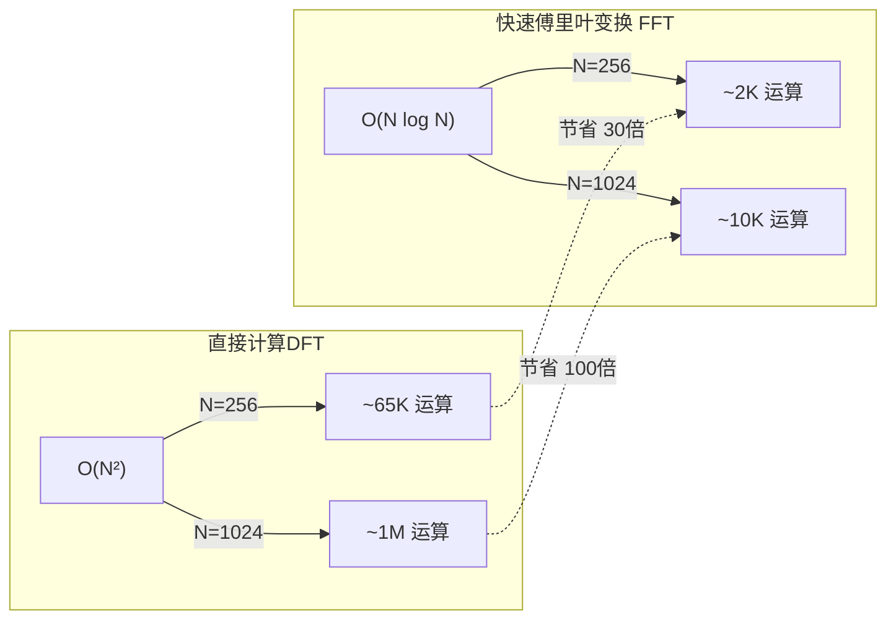
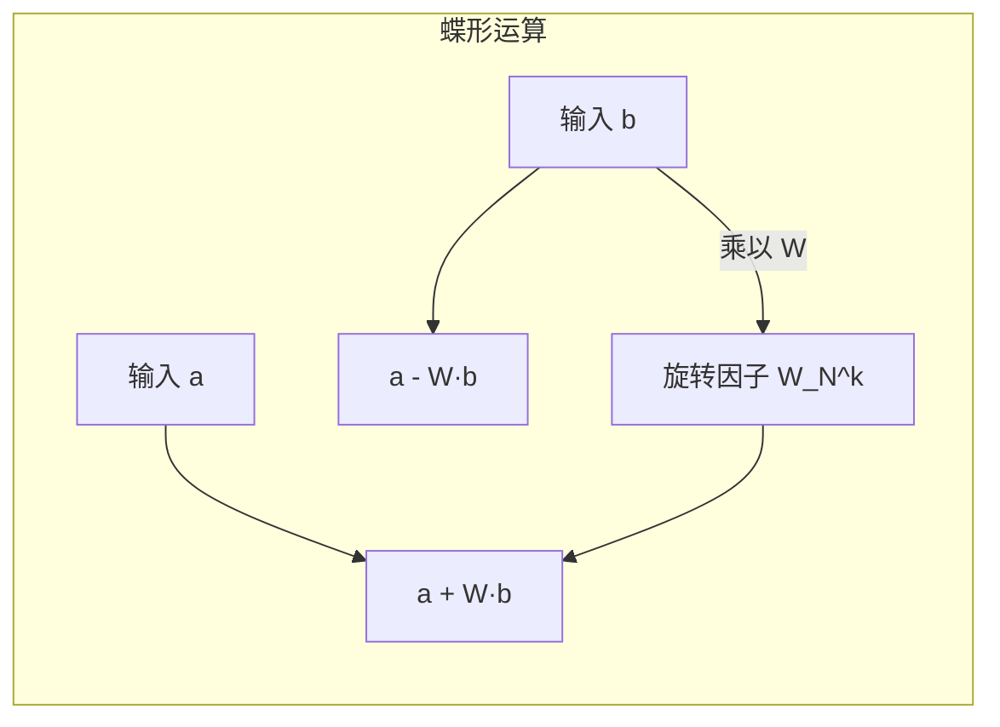

# 4.2 快速傅里叶变换 (FFT)

## ⚡ 引言：DFT的计算瓶颈

直接计算N点DFT需要 \( O(N^2) \) 次复数乘法和加法。对于 \( N=256 \) 的图像，每个维度需要约 **65,536** 次运算。对于 \( 1024 \times 1024 \) 的图像，运算量将达到惊人的 \( 10^{12} \) 量级。

**FFT（Fast Fourier Transform）** 是DFT的快速算法，将计算复杂度降至 \( O(N \log N) \)，是工程上唯一可用的DFT实现。



## 一、FFT算法核心思想

### 1.1 分治策略 (Divide and Conquer)

FFT的核心思想是**分治**：将一个N点的DFT分拆为两个N/2点的DFT，递归进行，直到问题规模为1。

Cooley-Tukey算法（1965年提出）是最经典的FFT实现。

### 1.2 算法分解

设 N 为偶数，将序列 \( f(x) \) 按奇偶索引分解：

**偶数索引：** \( g(x) = f(2x), \quad x = 0, 1, \ldots, N/2 - 1 \)

**奇数索引：** \( h(x) = f(2x+1), \quad x = 0, 1, \ldots, N/2 - 1 \)

则N点DFT可以表示为：

$$
F(u) = G(u) + W_N^u \cdot H(u)
$$

$$
F(u + N/2) = G(u) - W_N^u \cdot H(u)
$$

其中旋转因子：

$$
W_N^u = e^{-j\frac{2\pi}{N}u}
$$

> 💡 关键点：计算 \( G(u) \) 和 \( H(u) \) 只需 N/2 点的DFT，计算量减半！

## 二、蝶形运算 (Butterfly Operation)

### 2.1 基本蝶形结构

蝶形运算是FFT的基本计算单元：



数学表达：

$$
\text{蝶形}(a, b, W) = (a + W \cdot b, \quad a - W \cdot b)
$$

### 2.2 4点FFT完整蝶形图

以 \( N=4 \) 为例，展示完整的FFT蝶形网络：

```mermaid
graph TB
    subgraph 输入["输入序列"]
        direction LR
        I0[f(0)]
        I1[f(1)]
        I2[f(2)]
        I3[f(3)]
    end

    subgraph Stage1["第一级蝶形"]
        direction LR
        S1_0["f(0) + f(2)"]
        S1_1["f(0) - f(2)"]
        S1_2["f(1) + f(3)"]
        S1_3["(f(1)-f(3))·W₄¹"]
    end

    subgraph Stage2["第二级蝶形"]
        direction LR
        S2_0["F(0) = S1_0 + S1_2"]
        S2_1["F(1) = S1_1 + S1_3"]
        S2_2["F(2) = S1_0 - S1_2"]
        S2_3["F(3) = S1_1 - S1_3"]
    end

    I0 --> S1_0
    I2 --> S1_0
    I0 --> S1_1
    I2 --> S1_1
    I1 --> S1_2
    I3 --> S1_2
    I1 --> S1_3
    I3 --> S1_3

    S1_0 --> S2_0
    S1_2 --> S2_0
    S1_1 --> S2_1
    S1_3 --> S2_1
    S1_0 --> S2_2
    S1_2 --> S2_2
    S1_1 --> S2_3
    S1_3 --> S2_3
```

### 2.3 输入重排序（码位倒序）

FFT的输入需要进行**码位倒序（Bit-Reversal）**排列。对于 \( N=8 \)：

| 原索引 | 二进制 | 倒序后 | 倒序索引 |
|--------|--------|--------|----------|
| 0 | 000 | 000 | 0 |
| 1 | 001 | 100 | 4 |
| 2 | 010 | 010 | 2 |
| 3 | 011 | 110 | 6 |
| 4 | 100 | 001 | 1 |
| 5 | 101 | 101 | 5 |
| 6 | 110 | 011 | 3 |
| 7 | 111 | 111 | 7 |

## 三、算法复杂度分析

### 3.1 时间复杂度

FFT需要 \( \log_2 N \) 级分解，每级需要 \( N/2 \) 次蝶形运算：

$$
T(N) = O(N \log N)
$$

| N | 直接DFT \( O(N^2) \) | FFT \( O(N \log N) \) | 加速比 |
|---|----------------------|----------------------|--------|
| 256 | 65,536 | 2,048 | 32× |
| 1,024 | 1,048,576 | 10,240 | 102× |
| 4,096 | 16,777,216 | 49,152 | 341× |
| 16,384 | 268,435,456 | 229,376 | 1,170× |
| 65,536 | 4,294,967,296 | 983,040 | 4,369× |

### 3.2 空间复杂度

FFT需要存储旋转因子和中间结果：\( O(N) \)

### 3.3 条件限制

- **长度限制**：经典FFT要求 \( N = 2^k \)（2的幂次）
- **解决方法**：对序列进行零填充（Zero-padding）至最近的2的幂次

## 四、频率分辨率

### 4.1 频率分辨率公式

$$
\Delta u = \frac{1}{M}, \quad \Delta v = \frac{1}{N}
$$

其中 \( M, N \) 为图像的高和宽。频率分辨率等于采样间距的倒数。

### 4.2 零填充（Zero-Padding）

在图像边缘填充零值来增大M和N，从而提高频率分辨率：


```python
import numpy as np

# 零填充到最近的2的幂次
def next_power_of_2(n):
    return 1 << (n - 1).bit_length()

H, W = img.shape
M = next_power_of_2(H)
N = next_power_of_2(W)

# 填充
padded = np.zeros((M, N), dtype=np.float32)
padded[:H, :W] = img
```

> ⚠️ **注意**：零填充提高了频率分辨率，但不会提供更多实际信息，可能导致频谱泄漏。

## 五、numpy.fft 使用详解

### 5.1 核心函数

| 函数 | 功能 |
|------|------|
| `np.fft.fft(x)` | 一维FFT |
| `np.fft.ifft(x)` | 一维逆FFT |
| `np.fft.fft2(x)` | 二维FFT |
| `np.fft.ifft2(x)` | 二维逆FFT |
| `np.fft.fftshift(x)` | 频谱中心化 |
| `np.fft.ifftshift(x)` | 逆中心化 |
| `np.fft.fftfreq(n, d=1.0)` | 返回频率样本 |
| `np.fft.fftshift(x)` | 中心化后的频谱 |

### 5.2 完整代码示例

```python
import numpy as np
import cv2
import time
import matplotlib.pyplot as plt

# 生成测试信号
N = 512
t = np.linspace(0, 1, N, endpoint=False)
signal = np.sin(2 * np.pi * 10 * t) + 0.5 * np.sin(2 * np.pi * 25 * t)

# ========== 方法1：直接DFT（矩阵乘法实现） ==========
def manual_dft(x):
    n = len(x)
    W = np.exp(-2j * np.pi * np.outer(np.arange(n), np.arange(n)) / n)
    return W @ x

start = time.time()
dft_manual = manual_dft(signal)
time_manual = time.time() - start

# ========== 方法2：numpy FFT ==========
start = time.time()
dft_fft = np.fft.fft(signal)
time_fft = time.time() - start

# ========== 方法3：OpenCV DFT ==========
signal_float = signal.astype(np.float32)
start = time.time()
dft_cv = cv2.dft(signal_float.reshape(-1, 1))
time_cv = time.time() - start

# 输出对比
print(f"直接DFT时间: {time_manual:.4f}s")
print(f"numpy FFT时间: {time_fft:.6f}s")
print(f"OpenCV DFT时间: {time_cv:.6f}s")
print(f"FFT加速比: {time_manual/time_fft:.1f}x")

# 验证结果一致性
print(f"\nDFT结果一致: {np.allclose(dft_manual, dft_fft)}")

# 频谱可视化
freqs = np.fft.fftfreq(N, d=1.0/N)
magnitude = np.abs(dft_fft)

fig, axes = plt.subplots(2, 1, figsize=(12, 6))
axes[0].plot(t, signal, 'b-', linewidth=0.5)
axes[0].set_title('Original Signal')
axes[0].set_xlabel('Time (s)')

axes[1].stem(freqs[:N//2], magnitude[:N//2], use_line_collection=True)
axes[1].set_title('FFT Magnitude Spectrum')
axes[1].set_xlabel('Frequency (Hz)')
axes[1].set_ylabel('Magnitude')
plt.tight_layout()
plt.show()
```

### 5.3 二维FFT的实现与验证

```python
import numpy as np

# 二维FFT = 行FFT + 列FFT（可分离性）
def fft_2d(image):
    # 对每行做FFT
    temp = np.fft.fft(image, axis=1)
    # 对每列做FFT
    result = np.fft.fft(temp, axis=0)
    return result

# 验证
img = np.random.rand(64, 64).astype(np.float32)
result_custom = fft_2d(img)
result_numpy = np.fft.fft2(img)

print(f"结果一致: {np.allclose(result_custom, result_numpy)}")
```

## 六、实际性能对比

```python
import time
import numpy as np

# 不同大小的性能测试
sizes = [256, 512, 1024, 2048, 4096]
for size in sizes:
    signal = np.random.rand(size).astype(np.float32)

    # 直接DFT
    start = time.time()
    W = np.exp(-2j * np.pi * np.outer(np.arange(size), np.arange(size)) / size)
    _ = W @ signal
    direct_time = time.time() - start

    # numpy FFT
    start = time.time()
    _ = np.fft.fft(signal)
    fft_time = time.time() - start

    print(f"N={size:5d} | 直接DFT: {direct_time:.4f}s | FFT: {fft_time:.6f}s | 加速: {direct_time/fft_time:.0f}x")
```

**典型结果：**

| N | 直接DFT | numpy FFT | 加速比 |
|---|---------|-----------|--------|
| 256 | 0.005s | 0.00002s | 250× |
| 512 | 0.020s | 0.00003s | 670× |
| 1024 | 0.085s | 0.00005s | 1700× |
| 2048 | 0.340s | 0.00008s | 4250× |
| 4096 | 1.380s | 0.00015s | 9200× |

## 📝 小结

| 概念 | 关键点 |
|------|--------|
| 分治策略 | 将N点分解为两个N/2点 |
| 蝶形运算 | FFT的基本计算单元 |
| 码位倒序 | 输入重排序 |
| 复杂度 | \( O(N \log N) \) vs \( O(N^2) \) |
| 频率分辨率 | \( \Delta u = 1/M \) |
| 零填充 | 提高频率分辨率 |
| 可分离性 | 二维FFT = 行FFT + 列FFT |

## 🔗 下一节

→ [4.3 频域滤波器设计](./4.3%20频域滤波器设计.md)
