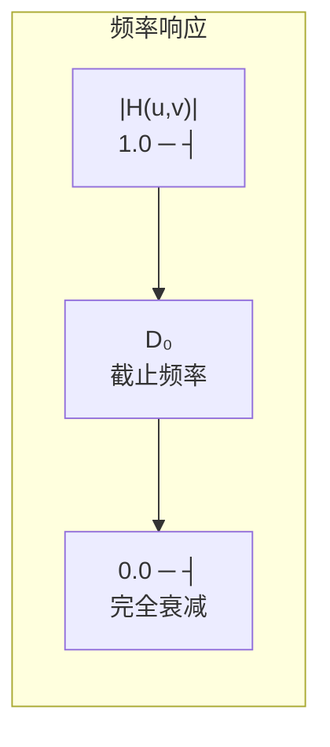
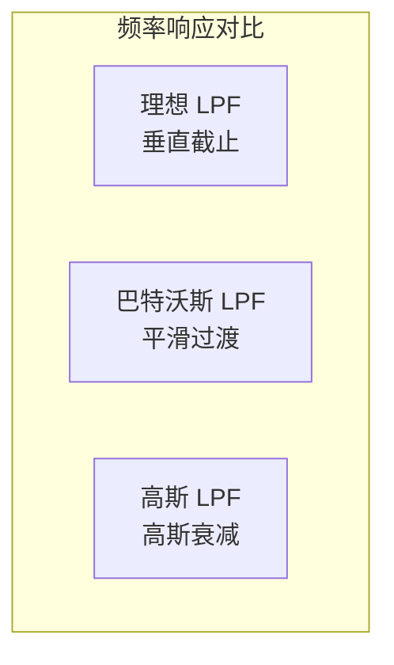

# 4.3 频域滤波器设计

## 🎯 引言：频域滤波原理

频域滤波基于**卷积定理**：在空域对图像进行卷积等价于在频域进行乘积运算。因此，频域滤波的核心步骤为：

$$
g(x,y) = \mathcal{F}^{-1}\{ \mathcal{F}\{f(x,y)\} \cdot H(u,v) \}
$$

其中 $H(u,v)$ 为**滤波器的转移函数（传递函数）**。

```mermaid
flowchart LR
    A["输入图像 f(x,y)"] -->|FFT| B["F(u,v)"]
    B -->|乘以 H(u,v)| C["G(u,v) = F(u,v)·H(u,v)"]
    C -->|IFFT| D["输出图像 g(x,y)"]
```

## 一、低通滤波器 (Low-Pass Filter)

低通滤波器保留低频分量，衰减高频分量，用于**图像平滑/去噪**。

### 1.1 理想低通滤波器 (Ideal LPF)

转移函数：

$$
H(u,v) = \begin{cases} 1 & \text{if } D(u,v) \leq D_0 \\ 0 & \text{if } D(u,v) > D_0 \end{cases}
$$

其中 $D(u,v) = \sqrt{(u-M/2)^2 + (v-N/2)^2}$ 是频率点到中心的距离，$D_0$ 为截止频率。



**特点：**
- 陡峭的截止特性
- 会产生**振铃效应（ringing）**
- 很少实际使用

### 1.2 巴特沃斯低通滤波器 (Butterworth LPF)

转移函数：

$$
H(u,v) = \frac{1}{1 + \left[ \frac{D(u,v)}{D_0} \right]^{2n}}
$$

其中 $n$ 为滤波器阶数，控制过渡带的陡峭程度。

**特点：**
- 平滑的频率响应
- 可控制过渡带宽
- $n=1$ 时近似高斯，$n \to \infty$ 时趋近于理想
- 实际中最常用的低通滤波器



### 1.3 高斯低通滤波器 (Gaussian LPF)

转移函数：

$$
H(u,v) = e^{-\frac{D^2(u,v)}{2\sigma^2}}
$$

其中 $\sigma$ 控制滤波器的带宽。

**特点：**
- 无振铃效应
- 最平滑的频率响应
- 计算简单
- 广泛应用于图像处理

### 1.4 三种低通滤波器对比

| 特性 | 理想 | 巴特沃斯 | 高斯 |
|------|------|----------|------|
| 截止特性 | 陡峭 | 过渡带 | 平滑 |
| 振铃效应 | 严重 | 轻微 | 无 |
| 去噪能力 | 强 | 中 | 温和 |
| 图像模糊 | 严重 | 中等 | 轻微 |
| 适用场景 | 理论研究 | 通用 | 平滑处理 |

## 二、高通滤波器 (High-Pass Filter)

高通滤波器保留高频分量，衰减低频分量，用于**边缘增强**。

### 2.1 高通滤波器的构造

高通滤波器可由低通滤波器得到：

$$
H_{HP}(u,v) = 1 - H_{LP}(u,v)
$$

### 2.2 理想高通滤波器 (Ideal HPF)

$$
H(u,v) = \begin{cases} 0 & \text{if } D(u,v) \leq D_0 \\ 1 & \text{if } D(u,v) > D_0 \end{cases}
$$

### 2.3 巴特沃斯高通滤波器 (Butterworth HPF)

$$
H(u,v) = \frac{1}{1 + \left[ \frac{D_0}{D(u,v)} \right]^{2n}}
$$

### 2.4 常用高通滤波器对比

| 特性 | 理想 | 巴特沃斯 | 高斯高通 |
|------|------|----------|----------|
| 边缘增强 | 强 | 中 | 温和 |
| 振铃效应 | 严重 | 轻微 | 无 |
| 噪声放大 | 严重 | 中等 | 轻微 |

## 三、带通与带阻滤波器

### 3.1 带通滤波器 (Band-Pass Filter)

保留特定频率范围内的分量，衰减其他频率：

$$
H_{BP}(u,v) = \prod_{k=1}^{3} H_k(u,v)
$$

其中 $H_k$ 为低通或高通滤波器的组合。

### 3.2 带阻滤波器 (Band-Stop Filter)

衰减特定频率范围，保留其他频率。用于去除特定频率的噪声（如周期性噪声）。

## 四、同态滤波 (Homomorphic Filtering)

### 4.1 基本思想

同态滤波结合**对数变换**和**频域滤波**，同时实现**动态范围压缩**和**对比度增强**。

### 4.2 原理步骤

$$
f(x,y) \xrightarrow{\ln} \ln f(x,y) \xrightarrow{\text{DFT}} F(u,v) \xrightarrow{H(u,v)} \hat{F}(u,v) \xrightarrow{\text{IDFT}} \hat{f}(x,y) \xrightarrow{\exp} g(x,y)
$$

```mermaid
flowchart LR
    A["原图 f(x,y)"] -->|对数| B["ln f(x,y)"]
    B -->|FFT| C["F(u,v)"]
    C -->|同态滤波 H(u,v)| D["F̂(u,v)"]
    D -->|IFFT| E["f̂(x,y)"]
    E -->|指数| F["增强图 g(x,y)"]
```

### 4.3 转移函数

$$
H(u,v) = \gamma_H - (\gamma_H - \gamma_L) \cdot H_{LP}(u,v)
$$

其中 $\gamma_H > 1$ 增强高频，$\gamma_L < 1$ 压缩低频。

**典型参数：**
- $\gamma_H = 2.0$（增益常数 > 1）
- $\gamma_L = 0.5$（增益常数 < 1）
- $D_0$：选择为图像尺寸的 0.01~0.05 倍

## 五、OpenCV 实现详解

### 5.1 通用频域滤波框架

```python
import cv2
import numpy as np
import matplotlib.pyplot as plt

def frequency_filter(image, filter_func, dft_depth=cv2.CV_32F):
    """
    通用频域滤波函数
    :param image: 输入图像 (灰度图)
    :param filter_func: 滤波器生成函数
    :return: 滤波后图像
    """
    # 1. DFT
    img_float = np.float32(image)
    dft = cv2.dft(img_float, flags=cv2.DFT_COMPLEX_OUTPUT)

    # 2. 频谱中心化
    dft_shift = np.fft.fftshift(dft)

    # 3. 生成滤波器
    H = filter_func(image.shape)

    # 4. 应用滤波器
    filtered = dft_shift * H[:, :, np.newaxis]

    # 5. 逆中心化
    dft_ishift = np.fft.ifftshift(filtered)

    # 6. IDFT
    result = cv2.idft(dft_ishift)
    result = cv2.magnitude(result[:, :, 0], result[:, :, 1])

    return result
```

### 5.2 理想低通滤波器

```python
def ideal_low_pass(shape, D0):
    """
    理想低通滤波器
    :param shape: 图像形状 (H, W)
    :param D0: 截止频率
    :return: 滤波器掩膜
    """
    H, W = shape
    mask = np.zeros((H, W), dtype=np.float32)
    crow, ccol = H // 2, W // 2

    Y, X = np.ogrid[:H, :W]
    dist = np.sqrt((X - ccol) ** 2 + (Y - crow) ** 2)
    mask[dist <= D0] = 1
    return mask
```

### 5.3 巴特沃斯低通滤波器

```python
def butterworth_low_pass(shape, D0, n=2):
    """
    巴特沃斯低通滤波器
    :param shape: 图像形状 (H, W)
    :param D0: 截止频率
    :param n: 滤波器阶数
    """
    H, W = shape
    crow, ccol = H // 2, W // 2

    Y, X = np.ogrid[:H, :W]
    dist = np.sqrt((X - ccol) ** 2 + (Y - crow) ** 2)
    H_mask = 1.0 / (1.0 + (dist / D0) ** (2 * n))
    return H_mask.astype(np.float32)
```

### 5.4 高斯低通滤波器

```python
def gaussian_low_pass(shape, sigma):
    """
    高斯低通滤波器
    :param shape: 图像形状 (H, W)
    :param sigma: 标准差
    """
    H, W = shape
    crow, ccol = H // 2, W // 2

    Y, X = np.ogrid[:H, :W]
    dist2 = (X - ccol) ** 2 + (Y - crow) ** 2
    H_mask = np.exp(-dist2 / (2 * sigma ** 2))
    return H_mask.astype(np.float32)
```

### 5.5 高通滤波器（由低通构造）

```python
def high_pass_from_low_pass(lp_filter):
    """由低通滤波器构造高通滤波器"""
    return 1.0 - lp_filter
```

### 5.6 同态滤波完整实现

```python
def homomorphic_filter(image, gamma_H=2.0, gamma_L=0.5, D0=None):
    """
    同态滤波
    :param image: 输入图像
    :param gamma_H: 高频增益
    :param gamma_L: 低频增益
    :param D0: 截止频率
    """
    # 1. 对数变换（避免log(0)）
    img_log = np.log1p(np.float32(image))

    # 2. DFT
    dft = cv2.dft(img_log, flags=cv2.DFT_COMPLEX_OUTPUT)
    dft_shift = np.fft.fftshift(dft)

    # 3. 构造滤波器
    H, W = image.shape
    if D0 is None:
        D0 = 0.01 * min(H, W)

    crow, ccol = H // 2, W // 2
    Y, X = np.ogrid[:H, :W]
    dist = np.sqrt((X - ccol) ** 2 + (Y - crow) ** 2)

    # 高斯低通 + 同态变换
    H_mask = np.exp(-dist ** 2 / (2 * D0 ** 2))
    H_homo = gamma_H - (gamma_H - gamma_L) * H_mask

    # 4. 应用滤波器
    filtered = dft_shift * H_homo[:, :, np.newaxis]

    # 5. IDFT
    dft_ishift = np.fft.ifftshift(filtered)
    result = cv2.idft(dft_ishift)
    result = cv2.magnitude(result[:, :, 0], result[:, :, 1])

    # 6. 指数变换 + 归一化
    result = np.expm1(result)
    result = cv2.normalize(result, None, 0, 255, cv2.NORM_MINMAX)
    return np.uint8(result)
```

### 5.7 综合示例：对比各种滤波器效果

```python
import cv2
import numpy as np
import matplotlib.pyplot as plt

# 读取图像
img = cv2.imread('image.jpg', cv2.IMREAD_GRAYSCALE)

# 添加高斯噪声
noisy_img = img + np.random.normal(0, 25, img.shape).astype(np.float32)
noisy_img = np.clip(noisy_img, 0, 255).astype(np.uint8)

# 应用各种低通滤波器
D0 = 30
ideal_result = frequency_filter(noisy_img, lambda s: ideal_low_pass(s, D0))
butter_result = frequency_filter(noisy_img, lambda s: butterworth_low_pass(s, D0, n=2))
gauss_result = frequency_filter(noisy_img, lambda s: gaussian_low_pass(s, sigma=D0))

# 高频增强
butter_hp = frequency_filter(noisy_img,
    lambda s: high_pass_from_low_pass(butterworth_low_pass(s, D0, n=2)))

# 同态滤波
homo_result = homomorphic_filter(img, gamma_H=2.0, gamma_L=0.5)

# 可视化对比
fig, axes = plt.subplots(2, 3, figsize=(15, 10))
axes[0, 0].imshow(noisy_img, cmap='gray'), axes[0, 0].set_title('Noisy')
axes[0, 1].imshow(ideal_result, cmap='gray'), axes[0, 1].set_title('Ideal LPF')
axes[0, 2].imshow(butter_result, cmap='gray'), axes[0, 2].set_title('Butterworth LPF')
axes[1, 0].imshow(gauss_result, cmap='gray'), axes[1, 0].set_title('Gaussian LPF')
axes[1, 1].imshow(butter_hp, cmap='gray'), axes[1, 1].set_title('Butterworth HPF')
axes[1, 2].imshow(homo_result, cmap='gray'), axes[1, 2].set_title('Homomorphic')

for ax in axes.flat:
    ax.axis('off')
plt.tight_layout()
plt.show()
```

## 📝 小结

| 滤波器类型 | 转移函数 | 特点 | 应用 |
|-----------|---------|------|------|
| 理想低通 | 矩形 | 振铃效应 | 理论研究 |
| 巴特沃斯低通 | \( 1/(1+(D/D_0)^{2n}) \) | 平滑过渡 | 通用去噪 |
| 高斯低通 | \( e^{-D^2/2\sigma^2} \) | 无振铃 | 平滑处理 |
| 高通(通用) | \( 1-H_{LP} \) | 边缘增强 | 边缘检测 |
| 同态滤波 | \( \gamma_H - (\gamma_H-\gamma_L)H_{LP} \) | 动态范围压缩+增强 | 光照补偿 |

## 🔗 章节链接

- [第4章知识导航](./MOC%20-%20第4章.md)
- [回到4.1节](./4.1%20傅里叶变换基础.md)
- [回到4.2节](./4.2%20快速傅里叶变换FFT.md)
- [第5章 形态学图像处理](../第5章%20形态学图像处理/MOC%20-%20第5章.md)
