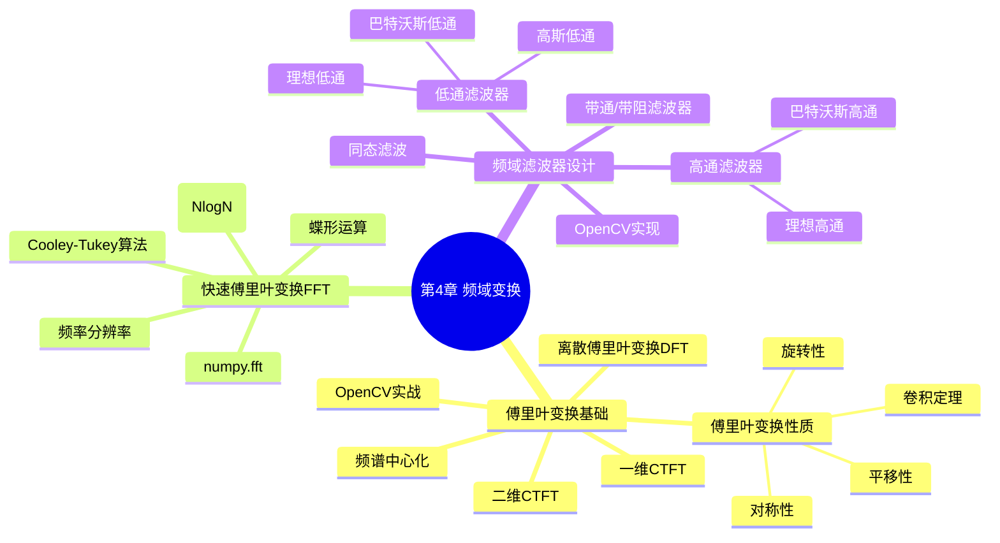

# 第4章 频域变换：傅里叶变换与频域滤波 — 导航

## 📋 章节概览

本章系统介绍数字图像处理中的频域分析核心工具——**傅里叶变换**及其在滤波中的应用。从连续傅里叶变换到离散傅里叶变换(DFT)，再到快速傅里叶变换(FFT)的工程实现，最终落脚于频域滤波器的设计与应用。

## 🗺️ 知识地图 (Mermaid)

## 📚 学习路径

| 序号 | 文件 | 核心内容 | 重要程度 |
|------|------|----------|----------|
| 4.1 | [傅里叶变换基础](./4.1%20傅里叶变换基础.md) | CTFT、DFT、变换性质、频谱中心化 | ⭐⭐⭐⭐⭐ |
| 4.2 | [快速傅里叶变换FFT](./4.2%20快速傅里叶变换FFT.md) | Cooley-Tukey、蝶形图、复杂度、numpy.fft | ⭐⭐⭐⭐ |
| 4.3 | [频域滤波器设计](./4.3%20频域滤波器设计.md) | 低通/高通/带通滤波器、同态滤波、OpenCV实现 | ⭐⭐⭐⭐⭐ |

## 🎯 核心考点 (考研/竞赛)

### 高频考点

1. **离散傅里叶变换(DFT)公式** — 二维DFT的定义与计算
2. **傅里叶变换性质** — 平移、旋转、卷积定理、对称性
3. **FFT算法原理** — Cooley-Tukey算法的分治思想、蝶形运算
4. **频谱中心化** — `fftshift`的作用与原理
5. **低通滤波器** — 理想/巴特沃斯/高斯低通的转移函数与特性对比
6. **高通滤波器** — 基于低通的高通滤波器构造
7. **同态滤波** — 结合同态变换的图像增强

### 典型题型

- 计算题：给定图像矩阵，计算DFT系数
- 证明题：证明傅里叶变换的平移性质或卷积定理
- 分析题：对比不同滤波器的频谱特性和去噪效果
- 编程题：使用OpenCV/numpy实现FFT和频域滤波

## ✅ 自测题

### 基础题

1. 什么是傅里叶变换？它将信号从**时域**映射到什么域？这种映射的意义是什么？

2. 写出二维离散傅里叶变换(DFT)的公式，并说明每个符号的含义。

3. `fftshift`函数的作用是什么？为什么需要进行频谱中心化？

4. FFT的时间复杂度是多少？与直接计算DFT的O(N²)相比有何优势？

### 进阶题

5. 证明傅里叶变换的**卷积定理**：两个信号卷积的傅里叶变换等于它们傅里叶变换的乘积。

6. 理想低通滤波器和巴特沃斯低通滤波器在截止频率处有什么区别？这种区别对滤波效果有什么影响？

7. 同态滤波的基本思想是什么？它结合了哪两种图像处理技术？

8. 使用Python/OpenCV实现：读取一幅图像，对其进行FFT，将频谱中心化，然后使用高斯低通滤波，最后逆变换回空域。

### 应用题

9. 为什么在数字图像处理中常用频域滤波而不是空域滤波？两者各有什么优势？

10. 设计一个实验：使用频域方法去除图像中的周期性噪声（如扫描线干扰），说明你的设计思路和滤波器选择。

## 🔗 相关章节

- **前置知识**：[第3章 空间域图像处理](../第3章%20空间域图像处理/MOC%20-%20第3章.md)
- **后续知识**：[第5章 形态学图像处理](../第5章%20形态学图像处理/MOC%20-%20第5章.md)
- **拓展阅读**：小波变换、短时傅里叶变换(STFT)
