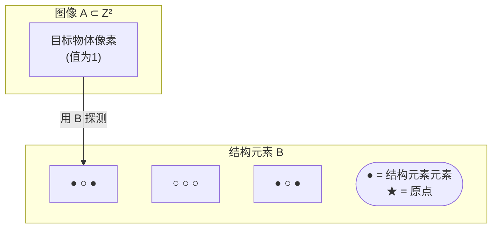
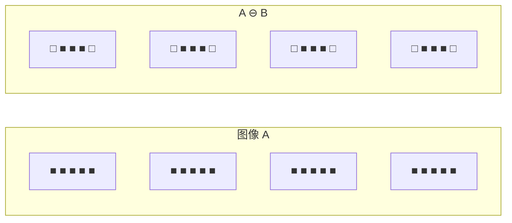
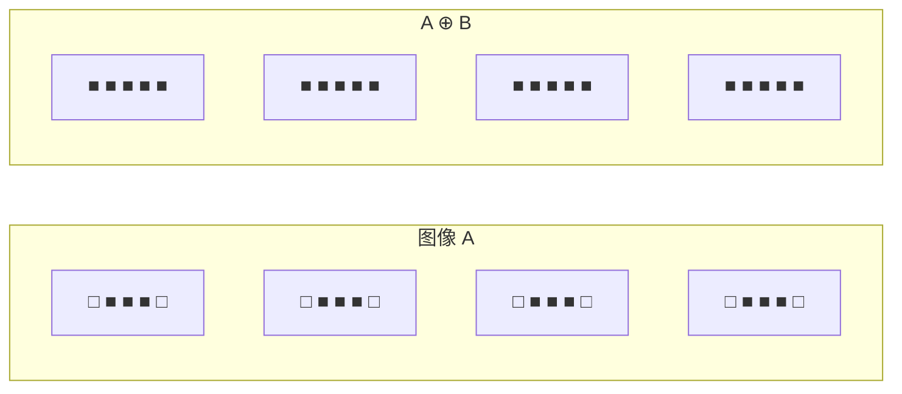

# 5.1 形态学基本运算

## 🌱 引言：数学形态学基础

**数学形态学（Mathematical Morphology）** 是一门研究图像形状和结构的数学分支，由法国数学家 Serra 和 Matheron 于1960年代创立。它的理论基础是**集合论**，主要用于从图像中提取和分析形状信息。

### 基本概念

- **图像**：表示为二维空间 $Z^2$ 中的集合
- **结构元素（Structuring Element, SE）**：一个小的集合，作为"探针"在图像上移动
- **原点（Origin）**：结构元素的参考点



## 一、腐蚀 (Erosion)

### 1.1 数学定义

腐蚀是形态学处理中最基本的操作，用于**缩小**物体边界，消除小的突出部分。

$$
\boxed{A \ominus B = \{ z \mid B_z \subseteq A \}}
$$

其中：
- $A$：输入图像（集合）
- $B$：结构元素
- $B_z$：结构元素 $B$ 平移到位置 $z$ 后的集合
- $B_z \subseteq A$：$B_z$ 是 $A$ 的子集

**含义**：腐蚀操作将结构元素 $B$ 在图像 $A$ 上平移，当 $B$ 完全包含在 $A$ 中时，$z$ 点保留。

### 1.2 几何直观



**效果：**
- 物体边界向内收缩
- 消除小的突起和毛刺
- 断开细的连接
- 小孔洞可能被消除

### 1.3 计算示例

设结构元素 $B$ 为：

```
B = {(-1,0), (0,-1), (0,0), (0,1), (1,0)}  (十字形)
```

对下列二值图像 $A$ 进行腐蚀：

```
A:                    B (结构元素):
0 0 1 0 0            0 1 0
0 1 1 1 0            1 1 1
1 1 1 1 1            0 1 0
0 1 1 1 0
0 0 1 0 0
```

腐蚀结果：

```
A ⊖ B:
0 0 0 0 0
0 0 1 0 0
0 1 1 1 0
0 0 1 0 0
0 0 0 0 0
```

## 二、膨胀 (Dilation)

### 2.1 数学定义

膨胀是腐蚀的对偶操作，用于**扩大**物体边界，填充小孔洞。

$$
\boxed{A \oplus B = \{ z \mid B_z \cap A \neq \emptyset \}}
$$

**含义**：膨胀操作将结构元素 $B$ 在图像 $A$ 上平移，当 $B$ 与 $A$ 有交集时，$z$ 点保留。

### 2.2 几何直观



**效果：**
- 物体边界向外扩展
- 填充小孔洞和缝隙
- 连接断裂的物体

### 2.3 计算示例

对上面的图像 $A$ 进行膨胀：

```
A:                    B (结构元素):
0 0 1 0 0            0 1 0
0 1 1 1 0            1 1 1
1 1 1 1 1            0 1 0
0 1 1 1 0
0 0 1 0 0

A ⊕ B:
0 1 1 1 0
1 1 1 1 1
1 1 1 1 1
1 1 1 1 1
0 1 1 1 0
```

## 三、腐蚀与膨胀的对偶性

腐蚀和膨胀是**对偶操作**：

$$
A \ominus B = (A^c \oplus B^c)^c
$$

$$
A \oplus B = (A^c \ominus B^c)^c
$$

其中 $A^c$ 是 $A$ 的补集（互补图像），$B^c$ 是 $B$ 的反射（关于原点对称）。

> 💡 对偶性意味着：对前景的腐蚀等价于对背景的膨胀（用反射结构元素）。

## 四、结构元素的类型与选择

### 4.1 常见结构元素形状

| 形状 | 图示 | 适用场景 |
|------|------|----------|
| 矩形 \(3 \times 3\) | `1 1 1 / 1 1 1 / 1 1 1` | 通用处理 |
| 十字形 | `0 1 0 / 1 1 1 / 0 1 0` | 保留对角线 |
| 圆形 | 圆形图案 | 各向同性处理 |
| 线性 | 单行/单列 | 方向性处理 |

### 4.2 OpenCV 中的结构元素

```python
import cv2
import numpy as np

# 矩形结构元素
kernel_rect = cv2.getStructuringElement(cv2.MORPH_RECT, (5, 5))

# 椭圆结构元素
kernel_ellipse = cv2.getStructuringElement(cv2.MORPH_ELLIPSE, (5, 5))

# 十字形结构元素
kernel_cross = cv2.getStructuringElement(cv2.MORPH_CROSS, (5, 5))

# 自定义结构元素
kernel_custom = np.array([[0, 1, 0],
                           [1, 1, 1],
                           [0, 1, 0]], dtype=np.uint8)

print("矩形核:\n", kernel_rect)
print("椭圆核:\n", kernel_ellipse)
print("十字核:\n", kernel_cross)
```

**输出：**

```
矩形核:
 [[1 1 1 1 1]
  [1 1 1 1 1]
  [1 1 1 1 1]
  [1 1 1 1 1]
  [1 1 1 1 1]]
椭圆核:
 [[0 0 1 0 0]
  [1 1 1 1 1]
  [1 1 1 1 1]
  [1 1 1 1 1]
  [0 0 1 0 0]]
十字核:
 [[0 0 1 0 0]
  [0 0 1 0 0]
  [1 1 1 1 1]
  [0 0 1 0 0]
  [0 0 1 0 0]]
```

### 4.3 结构元素选择原则

| 结构元素 | 特性 | 选择建议 |
|----------|------|----------|
| 矩形 | 各向异性，在所有方向等距扩展 | 默认选择 |
| 椭圆/圆形 | 各向同性，圆形对称 | 圆形物体处理 |
| 十字形 | 仅在十字方向扩展 | 保留对角线结构 |
| 线性 | 仅单一方向扩展 | 方向性边缘 |

## 五、边界提取

### 5.1 边界提取原理

边界提取通过原图像减去腐蚀结果得到：

$$
\text{Boundary}(A) = A - (A \ominus B)
$$

或使用形态学梯度（见5.2节）。

### 5.2 OpenCV 实现

```python
import cv2
import numpy as np
import matplotlib.pyplot as plt

# 读取二值图像
img = cv2.imread('binary_image.png', cv2.IMREAD_GRAYSCALE)
_, binary = cv2.threshold(img, 127, 255, cv2.THRESH_BINARY)

# 定义结构元素
kernel = cv2.getStructuringElement(cv2.MORPH_RECT, (3, 3))

# 腐蚀
eroded = cv2.erode(binary, kernel, iterations=1)

# 边界提取
boundary = cv2.subtract(binary, eroded)

# 显示结果
fig, axes = plt.subplots(1, 3, figsize=(15, 5))
axes[0].imshow(binary, cmap='gray'), axes[0].set_title('Original')
axes[1].imshow(eroded, cmap='gray'), axes[1].set_title('Eroded')
axes[2].imshow(boundary, cmap='gray'), axes[2].set_title('Boundary')
plt.tight_layout()
plt.show()
```

## 六、OpenCV 核心函数详解

### 6.1 cv2.erode（腐蚀）

```python
# 函数签名
cv2.erode(src, kernel, dst=None, anchor=None, iterations=1,
          borderType=cv2.BORDER_CONSTANT, borderValue=None)
```

| 参数 | 说明 |
|------|------|
| `src` | 输入图像 |
| `kernel` | 结构元素 |
| `anchor` | 锚点位置（默认结构元素中心） |
| `iterations` | 腐蚀次数 |
| `borderType` | 边界填充方式 |
| `borderValue` | 边界填充值 |

### 6.2 cv2.dilate（膨胀）

```python
# 函数签名
cv2.dilate(src, kernel, dst=None, anchor=None, iterations=1,
           borderType=cv2.BORDER_CONSTANT, borderValue=None)
```

参数与 `erode` 相同。

### 6.3 完整实战示例

```python
import cv2
import numpy as np
import matplotlib.pyplot as plt

# 1. 创建测试二值图像
img = np.zeros((100, 100), dtype=np.uint8)
cv2.rectangle(img, (20, 20), (80, 80), 255, -1)
cv2.circle(img, (50, 50), 15, 0, -1)  # 添加孔洞
# 添加小突起
cv2.rectangle(img, (80, 45), (90, 55), 255, -1)

# 2. 定义不同结构元素
kernels = {
    '3x3 矩形': cv2.getStructuringElement(cv2.MORPH_RECT, (3, 3)),
    '5x5 矩形': cv2.getStructuringElement(cv2.MORPH_RECT, (5, 5)),
    '3x3 椭圆': cv2.getStructuringElement(cv2.MORPH_ELLIPSE, (3, 3)),
    '3x3 十字': cv2.getStructuringElement(cv2.MORPH_CROSS, (3, 3)),
}

# 3. 应用腐蚀和膨胀
fig, axes = plt.subplots(len(kernels) + 1, 3, figsize=(12, 4 * (len(kernels) + 1)))

axes[0, 0].imshow(img, cmap='gray'), axes[0, 0].set_title('Original')
axes[0, 1].axis('off')
axes[0, 2].axis('off')

for i, (name, kernel) in enumerate(kernels.items(), 1):
    eroded = cv2.erode(img, kernel, iterations=1)
    dilated = cv2.dilate(img, kernel, iterations=1)

    axes[i, 0].imshow(img, cmap='gray'), axes[i, 0].set_title('Original')
    axes[i, 1].imshow(eroded, cmap='gray'), axes[i, 1].set_title(f'Erode - {name}')
    axes[i, 2].imshow(dilated, cmap='gray'), axes[i, 2].set_title(f'Dilate - {name}')

for ax in axes.flat:
    ax.axis('off')
plt.tight_layout()
plt.show()
```

### 6.4 迭代次数的影响

```python
# 多次迭代腐蚀
fig, axes = plt.subplots(1, 5, figsize=(20, 4))
for i, iterations in enumerate([1, 2, 3, 4, 5]):
    eroded = cv2.erode(img, kernel, iterations=iterations)
    axes[i].imshow(eroded, cmap='gray')
    axes[i].set_title(f'Iter={iterations}')
    axes[i].axis('off')
plt.tight_layout()
plt.show()
```

## 📝 小结

| 操作 | 数学定义 | 效果 | 应用 |
|------|----------|------|------|
| 腐蚀 \(A \ominus B\) | \(\{z \mid B_z \subseteq A\}\) | 缩小物体 | 去除噪声、分离物体 |
| 膨胀 \(A \oplus B\) | \(\{z \mid B_z \cap A \neq \emptyset\}\) | 扩大物体 | 填充孔洞、连接物体 |
| 边界提取 | \(A - (A \ominus B)\) | 提取边缘轮廓 | 轮廓检测 |

### 对偶关系

$$
A \ominus B \longleftrightarrow A \oplus B
$$

$$
A \ominus B = (A^c \oplus \hat{B})^c
$$

## 🔗 下一节

→ [5.2 形态学组合运算](./5.2%20形态学组合运算.md)
