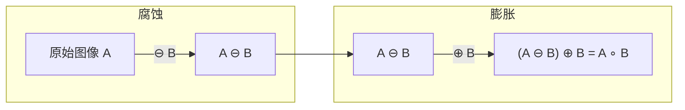
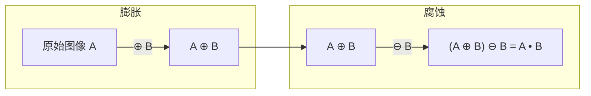
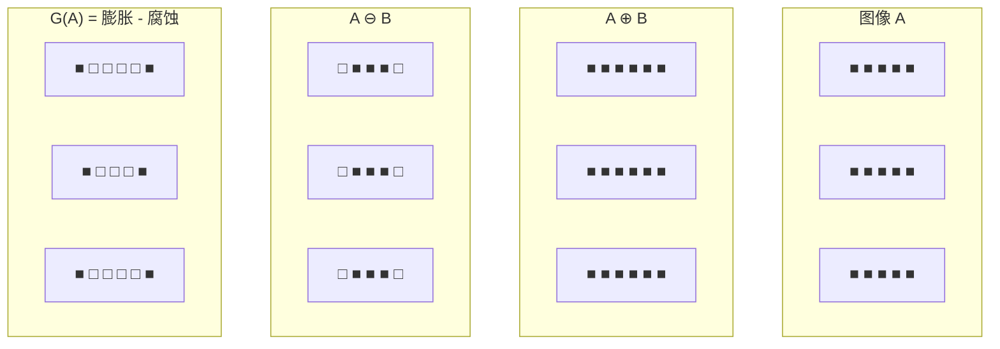
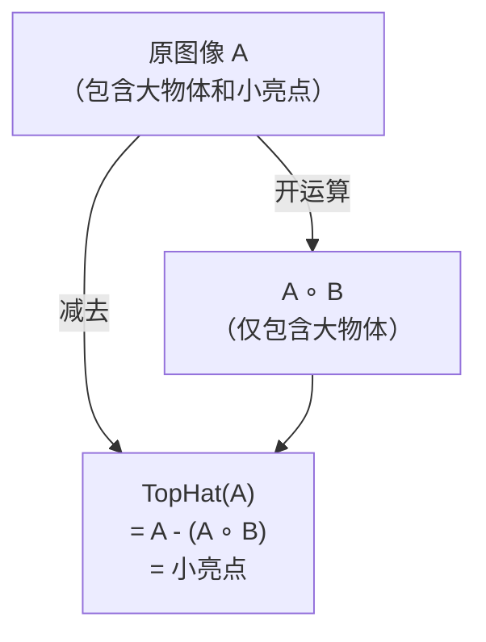
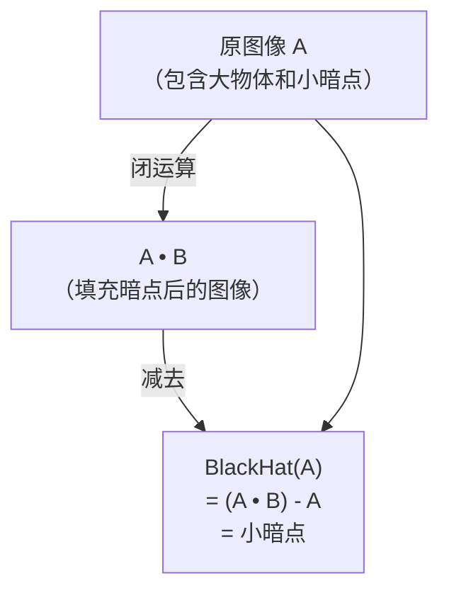
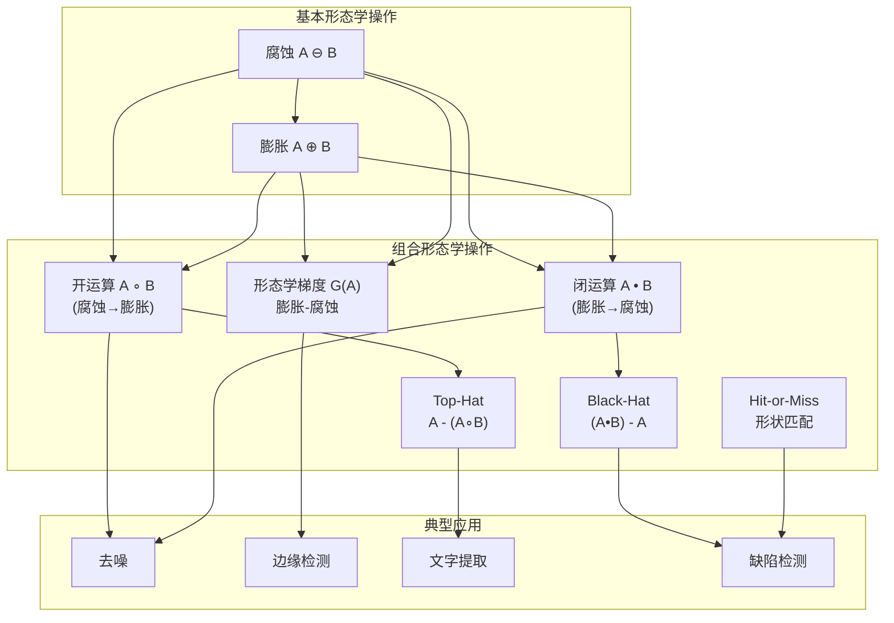

# 5.2 形态学组合运算

## 🔗 引言：从基本到组合

腐蚀和膨胀是形态学的两个基本操作。通过按特定顺序组合它们，可以构造出更强大的图像处理算法——开运算、闭运算、形态学梯度、Top-Hat 变换等。

## 一、开运算 (Opening)

### 1.1 数学定义

开运算 = 先腐蚀后膨胀：

$$
\boxed{A \circ B = (A \ominus B) \oplus B}
$$

### 1.2 几何直观



### 1.3 效果与应用

**效果：**
- 去除小的**亮点噪声**（比结构元素小的突出部分）
- 平滑物体轮廓
- 断开狭窄的连接
- **不会显著改变物体的整体形状**

**应用：**
- 去除二值图像中的小噪声点
- 分离轻微连接的物体
- 预处理步骤

## 二、闭运算 (Closing)

### 2.1 数学定义

闭运算 = 先膨胀后腐蚀：

$$
\boxed{A \bullet B = (A \oplus B) \ominus B}
$$

### 2.2 几何直观



### 2.3 效果与应用

**效果：**
- 去除小的**暗点噪声**（填充比结构元素小的孔洞）
- 连接狭窄的断裂
- 填充小孔洞和缝隙
- **不会显著改变物体的整体形状**

**应用：**
- 填充二值图像中的小孔洞
- 连接断裂的物体
- 修复图像中的小缺陷

## 三、开运算与闭运算的对偶性

开运算和闭运算互为**对偶操作**：

$$
A \circ B = (A^c \bullet \hat{B})^c
$$

$$
A \bullet B = (A^c \circ \hat{B})^c
$$

### 性质对比

| 性质 | 开运算 | 闭运算 |
|------|--------|--------|
| 操作顺序 | 先腐蚀后膨胀 | 先膨胀后腐蚀 |
| 去噪类型 | 亮点噪声 | 暗点噪声 |
| 对物体大小的影响 | 略微缩小 | 略微扩大 |
| 幂等性 | \((A \circ B) \circ B = A \circ B\) | \((A \bullet B) \bullet B = A \bullet B\) |

> 💡 **幂等性**：开运算和闭运算进行多次的效果与进行一次相同。

## 四、形态学梯度 (Morphological Gradient)

### 4.1 数学定义

形态学梯度 = 膨胀结果 - 腐蚀结果：

$$
\boxed{G(A) = (A \oplus B) - (A \ominus B)}
$$

或等价地：

$$
G(A) = A \oplus B - A \ominus B
$$

### 4.2 几何直观



### 4.3 应用

- **边缘检测**：提取物体的精确边界
- **轮廓提取**：获取物体的形状特征
- 作为预处理步骤

## 五、Top-Hat 变换

### 5.1 数学定义

Top-Hat = 原图像 - 开运算结果：

$$
\boxed{\text{TopHat}(A) = A - (A \circ B)}
$$

### 5.2 几何直观



### 5.3 效果与应用

**效果：**
- 提取比结构元素**小**的**亮**细节
- 去除比结构元素**大**的背景
- 背景不均匀时增强亮细节

**应用场景：**
- **文档分析**：从不均匀背景中提取文字
- **目标检测**：从复杂背景中提取小目标
- **特征提取**：突出细节特征

## 六、Black-Hat 变换

### 6.1 数学定义

Black-Hat = 闭运算结果 - 原图像：

$$
\boxed{\text{BlackHat}(A) = (A \bullet B) - A}
$$

### 6.2 几何直观



### 6.3 效果与应用

**效果：**
- 提取比结构元素**小**的**暗**细节
- 补偿 Top-Hat 变换的不足

**应用场景：**
- **缺陷检测**：检测表面的凹陷、裂纹等暗缺陷
- **文档分析**：提取阴影部分
- **特征提取**：突出暗细节特征

## 七、Hit-or-Miss 变换

### 7.1 数学定义

Hit-or-Miss 变换是一种用于**精确定位**特定形状的形态学操作。它使用两个结构元素 $B_1$ 和 $B_2$：

$$
\boxed{A \circledast B = (A \ominus B_1) \cap (A^c \ominus B_2)}
$$

其中 $B_1$ 检测前景形状，$B_2$ 检测背景形状。

### 7.2 应用

- **精确形状匹配**：定位特定的几何图案
- **字符识别**：检测特定的字符模式
- **形状检测**：定位特定形状的物体

## 八、OpenCV 实现详解

### 8.1 cv2.morphologyEx 函数

OpenCV 使用 `cv2.morphologyEx` 函数实现所有形态学操作：

```python
cv2.morphologyEx(src, op, kernel, dst=None, anchor=None,
                  iterations=1, borderType=cv2.BORDER_CONSTANT,
                  borderValue=None)
```

其中 `op` 参数指定操作类型：

| 参数 | 操作 | 定义 |
|------|------|------|
| `cv2.MORPH_ERODE` | 腐蚀 | $A \ominus B$ |
| `cv2.MORPH_DILATE` | 膨胀 | $A \oplus B$ |
| `cv2.MORPH_OPEN` | 开运算 | $(A \ominus B) \oplus B$ |
| `cv2.MORPH_CLOSE` | 闭运算 | $(A \oplus B) \ominus B$ |
| `cv2.MORPH_GRADIENT` | 形态学梯度 | $(A \oplus B) - (A \ominus B)$ |
| `cv2.MORPH_TOPHAT` | Top-Hat | $A - (A \circ B)$ |
| `cv2.MORPH_BLACKHAT` | Black-Hat | $(A \bullet B) - A$ |

### 8.2 完整代码示例

```python
import cv2
import numpy as np
import matplotlib.pyplot as plt

# 1. 读取图像
img = cv2.imread('image.jpg', cv2.IMREAD_GRAYSCALE)
_, binary = cv2.threshold(img, 127, 255, cv2.THRESH_BINARY)

# 2. 定义结构元素
kernel = cv2.getStructuringElement(cv2.MORPH_RECT, (5, 5))

# 3. 应用各种形态学操作
opening = cv2.morphologyEx(binary, cv2.MORPH_OPEN, kernel)
closing = cv2.morphologyEx(binary, cv2.MORPH_CLOSE, kernel)
gradient = cv2.morphologyEx(binary, cv2.MORPH_GRADIENT, kernel)
tophat = cv2.morphologyEx(binary, cv2.MORPH_TOPHAT, kernel)
blackhat = cv2.morphologyEx(binary, cv2.MORPH_BLACKHAT, kernel)

# 4. 可视化对比
fig, axes = plt.subplots(2, 3, figsize=(15, 10))
titles = ['Original', 'Opening', 'Closing', 'Gradient', 'Top-Hat', 'Black-Hat']
images = [binary, opening, closing, gradient, tophat, blackhat]

for i, (ax, title, image) in enumerate(zip(axes.flat, titles, images)):
    ax.imshow(image, cmap='gray')
    ax.set_title(title)
    ax.axis('off')

plt.tight_layout()
plt.show()
```

### 8.3 实战：文档文字提取

```python
import cv2
import numpy as np

def extract_text(document_image, kernel_size=(3, 3)):
    """
    从不均匀背景的文档图像中提取文字
    """
    gray = cv2.cvtColor(document_image, cv2.COLOR_BGR2GRAY)

    # 使用自适应阈值处理
    binary = cv2.adaptiveThreshold(gray, 255, cv2.ADAPTIVE_THRESH_GAUSSIAN_C,
                                     cv2.THRESH_BINARY, 11, 2)

    # 定义结构元素
    kernel = cv2.getStructuringElement(cv2.MORPH_RECT, kernel_size)

    # 应用 Top-Hat 变换（提取亮细节/文字）
    tophat = cv2.morphologyEx(binary, cv2.MORPH_TOPHAT, kernel)

    # 应用闭运算连接断开的文字
    kernel_close = cv2.getStructuringElement(cv2.MORPH_RECT, (2, 2))
    text_mask = cv2.morphologyEx(tophat, cv2.MORPH_CLOSE, kernel_close)

    return text_mask

# 使用
doc_img = cv2.imread('document.jpg')
text = extract_text(doc_img)
cv2.imshow('Extracted Text', text)
cv2.waitKey(0)
```

### 8.4 实战：形态学梯度边缘检测

```python
def morphological_edges(image, kernel_size=(3, 3)):
    """
    使用形态学梯度进行边缘检测
    """
    gray = cv2.cvtColor(image, cv2.COLOR_BGR2GRAY)
    _, binary = cv2.threshold(gray, 0, 255, cv2.THRESH_BINARY + cv2.THRESH_OTSU)

    kernel = cv2.getStructuringElement(cv2.MORPH_RECT, kernel_size)
    gradient = cv2.morphologyEx(binary, cv2.MORPH_GRADIENT, kernel)

    return gradient

# 使用
img = cv2.imread('object.jpg')
edges = morphological_edges(img)
cv2.imshow('Morphological Edges', edges)
cv2.waitKey(0)
```

## 📝 操作总结



### 速查表

| 操作 | 公式 | 去除噪声 | 提取细节 |
|------|------|----------|----------|
| 开运算 | $(A \ominus B) \oplus B$ | 亮点噪声 | — |
| 闭运算 | $(A \oplus B) \ominus B$ | 暗点噪声 | — |
| 形态学梯度 | $(A \oplus B) - (A \ominus B)$ | — | 边缘 |
| Top-Hat | $A - (A \circ B)$ | — | 亮细节 |
| Black-Hat | $(A \bullet B) - A$ | — | 暗细节 |

## 🔗 下一节

→ [5.3 连通域分析与骨架](./5.3%20连通域分析与骨架.md)
