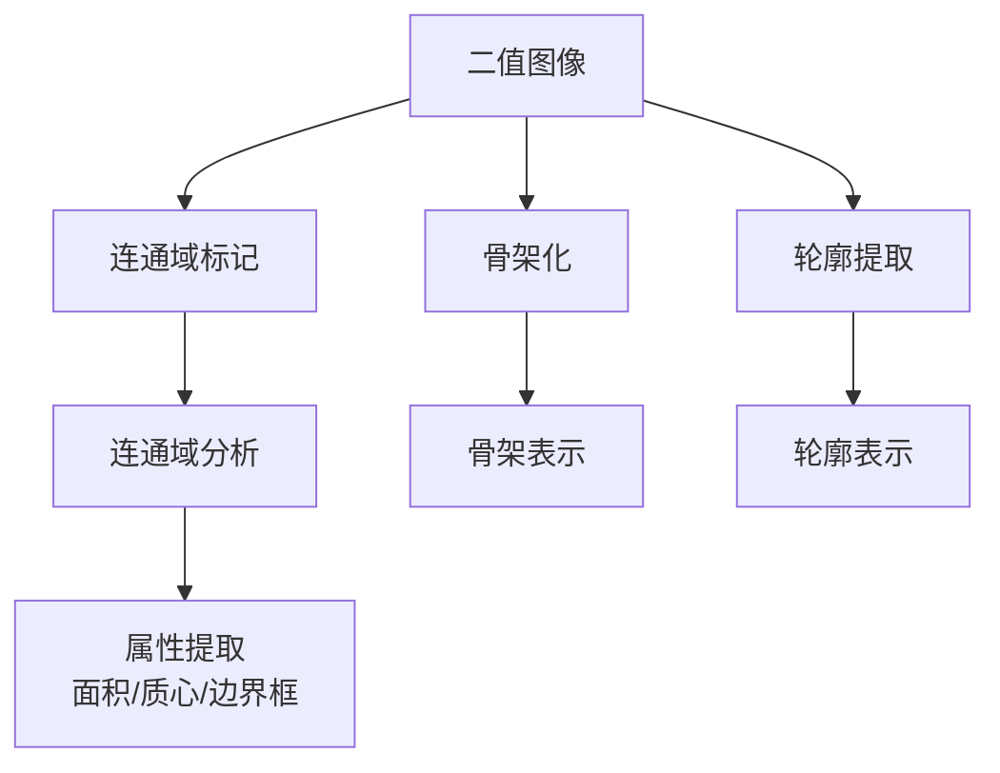
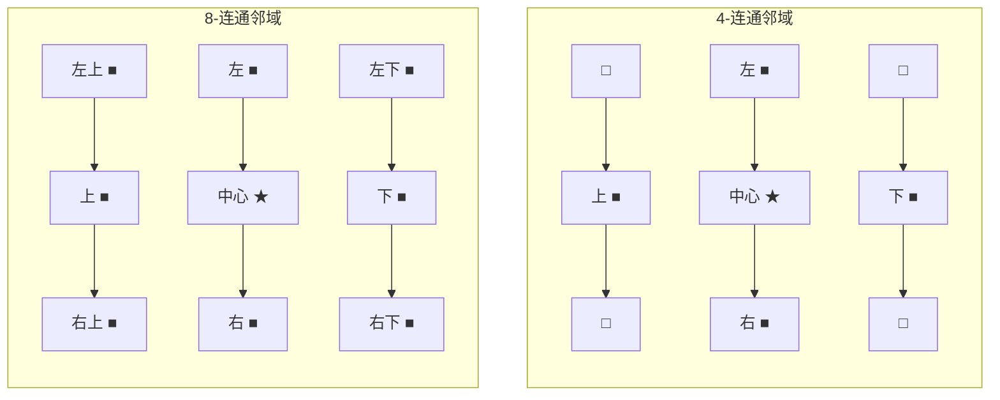
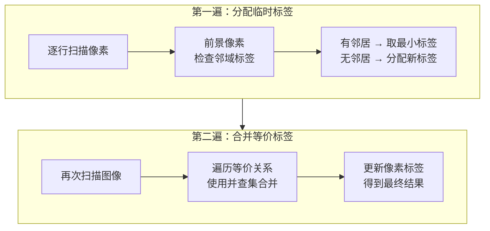
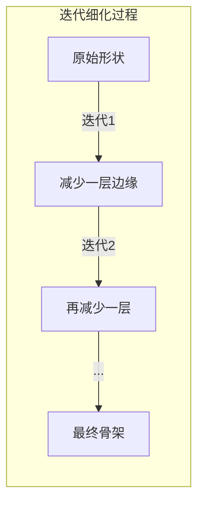

# 5.3 连通域分析与骨架

## 🔗 引言

前面章节介绍了形态学的基本运算和组合运算。本节将进一步介绍如何利用这些工具分析图像中的**连通区域**，并提取**骨架**和**轮廓**等高级特征。



## 一、连通域与连通分量

### 1.1 基本概念

**连通域（Connected Component）**：图像中由相互连通的像素组成的区域。

**两种连通性定义：**

| 类型 | 定义 | 说明 |
|------|------|------|
| 4-连通 | 上下左右四个方向相邻 | 对角线不连通 |
| 8-连通 | 8个方向（含对角线）相邻 | 更宽松的连通性 |



### 1.2 连通域标记（Labeling）

连通域标记是将图像中每个连通区域赋予唯一标签的过程。

**两遍扫描算法：**



### 1.3 并查集（Union-Find）

用于高效管理和合并等价标签：

```python
class UnionFind:
    def __init__(self, n):
        self.parent = list(range(n))
        self.rank = [0] * n

    def find(self, x):
        if self.parent[x] != x:
            self.parent[x] = self.find(self.parent[x])
        return self.parent[x]

    def union(self, x, y):
        rx, ry = self.find(x), self.find(y)
        if rx == ry:
            return
        if self.rank[rx] < self.rank[ry]:
            rx, ry = ry, rx
        self.parent[ry] = rx
        if self.rank[rx] == self.rank[ry]:
            self.rank[rx] += 1
```

## 二、OpenCV 连通域分析

### 2.1 cv2.connectedComponents

```python
cv2.connectedComponents(image, labels=None, connectivity=8, ltype=cv2.CV_32S)
```

| 参数 | 说明 |
|------|------|
| `image` | 输入二值图像（前景像素为1） |
| `labels` | 输出标签矩阵 |
| `connectivity` | 连通性（4或8） |
| `ltype` | 标签数据类型 |
| 返回值 | 连通域数量（含背景） |

### 2.2 cv2.connectedComponentsWithStats

```python
cv2.connectedComponentsWithStats(image, labels=None, stats=None, centroids=None,
                                  connectivity=8, ltype=cv2.CV_32S)
```

额外返回：
- `stats`：每个连通域的统计信息（面积、边界框等）
- `centroids`：每个连通域的质心坐标

### 2.3 完整示例代码

```python
import cv2
import numpy as np
import matplotlib.pyplot as plt

# 1. 创建测试图像
img = np.zeros((200, 300), dtype=np.uint8)
# 添加多个形状
cv2.rectangle(img, (20, 20), (80, 80), 255, -1)
cv2.circle(img, (150, 50), 25, 255, -1)
cv2.rectangle(img, (130, 100), (200, 180), 255, -1)
cv2.circle(img, (250, 150), 20, 255, -1)
# 添加小噪声点
cv2.circle(img, (250, 40), 3, 255, -1)

# 2. 连通域标记
num_labels, labels, stats, centroids = cv2.connectedComponentsWithStats(
    img, connectivity=8
)

# 3. 分析每个连通域
print(f"连通域数量（含背景）: {num_labels}")

for label_id in range(1, num_labels):  # 跳过背景（label=0）
    x, y, w, h, area = stats[label_id]
    cx, cy = centroids[label_id]

    print(f"\n连通域 {label_id}:")
    print(f"  面积: {area} 像素")
    print(f"  边界框: ({x}, {y}, {w}, {h})")
    print(f"  质心: ({cx:.1f}, {cy:.1f})")

# 4. 可视化结果
fig, axes = plt.subplots(1, 2, figsize=(15, 6))
axes[0].imshow(img, cmap='gray')
axes[0].set_title('Original Image')
axes[0].axis('off')

# 彩色标签图
label_image = cv2.applyColorMap(
    (labels * 255 // num_labels).astype(np.uint8),
    cv2.COLORMAP_JET
)
axes[1].imshow(label_image)
axes[1].set_title(f'{num_labels - 1} Connected Components')
axes[1].axis('off')

plt.tight_layout()
plt.show()
```

### 2.4 应用：目标计数

```python
def count_objects(binary_image, min_area=100):
    """
    计数二值图像中的目标数量
    :param binary_image: 二值图像
    :param min_area: 最小面积阈值（过滤噪声）
    :return: 目标数量, 每个目标的属性
    """
    num_labels, labels, stats, centroids = cv2.connectedComponentsWithStats(
        binary_image, connectivity=8
    )

    objects = []
    for label_id in range(1, num_labels):
        area = stats[label_id, cv2.CC_STAT_AREA]
        if area >= min_area:
            objects.append({
                'label': label_id,
                'area': area,
                'bbox': (stats[label_id, cv2.CC_STAT_LEFT],
                         stats[label_id, cv2.CC_STAT_TOP],
                         stats[label_id, cv2.CC_STAT_WIDTH],
                         stats[label_id, cv2.CC_STAT_HEIGHT]),
                'centroid': (centroids[label_id][0], centroids[label_id][1])
            })

    return len(objects), objects

# 使用
count, objects = count_objects(binary_img, min_area=50)
print(f"检测到 {count} 个目标")
```

## 三、骨架化 (Skeletonization)

### 3.1 骨架的定义

**骨架（Skeleton）** 是形状的"中轴"表示，它保留了形状的拓扑结构，同时大大减少了数据量。

骨架应满足的性质：
1. **连通性保持**：骨架是连通的
2. **位置精确**：骨架位于形状的中心
3. **宽度为1**：骨架像素的宽度为1
4. **拓扑不变性**：骨架保留原形状的拓扑结构

### 3.2 细化算法 (Thinning)

骨架化最常用的方法是**细化算法**，它迭代地移除不影响连通性的边缘像素。



### 3.3 Zhang-Suen 细化算法

最经典的细化算法，每轮迭代分两步：

**第一步（奇数迭代）：** 移除满足以下所有条件的前景像素 $P_1$：

1. $P_1$ 是前景像素（值为1）
2. 8邻域中前景像素数 $2 \leq B(P_1) \leq 6$
3. 8邻域中0→1的转化次数 $= 1$
4. $P_2 \cdot P_4 \cdot P_6 = 0$
5. $P_4 \cdot P_6 \cdot P_8 = 0$

**第二步（偶数迭代）：** 类似条件，仅条件4和5变为：
4. $P_2 \cdot P_4 \cdot P_8 = 0$
5. $P_2 \cdot P_6 \cdot P_8 = 0$

```python
def zhang_suen_thinning(image):
    """
    Zhang-Suen 细化算法
    :param image: 二值图像 (0/1)
    :return: 骨架图像
    """
    skeleton = image.copy() // 255
    changed = True

    while changed:
        changed = False

        # 第一步
        for i in range(1, image.shape[0] - 1):
            for j in range(1, image.shape[1] - 1):
                if skeleton[i, j] == 1:
                    p2, p3, p4, p5, p6, p7, p8, p9 = [
                        skeleton[i-1, j], skeleton[i-1, j+1],
                        skeleton[i, j+1], skeleton[i+1, j+1],
                        skeleton[i+1, j], skeleton[i+1, j-1],
                        skeleton[i, j-1], skeleton[i-1, j-1]
                    ]

                    neighbors = [p2, p3, p4, p5, p6, p7, p8, p9]
                    transitions = sum(
                        1 for k in range(8)
                        if neighbors[k] == 0 and neighbors[(k+1) % 8] == 1
                    )

                    if (2 <= sum(neighbors) <= 6 and transitions == 1
                            and p2 * p4 * p6 == 0 and p4 * p6 * p8 == 0):
                        skeleton[i, j] = 0
                        changed = True

        # 第二步（简化版）
        for i in range(1, image.shape[0] - 1):
            for j in range(1, image.shape[1] - 1):
                if skeleton[i, j] == 1:
                    p2, p3, p4, p5, p6, p7, p8, p9 = [
                        skeleton[i-1, j], skeleton[i-1, j+1],
                        skeleton[i, j+1], skeleton[i+1, j+1],
                        skeleton[i+1, j], skeleton[i+1, j-1],
                        skeleton[i, j-1], skeleton[i-1, j-1]
                    ]

                    neighbors = [p2, p3, p4, p5, p6, p7, p8, p9]
                    transitions = sum(
                        1 for k in range(8)
                        if neighbors[k] == 0 and neighbors[(k+1) % 8] == 1
                    )

                    if (2 <= sum(neighbors) <= 6 and transitions == 1
                            and p2 * p4 * p8 == 0 and p2 * p6 * p8 == 0):
                        skeleton[i, j] = 0
                        changed = True

    return skeleton * 255
```

### 3.4 使用 morphologyEx 实现骨架化

```python
def skeletonize(image):
    """
    使用形态学方法实现骨架化
    基于形态学梯度的迭代细化
    """
    gray = cv2.cvtColor(image, cv2.COLOR_BGR2GRAY) if len(image.shape) == 3 else image
    _, binary = cv2.threshold(gray, 0, 255, cv2.THRESH_BINARY + cv2.THRESH_OTSU)

    skeleton = np.zeros_like(binary)
    kernel = cv2.getStructuringElement(cv2.MORPH_CROSS, (3, 3))

    while True:
        eroded = cv2.erode(binary, kernel)
        opened = cv2.dilate(eroded, kernel)
        residue = cv2.subtract(binary, opened)
        skeleton = cv2.bitwise_or(skeleton, residue)
        binary = eroded

        if cv2.countNonZero(binary) == 0:
            break

    return skeleton
```

## 四、轮廓提取

### 4.1 cv2.findContours

```python
cv2.findContours(image, mode, method, contours=None, hierarchy=None,
                 offset=None)
```

| 参数 | 说明 |
|------|------|
| `image` | 输入二值图像 |
| `mode` | 轮廓检索模式 |
| `method` | 轮廓近似方法 |
| `contours` | 输出轮廓列表 |
| `hierarchy` | 轮廓层级信息 |

**轮廓检索模式：**

| 模式 | 说明 |
|------|------|
| `RETR_EXTERNAL` | 仅检索最外层轮廓 |
| `RETR_LIST` | 检索所有轮廓，不建立层级 |
| `RETR_CCOMP` | 检索所有轮廓，建立两层层级 |
| `RETR_TREE` | 检索所有轮廓，建立完整层级 |

**轮廓近似方法：**

| 方法 | 说明 |
|------|------|
| `CHAIN_APPROX_NONE` | 存储所有轮廓点 |
| `CHAIN_APPROX_SIMPLE` | 压缩水平/垂直/对角线段 |
| `CHAIN_APPROX_TC89_L1` | Teh-Chin 链码近似 |
| `CHAIN_APPROX_TC89_KCOS` | Teh-Chin 链码近似（慢速） |

### 4.2 轮廓属性计算

```python
# 轮廓属性
area = cv2.contourArea(contour)          # 面积
perimeter = cv2.arcLength(contour, True)  # 周长
x, y, w, h = cv2.boundingRect(contour)   # 边界矩形
cx, cy = cv2.moments(contour)['m10'] / cv2.moments(contour)['m00'], \
         cv2.moments(contour)['m01'] / cv2.moments(contour)['m00']  # 质心

# 形状描述符
aspect_ratio = w / h                     # 宽高比
extent = area / (w * h)                  # 矩形度
hull = cv2.convexHull(contour)           # 凸包
solidity = area / cv2.contourArea(hull)  # 凸度
```

### 4.3 完整实战示例

```python
import cv2
import numpy as np
import matplotlib.pyplot as plt

# 1. 读取图像并二值化
img = cv2.imread('shapes.jpg')
gray = cv2.cvtColor(img, cv2.COLOR_BGR2GRAY)
_, binary = cv2.threshold(gray, 127, 255, cv2.THRESH_BINARY)

# 2. 查找轮廓
contours, hierarchy = cv2.findContours(
    binary, cv2.RETR_EXTERNAL, cv2.CHAIN_APPROX_SIMPLE
)

# 3. 过滤和分析轮廓
min_area = 100
filtered_contours = []
contour_data = []

for contour in contours:
    area = cv2.contourArea(contour)
    if area >= min_area:
        filtered_contours.append(contour)

        x, y, w, h = cv2.boundingRect(contour)
        area = cv2.contourArea(contour)
        perimeter = cv2.arcLength(contour, True)

        contour_data.append({
            'area': area,
            'perimeter': perimeter,
            'bbox': (x, y, w, h),
            'aspect_ratio': w / h if h > 0 else 0
        })

# 4. 绘制轮廓
result = img.copy()
cv2.drawContours(result, filtered_contours, -1, (0, 255, 0), 2)

# 为每个轮廓标注信息
for i, contour in enumerate(filtered_contours):
    M = cv2.moments(contour)
    if M['m00'] != 0:
        cx = int(M['m10'] / M['m00'])
        cy = int(M['m01'] / M['m00'])
        cv2.putText(result, f'#{i+1}', (cx - 15, cy + 5),
                    cv2.FONT_HERSHEY_SIMPLEX, 0.5, (255, 0, 0), 2)

# 5. 可视化
fig, axes = plt.subplots(1, 2, figsize=(15, 6))
axes[0].imshow(cv2.cvtColor(img, cv2.COLOR_BGR2RGB))
axes[0].set_title('Original')
axes[0].axis('off')
axes[1].imshow(cv2.cvtColor(result, cv2.COLOR_BGR2RGB))
axes[1].set_title(f'{len(filtered_contours)} Objects Found')
axes[1].axis('off')
plt.tight_layout()
plt.show()
```

## 五、应用实战

### 5.1 文字检测与提取

```python
def detect_text_regions(image):
    """
    检测图像中的文字区域
    """
    gray = cv2.cvtColor(image, cv2.COLOR_BGR2GRAY)

    # 二值化
    _, binary = cv2.threshold(gray, 0, 255, cv2.THRESH_BINARY_INV + cv2.THRESH_OTSU)

    # 形态学操作：膨胀以连接文字
    kernel = cv2.getStructuringElement(cv2.MORPH_RECT, (50, 10))
    dilated = cv2.dilate(binary, kernel, iterations=1)

    # 查找轮廓
    contours, _ = cv2.findContours(dilated, cv2.RETR_EXTERNAL, cv2.CHAIN_APPROX_SIMPLE)

    # 筛选文字区域
    text_regions = []
    for contour in contours:
        area = cv2.contourArea(contour)
        if area > 1000:  # 根据实际情况调整阈值
            x, y, w, h = cv2.boundingRect(contour)
            text_regions.append((x, y, w, h))

    return text_regions

# 使用
img = cv2.imread('document.jpg')
regions = detect_text_regions(img)

# 绘制检测结果
for x, y, w, h in regions:
    cv2.rectangle(img, (x, y), (x+w, y+h), (0, 255, 0), 2)

cv2.imshow('Text Detection', img)
cv2.waitKey(0)
```

### 5.2 骨架化文字识别

```python
def skeleton_based_text_recognition(image):
    """
    基于骨架化的文字特征提取
    """
    gray = cv2.cvtColor(image, cv2.COLOR_BGR2GRAY) if len(image.shape) == 3 else image
    _, binary = cv2.threshold(gray, 0, 255, cv2.THRESH_BINARY + cv2.THRESH_OTSU)

    # 骨架化
    skeleton = skeletonize(binary)

    # 连通域分析
    num_labels, labels, stats, centroids = cv2.connectedComponentsWithStats(
        cv2.bitwise_not(skeleton), connectivity=8
    )

    # 骨架特征提取
    features = []
    for label_id in range(1, num_labels):
        area = stats[label_id, cv2.CC_STAT_AREA]
        if area > 10:
            features.append({
                'area': area,
                'bbox': (stats[label_id, cv2.CC_STAT_LEFT],
                         stats[label_id, cv2.CC_STAT_TOP],
                         stats[label_id, cv2.CC_STAT_WIDTH],
                         stats[label_id, cv2.CC_STAT_HEIGHT])
            })

    return skeleton, features
```

### 5.3 综合应用：PCB板缺陷检测

```python
def pcb_defect_detection(pcb_image):
    """
    PCB板缺陷检测流程
    """
    # 1. 预处理
    gray = cv2.cvtColor(pcb_image, cv2.COLOR_BGR2GRAY)

    # 2. 二值化
    _, binary = cv2.threshold(gray, 0, 255, cv2.THRESH_BINARY + cv2.THRESH_OTSU)

    # 3. 形态学处理
    kernel = cv2.getStructuringElement(cv2.MORPH_RECT, (3, 3))
    cleaned = cv2.morphologyEx(binary, cv2.MORPH_CLOSE, kernel)

    # 4. 连通域分析
    num_labels, labels, stats, centroids = cv2.connectedComponentsWithStats(
        cleaned, connectivity=8
    )

    # 5. 缺陷检测
    defects = []
    for label_id in range(1, num_labels):
        area = stats[label_id, cv2.CC_STAT_AREA]
        x = stats[label_id, cv2.CC_STAT_LEFT]
        y = stats[label_id, cv2.CC_STAT_TOP]
        w = stats[label_id, cv2.CC_STAT_WIDTH]
        h = stats[label_id, cv2.CC_STAT_HEIGHT]

        # 面积异常检测
        if area < 50 or area > 5000:
            defects.append({
                'type': '面积异常',
                'area': area,
                'position': (x, y)
            })

        # 形状异常检测
        if w > 0 and h > 0:
            aspect = w / h
            if aspect > 5 or aspect < 0.2:
                defects.append({
                    'type': '形状异常',
                    'aspect_ratio': aspect,
                    'position': (x, y)
                })

    return defects
```

## 📝 小结

| 技术 | 核心功能 | OpenCV函数 | 典型应用 |
|------|----------|------------|----------|
| 连通域标记 | 标记连通区域 | `connectedComponents` | 目标计数、分割 |
| 连通域分析 | 提取连通域属性 | `connectedComponentsWithStats` | 目标检测、测量 |
| 骨架化 | 提取形状中轴 | 迭代腐蚀/细化算法 | 文字识别、形状分析 |
| 轮廓提取 | 提取物体边界 | `findContours` | 形状分析、目标定位 |
| 轮廓属性 | 计算轮廓特征 | `contourArea`, `arcLength` | 目标分类、测量 |

### 核心API速查

```python
# 连通域
num_labels, labels = cv2.connectedComponents(binary)
num_labels, labels, stats, centroids = cv2.connectedComponentsWithStats(binary)

# 轮廓
contours, hierarchy = cv2.findContours(binary, mode, method)
cv2.drawContours(image, contours, contourIdx, color, thickness)

# 轮廓属性
area = cv2.contourArea(contour)
perimeter = cv2.arcLength(contour, is_closed)
x, y, w, h = cv2.boundingRect(contour)
hull = cv2.convexHull(contour)
```

## 🔗 章节链接

- [第5章知识导航](./MOC%20-%20第5章.md)
- [回到5.1节](./5.1%20形态学基本运算.md)
- [回到5.2节](./5.2%20形态学组合运算.md)
- [第6章 图像分割与阈值化](../第6章%20图像分割与阈值化/MOC%20-%20第6章.md)
