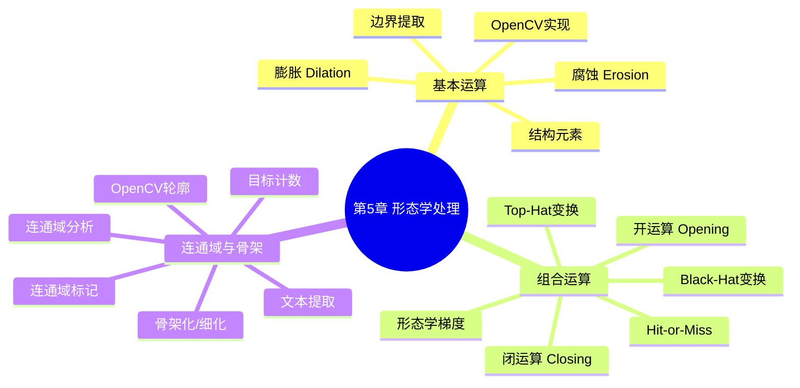
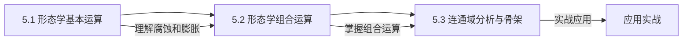

# 第5章 形态学图像处理 — 导航

## 📋 章节概览

本章介绍基于**集合运算**的图像处理技术——形态学处理。形态学图像处理以数学形态学为基础，通过对图像中的形状进行分析和操作，实现图像增强、分割、特征提取等功能。核心操作包括腐蚀、膨胀、开运算、闭运算等。

## 🗺️ 知识地图 (Mermaid)

## 📚 学习路径

| 序号 | 文件 | 核心内容 | 重要程度 |
|------|------|----------|----------|
| 5.1 | [形态学基本运算](./5.1%20形态学基本运算.md) | 腐蚀、膨胀、结构元素、边界提取 | ⭐⭐⭐⭐⭐ |
| 5.2 | [形态学组合运算](./5.2%20形态学组合运算.md) | 开运算、闭运算、形态学梯度、Top/Bot-Hat、Hit-or-Miss | ⭐⭐⭐⭐⭐ |
| 5.3 | [连通域分析与骨架](./5.3%20连通域分析与骨架.md) | 连通域标记、骨架化、轮廓提取、目标计数 | ⭐⭐⭐⭐ |

## 🎯 核心考点 (考研/竞赛)

### 高频考点

1. **腐蚀与膨胀的定义** — 集合形式的数学定义及几何直观
2. **结构元素的选择** — 不同形状结构元素对形态学操作的影响
3. **开运算与闭运算的区别** — 对图像的平滑作用及其对偶性
4. **形态学梯度** — 如何通过腐蚀和膨胀组合得到边界
5. **Top-Hat / Black-Hat 变换** — 从复杂背景中提取亮/暗细节
6. **连通域标记算法** — 两遍扫描法的原理
7. **骨架化（细化）** — 骨架的性质与应用
8. **OpenCV `morphologyEx` 函数** — 参数选择与实际应用

### 典型题型

- 证明题：证明开运算和闭运算的对偶性
- 计算题：给定二值图像和结构元素，计算腐蚀/膨胀结果
- 分析题：分析不同形态学操作对特定噪声的去除效果
- 编程题：使用形态学操作实现文本检测、目标计数等

## ✅ 自测题

### 基础题

1. 什么是结构元素？它在形态学图像处理中起什么作用？

2. 写出腐蚀（Erosion）和膨胀（Dilation）的数学定义，并用集合图示说明。

3. 开运算和闭运算分别是什么？它们的对偶关系是什么？

4. 形态学梯度如何定义？它有什么应用？

### 进阶题

5. Top-Hat 变换和 Black-Hat 变换分别用于什么场景？它们如何定义？

6. 解释连通域标记的两遍扫描算法的基本步骤。

7. 骨架化的目的是什么？骨架应满足哪些性质？

8. 使用 OpenCV 实现：对一幅二值图像依次进行腐蚀、膨胀、开运算、闭运算，并对比它们的效果。

### 应用题

9. 设计一个形态学处理流程，用于从印刷电路板图像中提取焊点轮廓。

10. 如何利用形态学操作实现文字检测？请描述完整的处理流程。

## 🔗 相关章节

- **前置知识**：[第4章 频域变换傅里叶变换与频域滤波](../第4章%20频域变换傅里叶变换与频域滤波/MOC%20-%20第4章.md)
- **后续知识**：[第6章 图像分割与阈值化](../第6章%20图像分割与阈值化/MOC%20-%20第6章.md)
- **拓展阅读**：灰度形态学、彩色形态学、数学形态学理论
