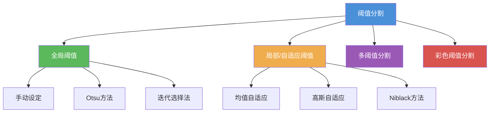

# 6.1 阈值分割

## 一、阈值分割概述

阈值分割是最古老、最基本的图像分割方法，通过设定一个或多个灰度阈值，将图像像素划分为不同区域（通常为前景和背景）。

### 基本原理

设原始图像为 $f(x,y)$，阈值为 $T$，则分割后的图像 $g(x,y)$ 定义为：

$$
g(x,y) = \begin{cases} 1, & f(x,y) \geq T \\ 0, & f(x,y) < T \end{cases}
$$

### 分类体系



---

## 二、全局阈值分割

### 2.1 手动阈值法

最简单的方式，由用户通过观察直方图手动指定阈值。适用于前景背景对比度高、直方图呈明显双峰分布的图像。

### 2.2 迭代选择法

**算法步骤**：
1. 选择一个初始估计阈值 $T$
2. 用 $T$ 将图像分为两组：$G_1$（≥T）和 $G_2$（<T）
3. 计算两组的平均灰度值 $\mu_1$ 和 $\mu_2$
4. 更新阈值：$T = \frac{\mu_1 + \mu_2}{2}$
5. 重复步骤 2–4 直到 $T$ 不再变化

**Python 实现**：

```python
import numpy as np

def iterative_threshold(img, max_iter=100, tol=1e-3):
    """迭代法确定全局阈值"""
    T = np.mean(img)
    for _ in range(max_iter):
        g1 = img[img >= T]
        g2 = img[img < T]
        if len(g1) == 0 or len(g2) == 0:
            break
        mu1 = np.mean(g1)
        mu2 = np.mean(g2)
        T_new = (mu1 + mu2) / 2
        if abs(T_new - T) < tol:
            break
        T = T_new
    return T
```

---

## 三、Otsu 方法——最大类间方差

### 3.1 数学推导

Otsu 方法由日本学者大津展之于 1979 年提出，核心思想是**最大化类间方差**，等价于最小化类内方差。

#### 符号定义

- 图像灰度范围：$[0, L-1]$
- 阈值 $T$ 将像素分为两类：
  - $C_1$：灰度为 $[0, T]$，像素数 $N_1$，概率 $P_1(T)$
  - $C_2$：灰度为 $[T+1, L-1]$，像素数 $N_2$，概率 $P_2(T)$
- 总像素数：$N = N_1 + N_2$
- 两类均值：$\mu_1(T)$, $\mu_2(T)$
- 全局均值：$\mu_T = P_1(T)\mu_1(T) + P_2(T)\mu_2(T)$

#### 类间方差

$$
\sigma_B^2(T) = P_1(T)P_2(T)[\mu_1(T) - \mu_2(T)]^2
$$

由于 $P_2(T) = 1 - P_1(T)$，且 $\mu_2(T) = \frac{\mu_T - P_1(T)\mu_1(T)}{1 - P_1(T)}$，代入化简得：

$$
\sigma_B^2(T) = \frac{[\mu_T P_1(T) - \mu(T)]^2}{P_1(T)[1 - P_1(T)]}
$$

其中 $\mu(T) = \sum_{i=0}^{T} i \cdot p(i)$，$\mu_T = \sum_{i=0}^{L-1} i \cdot p(i)$。

#### 类内方差（等价最小化）

$$
\sigma_W^2(T) = P_1(T)\sigma_1^2(T) + P_2(T)\sigma_2^2(T)
$$

**Otsu 证明**：最大化 $\sigma_B^2(T)$ 等价于最小化 $\sigma_W^2(T)$。

### 3.2 算法步骤

1. 计算直方图 $p(i) = \frac{n_i}{N}$，$i = 0, 1, \dots, L-1$
2. 计算全局均值 $\mu_T = \sum_{i=0}^{L-1} i \cdot p(i)$
3. 对每个阈值 $T$：
   - 累积和 $P_1(T) = \sum_{i=0}^{T} p(i)$
   - 累积均值 $\mu(T) = \sum_{i=0}^{T} i \cdot p(i)$
   - 计算类间方差 $\sigma_B^2(T)$
4. 选择使 $\sigma_B^2(T)$ 最大的 $T$ 作为最佳阈值

**时间复杂度**：$O(L)$，只需遍历灰度级一次。

### 3.3 Python 实现

```python
import numpy as np

def otsu_threshold(img):
    """Otsu 阈值分割算法实现"""
    if len(img.shape) > 2:
        img = cv2.cvtColor(img, cv2.COLOR_BGR2GRAY)

    histogram = np.bincount(img.ravel(), minlength=256).astype(np.float64)
    total = img.size

    sum_all = np.dot(np.arange(256), histogram)
    sum_bg, weight_bg, weight_max = 0., 0., 0.
    threshold = 0
    sigma_max = 0.

    for t in range(256):
        weight_bg += histogram[t]
        if weight_bg == 0:
            continue
        weight_fg = total - weight_bg
        if weight_fg == 0:
            break
        sum_bg += t * histogram[t]
        mean_bg = sum_bg / weight_bg
        mean_fg = (sum_all - sum_bg) / weight_fg
        sigma_between = weight_bg * weight_fg * (mean_bg - mean_fg) ** 2
        if sigma_between > sigma_max:
            sigma_max = sigma_between
            threshold = t

    return threshold
```

### 3.4 OpenCV 实现

```python
import cv2
import numpy as np

img = cv2.imread('image.jpg', 0)

# Otsu 阈值 + 自适应阈值
_, otsu_thresh = cv2.threshold(img, 0, 255, cv2.THRESH_BINARY + cv2.THRESH_OTSU)

# 三角法（Triangle）
_, triang_thresh = cv2.threshold(img, 0, 255, cv2.THRESH_BINARY + cv2.THRESH_TRIANGLE)

cv2.imwrite('otsu_result.png', otsu_thresh)
```

### 3.5 Otsu 方法推广

- **多阈值 Otsu**（Multi-Otsu）：将像素分为 $K > 2$ 类，最大化所有类间方差之和
- **加权 Otsu**：对不同灰度区域赋予不同权重
- **二维 Otsu**：结合像素灰度和邻域平均灰度构成二维直方图

---

## 四、自适应阈值分割

当图像存在光照不均匀、阴影或反射时，全局阈值无法获得理想效果。自适应阈值对图像的不同区域使用不同的阈值。

### 4.1 基本思想

$$
T(x, y) = \mu_G(x, y) - C
$$

其中 $\mu_G(x, y)$ 是以 $(x,y)$ 为中心、窗口大小为 $b \times b$ 的邻域灰度均值（或高斯加权均值），$C$ 为常数偏移量。

### 4.2 均值自适应（Mean Adaptive）

$$
T(x,y) = \frac{1}{b^2}\sum_{(u,v)\in W_b(x,y)} f(u,v) - C
$$

### 4.3 高斯自适应（Gaussian Adaptive）

$$
T(x,y) = \sum_{(u,v)\in W_b(x,y)} G_{\sigma}(u,v) \cdot f(u,v) - C
$$

其中 $G_{\sigma}$ 为二维高斯权重：

$$
G_{\sigma}(u,v) = \frac{1}{2\pi\sigma^2} e^{-(u^2+v^2)/(2\sigma^2)}
$$

### 4.4 OpenCV 实现

```python
import cv2

img = cv2.imread('image.jpg', 0)

# 均值自适应阈值
adaptive_mean = cv2.adaptiveThreshold(
    img, 255,
    cv2.ADAPTIVE_THRESH_MEAN_C,
    cv2.THRESH_BINARY,
    blockSize=11,
    C=2
)

# 高斯自适应阈值
adaptive_gaussian = cv2.adaptiveThreshold(
    img, 255,
    cv2.ADAPTIVE_THRESH_GAUSSIAN_C,
    cv2.THRESH_BINARY,
    blockSize=11,
    C=2
)

# 反二值化
adaptive_gaussian_inv = cv2.adaptiveThreshold(
    img, 255,
    cv2.ADAPTIVE_THRESH_GAUSSIAN_C,
    cv2.THRESH_BINARY_INV,
    blockSize=11,
    C=2
)

cv2.imwrite('adaptive_mean.png', adaptive_mean)
cv2.imwrite('adaptive_gaussian.png', adaptive_gaussian)
```

### 4.5 参数选择指南

| 参数 | 含义 | 典型值 | 调节建议 |
|------|------|--------|----------|
| `blockSize` | 邻域窗口大小 | 3, 5, 7, 11 | 必须为奇数；值越大对缓慢变化的光照越鲁棒 |
| `C` | 从均值中减去的常数 | 1–10 | 正值：分割出深色区域；负值：分割出浅色区域 |

### 4.6 手动实现自适应阈值

```python
import cv2
import numpy as np

def adaptive_threshold_manual(img, block_size=11, C=2):
    """手动实现均值自适应阈值"""
    h, w = img.shape
    result = np.zeros_like(img)
    half = block_size // 2

    # 使用积分图加速邻域均值计算
    integral = cv2.integral(img.astype(np.float64))

    for y in range(h):
        for x in range(w):
            y1 = max(0, y - half)
            y2 = min(h, y + half + 1)
            x1 = max(0, x - half)
            x2 = min(w, x + half + 1)

            # 使用积分图快速求和
            s = integral[y2-1, x2-1]
            if y1 > 0:
                s -= integral[y1-1, x2-1]
            if x1 > 0:
                s -= integral[y2-1, x1-1]
            if y1 > 0 and x1 > 0:
                s += integral[y1-1, x1-1]

            count = (y2 - y1) * (x2 - x1)
            mean = s / count
            T = mean - C
            result[y, x] = 255 if img[y, x] >= T else 0

    return result
```

---

## 五、基于彩色的分割

### 5.1 HSV 空间分割

在 HSV 空间中，通过指定色相（Hue）范围可以有效分割特定颜色物体。

```python
import cv2
import numpy as np

img = cv2.imread('color_object.jpg')
hsv = cv2.cvtColor(img, cv2.COLOR_BGR2HSV)

# 红色物体分割
lower_red = np.array([0, 100, 100])
upper_red = np.array([10, 255, 255])
mask_red1 = cv2.inRange(hsv, lower_red, upper_red)

# 红色跨越 0/180 边界
lower_red2 = np.array([160, 100, 100])
upper_red2 = np.array([180, 255, 255])
mask_red2 = cv2.inRange(hsv, lower_red2, upper_red2)

mask_red = cv2.bitwise_or(mask_red1, mask_red2)
result = cv2.bitwise_and(img, img, mask=mask_red)

cv2.imwrite('red_segment.png', result)
```

### 5.2 常用颜色 HSV 范围

| 颜色 | Hue 范围 (OpenCV) | 备注 |
|------|-------------------|------|
| 红色 | $[0,10] \cup [160,180]$ | 跨越色相环边界 |
| 橙色 | $[10, 25]$ | |
| 黄色 | $[25, 35]$ | |
| 绿色 | $[35, 80]$ | |
| 青色 | $[80, 100]$ | |
| 蓝色 | $[100, 130]$ | |
| 紫色 | $[130, 160]$ | |

### 5.3 基于 RGB 距离的分割

```python
def color_distance_segment(img, target_color, threshold=50):
    """基于欧氏距离的颜色分割"""
    img_float = img.astype(np.float32)
    target = np.array(target_color, dtype=np.float32)
    dist = np.sqrt(np.sum((img_float - target) ** 2, axis=2))
    mask = (dist < threshold).astype(np.uint8) * 255
    return mask
```

### 5.4 K-Means 颜色分割

```python
def kmeans_color_segment(img, k=3):
    """K-Means 聚类颜色分割"""
    data = img.reshape((-1, 3)).astype(np.float32)
    criteria = (cv2.TERM_CRITERIA_EPS + cv2.TERM_CRITERIA_MAX_ITER, 100, 0.2)
    _, labels, centers = cv2.kmeans(
        data, k, None, criteria, 10, cv2.KMEANS_PP_CENTERS
    )
    centers = np.uint8(centers)
    segmented = centers[labels.flatten()].reshape(img.shape)
    return segmented
```

---

## 六、OpenCV 函数速查

### `cv2.threshold()` 全局阈值

```python
retval, dst = cv2.threshold(
    src,          # 输入图像（单通道 uint8）
    thresh,       # 阈值 T
    maxval,       # 高阈值填充值（通常为 255）
    type          # 阈值类型
)
```

**阈值类型**：

| 类型 | 说明 |
|------|------|
| `THRESH_BINARY` | 二值化：$dst = \begin{cases} maxval & src > thresh \\ 0 & \text{otherwise} \end{cases}$ |
| `THRESH_BINARY_INV` | 反二值化 |
| `THRESH_TRUNC` | 截断：$dst = \min(src, thresh)$ |
| `THRESH_TOZERO` | 过零：低于阈值置零 |
| `THRESH_TOZERO_INV` | 反过零 |
| `THRESH_OTSU` | Otsu 自动阈值 |
| `THRESH_TRIANGLE` | 三角法自动阈值 |

### `cv2.adaptiveThreshold()` 自适应阈值

```python
dst = cv2.adaptiveThreshold(
    src,               # 输入图像
    maxValue,          # 非零值填充
    adaptiveMethod,    # ADAPTIVE_THRESH_MEAN_C / ADAPTIVE_THRESH_GAUSSIAN_C
    thresholdType,     # THRESH_BINARY / THRESH_BINARY_INV
    blockSize,         # 邻域大小（奇数）
    C                  # 偏移常数
)
```

---

## 七、实验对比：三种阈值方法效果

```python
import cv2
import numpy as np
import matplotlib.pyplot as plt

img = cv2.imread('gradient_text.png', 0)

# 1. 手动全局阈值
_, global_res = cv2.threshold(img, 127, 255, cv2.THRESH_BINARY)

# 2. Otsu 自动阈值
_, otsu_res = cv2.threshold(img, 0, 255, cv2.THRESH_BINARY + cv2.THRESH_OTSU)

# 3. 自适应高斯阈值
adaptive_res = cv2.adaptiveThreshold(
    img, 255,
    cv2.ADAPTIVE_THRESH_GAUSSIAN_C,
    cv2.THRESH_BINARY, 11, 2
)

# 可视化
fig, axes = plt.subplots(1, 4, figsize=(20, 5))
axes[0].imshow(img, cmap='gray')
axes[0].set_title('Original')
axes[1].imshow(global_res, cmap='gray')
axes[1].set_title('Global T=127')
axes[2].imshow(otsu_res, cmap='gray')
axes[2].set_title(f'Otsu T={otsu_threshold(img)}')
axes[3].imshow(adaptive_res, cmap='gray')
axes[3].set_title('Adaptive Gaussian')
plt.tight_layout()
plt.savefig('threshold_comparison.png')
```

### 方法适用场景对比

| 方法 | 适用场景 | 优点 | 缺点 |
|------|----------|------|------|
| 手动全局阈值 | 对比度高、直方图双峰明显 | 简单快速 | 需人工干预，对光照敏感 |
| Otsu 方法 | 直方图双峰、自动分割 | 全自动、数学最优 | 对单峰直方图效果差 |
| 迭代法 | 双峰但不明显的直方图 | 实现简单 | 收敛速度不稳定 |
| 均值自适应 | 光照不均匀、有阴影 | 局部自适应 | 计算量较大 |
| 高斯自适应 | 光照渐变的场景 | 对噪声更鲁棒 | 参数敏感 |
| 彩色分割 | 彩色物体检测与分割 | 利用色彩信息 | 光照变化影响大 |

---

## 八、常见问题与易错点

### Q1：Otsu 方法为什么对单峰直方图效果不好？
单峰直方图意味着前景和背景的灰度分布差异大，类间方差的最大值出现在不合理的位置（如分布的尾部），导致分割结果差。此时应使用局部阈值或其他分割方法。

### Q2：自适应阈值的 `blockSize` 如何选择？
一般建议从 5 开始尝试。如果图像噪声大，使用较大的 `blockSize`（如 11–51）；如果图像细节丰富，使用较小的 `blockSize`。注意必须为奇数。

### Q3：彩色分割中 HSV 和 RGB 空间如何选择？
HSV 空间更适合基于颜色的分割，因为色相（Hue）与亮度无关。RGB 空间中颜色分量相关性高，一个颜色变化会同时影响 R、G、B 三个通道。

### Q4：如何评估分割效果？
常用指标：
- **IoU (Intersection over Union)**：$\text{IoU} = \frac{TP}{TP + FP + FN}$
- **Dice 系数**：$\text{Dice} = \frac{2 \cdot TP}{2 \cdot TP + FP + FN}$
- **像素准确率**：$\text{Acc} = \frac{TP + TN}{TP + TN + FP + FN}$