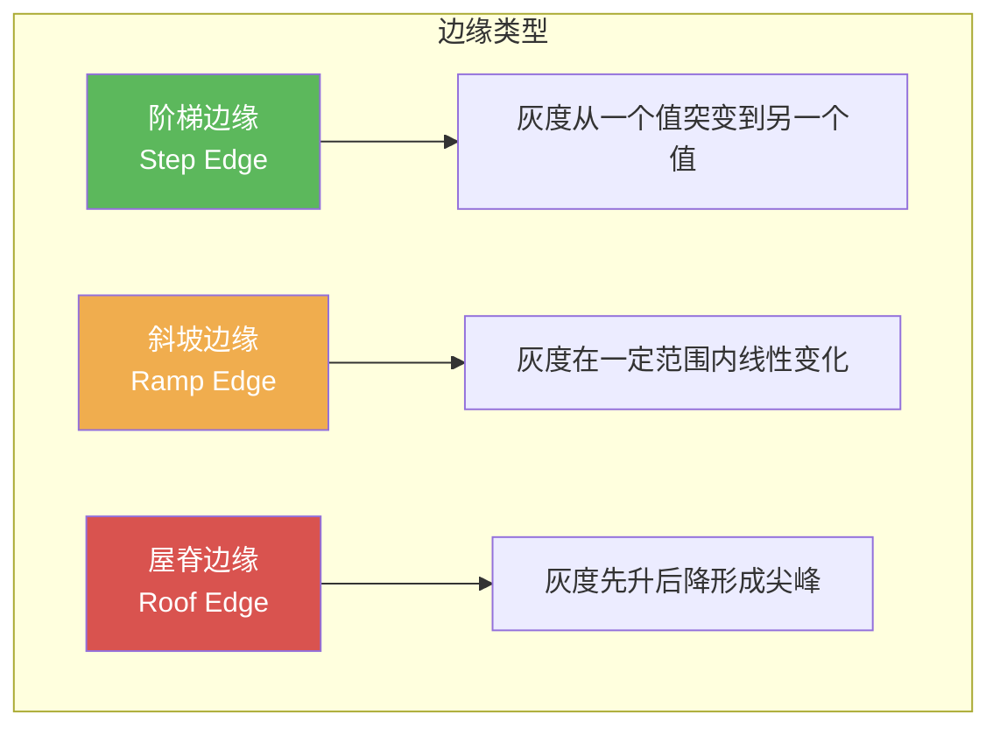
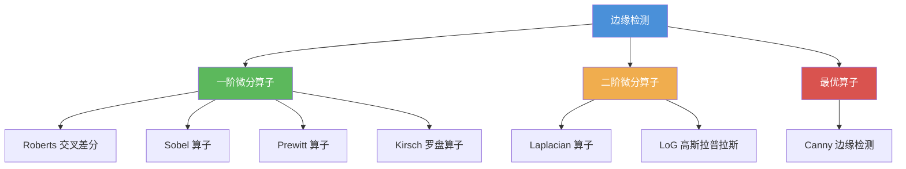

# 6.2 边缘检测

## 一、边缘检测概述

边缘是图像中灰度发生急剧变化的区域边界，是图像最基本的特征之一。边缘检测的目标是精确定位这些灰度变化的位置。

### 边缘类型



### 三种边缘的数学模型

**阶梯边缘（Step Edge）**：

$$
f(x) = \begin{cases} A & x < x_0 \\ B & x \geq x_0 \end{cases}
$$

**斜坡边缘（Ramp Edge）**：

$$
f(x) = \begin{cases} A & x < x_0 \\ A + k(x - x_0) & x_0 \leq x < x_1 \\ B & x \geq x_1 \end{cases}
$$

**屋脊边缘（Roof Edge）**：

$$
f(x) = \begin{cases} A & x < x_0 \\ A + k(x - x_0) & x_0 \leq x < x_m \\ B - k(x - x_m) & x_m \leq x < x_1 \\ B & x \geq x_1 \end{cases}
$$

### 梯度与边缘检测的关系

边缘检测本质上是检测图像的梯度（一阶导数）或二阶导数的极值/过零点：

$$
\nabla f(x,y) = \begin{bmatrix} \frac{\partial f}{\partial x} \\ \frac{\partial f}{\partial y} \end{bmatrix}
$$

- **一阶导数**：在阶梯边缘处产生阶跃响应，在斜坡边缘处产生矩形响应
- **二阶导数**：在阶梯边缘处产生冲激响应，在斜坡边缘处产生阶跃响应

### 边缘检测分类体系



---

## 二、一阶微分算子

### 2.1 Roberts 交叉差分算子

Roberts 算子使用 $2 \times 2$ 邻域，是最简单的一阶差分算子。

**核矩阵**：

$$
G_x = \begin{bmatrix} -1 & 0 \\ 0 & 1 \end{bmatrix}, \quad
G_y = \begin{bmatrix} 0 & -1 \\ 1 & 0 \end{bmatrix}
$$

**梯度幅值**：

$$
G(x,y) = |G_x| + |G_y|
$$

**特点**：计算量最小，但对噪声敏感，检测的边缘较粗（约 2 像素宽）。

```python
import cv2
import numpy as np

img = cv2.imread('edge_test.png', 0).astype(np.float64)

# Roberts 算子手动实现
def roberts_operator(img):
    h, w = img.shape
    gx = np.zeros((h, w), dtype=np.float64)
    gy = np.zeros((h, w), dtype=np.float64)
    gx[:-1, :-1] = -img[:-1, :-1] + img[1:, 1:]
    gy[:-1, :-1] = -img[:-1, 1:] + img[1:, :-1]
    magnitude = np.sqrt(gx**2 + gy**2)
    return magnitude

roberts_mag = roberts_operator(img)
roberts_edge = (roberts_mag > 50).astype(np.uint8) * 255
cv2.imwrite('roberts_edge.png', roberts_edge)
```

### 2.2 Prewitt 算子

Prewitt 算子使用 $3 \times 3$ 邻域，在 $x$ 和 $y$ 方向上进行差分运算，同时在垂直方向上做邻域平均以抑制噪声。

**核矩阵**：

$$
G_x = \begin{bmatrix} -1 & 0 & 1 \\ -1 & 0 & 1 \\ -1 & 0 & 1 \end{bmatrix}, \quad
G_y = \begin{bmatrix} -1 & -1 & -1 \\ 0 & 0 & 0 \\ 1 & 1 & 1 \end{bmatrix}
$$

**特点**：通过均值运算抑制噪声，是对 Roberts 的改进。

```python
# Prewitt 算子
prewitt_x = cv2.filter2D(img, cv2.CV_64F,
    np.array([[-1, 0, 1], [-1, 0, 1], [-1, 0, 1]]))
prewitt_y = cv2.filter2D(img, cv2.CV_64F,
    np.array([[-1, -1, -1], [0, 0, 0], [1, 1, 1]]))
prewitt_mag = np.sqrt(prewitt_x**2 + prewitt_y**2)
```

### 2.3 Sobel 算子

Sobel 算子在 Prewitt 基础上对中心行/列加权为 2，使中心像素的贡献更大。

**核矩阵**：

$$
G_x = \begin{bmatrix} -1 & 0 & 1 \\ -2 & 0 & 2 \\ -1 & 0 & 1 \end{bmatrix}, \quad
G_y = \begin{bmatrix} -1 & -2 & -1 \\ 0 & 0 & 0 \\ 1 & 2 & 1 \end{bmatrix}
$$

**梯度幅值和方向**：

$$
G(I) = \sqrt{G_x^2 + G_y^2}, \quad
\theta = \arctan\left(\frac{G_y}{G_x}\right)
$$

**OpenCV 实现**：

```python
import cv2
import numpy as np

img = cv2.imread('image.jpg', 0)

# Sobel x 方向（检测垂直边缘）
sobelx = cv2.Sobel(img, cv2.CV_64F, 1, 0, ksize=3)

# Sobel y 方向（检测水平边缘）
sobely = cv2.Sobel(img, cv2.CV_64F, 0, 1, ksize=3)

# 计算梯度幅值
sobel_mag = np.sqrt(sobelx**2 + sobely**2)

# 计算梯度方向
sobel_angle = np.arctan2(sobely, sobelx) * 180 / np.pi

# 取绝对值转回 uint8
sobelx_abs = cv2.convertScaleAbs(sobelx)
sobely_abs = cv2.convertScaleAbs(sobely)

# 合并 x 和 y 方向
sobel_combined = cv2.addWeighted(sobelx_abs, 0.5, sobely_abs, 0.5, 0)

# 二值化
_, sobel_edge = cv2.threshold(sobel_combined, 50, 255, cv2.THRESH_BINARY)

cv2.imwrite('sobel_edge.png', sobel_edge)
```

### 2.4 三种算子对比

| 特性 | Roberts | Prewitt | Sobel |
|------|---------|---------|-------|
| 邻域大小 | $2 \times 2$ | $3 \times 3$ | $3 \times 3$ |
| 噪声抑制 | 差 | 中 | 中 |
| 边缘定位精度 | 高 | 中 | 中 |
| 计算量 | 最小 | 中 | 中 |
| 加权方式 | 无 | 均匀 | 中心加权 2 |
| 适用场景 | 低噪声、高精度 | 一般场景 | 通用场景 |

---

## 三、二阶微分算子

### 3.1 Laplacian 算子

Laplacian 是一个二阶微分算子，定义为：

$$
\nabla^2 f = \frac{\partial^2 f}{\partial x^2} + \frac{\partial^2 f}{\partial y^2}
$$

**常用离散核**：

$$
\nabla^2_1 = \begin{bmatrix} 0 & 1 & 0 \\ 1 & -4 & 1 \\ 0 & 1 & 0 \end{bmatrix}, \quad
\nabla^2_2 = \begin{bmatrix} 1 & 1 & 1 \\ 1 & -8 & 1 \\ 1 & 1 & 1 \end{bmatrix}
$$

**注意**：Laplacian 对噪声极度敏感，通常需要先进行高斯滤波。

### 3.2 高斯拉普拉斯算子 (LoG)

LoG（Laplacian of Gaussian）先用高斯平滑图像，再用 Laplacian 检测边缘。

$$
\text{LoG}(x,y) = \nabla^2 G_{\sigma}(x,y) * f(x,y)
$$

其中 $G_{\sigma}$ 为二维高斯函数：

$$
G_{\sigma}(x,y) = \frac{1}{2\pi\sigma^2} e^{-(x^2+y^2)/(2\sigma^2)}
$$

LoG 的核为：

$$
\text{LoG}(r) = \frac{1}{\pi\sigma^4}\left(1 - \frac{r^2}{2\sigma^2}\right) e^{-r^2/(2\sigma^2)}
$$

其中 $r^2 = x^2 + y^2$。

**LoG 的过零点检测**：检测 LoG 响应从正变负（或从负变正）的位置，即为边缘。

```python
import cv2
import numpy as np

img = cv2.imread('image.jpg', 0)

# LoG 算子实现
def log_operator(img, sigma=1.0, ksize=5):
    """高斯拉普拉斯算子"""
    # 生成 LoG 核
    ax = np.arange(-ksize // 2 + 1, ksize // 2 + 1)
    xx, yy = np.meshgrid(ax, ax)
    kernel = ((xx**2 + yy**2 - 2*sigma**2) / (sigma**4)) * \
             np.exp(-(xx**2 + yy**2) / (2 * sigma**2))
    kernel = kernel / kernel.sum()

    # 卷积
    log_img = cv2.filter2D(img, cv2.CV_64F, kernel)

    # 过零点检测
    h, w = log_img.shape
    zero_crossing = np.zeros((h, w), dtype=np.uint8)
    for i in range(1, h-1):
        for j in range(1, w-1):
            if (log_img[i,j] * log_img[i-1,j] < 0) or \
               (log_img[i,j] * log_img[i+1,j] < 0) or \
               (log_img[i,j] * log_img[i,j-1] < 0) or \
               (log_img[i,j] * log_img[i,j+1] < 0):
                zero_crossing[i, j] = 255

    return zero_crossing

log_edge = log_operator(img, sigma=1.0, ksize=5)
cv2.imwrite('log_edge.png', log_edge)
```

### 3.3 LoG vs DoG

**DoG（Difference of Gaussians）**：两个不同标准差的高斯滤波结果之差。

$$
\text{DoG} = G_{\sigma_1} * f - G_{\sigma_2} * f, \quad \sigma_1 < \sigma_2
$$

DoG 是 LoG 的近似实现，计算更快，被 SIFT 算法采用。

---

## 四、Canny 边缘检测器

Canny 边缘检测是 John Canny 于 1986 年提出的最优边缘检测算子，至今仍是应用最广泛的边缘检测方法之一。

### 4.1 设计准则

1. **高信噪比**：边缘检测概率最大化，误检概率最小化
2. **定位精度高**：检测到的边缘位置尽可能接近真实边缘
3. **单边响应**：对同一边缘只响应一次，避免多重响应

### 4.2 算法流程


#### Step 1：高斯平滑

使用标准差为 $\sigma$ 的高斯核对图像进行卷积，抑制噪声：

$$
I_s = G_{\sigma} * I
$$

#### Step 2：计算梯度

使用 Sobel 算子计算 $x$ 和 $y$ 方向的梯度，得到梯度幅值和方向：

$$
G_x, G_y = \text{Sobel}_x(I_s), \text{Sobel}_y(I_s)
$$

$$
G = \sqrt{G_x^2 + G_y^2}, \quad \theta = \arctan2(G_y, G_x)
$$

#### Step 3：非极大值抑制（Non-Maximum Suppression, NMS）

沿梯度方向 $\theta$，在 $3 \times 3$ 邻域内比较梯度幅值：

- 将 $\theta$ 量化为 $0^\circ, 45^\circ, 90^\circ, 135^\circ$ 四个方向
- 在每个方向上，将当前像素与沿梯度方向的两个相邻像素比较
- 仅保留局部最大值，将其他置零

```python
def non_max_suppression(gradient, angle):
    """非极大值抑制"""
    h, w = gradient.shape
    result = np.zeros((h, w), dtype=np.float64)
    angle = angle * 180 / np.pi
    angle[angle < 0] += 180

    for i in range(1, h - 1):
        for j in range(1, w - 1):
            q, r = 255, 255
            if (0 <= angle[i,j] < 22.5) or (157.5 <= angle[i,j] <= 180):
                q = gradient[i, j+1]
                r = gradient[i, j-1]
            elif 22.5 <= angle[i,j] < 67.5:
                q = gradient[i+1, j-1]
                r = gradient[i-1, j+1]
            elif 67.5 <= angle[i,j] < 112.5:
                q = gradient[i+1, j]
                r = gradient[i-1, j]
            elif 112.5 <= angle[i,j] < 157.5:
                q = gradient[i-1, j-1]
                r = gradient[i+1, j+1]

            if gradient[i,j] >= q and gradient[i,j] >= r:
                result[i,j] = gradient[i,j]

    return result
```

#### Step 4：双阈值滞后连接

设定两个阈值 $T_{\text{high}}$ 和 $T_{\text{low}}$（通常 $T_{\text{high}} \approx 2 \cdot T_{\text{low}}$）：

- **强边缘像素**：$G \geq T_{\text{high}}$ → 一定为边缘
- **弱边缘像素**：$T_{\text{low}} \leq G < T_{\text{high}}$ → 仅当连接到强边缘时才为边缘
- **抑制像素**：$G < T_{\text{low}}$ → 一定不是边缘

```python
def hysteresis_thresholding(nms, T_low, T_high):
    """双阈值滞后连接"""
    h, w = nms.shape
    strong = (nms >= T_high).astype(np.uint8)
    weak = (nms >= T_low) & (nms < T_high)

    # 从强边缘开始，通过邻域连接弱边缘
    visited = np.zeros_like(strong, dtype=bool)
    result = strong.copy()

    for i in range(1, h-1):
        for j in range(1, w-1):
            if strong[i,j] == 1 and not visited[i,j]:
                # BFS 搜索
                queue = [(i, j)]
                visited[i, j] = True
                while queue:
                    ci, cj = queue.pop(0)
                    for di in [-1, 0, 1]:
                        for dj in [-1, 0, 1]:
                            ni, nj = ci+di, cj+dj
                            if 0 <= ni < h and 0 <= nj < w and not visited[ni,nj]:
                                if weak[ni, nj]:
                                    visited[ni, nj] = True
                                    result[ni, nj] = 1
                                    queue.append((ni, nj))

    return result * 255
```

### 4.3 Canny 完整实现

```python
import cv2
import numpy as np

def canny_detector(img, sigma=1.0, T_low=50, T_high=150):
    """完整 Canny 边缘检测实现"""
    # Step 1: 高斯平滑
    ksize = int(6 * sigma + 1)
    if ksize % 2 == 0:
        ksize += 1
    smoothed = cv2.GaussianBlur(img, (ksize, ksize), sigma)

    # Step 2: 计算梯度
    sobelx = cv2.Sobel(smoothed, cv2.CV_64F, 1, 0, ksize=3)
    sobely = cv2.Sobel(smoothed, cv2.CV_64F, 0, 1, ksize=3)
    gradient = np.sqrt(sobelx**2 + sobely**2)
    angle = np.arctan2(sobely, sobelx)

    # Step 3: 非极大值抑制
    nms = non_max_suppression(gradient, angle)

    # Step 4: 双阈值滞后连接
    edges = hysteresis_thresholding(nms, T_low, T_high)

    return edges

img = cv2.imread('image.jpg', 0)
edges = canny_detector(img, sigma=1.4, T_low=50, T_high=150)
cv2.imwrite('canny_edges.png', edges)
```

### 4.4 OpenCV 实现

```python
import cv2
import numpy as np

img = cv2.imread('image.jpg', 0)

# Canny 边缘检测
edges = cv2.Canny(
    img,
    threshold1=100,   # 低阈值
    threshold2=200,   # 高阈值
    apertureSize=3,   # Sobel 孔径大小
    L2gradient=True    # 使用 L2 范数（默认 False 为 L1）
)

# 自适应 Canny（AUTO_THRESHOLD）
# 通过图像中值自动计算阈值
v = np.median(img)
sigma = 0.33
lower = int(max(0, (1 - sigma) * v))
upper = int(min(255, (1 + sigma) * v))
edges_auto = cv2.Canny(img, lower, upper)

cv2.imwrite('canny_edges_opencv.png', edges)
cv2.imwrite('canny_edges_auto.png', edges_auto)
```

### 4.5 Canny 参数调节指南

| 参数 | 含义 | 调节建议 |
|------|------|----------|
| `threshold1` ($T_{\text{low}}$) | 低阈值 | 一般 20–100 |
| `threshold2` ($T_{\text{high}}$) | 高阈值 | 一般为低阈值的 2–3 倍 |
| `apertureSize` | Sobel 孔径 | 默认 3；可选 5 |
| `L2gradient` | 梯度范数类型 | `True` 更精确，`False` 更快 |
| 高斯核 $\sigma$ | 平滑强度 | 噪声大时增大；细节多时减小 |

---

## 五、多尺度边缘检测

### 5.1 基本思想

不同尺度的边缘需要使用不同大小的检测算子。高斯核标准差 $\sigma$ 决定了检测的尺度。

### 5.2 多尺度 Canny

```python
def multi_scale_canny(img, sigmas=[0.5, 1.0, 1.5, 2.0]):
    """多尺度 Canny 边缘检测"""
    results = []
    for sigma in sigmas:
        ksize = int(6 * sigma + 1)
        if ksize % 2 == 0:
            ksize += 1
        blurred = cv2.GaussianBlur(img, (ksize, ksize), sigma)
        v = np.median(blurred)
        lower = int(max(0, 0.66 * v))
        upper = int(min(255, 1.33 * v))
        edges = cv2.Canny(blurred, lower, upper)
        results.append((sigma, edges))
    return results
```

### 5.3 边缘融合

将不同尺度的边缘图取并集（像素级 OR）：

```python
def fuse_edges(edge_list):
    """融合多尺度边缘"""
    h, w = edge_list[0][1].shape
    fused = np.zeros((h, w), dtype=np.uint8)
    for _, edges in edge_list:
        fused = cv2.bitwise_or(fused, edges)
    return fused
```

---

## 六、实验对比

### 六种边缘检测算子对比

```python
import cv2
import numpy as np
import matplotlib.pyplot as plt

img = cv2.imread('building.jpg', 0)

# 1. Roberts
roberts_x = cv2.filter2D(img, cv2.CV_64F,
    np.array([[-1, 0], [0, 1]]))
roberts_y = cv2.filter2D(img, cv2.CV_64F,
    np.array([[0, -1], [1, 0]]))
roberts = np.sqrt(roberts_x**2 + roberts_y**2)

# 2. Prewitt
prewitt_x = cv2.filter2D(img, cv2.CV_64F,
    np.array([[-1, 0, 1], [-1, 0, 1], [-1, 0, 1]]))
prewitt_y = cv2.filter2D(img, cv2.CV_64F,
    np.array([[-1, -1, -1], [0, 0, 0], [1, 1, 1]]))
prewitt = np.sqrt(prewitt_x**2 + prewitt_y**2)

# 3. Sobel
sobel_x = cv2.Sobel(img, cv2.CV_64F, 1, 0, ksize=3)
sobel_y = cv2.Sobel(img, cv2.CV_64F, 0, 1, ksize=3)
sobel = np.sqrt(sobel_x**2 + sobel_y**2)

# 4. Laplacian
laplacian = cv2.Laplacian(img, cv2.CV_64F, ksize=3)

# 5. LoG
blurred = cv2.GaussianBlur(img, (5, 5), 1.0)
log = cv2.Laplacian(blurred, cv2.CV_64F, ksize=3)

# 6. Canny
canny = cv2.Canny(img, 50, 150)

# 可视化对比
fig, axes = plt.subplots(2, 3, figsize=(18, 12))
titles = ['Roberts', 'Prewitt', 'Sobel', 'Laplacian', 'LoG', 'Canny']
images = [roberts, prewitt, sobel, laplacian, log, canny]
for ax, title, img_res in zip(axes.flat, titles, images):
    ax.imshow(np.abs(img_res), cmap='gray')
    ax.set_title(title)
    ax.axis('off')
plt.tight_layout()
plt.savefig('edge_comparison.png')
```

### 性能对比总结

| 算子 | 边缘定位 | 噪声鲁棒 | 计算速度 | 边缘类型 |
|------|----------|----------|----------|----------|
| Roberts | ★★★★★ | ★★☆☆☆ | ★★★★★ | 阶梯边缘 |
| Prewitt | ★★★★☆ | ★★★★☆ | ★★★★☆ | 阶梯/斜坡 |
| Sobel | ★★★★☆ | ★★★★☆ | ★★★★☆ | 阶梯/斜坡 |
| Laplacian | ★★★★★ | ★☆☆☆☆ | ★★★★☆ | 屋脊/阶跃 |
| LoG | ★★★★★ | ★★★★☆ | ★★★☆☆ | 屋脊/阶跃 |
| Canny | ★★★★★ | ★★★★★ | ★★★☆☆ | 通用最优 |

---

## 七、常见问题与易错点

### Q1：为什么 Canny 要用两个阈值？
单一阈值会导致：低阈值 → 边缘过多（噪声多）；高阈值 → 边缘不连续。双阈值通过"强边缘 + 弱边缘连接"策略，既保证了边缘的连续性，又抑制了噪声。

### Q2：非极大值抑制为什么要量化到 4 个方向？
Sobel 计算得到的梯度方向是连续的，但邻域比较只能在离散方向上进行。量化到 $0^\circ, 45^\circ, 90^\circ, 135^\circ$ 四个方向是一种近似，实现简单且效果良好。

### Q3：Sobel 算子中为什么中心行权重为 2？
中心行权重为 2 可以使算子在检测边缘时更关注中心点的响应，同时也起到了平滑相邻行的作用，减小噪声影响。

### Q4：梯度幅值的 L1 和 L2 范数如何选择？
$$L_1: G = |G_x| + |G_y|, \quad L_2: G = \sqrt{G_x^2 + G_y^2}$$
- L1 计算更快，但各方向响应不均衡
- L2 更精确，各方向响应均衡
- OpenCV Canny 默认使用 L1（`L2gradient=False`），设置为 `True` 可使用 L2

### Q5：Canny 中高斯核 $\sigma$ 如何选择？
$$\text{kernel\_size} = 2 \cdot \text{int}(3\sigma + 0.5) + 1$$
- 噪声小：$\sigma = 0.5$
- 一般场景：$\sigma = 1.0$
- 噪声大：$\sigma = 1.5 \sim 2.0$