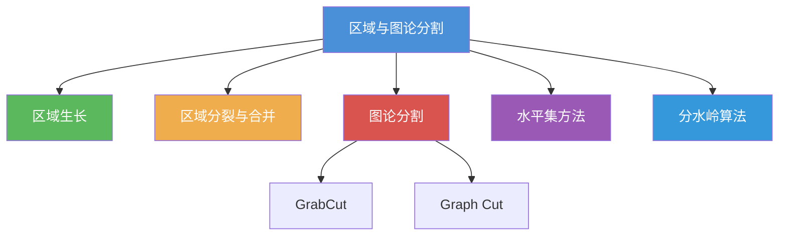
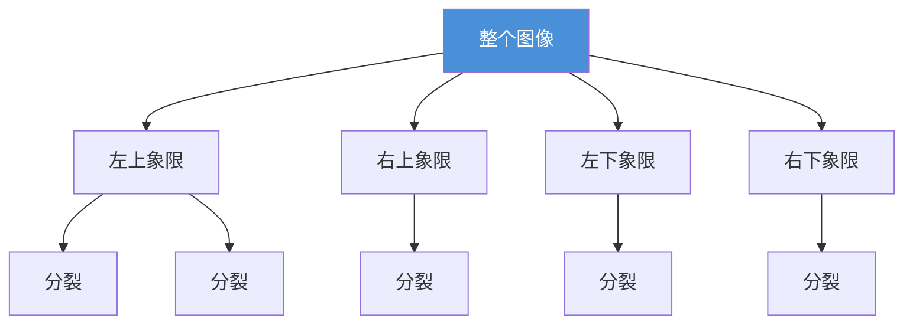
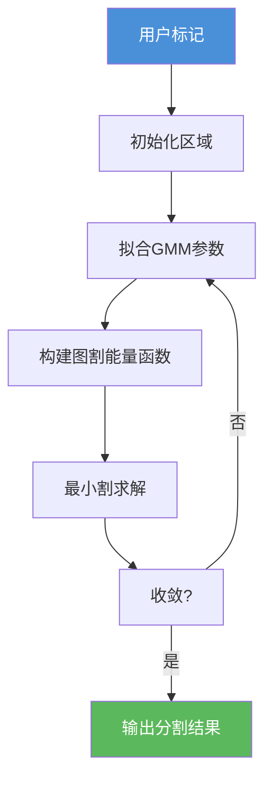
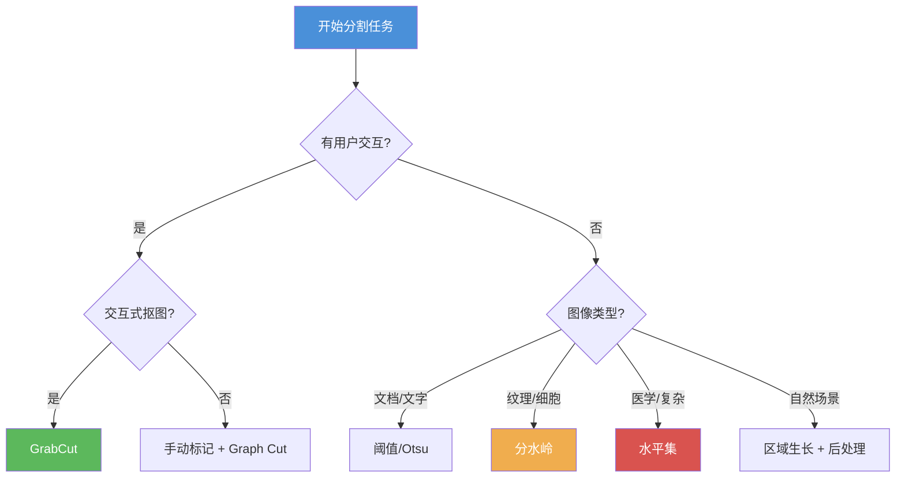

# 6.3 区域与图论分割

## 一、区域分割概述

区域分割方法基于区域一致性准则，将具有相似特性的像素归为同一区域。与基于边缘的方法（寻找区域边界）不同，区域分割从像素相似性出发直接构建区域。

### 分类体系



---

## 二、区域生长算法

### 2.1 基本思想

区域生长从一组**种子点**开始，根据生长准则将相似的相邻像素合并到当前区域。

### 2.2 算法步骤

1. **初始化**：选择种子像素集合 $S = \{s_1, s_2, \dots, s_n\}$
2. **生长准则**：定义像素加入区域的条件
3. **遍历邻域**：从每个种子点出发，检查 8-邻域（或 4-邻域）像素
4. **合并**：满足生长准则的像素加入区域
5. **迭代**：对新加入的像素重复步骤 3–4 直到没有新像素加入

### 2.3 生长准则

**基于灰度差的准则**：

$$
|f(x,y) - \mu_R| < T
$$

其中 $\mu_R$ 为当前区域的平均灰度，$T$ 为阈值。

**基于相似度的准则**：

$$
\text{sim}(f(x,y), R) > \theta
$$

其中 $\text{sim}$ 可以是灰度差、颜色距离、纹理相似度等。

### 2.4 Python 实现

```python
import cv2
import numpy as np
from collections import deque

def region_growing(img, seeds, threshold=10):
    """区域生长算法"""
    h, w = img.shape
    segmented = np.zeros((h, w), dtype=np.uint8)
    img_float = img.astype(np.float64)

    # 初始化种子
    queue = deque(seeds)
    region_sum = sum(img_float[s[0], s[1]] for s in seeds)
    region_count = len(seeds)

    for s in seeds:
        segmented[s[0], s[1]] = 255

    # 8-邻域方向
    directions = [(-1, 0), (1, 0), (0, -1), (0, 1),
                  (-1, -1), (-1, 1), (1, -1), (1, 1)]

    while queue:
        cy, cx = queue.popleft()
        current_mean = region_sum / region_count

        for dy, dx in directions:
            ny, nx = cy + dy, cx + dx
            if 0 <= ny < h and 0 <= nx < w and segmented[ny, nx] == 0:
                if abs(img_float[ny, nx] - current_mean) < threshold:
                    segmented[ny, nx] = 255
                    region_sum += img_float[ny, nx]
                    region_count += 1
                    queue.append((ny, nx))

    return segmented

img = cv2.imread('region_test.png', 0)
seeds = [(100, 100), (150, 200)]
result = region_growing(img, seeds, threshold=15)
cv2.imwrite('region_growing.png', result)
```

### 2.5 优缺点

| 优点 | 缺点 |
|------|------|
| 实现简单，原理直观 | 需要人工选择种子点 |
| 能分割出连通的区域 | 对种子点位置敏感 |
| 适应复杂形状 | 对边界模糊的区域效果差 |
| 可与先验知识结合 | 时间复杂度较高 |

---

## 三、区域分裂与合并

### 3.1 基本思想

- **分裂（Splitting）**：将不满足一致性的区域递归分裂为更小的子区域
- **合并（Merging）**：将满足一致性的相邻区域合并

### 3.2 数据结构：四叉树

分裂过程基于**四叉树（Quadtree）**结构：



### 3.3 一致性准则

区域 $R$ 满足一致性 $P$：

$$
P(R) = \begin{cases} \text{true}, & \text{if } \forall f(x,y) \in R, |f(x,y) - \mu_R| < T \\ \text{false}, & \text{otherwise} \end{cases}
$$

也可使用方差作为准则：

$$
\text{Var}(R) = \frac{1}{|R|}\sum_{(x,y)\in R} (f(x,y) - \mu_R)^2 < T_v
$$

### 3.4 分裂-合并算法

```python
import numpy as np
import cv2

class RegionNode:
    def __init__(self, x, y, w, h):
        self.x, self.y = x, y
        self.w, self.h = w, h
        self.children = []
        self.merged = False

    def is_uniform(self, img, threshold=5):
        region = img[self.y:self.y+self.h, self.x:self.x+self.w]
        if region.size == 0:
            return True
        return np.std(region) < threshold

def split_merge(img, threshold=5, min_size=4):
    """分裂合并算法"""
    h, w = img.shape
    root = RegionNode(0, 0, w, h)

    def split(node):
        if node.w <= min_size or node.h <= min_size or node.is_uniform(img, threshold):
            return
        hw, hh = node.w // 2, node.h // 2
        node.children = [
            RegionNode(node.x, node.y, hw, hh),
            RegionNode(node.x + hw, node.y, hw, hh),
            RegionNode(node.x, node.y + hh, hw, hh),
            RegionNode(node.x + hw, node.y + hh, hw, hh),
        ]
        for child in node.children:
            split(child)

    split(root)
    return root

def get_segments(node, img, segments):
    """获取所有叶节点作为分割结果"""
    if not node.children:
        region = img[node.y:node.y+node.h, node.x:node.x+node.w]
        mean_val = np.mean(region)
        segments.append((node.x, node.y, node.w, node.h, mean_val))
    else:
        for child in node.children:
            get_segments(child, img, segments)

img = cv2.imread('texture.png', 0)
root = split_merge(img, threshold=10)
segments = []
get_segments(root, img, segments)
```

### 3.5 合并步骤

分裂完成后，检查相邻的叶节点，如果它们满足一致性则合并：

```python
def merge_regions(segments, threshold=5):
    """合并相似的相邻区域"""
    merged = True
    while merged:
        merged = False
        for i in range(len(segments)):
            if segments[i] is None:
                continue
            for j in range(i+1, len(segments)):
                if segments[j] is None:
                    continue
                # 检查相邻性
                if is_adjacent(segments[i], segments[j]):
                    if abs(segments[i][4] - segments[j][4]) < threshold:
                        segments[i] = merge_two(segments[i], segments[j])
                        segments[j] = None
                        merged = True
    return [s for s in segments if s is not None]
```

---

## 四、基于图论的分割

### 4.1 图割基础

将图像分割建模为**图割（Graph Cut）问题**：

- 每个像素为图的节点 $v$
- 相邻像素间建立边，权重为像素相似度
- 目标：找到一个最小割，将图分为前景和背景

### 4.2 Graph Cut 能量函数

$$
E(L) = \sum_{p \in P} D_p(L_p) + \lambda \sum_{(p,q) \in N} V_{pq}(L_p, L_q)
$$

- $D_p(L_p)$：数据项，衡量像素 $p$ 标记为 $L_p$ 的代价
- $V_{pq}(L_p, L_q)$：平滑项，衡量相邻像素标记不同的代价
- $\lambda$：平衡两个能量项的权重系数

#### 数据项

$$
D_p(L_p) = \begin{cases} -\ln P(I_p | \text{obj}), & L_p = 1 \\ -\ln P(I_p | \text{bkg}), & L_p = 0 \end{cases}
$$

#### 平滑项

$$
V_{pq}(L_p, L_q) = \begin{cases} 0, & L_p = L_q \\ \exp\left(-\frac{(I_p - I_q)^2}{2\sigma^2}\right), & L_p \neq L_q \end{cases}
$$

### 4.3 GrabCut 算法

GrabCut 是 Graph Cut 的改进版本，由 Rother 等人于 2004 年提出。

#### 改进点

1. **迭代优化**：交替更新区域和参数
2. **高斯混合模型（GMM）**：用 GMM 建模前景和背景的颜色分布
3. **用户交互**：通过矩形框或涂鸦标记前景/背景区域

#### 算法流程



#### OpenCV 实现

```python
import cv2
import numpy as np

img = cv2.imread('person.jpg')
h, w = img.shape[:2]

# 初始化
mask = np.zeros((h, w), np.uint8)
rect = (50, 50, w - 100, h - 100)
bgd_model = np.zeros((1, 65), np.float64)
fgd_model = np.zeros((1, 65), np.float64)

# GrabCut 迭代优化
cv2.grabCut(img, mask, rect, bgd_model, fgd_model, 5, cv2.GC_INIT_WITH_RECT)

# 提取前景
mask2 = np.where((mask == cv2.GC_FGD) | (mask == cv2.GC_PR_FGD), 255, 0).astype(np.uint8)
result = cv2.bitwise_and(img, img, mask=mask2)

cv2.imwrite('grabcut_result.png', result)
```

#### 参数说明

| 参数 | 说明 |
|------|------|
| `mask` | 输入/输出掩码（GC_BGD=0, GC_FGD=1, GC_PR_BGD=2, GC_PR_FGD=3） |
| `rect` | 前景矩形区域（x, y, w, h） |
| `bgd_model` | 背景 GMM 模型（内部使用） |
| `fgd_model` | 前景 GMM 模型（内部使用） |
| `count` | 迭代次数（5 通常足够） |
| `mode` | `GC_INIT_WITH_RECT` 或 `GC_INIT_WITH_MASK` |

### 4.4 交互式 GrabCut

```python
def interactive_grabcut(img, rect):
    """交互式 GrabCut 分割"""
    mask = np.zeros(img.shape[:2], np.uint8)
    bgd = np.zeros((1, 65), np.float64)
    fgd = np.zeros((1, 65), np.float64)

    # 第一步：基于矩形初始化
    cv2.grabCut(img, mask, rect, bgd, fgd, 10, cv2.GC_INIT_WITH_RECT)

    # 第二步：添加前景/背景标记
    # 假设用户标记了 (col, row) 为前景
    # cv2.circle(mask, (col, row), 5, cv2.GC_FGD, -1)

    # 第三步：用标记重新优化
    # cv2.grabCut(img, mask, rect, bgd, fgd, 3, cv2.GC_INIT_WITH_MASK)

    # 生成结果
    mask2 = np.where(
        (mask == cv2.GC_FGD) | (mask == cv2.GC_PR_FGD), 255, 0
    ).astype(np.uint8)

    return cv2.bitwise_and(img, img, mask=mask2)
```

---

## 五、水平集方法

### 5.1 基本思想

水平集方法将分割轮廓表示为一个高维函数 $\phi(x,y,t)$ 的零等值线：

$$
C(t) = \{(x,y) | \phi(x,y,t) = 0\}
$$

函数 $\phi$ 定义为：

$$
\phi(x,y,t) = \begin{cases} d((x,y), C(t)), & (x,y) \in \text{inside} \\ -d((x,y), C(t)), & (x,y) \in \text{outside} \end{cases}
$$

其中 $d$ 为到轮廓 $C(t)$ 的有符号距离。

### 5.2 演化方程

水平集函数的演化遵循偏微分方程：

$$
\frac{\partial \phi}{\partial t} + F|\nabla \phi| = 0
$$

其中 $F$ 为速度函数，由图像数据和曲率项决定。

### 5.3 Chan-Vese 模型

Chan-Vese 模型是最著名的水平集分割模型之一：

$$
E(C, c_1, c_2) = \mu \cdot \text{Length}(C) + \nu \cdot \text{Area}(\text{inside}(C)) + \lambda_1 \int_{\text{inside}(C)} |I - c_1|^2 dxdy + \lambda_2 \int_{\text{outside}(C)} |I - c_2|^2 dxdy
$$

- $c_1, c_2$：前景和背景的平均灰度
- $\mu, \nu, \lambda_1, \lambda_2$：权重参数

### 5.4 Python 实现（简化版）

```python
import numpy as np
import cv2

def level_set_segment(img, num_iter=1000, mu=0.1, nu=0.001,
                      lambda1=1.0, lambda2=1.0, dt=0.5):
    """简化的 Chan-Vese 水平集分割"""
    h, w = img.shape
    img = img.astype(np.float64) / 255.0

    # 初始化水平集函数
    phi = np.ones((h, w))
    phi[h//4:3*h//4, w//4:3*w//4] = -1

    # 步长参数
    epsilon = 1.0

    for iteration in range(num_iter):
        # 计算 Heaviside 函数
        H = 0.5 * (1 + 2/np.pi * np.arctan(phi / epsilon))
        delta = epsilon / (np.pi * (epsilon**2 + phi**2))

        # 计算均值
        c1 = np.sum(H * img) / (np.sum(H) + 1e-10)
        c2 = np.sum((1 - H) * img) / (np.sum(1 - H) + 1e-10)

        # 计算梯度和散度
        grad_x = np.gradient(phi, axis=1)
        grad_y = np.gradient(phi, axis=0)
        grad_norm = np.sqrt(grad_x**2 + grad_y**2 + 1e-10)

        # 曲率项
        curvature = np.gradient(grad_x / grad_norm, axis=1) + \
                    np.gradient(grad_y / grad_norm, axis=0)

        # 数据项
        data_term = delta * (lambda2 * (img - c2)**2 - lambda1 * (img - c1)**2)

        # 长度项
        length_term = mu * delta * curvature

        # 面积项
        area_term = nu * delta

        # 更新水平集函数
        phi += dt * (data_term + length_term + area_term)

    # 提取零等值线
    result = (phi < 0).astype(np.uint8) * 255
    return result

img = cv2.imread('circle.png', 0)
result = level_set_segment(img)
cv2.imwrite('level_set_result.png', result)
```

---

## 六、分水岭算法

### 6.1 基本思想

分水岭（Watershed）算法将图像看作地形表面：

- **灰度值**：海拔高度
- **局部极小值**：盆地/集水盆（catchment basin）
- **极大值**：山脊/分水岭线（watershed line）

当水从局部极小值处涌出，逐步淹没整个地形，在不同盆地的水即将汇合处筑起堤坝，这些堤坝即为分割边界。

### 6.2 数学描述

分水岭变换基于**测地线距离**：

$$
\text{Watershed}(f) = \text{minimum of } h \text{ such that } \forall x \in M, h(x) \geq f(x)
$$

其中 $M$ 为所有极小值点的集合。

### 6.3 算法步骤

1. 计算梯度图（使用 Sobel 或形态学梯度）
2. 标记种子区域（前景/背景标记）
3. 从种子区域开始，按像素灰度升序进行泛洪
4. 标记分水岭线

### 6.4 Python 实现

```python
import cv2
import numpy as np

def watershed_segment(img, markers=None):
    """分水岭分割"""
    gray = cv2.cvtColor(img, cv2.COLOR_BGR2GRAY) if len(img.shape) == 3 else img

    # Step 1: 形态学梯度
    kernel = np.ones((3, 3), np.uint8)
    grad = cv2.morphologyEx(gray, cv2.MORPH_GRADIENT, kernel)

    # Step 2: 标记确定的前景和背景区域
    # 使用 Otsu 自动标记
    _, thresh = cv2.threshold(gray, 0, 255,
        cv2.THRESH_BINARY + cv2.THRESH_OTSU)

    # 去除噪声
    opening = cv2.morphologyEx(thresh, cv2.MORPH_OPEN,
        np.ones((3, 3), np.uint8), iterations=2)

    # 确定背景区域
    background = cv2.dilate(opening, np.ones((3, 3), np.uint8), iterations=3)

    # 确定前景区域（距离变换）
    dist_transform = cv2.distanceTransform(opening, cv2.DIST_L2, 5)
    _, foreground = cv2.threshold(
        dist_transform, 0.4 * dist_transform.max(), 255, 0
    )
    foreground = np.uint8(foreground)

    # 未知区域
    unknown = cv2.subtract(background, foreground)

    # 创建标记
    _, markers = cv2.connectedComponents(foreground)
    markers = markers + 1
    markers[unknown == 255] = 0

    # Step 3: 执行分水岭
    markers = cv2.watershed(img, markers)

    # 标记边界
    result = img.copy()
    result[markers == -1] = [0, 0, 255]

    return result, markers

img = cv2.imread('coins.png')
result, markers = watershed_segment(img)
cv2.imwrite('watershed_result.png', result)
```

### 6.5 OpenCV `cv2.watershed()` 详解

```python
markers = cv2.watershed(
    image,   # 输入图像（8UC3）
    markers  # 输入/输出标记矩阵（int32）
)
```

**标记值含义**：

| 值 | 含义 |
|----|------|
| 0 | 未知区域 |
| -1 | 分水岭边界（输出） |
| ≥1 | 标记的种子区域（输入/输出） |

### 6.6 过分割问题与解决

分水岭算法最主要的问题是**过分割**（Over-Segmentation），即产生过多的小区域。

#### 解决方案

**方法一：梯度预处理**

```python
# 使用形态学开运算平滑梯度
kernel = np.ones((5, 5), np.uint8)
grad_smooth = cv2.morphologyEx(gradient, cv2.MORPH_OPEN, kernel)

# 使用高斯滤波平滑梯度
grad_smooth = cv2.GaussianBlur(gradient, (5, 5), 1.0)
```

**方法二：区域合并**

```python
def merge_small_regions(markers, min_size=50):
    """合并过小的区域"""
    labels = np.unique(markers)
    for label in labels:
        if label == -1 or label == 0:
            continue
        mask = (markers == label)
        if np.sum(mask) < min_size:
            # 找到最近的相邻区域并合并
            nearest = find_nearest_neighbor(markers, label)
            markers[mask] = nearest
    return markers
```

**方法三：标记控制**

手动或半自动地指定少量种子点，只从这些点开始泛洪：

```python
# 手动标记种子点
manual_markers = np.zeros(gray.shape, dtype=np.int32)
manual_markers[100, 100] = 1  # 前景种子 1
manual_markers[200, 200] = 2  # 前景种子 2
manual_markers[50, 50] = 3    # 背景种子

result = cv2.watershed(img, manual_markers)
```

**方法四：基于距离变换的自动标记**

```python
def auto_markers(gray, min_distance=20):
    """基于距离变换的自动标记"""
    _, binary = cv2.threshold(gray, 0, 255,
        cv2.THRESH_BINARY + cv2.THRESH_OTSU)

    # 距离变换
    dist = cv2.distanceTransform(binary, cv2.DIST_L2, 5)

    # 寻找种子点（距离变换的局部极大值）
    from skimage.feature import peak_local_max
    peaks = peak_local_max(dist, min_distance=min_distance,
                           labels=binary)

    markers = np.zeros(gray.shape, dtype=np.int32)
    for i, (y, x) in enumerate(peaks):
        markers[y, x] = i + 1

    return markers

markers = auto_markers(gray, min_distance=30)
result = cv2.watershed(img, markers)
```

### 6.7 分水岭算法完整流程示例

```python
import cv2
import numpy as np

def complete_watershed(img):
    """完整分水岭分割流程"""
    # 1. 读取并预处理
    gray = cv2.cvtColor(img, cv2.COLOR_BGR2GRAY)
    img_blur = cv2.GaussianBlur(img, (5, 5), 0)

    # 2. 计算梯度
    grad_x = cv2.Sobel(gray, cv2.CV_64F, 1, 0, ksize=3)
    grad_y = cv2.Sobel(gray, cv2.CV_64F, 0, 1, ksize=3)
    gradient = cv2.magnitude(grad_x, grad_y).astype(np.uint8)

    # 3. 平滑梯度减少过分割
    gradient = cv2.morphologyEx(gradient, cv2.MORPH_OPEN,
        np.ones((3, 3), np.uint8), iterations=2)
    gradient = cv2.GaussianBlur(gradient, (5, 5), 1.0)

    # 4. 生成标记
    _, thresh = cv2.threshold(gray, 0, 255,
        cv2.THRESH_BINARY + cv2.THRESH_OTSU)

    # 距离变换寻找种子
    dist = cv2.distanceTransform(thresh, cv2.DIST_L2, 5)
    _, fg = cv2.threshold(dist, 0.3 * dist.max(), 255, 0)
    fg = np.uint8(fg)

    # 膨胀确定背景
    bg = cv2.dilate(fg, np.ones((3, 3), np.uint8), iterations=3)

    # 连接种子点
    _, labels = cv2.connectedComponents(fg)

    # 创建标记
    markers = labels + 1
    unknown = cv2.subtract(bg, fg)
    markers[unknown == 255] = 0

    # 5. 分水岭分割
    result = cv2.watershed(img_blur, markers)

    # 6. 绘制边界
    output = img.copy()
    output[result == -1] = [0, 0, 255]

    return output, result

img = cv2.imread('scene.jpg')
result, _ = complete_watershed(img)
cv2.imwrite('watershed_complete.png', result)
```

---

## 七、方法对比总结

### 七种分割方法综合对比

| 方法 | 原理 | 优点 | 缺点 | 适用场景 |
|------|------|------|------|----------|
| 阈值分割 | 灰度阈值 | 简单快速 | 对光照敏感 | 前景背景分明 |
| 区域生长 | 种子扩张 | 实现简单 | 需选种子 | 有先验种子 |
| 分裂合并 | 四叉树 | 无需种子 | 边界粗糙 | 纹理分割 |
| Graph Cut | 图割优化 | 理论最优 | 需 GMM 建模 | 交互式分割 |
| GrabCut | 迭代图割 | 用户友好 | 交互成本 | 前景抠图 |
| 水平集 | 曲线演化 | 边界光滑 | 计算量大 | 医学图像 |
| 分水岭 | 地形泛洪 | 理论直观 | 过分割 | 细胞/颗粒分割 |

### 选择决策树



---

## 八、常见考题与解析

### 考研真题

**题 1（2020 年）**：简述分水岭算法的基本原理，并说明如何解决过分割问题。

> **答**：分水岭算法将图像灰度看作地形高度，局部极小值为集水盆，从种子点泛洪模拟水流汇合，堤坝即为分割边界。
>
> 过分割解决方案：① 对梯度图进行形态学平滑或高斯滤波；② 使用标记控制，只从重要的种子点开始泛洪；③ 分割后进行区域合并，合并相似的相邻小区域。

**题 2（2021 年）**：比较区域生长和分水岭算法的异同。

> **答**：
> - 相同点：都需要种子点，都是基于区域一致性的分割方法
> - 不同点：区域生长基于像素灰度相似性直接扩张；分水岭基于梯度图的测地距离进行泛洪。分水岭在边界处理上更精确，但过分割问题更严重。

**题 3（2022 年）**：说明 GrabCut 算法相比传统 Graph Cut 做了哪些改进。

> **答**：① 使用高斯混合模型（GMM）建模颜色分布，更准确地建模前景/背景；② 采用迭代优化，交替更新分割结果和 GMM 参数；③ 支持矩形框初始化和掩码初始化两种交互方式；④ 通过边界项的硬约束减少碎片区域。

### 编程练习

**题 4**：使用 OpenCV 实现交互式 GrabCut 分割，用户可以通过鼠标绘制矩形框选择前景区域。

```python
import cv2
import numpy as np

drawing = False
ix, iy = -1, -1
img_display = None

def draw_rect(event, x, y, flags, param):
    global ix, iy, drawing, img_display
    if event == cv2.EVENT_LBUTTONDOWN:
        drawing = True
        ix, iy = x, y
    elif event == cv2.EVENT_MOUSEMOVE:
        if drawing:
            img_display = img.copy()
            cv2.rectangle(img_display, (ix, iy), (x, y), (0, 255, 0), 2)
    elif event == cv2.EVENT_LBUTTONUP:
        drawing = False
        img_display = img.copy()
        cv2.rectangle(img_display, (ix, iy), (x, y), (0, 255, 0), 2)
        rect = (min(ix, x), min(iy, y), abs(x - ix), abs(y - iy))
        do_grabcut(rect)

def do_grabcut(rect):
    mask = np.zeros(img.shape[:2], np.uint8)
    bgd = np.zeros((1, 65), np.float64)
    fgd = np.zeros((1, 65), np.float64)
    cv2.grabCut(img, mask, rect, bgd, fgd, 5, cv2.GC_INIT_WITH_RECT)
    mask2 = np.where(
        (mask == 2) | (mask == 0), 0, 1
    ).astype(np.uint8)
    result = img * mask2[:, :, np.newaxis]
    cv2.imwrite('grabcut_interactive.png', result)

img = cv2.imread('photo.jpg')
img_display = img.copy()
cv2.namedWindow('image')
cv2.setMouseCallback('image', draw_rect)
cv2.imshow('image', img_display)
cv2.waitKey(0)
cv2.destroyAllWindows()
```