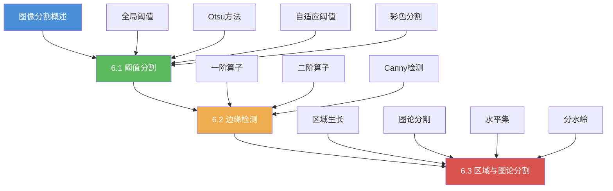

# 第6章 图像分割技术 — 导航总览

## 一、章节学习路线图

## 二、核心知识结构

| 知识点 | 重要程度 | 考查频率 | 关联章节 |
|--------|:--------:|:--------:|----------|
| Otsu 阈值分割 | ★★★★★ | 极高 | 直方图处理 |
| Canny 边缘检测 | ★★★★★ | 极高 | 梯度运算 |
| Sobel/Prewitt/Roberts 算子 | ★★★★☆ | 高 | 微分运算 |
| 区域生长算法 | ★★★☆☆ | 中 | 形态学处理 |
| 分水岭算法 | ★★★★☆ | 高 | 形态学、拓扑 |
| GrabCut 图论分割 | ★★★☆☆ | 中 | 能量最小化 |
| 水平集方法 | ★★★☆☆ | 中 | 偏微分方程 |

## 三、章节导航链接

### 6.1 阈值分割
- [[6.1 阈值分割#全局阈值分割|全局阈值分割]]
- [[6.1 阈值分割#Otsu方法——最大类间方差|Otsu 方法]]
- [[6.1 阈值分割#自适应阈值分割|自适应阈值]]
- [[6.1 阈值分割#基于彩色的分割|彩色分割]]
- [[6.1 阈值分割#OpenCV实现|OpenCV 实现]]

### 6.2 边缘检测
- [[6.2 边缘检测#边缘类型|边缘类型]]
- [[6.2 边缘检测#一阶微分算子|一阶算子]]
- [[6.2 边缘检测#二阶微分算子|二阶算子]]
- [[6.2 边缘检测#Canny边缘检测器|Canny 检测器]]
- [[6.2 边缘检测#OpenCV实现|OpenCV 实现]]

### 6.3 区域与图论分割
- [[6.3 区域与图论分割#区域生长算法|区域生长]]
- [[6.3 区域与图论分割#区域分裂与合并|区域分裂合并]]
- [[6.3 区域与图论分割#基于图论的分割|图论分割]]
- [[6.3 区域与图论分割#水平集方法|水平集]]
- [[6.3 区域与图论分割#分水岭算法|分水岭算法]]

## 四、考研核心考点速记

### 高频考点
1. **Otsu 方法的数学推导**：类间方差最大化 → 等价于类内方差最小化
2. **Canny 检测的四步流程**：高斯滤波 → 梯度计算 → 非极大值抑制 → 双阈值滞后连接
3. **梯度算子对比**：Sobel(带权3×3) vs Prewitt(均匀3×3) vs Roberts(2×2)
4. **分水岭过分割问题**：标记种子点 + 形态学预处理

### 易混淆辨析
| 概念 | 区别 |
|------|------|
| 阈值分割 vs 边缘检测 | 前者基于像素灰度，后者基于灰度变化率 |
| 一阶 vs 二阶算子 | 一阶检测灰度跳变，二阶检测一阶导的极值 |
| 区域生长 vs 分裂合并 | 前者从种子向外扩张，后者先整图分裂再合并 |
|  watershed vs GrabCut | 前者基于拓扑分割，后者基于图割能量优化 |

## 五、自测题清单

### 基础题
1. 全局阈值分割和自适应阈值分割的区别是什么？各自适用什么场景？
2. 什么是类间方差？Otsu 方法如何通过最大化类间方差确定阈值？
3. 简述 Canny 边缘检测的完整流程。
4. 比较 Sobel、Prewitt、Roberts 三种算子的异同。

### 应用题
5. 对一幅光照不均匀的图像，应选择哪种阈值分割方法？为什么？
6. 设计一个基于区域生长的前景检测算法，说明种子点选择和生长准则。
7. 分水岭算法容易产生过分割，有哪些改进方案？
8. GrabCut 算法相比传统图割（Graph Cut）做了哪些改进？

### 计算题
9. 对灰度直方图 $P(i)$，写出 Otsu 方法中类间方差 $\sigma_B^2(T)$ 的公式，并描述求解步骤。
10. 给定 $3 \times 3$ 图像块，用 Sobel 算子计算 $x$ 和 $y$ 方向的梯度。

## 六、学习建议

1. **理论先行**：阅读冈萨雷斯教材第10章，理解分割的数学本质
2. **动手推导**：手推 Otsu 公式、Canny 四步流程
3. **编程实践**：使用 OpenCV 对至少3种不同类型的图像进行分割实验
4. **对比分析**：对同一图像使用多种分割方法，对比效果
5. **拓展阅读**：了解深度学习分割方法（U-Net, Mask R-CNN）

## 七、公式速查表

| 方法 | 核心公式 |
|------|----------|
| Otsu 类间方差 | $\sigma_B^2(T) = \frac{[\mu_T P_1(T) - \mu(T)]^2}{P_1(T)[1-P_1(T)]}$ |
| Sobel 算子 | $G_x = \begin{bmatrix}-1&0&1\\-2&0&2\\-1&0&1\end{bmatrix} * I$ |
| LoG 算子 | $\nabla^2 G(r) = \frac{1}{\pi\sigma^4}\left(1-\frac{r^2}{2\sigma^2}\right)e^{-r^2/2\sigma^2}$ |
| Canny 非极大抑制 | 梯度方向上取局部最大值 |