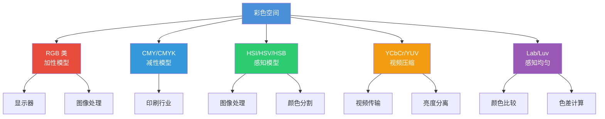
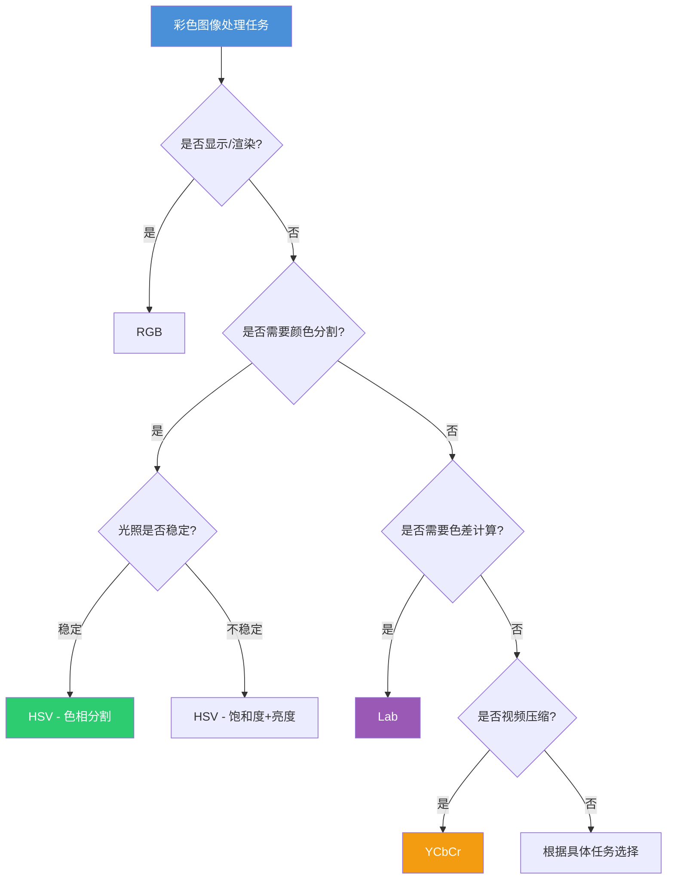

# 7.1 彩色空间与转换

## 一、彩色空间概述

### 1.1 什么是彩色空间

彩色空间（Color Space）是描述颜色的数学模型，用多个数值维度来表示一种颜色。不同的彩色空间适用于不同的应用场景。

### 1.2 分类体系



### 1.3 选择依据

| 任务 | 推荐空间 | 原因 |
|------|----------|------|
| 显示/渲染 | RGB | 显示器原生格式 |
| 颜色分割/检测 | HSV/HSI | 色相与亮度分离 |
| 视频压缩 | YCbCr | 亮度信息独立压缩 |
| 颜色比较/度量 | Lab | 感知均匀，欧氏距离即色差 |
| 肤色检测 | YCbCr / HSV | 肤色在特定通道上分布集中 |

---

## 二、RGB 空间

### 2.1 定义

RGB（Red-Green-Blue）是最常见的加性彩色空间，用三个分量 $R, G, B$ 表示颜色，取值范围 $[0, 255]$（8-bit）。

### 2.2 优缺点

| 优点 | 缺点 |
|------|------|
| 硬件友好（显示器、摄像头） | 三个分量高度相关 |
| 直观、常用 | 亮度和色度不分离 |
| 图像处理基础 | 不适合直接做颜色分割 |

### 2.3 Python 操作

```python
import cv2
import numpy as np

img = cv2.imread('image.jpg')

# OpenCV 默认使用 BGR 顺序，转换为 RGB
img_rgb = cv2.cvtColor(img, cv2.COLOR_BGR2RGB)

# 分离通道
r, g, b = cv2.split(img_rgb)

# 合并通道
merged = cv2.merge([r, g, b])

# 显示各通道
cv2.imshow('R channel', r)
cv2.imshow('G channel', g)
cv2.imshow('B channel', b)
```

### 2.4 BGR vs RGB 顺序

**重要**：OpenCV 读取图像默认使用 **BGR** 顺序，而大多数其他库（matplotlib, PIL）使用 **RGB**。

```python
# OpenCV 读取（BGR）
img_cv = cv2.imread('image.jpg')

# 转换为 RGB
img_rgb = cv2.cvtColor(img_cv, cv2.COLOR_BGR2RGB)

# matplotlib 显示（需要 RGB）
plt.imshow(img_rgb)
plt.title('RGB Image')
```

---

## 三、CMY / CMYK 空间

### 3.1 CMY（减性模型）

CMY（Cyan-Magenta-Yellow）是减性彩色空间，用于印刷行业。

$$
\begin{bmatrix} C \\ M \\ Y \end{bmatrix} = \begin{bmatrix} 1 \\ 1 \\ 1 \end{bmatrix} - \begin{bmatrix} R \\ G \\ B \end{bmatrix}
$$

即 $C = 1 - R$，$M = 1 - G$，$Y = 1 - B$（归一化到 $[0,1]$）。

### 3.2 CMYK

CMYK 在 CMY 基础上增加黑色（Key Black），解决青色/洋红/黄色混合无法得到纯黑的问题。

$$
K = \min(C, M, Y)
$$

$$
\begin{cases}
C' = \dfrac{C - K}{1 - K} \\[6pt]
M' = \dfrac{M - K}{1 - K} \\[6pt]
Y' = \dfrac{Y - K}{1 - K}
\end{cases}
$$

### 3.3 转换实现

```python
def rgb_to_cmyk(rgb):
    """RGB 转 CMYK"""
    r, g, b = rgb.astype(np.float64) / 255.0

    k = 1 - max(r, g, b)
    if k == 1:
        return np.array([0, 0, 0, 1])

    c = (1 - r - k) / (1 - k)
    m = (1 - g - k) / (1 - k)
    y = (1 - b - k) / (1 - k)

    return np.array([c, m, y, k])

def cmyk_to_rgb(cmyk):
    """CMYK 转 RGB"""
    c, m, y, k = cmyk
    r = 255 * (1 - c) * (1 - k)
    g = 255 * (1 - m) * (1 - k)
    b = 255 * (1 - y) * (1 - k)
    return np.array([r, g, b], dtype=np.uint8)
```

---

## 四、HSI / HSV 空间

### 4.1 HSI 定义

HSI（Hue-Saturation-Intensity）是面向感知的彩色空间：

- **H（Hue，色相）**：颜色的基本属性（红、橙、黄、绿...），取值 $[0^\circ, 360^\circ)$
- **S（Saturation，饱和度）**：颜色的纯度，取值 $[0, 1]$
- **I（Intensity，亮度）**：颜色的明暗程度，取值 $[0, 1]$

### 4.2 RGB → HSI 转换

设 $R, G, B \in [0, 1]$，$I = \frac{R + G + B}{3}$。

**当 $I = 0$ 时**：$S = 0$，$H = 0$

**否则**：

$$
S = 1 - \frac{3 \cdot \min(R, G, B)}{R + G + B}
$$

$$
H = \begin{cases}
\theta, & B \leq G \\
360^\circ - \theta, & B > G
\end{cases}
$$

其中：

$$
\theta = \arccos\left(\frac{(R - G) + (R - B)}{2\sqrt{(R - G)^2 + (R - B)(G - B)}}\right)
$$

### 4.3 HSI → RGB 反变换

根据 $H$ 所在的扇区进行计算：

$$
\text{if } 0^\circ \leq H < 120^\circ:
$$

$$
\begin{cases}
R = I \cdot [1 + S \cos(H)] \\
B = I \cdot (1 - S) \\
G = 3I - (R + B)
\end{cases}
$$

$$
\text{if } 120^\circ \leq H < 240^\circ:
$$

$$
\begin{cases}
G = I \cdot [1 + S \cos(H - 120^\circ)] \\
R = I \cdot (1 - S) \\
B = 3I - (G + R)
\end{cases}
$$

$$
\text{if } 240^\circ \leq H < 360^\circ:
$$

$$
\begin{cases}
B = I \cdot [1 + S \cos(H - 240^\circ)] \\
G = I \cdot (1 - S) \\
R = 3I - (B + G)
\end{cases}
$$

### 4.4 HSV 空间

HSV（Hue-Saturation-Value）与 HSI 类似，但亮度分量计算不同：

$$
V = \max(R, G, B)
$$

$$
S = \frac{V - \min(R, G, B)}{V} \quad (V \neq 0)
$$

OpenCV 中常用 HSV。

### 4.5 Python 实现

```python
import numpy as np

def rgb_to_hsi(rgb):
    """RGB 转 HSI"""
    r, g, b = rgb.astype(np.float64) / 255.0

    i = (r + g + b) / 3.0

    if i == 0:
        return 0, 0, 0

    s = 1 - 3 * min(r, g, b) / (r + g + b)

    numerator = (r - g) + (r - b)
    denominator = 2 * np.sqrt((r - g)**2 + (r - b) * (g - b))

    if denominator == 0:
        theta = 0
    else:
        theta = np.arccos(numerator / denominator) * 180 / np.pi

    if b <= g:
        h = theta
    else:
        h = 360 - theta

    return h, s, i

def rgb_to_hsv_array(img):
    """批量 RGB 转 HSV"""
    img_float = img.astype(np.float64) / 255.0
    r, g, b = img_float[..., 0], img_float[..., 1], img_float[..., 2]

    v = np.max(img_float, axis=2)

    delta = v - np.min(img_float, axis=2)
    s = np.where(v != 0, delta / v, 0)

    h = np.zeros_like(v)
    mask = delta != 0

    # 红色区域
    rmax = (v == r) & mask
    gmax = (v == g) & mask
    bmax = (v == b) & mask

    h[rmax] = 60 * (((g[rmax] - b[rmax]) / delta[rmax]) % 6)
    h[gmax] = 60 * ((b[gmax] - r[gmax]) / delta[gmax] + 2)
    h[bmax] = 60 * ((r[bmax] - g[bmax]) / delta[bmax] + 4)

    h = h.astype(np.uint8)
    s = (s * 255).astype(np.uint8)
    v = (v * 255).astype(np.uint8)

    return cv2.merge([h, s, v])
```

### 4.6 OpenCV 实现

```python
import cv2

img = cv2.imread('image.jpg')

# BGR → HSV
hsv = cv2.cvtColor(img, cv2.COLOR_BGR2HSV)

# BGR → HSI（手动实现）
hsi = cv2.cvtColor(img, cv2.COLOR_BGR2HSV)

# HSV → BGR
hsv_back = cv2.cvtColor(hsv, cv2.COLOR_HSV2BGR)

# 分离 HSV 通道
h, s, v = cv2.split(hsv)

# H 通道：色相 (0-179 in OpenCV, 0-360 normally)
# S 通道：饱和度 (0-255)
# V 通道：亮度 (0-255)
```

**注意**：OpenCV 中 HSV 的 H 通道范围为 $[0, 179]$（不是 $[0, 360]$），以节省存储空间。

### 4.7 HSV 空间的优势

- **亮度分离**：V 通道独立表示亮度变化，H 和 S 表示色度
- **颜色检测**：通过 H 范围即可检测特定颜色
- **光照鲁棒**：在光照变化场景下，H 相对稳定

---

## 五、YCbCr 空间

### 5.1 定义

YCbCr 是视频压缩中常用的颜色空间，将亮度和色度分离：

- **Y**：亮度（Luminance）
- **Cb**：蓝色色差（Blue Chrominance）
- **Cr**：红色色差（Red Chrominance）

### 5.2 转换公式

$$
\begin{bmatrix} Y \\ Cb \\ Cr \end{bmatrix} = \begin{bmatrix} 0.299 & 0.587 & 0.114 \\ -0.169 & -0.331 & 0.500 \\ 0.500 & -0.419 & -0.081 \end{bmatrix} \begin{bmatrix} R \\ G \\ B \end{bmatrix}
$$

反变换：

$$
\begin{bmatrix} R \\ G \\ B \end{bmatrix} = \begin{bmatrix} 1.000 & 1.000 & 1.000 \\ 1.000 & -0.344 & -1.714 \\ 1.000 & 1.772 & 0.000 \end{bmatrix} \begin{bmatrix} Y \\ Cb \\ Cr \end{bmatrix}
$$

### 5.3 OpenCV 实现

```python
import cv2

img = cv2.imread('image.jpg')

# BGR → YCrCb（注意 OpenCV 顺序为 YCrCb）
ycrcb = cv2.cvtColor(img, cv2.COLOR_BGR2YCrCb)

# 分离通道
y, cr, cb = cv2.split(ycrcb)

# YCrCb → BGR
bgr = cv2.cvtColor(ycrcb, cv2.COLOR_YCrCb2BGR)

# 肤色检测（YCbCr 空间）
def detect_skin_ycbcr(img):
    ycrcb = cv2.cvtColor(img, cv2.COLOR_BGR2YCrCb)
    y, cr, cb = cv2.split(ycrcb)

    # 肤色范围
    skin_mask = (cr >= 133) & (cr <= 173) & (cb >= 77) & (cb <= 127)

    return skin_mask.astype(np.uint8) * 255
```

### 5.4 应用场景

- **视频压缩**：Y 通道保留全部分辨率，Cb/Cr 可以降采样
- **肤色检测**：肤色在 YCbCr 空间中 Cr 和 Cb 值集中
- **图像增强**：在 Y 通道进行亮度增强，保持色彩不变

---

## 六、Lab 空间

### 6.1 定义

Lab（CIELAB）是国际照明委员会（CIE）定义的感知均匀的颜色空间：

- **L**：亮度（Lightness），$[0, 100]$
- **a**：绿-红轴，$[-128, 127]$
- **b**：蓝-黄轴，$[-128, 127]$

### 6.2 转换路径

RGB → Lab 不能直接转换，需要通过 CIE XYZ 空间：

$$
\text{RGB} \xrightarrow{M} \text{XYZ} \xrightarrow{L^{-1}} \text{Lab}
$$

#### Step 1：RGB → XYZ

$$
\begin{bmatrix} X \\ Y \\ Z \end{bmatrix} = \begin{bmatrix} 0.412453 & 0.357580 & 0.180423 \\ 0.212671 & 0.715160 & 0.072169 \\ 0.019334 & 0.119192 & 0.950304 \end{bmatrix} \begin{bmatrix} R \\ G \\ B \end{bmatrix}
$$

#### Step 2：XYZ → Lab

$$
L^* = 116 \cdot f\left(\frac{Y}{Y_n}\right) - 16
$$

$$
a^* = 500 \cdot \left[f\left(\frac{X}{X_n}\right) - f\left(\frac{Y}{Y_n}\right)\right]
$$

$$
b^* = 200 \cdot \left[f\left(\frac{Y}{Y_n}\right) - f\left(\frac{Z}{Z_n}\right)\right]
$$

其中：

$$
f(t) = \begin{cases} t^{1/3}, & t > \left(\frac{6}{29}\right)^3 \\ \dfrac{t}{3\left(\frac{6}{29}\right)^2} + \dfrac{4}{29}, & t \leq \left(\frac{6}{29}\right)^3 \end{cases}
$$

$X_n, Y_n, Z_n$ 为参考白点（D65 光源：$X_n=0.95047, Y_n=1.00000, Z_n=1.08883$）。

### 6.3 色差计算

Lab 空间的核心优势是**感知均匀性**，即欧氏距离与人眼感知的色差一致：

$$
\Delta E_{ab} = \sqrt{(L_1 - L_2)^2 + (a_1 - a_2)^2 + (b_1 - b_2)^2}
$$

### 6.4 OpenCV 实现

```python
import cv2
import numpy as np

img = cv2.imread('image.jpg')

# BGR → Lab
lab = cv2.cvtColor(img, cv2.COLOR_BGR2Lab)

# 分离通道
l_channel, a_channel, b_channel = cv2.split(lab)

# Lab → BGR
bgr = cv2.cvtColor(lab, cv2.COLOR_Lab2BGR)

# 色差计算
def color_distance_lab(color1, color2):
    """计算两个颜色的 Lab 色差"""
    c1_lab = cv2.cvtColor(np.uint8([[color1]]), cv2.COLOR_BGR2Lab)
    c2_lab = cv2.cvtColor(np.uint8([[color2]]), cv2.COLOR_BGR2Lab)

    diff = c1_lab.astype(np.float64) - c2_lab.astype(np.float64)
    return np.sqrt(np.sum(diff**2))

# 图像中每个像素到目标颜色的距离
def distance_to_color(img, target_bgr):
    """计算每个像素到目标颜色的 Lab 距离"""
    img_lab = cv2.cvtColor(img, cv2.COLOR_BGR2Lab)
    target_lab = cv2.cvtColor(
        np.uint8([[target_bgr]]), cv2.COLOR_BGR2Lab
    ).flatten()

    diff = img_lab.astype(np.float64) - target_lab.astype(np.float64)
    distance = np.sqrt(np.sum(diff**2, axis=2))
    return distance
```

### 6.5 手写 RGB → Lab 转换

```python
def rgb_to_lab(rgb):
    """RGB 转 Lab（通过 XYZ）"""
    r, g, b = rgb.astype(np.float64) / 255.0

    # sRGB → 线性 RGB
    def srgb_to_linear(c):
        if c > 0.04045:
            return ((c + 0.055) / 1.055) ** 2.4
        else:
            return c / 12.92

    r, g, b = srgb_to_linear(r), srgb_to_linear(g), srgb_to_linear(b)

    # 线性 RGB → XYZ（D65）
    x = r * 0.4124 + g * 0.3576 + b * 0.1805
    y = r * 0.2126 + g * 0.7152 + b * 0.0722
    z = r * 0.0193 + g * 0.1192 + b * 0.9505

    # XYZ 归一化到参考白点
    xn, yn, zn = x / 0.95047, y / 1.0, z / 1.08883

    # XYZ → Lab
    delta = 6.0 / 29.0

    def f(t):
        if t > delta**3:
            return t ** (1/3)
        else:
            return t / (3 * delta**2) + 4.0 / 29.0

    fx, fy, fz = f(xn), f(yn), f(zn)

    L = 116 * fy - 16
    a = 500 * (fx - fy)
    b_val = 200 * (fy - fz)

    return L, a, b_val
```

---

## 七、空间转换 OpenCV 速查

### `cv2.cvtColor()` 常用转换码

```python
# BGR → 其他
cv2.COLOR_BGR2RGB
cv2.COLOR_BGR2GRAY
cv2.COLOR_BGR2HSV
cv2.COLOR_BGR2HSI       # 注意：HSI 在 OpenCV 中不直接支持
cv2.COLOR_BGR2YCrCb
cv2.COLOR_BGR2Lab
cv2.COLOR_BGR2Luv
cv2.COLOR_BGR2XYZ
cv2.COLOR_BGR2HLS
cv2.COLOR_BGR2YUV

# 其他 → BGR
cv2.COLOR_RGB2BGR
cv2.COLOR_HSV2BGR
cv2.COLOR_YCrCb2BGR
cv2.COLOR_Lab2BGR
```

### 常用转换示例

```python
import cv2
import numpy as np

img = cv2.imread('image.jpg')

# RGB 转换
rgb = cv2.cvtColor(img, cv2.COLOR_BGR2RGB)

# 灰度转换（加权：0.299R + 0.587G + 0.114B）
gray = cv2.cvtColor(img, cv2.COLOR_BGR2GRAY)

# HSV 转换
hsv = cv2.cvtColor(img, cv2.COLOR_BGR2HSV)
h, s, v = cv2.split(hsv)

# YCrCb 转换（常用肤色检测）
ycrcb = cv2.cvtColor(img, cv2.COLOR_BGR2YCrCb)
y, cr, cb = cv2.split(ycrcb)

# Lab 转换
lab = cv2.cvtColor(img, cv2.COLOR_BGR2Lab)
l, a, b = cv2.split(lab)

# Luv 转换
luv = cv2.cvtColor(img, cv2.COLOR_BGR2Luv)

# HLS 转换（Hue-Lightness-Saturation）
hls = cv2.cvtColor(img, cv2.COLOR_BGR2HLS)
h, l, s = cv2.split(hls)
```

### HSI 在 OpenCV 中的实现

OpenCV **不直接支持** BGR2HSI，但可以手动实现：

```python
def bgr_to_hsi(bgr_img):
    """BGR 转 HSI"""
    rgb = cv2.cvtColor(bgr_img, cv2.COLOR_BGR2RGB).astype(np.float64) / 255.0
    r, g, b = rgb[..., 0], rgb[..., 1], rgb[..., 2]

    i = (r + g + b) / 3.0

    s = np.where(
        i > 0,
        1 - 3 * np.minimum(np.minimum(r, g), b) / (r + g + b + 1e-10),
        0
    )

    numerator = (r - g) + (r - b)
    denominator = 2 * np.sqrt((r - g)**2 + (r - b) * (g - b) + 1e-10)

    theta = np.arccos(np.clip(numerator / (denominator + 1e-10), -1, 1))
    h = np.where(b <= g, theta * 180 / np.pi, (360 - theta * 180 / np.pi))

    h = h.astype(np.uint8)
    s = (s * 255).astype(np.uint8)
    i = (i * 255).astype(np.uint8)

    return cv2.merge([h, s, i])
```

---

## 八、各空间对比总结

### 性能对比表

| 特性 | RGB | HSV/HSI | YCbCr | Lab | CMYK |
|------|-----|---------|-------|-----|------|
| 亮度分离 | ✗ | ✓ | ✓ | ✓ | ✗ |
| 感知均匀 | ✗ | ✗ | ✗ | ✓ | ✗ |
| 硬件支持 | ★★★★★ | ★★★☆☆ | ★★★★☆ | ★★☆☆☆ | ★★★★☆ |
| 颜色分割 | ★★☆☆☆ | ★★★★★ | ★★★☆☆ | ★★★★☆ | ★☆☆☆☆ |
| 色差计算 | ✗ | ✗ | ✗ | ✓ | ✗ |
| 印刷适用 | ✗ | ✗ | ✗ | ✗ | ✓ |

### 选择决策流程



### 常见问题

**Q1：为什么 OpenCV 读取图像使用 BGR 而不是 RGB？**
OpenCV 早期版本基于 Windows 的 BMP 格式（BGR 顺序），为了兼容历史原因沿用至今。现代库（如 PIL/matplotlib）使用 RGB。

**Q2：直方图均衡化为什么要在 HSV 的 V 通道而不是 RGB 上做？**
在 RGB 三通道分别做直方图均衡化会破坏颜色的一致性，可能导致严重的偏色问题。正确做法是在 HSV 空间中仅对 V（亮度）通道做均衡化，保持 H 和 S 不变。

**Q3：Lab 空间中 a 和 b 通道的取值范围是 $[-128, 127]$ 吗？**
理论上是，但实际中 a 和 b 的取值通常在 $[-100, 100]$ 左右。OpenCV 中为了使用 uint8 存储，将 a、b 通道分别偏移了 128，实际存储范围为 $[0, 255]$，对应实际值 $[-128, 127]$。

**Q4：RGB 到 HSI 转换中，为什么分母可能为零？**
当 $R=G=B$ 时（灰度色），$\arccos$ 的分母为零。此时 $H$ 无定义（灰度没有色相），$S=0$。需要特殊处理。

**Q5：在 OpenCV 中 HSV 的 H 通道范围是 $[0, 179]$ 还是 $[0, 255]$？**
OpenCV 使用 $[0, 179]$ 来存储 H 通道（实际 $0-360^\circ$ 的一半），以适配 uint8 类型。S 和 V 通道范围为 $[0, 255]$。