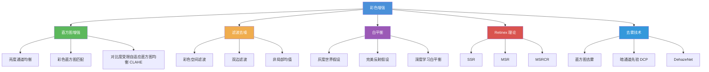

# 7.2 彩色增强与滤波

## 一、概述

彩色增强的目标是改善彩色图像的视觉质量，使其更适合人眼观察或后续处理。与灰度增强相比，彩色增强需要同时处理亮度和色度信息。

### 分类体系



---

## 二、彩色直方图均衡

### 2.1 为什么不能直接对 RGB 三通道分别处理

对 RGB 三通道分别进行直方图均衡化会导致**颜色失真**，因为：
- 三个通道的独立变换破坏了 RGB 向量的相对比例
- 可能出现原本不存在的颜色

### 2.2 正确做法：在 HSV 空间中均衡亮度通道

```python
import cv2
import numpy as np

def histogram_equalization_color(img):
    """彩色图像直方图均衡化（仅亮度通道）"""
    hsv = cv2.cvtColor(img, cv2.COLOR_BGR2HSV)
    h, s, v = cv2.split(hsv)

    # 仅对 V 通道进行均衡化
    v_eq = cv2.equalizeHist(v)

    # 合并通道
    hsv_eq = cv2.merge([h, s, v_eq])
    result = cv2.cvtColor(hsv_eq, cv2.COLOR_HSV2BGR)

    return result

img = cv2.imread('color_image.jpg')
eq_img = histogram_equalization_color(img)
cv2.imwrite('color_equalized.png', eq_img)
```

### 2.3 CLAHE（对比度受限自适应直方图均衡化）

```python
def clahe_color(img, clip_limit=3.0, grid_size=(8, 8)):
    """CLAHE 彩色图像增强"""
    hsv = cv2.cvtColor(img, cv2.COLOR_BGR2HSV)
    h, s, v = cv2.split(hsv)

    clahe = cv2.createCLAHE(
        clipLimit=clip_limit,
        tileGridSize=grid_size
    )

    v_clahe = clahe.apply(v)
    hsv_clahe = cv2.merge([h, s, v_clahe])
    result = cv2.cvtColor(hsv_clahe, cv2.COLOR_HSV2BGR)

    return result

clahe_img = clahe_color(img, clip_limit=2.0, grid_size=(8, 8))
cv2.imwrite('color_clahe.png', clahe_img)
```

### 2.4 在 Lab 空间中的直方图均衡

```python
def equalize_lab(img):
    """Lab 空间直方图均衡化"""
    lab = cv2.cvtColor(img, cv2.COLOR_BGR2Lab)
    l, a, b = cv2.split(lab)

    # 仅对 L 通道均衡化
    l_eq = cv2.equalizeHist(l)

    lab_eq = cv2.merge([l_eq, a, b])
    result = cv2.cvtColor(lab_eq, cv2.COLOR_Lab2BGR)

    return result

lab_eq_img = equalize_lab(img)
cv2.imwrite('lab_equalized.png', lab_eq_img)
```

### 2.5 各方法效果对比

```python
import matplotlib.pyplot as plt

img = cv2.imread('color_image.jpg')

# 1. RGB 三通道分别均衡（错误做法）
rgb = cv2.cvtColor(img, cv2.COLOR_BGR2RGB)
rgb_eq = np.zeros_like(rgb)
for i in range(3):
    rgb_eq[:, :, i] = cv2.equalizeHist(rgb[:, :, i])

# 2. HSV 亮度均衡
hsv_eq = histogram_equalization_color(img)
hsv_eq_rgb = cv2.cvtColor(hsv_eq, cv2.COLOR_BGR2RGB)

# 3. CLAHE
clahe_eq = clahe_color(img)
clahe_eq_rgb = cv2.cvtColor(clahe_eq, cv2.COLOR_BGR2RGB)

# 4. Lab 空间均衡
lab_eq = equalize_lab(img)
lab_eq_rgb = cv2.cvtColor(lab_eq, cv2.COLOR_BGR2RGB)

# 可视化
fig, axes = plt.subplots(2, 3, figsize=(18, 12))
titles = ['Original', 'RGB Separate (Bad)', 'HSV V-channel', 'CLAHE', 'Lab L-channel']
images_rgb = [rgb, rgb_eq, hsv_eq_rgb, clahe_eq_rgb, lab_eq_rgb]

for ax, title, img_rgb in zip(axes.flat, titles, images_rgb):
    ax.imshow(img_rgb)
    ax.set_title(title)
    ax.axis('off')

axes[1, 2].axis('off')
plt.tight_layout()
plt.savefig('color_equalization_comparison.png')
```

---

## 三、彩色滤波与去噪

### 3.1 彩色空间高斯滤波

```python
def gaussian_filter_color(img, kernel_size=5, sigma=1.0):
    """彩色高斯滤波"""
    # 在各通道独立滤波
    blurred = cv2.GaussianBlur(img, (kernel_size, kernel_size), sigma)
    return blurred

img = cv2.imread('noisy_color.jpg')
blurred = gaussian_filter_color(img, kernel_size=7, sigma=1.5)
cv2.imwrite('gaussian_blur.png', blurred)
```

### 3.2 中值滤波

```python
def median_filter_color(img, kernel_size=5):
    """彩色中值滤波（对椒盐噪声效果好）"""
    # 在各通道独立中值滤波
    filtered = cv2.medianBlur(img, kernel_size)
    return filtered

median_filtered = median_filter_color(img, kernel_size=5)
cv2.imwrite('median_filtered.png', median_filtered)
```

### 3.3 双边滤波（保边去噪）

双边滤波同时考虑空间距离和像素值差异，能在去噪的同时保留边缘。

$$
I_p' = \frac{1}{W_p}\sum_{q \in \Omega} G_{\sigma_s}(\|p-q\|) \cdot G_{\sigma_r}(\|I_p - I_q\|) \cdot I_q
$$

$$
W_p = \sum_{q \in \Omega} G_{\sigma_s}(\|p-q\|) \cdot G_{\sigma_r}(\|I_p - I_q\|)
$$

其中：
- $G_{\sigma_s}$：空间高斯核
- $G_{\sigma_r}$：值域高斯核
- $\sigma_s$：空间标准差
- $\sigma_r$：值域标准差

```python
def bilateral_filter_color(img, d=9, sigma_color=75, sigma_space=75):
    """彩色双边滤波"""
    filtered = cv2.bilateralFilter(img, d, sigma_color, sigma_space)
    return filtered

bilateral = bilateral_filter_color(img, d=9, sigma_color=75, sigma_space=75)
cv2.imwrite('bilateral_filtered.png', bilateral)
```

### 3.4 非局部均值去噪

非局部均值（Non-Local Means, NLM）利用图像中相似的块进行去噪：

$$
\text{NLM}[i] = \frac{1}{Z(i)}\sum_{j \in \Omega} w(i,j) \cdot u(j)
$$

$$
w(i,j) = \frac{1}{Z(i)}\exp\left(-\frac{\|u(N_i) - u(N_j)\|^2}{h^2}\right)
$$

```python
def nlm_denoise_color(img, h=10, template_size=7, search_size=21):
    """非局部均值去噪"""
    denoised = cv2.fastNlMeansDenoisingColored(
        img,
        h=h,
        hColor=10,
        templateWindowSize=template_size,
        searchWindowSize=search_size
    )
    return denoised

nlm_denoised = nlm_denoise_color(img, h=10)
cv2.imwrite('nlm_denoised.png', nlm_denoised)
```

### 3.5 各滤波方法对比

| 方法 | 去噪能力 | 边缘保持 | 计算速度 | 适用噪声 |
|------|----------|----------|----------|----------|
| 高斯滤波 | ★★★☆☆ | ★☆☆☆☆ | ★★★★★ | 高斯噪声 |
| 中值滤波 | ★★★★☆ | ★★☆☆☆ | ★★★★☆ | 椒盐噪声 |
| 双边滤波 | ★★★☆☆ | ★★★★★ | ★★★☆☆ | 混合噪声 |
| 非局部均值 | ★★★★★ | ★★★★★ | ★☆☆☆☆ | 高斯噪声 |

---

## 四、白平衡

### 4.1 白平衡原理

白平衡（White Balance, WB）的目标是消除光源色温造成的色彩偏差，使白色物体在任何光源下都显示为纯白。

#### 色温与白平衡

人眼在日光下（~5500K）和白炽灯下（~3000K）都能正确感知颜色，但摄像头会记录不同色温下的色偏。

### 4.2 灰度世界假设（Gray-World Assumption）

**假设**：场景中平均反射率的颜色是灰色。

**算法**：

1. 计算图像三个通道的平均值 $\bar{R}, \bar{G}, \bar{B}$
2. 计算目标灰度 $G = (\bar{R} + \bar{G} + \bar{B}) / 3$
3. 计算每个通道的增益系数
4. 应用增益

```python
def gray_world_wb(img):
    """灰度世界白平衡"""
    img_float = img.astype(np.float64)
    avg_r = np.mean(img_float[:, :, 2])
    avg_g = np.mean(img_float[:, :, 1])
    avg_b = np.mean(img_float[:, :, 0])

    avg_gray = (avg_r + avg_g + avg_b) / 3

    kr = avg_gray / avg_r
    kg = avg_gray / avg_g
    kb = avg_gray / avg_b

    img_float[:, :, 2] *= kr
    img_float[:, :, 1] *= kg
    img_float[:, :, 0] *= kb

    img_float = np.clip(img_float, 0, 255)
    return img_float.astype(np.uint8)

img = cv2.imread('color_cast.jpg')
wb_img = gray_world_wb(img)
cv2.imwrite('gray_world_wb.png', wb_img)
```

### 4.3 完美反射假设（Perfect Reflector Assumption）

**假设**：图像中最亮的像素代表光源颜色（镜面反射）。

**算法**：

1. 找到图像中亮度最大的像素（Top 0.1%）
2. 用这些像素的平均值估计光源颜色
3. 计算增益并应用

```python
def perfect_reflector_wb(img, percentile=0.99):
    """完美反射白平衡"""
    img_float = img.astype(np.float64)

    # 计算亮度
    luminance = np.max(img_float, axis=2)

    # 找到最亮的像素
    threshold = np.percentile(luminance, percentile * 100)
    bright_mask = luminance >= threshold

    # 估计光源颜色
    src_color = np.mean(img_float[bright_mask], axis=0)

    # 目标白色
    dst_color = np.array([255.0, 255.0, 255.0])

    # 计算增益
    gains = dst_color / src_color

    # 应用增益
    result = img_float * gains.reshape(1, 1, 3)
    result = np.clip(result, 0, 255)

    return result.astype(np.uint8)

pr_wb = perfect_reflector_wb(img)
cv2.imwrite('perfect_reflector_wb.png', pr_wb)
```

### 4.4 基于直方图的白平衡

```python
def histogram_wb(img, percentile=0.995):
    """直方图白平衡"""
    img_float = img.astype(np.float64)
    h, w, c = img.shape

    # 对每个通道独立处理
    result = img_float.copy()
    for channel in range(3):
        # 找到通道的最大和最小值
        ch = img_float[:, :, channel]
        ch_min = np.percentile(ch, (1 - percentile) * 100)
        ch_max = np.percentile(ch, percentile * 100)

        # 线性映射到 [0, 255]
        result[:, :, channel] = np.clip(
            (ch - ch_min) / (ch_max - ch_min + 1e-10) * 255,
            0, 255
        )

    return result.astype(np.uint8)

hist_wb = histogram_wb(img)
cv2.imwrite('histogram_wb.png', hist_wb)
```

### 4.5 白平衡方法对比

| 方法 | 原理 | 优点 | 缺点 |
|------|------|------|------|
| 灰度世界 | 场景平均为灰 | 简单快速 | 假设不成立时失效 |
| 完美反射 | 最亮点为光源 | 对高光场景有效 | 无高光时失效 |
| 直方图映射 | 每通道映射 | 效果稳定 | 可能过增强 |
| 深度学习 | 数据驱动 | 泛化能力强 | 需要训练数据 |

---

## 五、Retinex 理论

### 5.1 理论基础

Retinex 理论由 Land 于 1977 年提出，核心思想：

$$
\text{图像} = \text{照度} \times \text{反射率}
$$

$$
I(x,y) = L(x,y) \cdot R(x,y)
$$

- $I(x,y)$：观测到的图像
- $L(x,y)$：照度（Illumination），表示光照条件
- $R(x,y)$：反射率（Reflectance），表示物体表面特性

**目标**：从图像 $I$ 中估计照度 $L$，然后分离出反射率 $R$，实现颜色恒常性。

### 5.2 SSR（单尺度 Retinex）

$$
\log(R) = \log(I) - \log(L)
$$

其中照度 $L$ 通过高斯模糊估计：

$$
L(x,y) = G_{\sigma}(x,y) * I(x,y)
$$

$$
\log(R(x,y)) = \log(I(x,y) + \epsilon) - \log(G_{\sigma}(x,y) * I(x,y) + \epsilon)
$$

```python
def ssr_retinex(img, sigma=25, gain=1.0, offset=0.0):
    """单尺度 Retinex"""
    img_float = np.float64(img) + 1.0
    img_log = np.log(img_float)

    # 高斯模糊估计照度
    gaussian = cv2.GaussianBlur(img_float, (0, 0), sigma)
    gaussian_log = np.log(gaussian)

    # 计算反射率
    retinex = img_log - gaussian_log

    # 后处理：增益和偏移
    retinex = gain * (retinex - np.min(retinex)) + offset
    retinex = np.clip(retinex, 0, 255)

    return retinex.astype(np.uint8)

img = cv2.imread('shadow.jpg')
ssr_result = ssr_retinex(img, sigma=25)
cv2.imwrite('ssr_result.png', ssr_result)
```

### 5.3 MSR（多尺度 Retinex）

MSR 使用多个尺度的高斯模糊，加权融合：

$$
\log(R) = \sum_{k=1}^{K} w_k \cdot [\log(I) - \log(G_{\sigma_k} * I)]
$$

通常取 $K=3$，$\sigma = [15, 80, 250]$，权重 $w_k = 1/3$。

```python
def msr_retinex(img, sigmas=[15, 80, 250]):
    """多尺度 Retinex"""
    img_float = np.float64(img) + 1.0
    img_log = np.log(img_float)

    msr = np.zeros_like(img_float)
    weight = 1.0 / len(sigmas)

    for sigma in sigmas:
        gaussian = cv2.GaussianBlur(img_float, (0, 0), sigma)
        gaussian_log = np.log(gaussian)
        msr += weight * (img_log - gaussian_log)

    # 后处理
    for c in range(3):
        ch = msr[:, :, c]
        ch_min, ch_max = np.min(ch), np.max(ch)
        msr[:, :, c] = np.clip(
            (ch - ch_min) / (ch_max - ch_min + 1e-10) * 255, 0, 255
        )

    return msr.astype(np.uint8)

msr_result = msr_retinex(img)
cv2.imwrite('msr_result.png', msr_result)
```

### 5.4 MSRCR（带色彩恢复的 MSR）

MSRCR 在 MSR 基础上加入色彩恢复因子，校正颜色失真：

$$
R_i = G \cdot \left[C_i \cdot \sum_{k=1}^{K} w_k (\log I - \log G_{\sigma_k} * I) - b\right]
$$

$$
C_i = f(I_i) = \alpha \cdot \left[\frac{I_i}{\sum_{j=1}^{N} I_j}\right]
$$

```python
def msrcr_retinex(img, sigmas=[15, 80, 250], alpha=125, beta=46, G=192, b=-30):
    """带色彩恢复的 MSRCR"""
    img_float = np.float64(img) + 1.0
    img_log = np.log(img_float)

    # MSR
    msr = np.zeros_like(img_float)
    weight = 1.0 / len(sigmas)
    for sigma in sigmas:
        gaussian = cv2.GaussianBlur(img_float, (0, 0), sigma)
        gaussian_log = np.log(gaussian)
        msr += weight * (img_log - gaussian_log)

    # 色彩恢复
    img_sum = np.sum(img_float, axis=2, keepdims=True)
    Cr = np.log(alpha * img_float / img_sum)

    msrcr = G * (Cr * msr - b)

    # 归一化
    for c in range(3):
        ch = msrcr[:, :, c]
        ch_min, ch_max = np.min(ch), np.max(ch)
        msrcr[:, :, c] = np.clip(
            (ch - ch_min) / (ch_max - ch_min + 1e-10) * 255, 0, 255
        )

    return msrcr.astype(np.uint8)

msrcr_result = msrcr_retinex(img)
cv2.imwrite('msrcr_result.png', msrcr_result)
```

### 5.5 Retinex 各版本对比

| 方法 | 尺度数 | 优点 | 缺点 |
|------|--------|------|------|
| SSR | 1 | 实现简单 | 单一尺度，可能出现光晕 |
| MSR | 3 | 多尺度融合，效果自然 | 可能色彩失真 |
| MSRCR | 3 | 色彩恢复，颜色准确 | 参数多，计算量大 |

---

## 六、去雾技术

### 6.1 大气散射模型

有雾图像的物理模型：

$$
I(x) = J(x) \cdot t(x) + A \cdot (1 - t(x))
$$

- $I(x)$：观测到的有雾图像
- $J(x)$：无雾图像（场景辐射）
- $A$：大气光强度（全局常数）
- $t(x)$：透射率（透射率函数）

### 6.2 暗通道先验（Dark Channel Prior, DCP）

由 He 等人于 2009 年提出，核心观察：

**在户外无雾图像中，除天空区域外，局部区域内 RGB 最小值趋近于零。**

$$
J_{\text{dark}}(x) = \min_{y \in \Omega(x)}\left(\min_{c \in \{r,g,b\}} J^c(y)\right) \approx 0
$$

### 6.3 DCP 去雾算法

#### Step 1：计算暗通道

$$
I_{\text{dark}}(x) = \min_{y \in \Omega(x)}\left(\min_{c \in \{r,g,b\}} \frac{I^c(y)}{A^c}\right)
$$

#### Step 2：估计透射率

根据暗通道近似：

$$
\tilde{t}(x) = 1 - \omega \cdot I_{\text{dark}}(x)
$$

其中 $\omega \in (0, 1]$ 为去雾强度参数（通常取 0.95）。

#### Step 3：估计大气光

取暗通道中最亮的 $0.1\%$ 像素，对应原图中的最大值作为 $A$。

#### Step 4：恢复无雾图像

$$
J(x) = \frac{I(x) - A}{\max(t_0, \tilde{t}(x))} + A
$$

其中 $t_0$ 为透射率下限（通常取 0.1）。

#### Step 5：软抠图优化透射率

使用导向滤波或软抠图细化透射率图。

### 6.4 Python 实现

```python
import cv2
import numpy as np

def dark_channel(img, patch_size=15):
    """计算暗通道"""
    h, w = img.shape[:2]
    img_float = img.astype(np.float64) / 255.0

    # 计算每个像素 RGB 最小值
    min_channel = np.min(img_float, axis=2)

    # 局部最小值滤波
    kernel = cv2.getStructuringElement(cv2.MORPH_ELLIPSE,
                                       (patch_size, patch_size))
    dark = cv2.erode(min_channel, kernel)

    return dark

def estimate_atmospheric_light(img, dark_channel, percentile=0.001):
    """估计大气光 A"""
    h, w = img.shape[:2]
    n_pixels = h * w
    n_bright = int(n_pixels * percentile)

    # 找到暗通道中最亮的像素
    dark_vec = dark_channel.reshape(-1)
    indices = np.argsort(dark_vec)[-n_bright:]

    img_vec = img.reshape(-1, 3)
    A = np.mean(img_vec[indices], axis=0)

    return A

def estimate_transmission(img, A, omega=0.95, patch_size=15):
    """估计透射率"""
    img_normalized = img.astype(np.float64) / 255.0 / A.reshape(1, 1, 3)

    dark = dark_channel(img_normalized, patch_size)
    transmission = 1 - omega * dark

    return transmission

def guided_filter(I, p, r, eps):
    """导向滤波（简化版）"""
    I_mean = cv2.boxFilter(I, cv2.CV_64F, (r, r))
    p_mean = cv2.boxFilter(p, cv2.CV_64F, (r, r))
    Ip_mean = cv2.boxFilter(I * p, cv2.CV_64F, (r, r))
    I_var = cv2.boxFilter(I * I, cv2.CV_64F, (r, r)) - I_mean * I_mean
    Ip_cov = Ip_mean - I_mean * p_mean

    a = Ip_cov / (I_var + eps)
    b = p_mean - a * I_mean

    a_mean = cv2.boxFilter(a, cv2.CV_64F, (r, r))
    b_mean = cv2.boxFilter(b, cv2.CV_64F, (r, r))

    return a_mean * I + b_mean

def dehaze_dcp(img, omega=0.95, t0=0.1, patch_size=15, r=30, eps=1e-6):
    """DCP 去雾完整实现"""
    # Step 1: 计算暗通道
    dark = dark_channel(img, patch_size)

    # Step 2: 估计大气光
    A = estimate_atmospheric_light(img, dark)

    # Step 3: 估计透射率
    t_rough = estimate_transmission(img, A, omega, patch_size)

    # Step 4: 导向滤波细化透射率
    img_gray = cv2.cvtColor(img, cv2.COLOR_BGR2GRAY).astype(np.float64) / 255.0
    t = guided_filter(img_gray, t_rough, r, eps)

    # Step 5: 恢复无雾图像
    img_float = img.astype(np.float64)
    J = np.zeros_like(img_float)
    for c in range(3):
        J[:, :, c] = (img_float[:, :, c] - A[c] * 255) / np.maximum(t, t0) + A[c] * 255

    J = np.clip(J, 0, 255)
    return J.astype(np.uint8)

img = cv2.imread('hazy_image.jpg')
dehazed = dehaze_dcp(img)
cv2.imwrite('dehazed_dcp.png', dehazed)
```

### 6.5 去雾效果增强

```python
def enhance_dehazed(img):
    """去雾后增强"""
    # 自适应直方图均衡化
    lab = cv2.cvtColor(img, cv2.COLOR_BGR2Lab)
    l, a, b = cv2.split(lab)

    clahe = cv2.createCLAHE(clipLimit=2.0, tileGridSize=(8, 8))
    l_enhanced = clahe.apply(l)

    lab_enhanced = cv2.merge([l_enhanced, a, b])
    result = cv2.cvtColor(lab_enhanced, cv2.COLOR_Lab2BGR)

    # 锐化
    blurred = cv2.GaussianBlur(result, (0, 0), 1.5)
    result = cv2.addWeighted(result, 1.5, blurred, -0.5, 0)

    return result
```

### 6.6 其他去雾方法

| 方法 | 原理 | 优点 | 缺点 |
|------|------|------|------|
| DCP | 暗通道先验 | 物理模型清晰 | 天空区域处理差 |
| DeHazeNet | 深度学习 | 效果好 | 需要 GPU |
| AOD-Net | 端到端学习 | 速度快 | 依赖训练数据 |
| 直方图均衡 | 增强对比度 | 简单 | 非物理模型 |
| 小波去雾 | 频域处理 | 保边 | 参数调整复杂 |

---

## 七、综合实验：彩色增强流水线

```python
import cv2
import numpy as np
import matplotlib.pyplot as plt

def enhance_pipeline(img):
    """彩色图像增强流水线"""
    result = img.copy()

    # Step 1: 去噪
    result = cv2.bilateralFilter(result, 9, 75, 75)

    # Step 2: 白平衡
    avg_r = np.mean(result[:, :, 2])
    avg_g = np.mean(result[:, :, 1])
    avg_b = np.mean(result[:, :, 0])
    avg_gray = (avg_r + avg_g + avg_b) / 3
    result[:, :, 2] = np.clip(result[:, :, 2] * avg_gray / avg_r, 0, 255)
    result[:, :, 0] = np.clip(result[:, :, 0] * avg_gray / avg_b, 0, 255)

    # Step 3: Retinex 增强
    result = result.astype(np.float64)
    for c in range(3):
        ch = result[:, :, c] + 1.0
        log_ch = np.log(ch)
        gaussian = cv2.GaussianBlur(ch, (0, 0), 25)
        log_gaussian = np.log(gaussian)
        r = log_ch - log_gaussian
        r = (r - np.min(r)) / (np.max(r) - np.min(r) + 1e-10) * 255
        result[:, :, c] = r

    result = np.clip(result, 0, 255).astype(np.uint8)

    # Step 4: CLAHE 增强
    lab = cv2.cvtColor(result, cv2.COLOR_BGR2Lab)
    l, a, b = cv2.split(lab)
    clahe = cv2.createCLAHE(clipLimit=2.0, tileGridSize=(8, 8))
    l = clahe.apply(l)
    lab = cv2.merge([l, a, b])
    result = cv2.cvtColor(lab, cv2.COLOR_Lab2BGR)

    return result

img = cv2.imread('input.jpg')
enhanced = enhance_pipeline(img)
cv2.imwrite('enhanced_pipeline.png', enhanced)
```

---

## 八、常见问题

### Q1：为什么直方图均衡化可能导致色彩失真？
在 RGB 空间中独立对三通道做均衡化会改变三个通道的相对比例。例如，原本某像素 R=100, G=150, B=50，均衡化后可能变成 R=180, G=100, B=120，颜色完全改变。正确做法是在亮度-色度分离的空间（HSV/Lab/YCrCb）中只处理亮度通道。

### Q2：Retinex 理论中高斯核的大小如何选择？
高斯核 $\sigma$ 决定了照度估计的尺度。小 $\sigma$ 适合估计局部光照变化，大 $\sigma$ 适合估计全局照度。MSR 使用多个 $\sigma$ 的加权融合来平衡。典型的 $\sigma$ 取值：$15, 80, 250$。

### Q3：DCP 去雾算法中为什么天空区域效果差？
天空区域的暗通道不为零（因为天空本身就是亮的），违反了暗通道先验的假设。在天空区域，透射率估计不准确，导致去雾后出现色彩失真。解决方法：① 检测天空区域并单独处理；② 使用软抠图细化透射率。

### Q4：白平衡算法如何评价？
白平衡的评价指标：
- **色温误差**：$\Delta CCT = |CCT_{\text{estimated}} - CCT_{\text{groundtruth}}|$
- **色度误差**：CIEDE2000 色差公式
- **主观评价**：人眼感知自然度