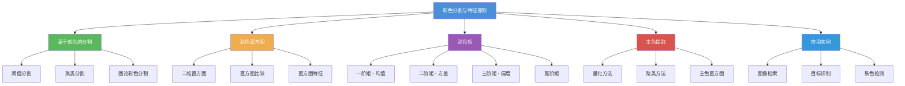

# 7.3 彩色分割与特征提取

## 一、概述

彩色分割利用颜色信息将图像划分为具有不同颜色特征的区域。彩色特征提取则是从图像中提取具有判别性的颜色描述子，用于图像检索、目标识别等任务。

### 知识体系



---

## 二、基于颜色的分割

### 2.1 基于 HSV 颜色空间的分割

在 HSV 空间中，通过指定色相范围可以有效分割特定颜色物体。

```python
import cv2
import numpy as np

def color_segment_hsv(img, lower_hsv, upper_hsv):
    """HSV 颜色分割"""
    hsv = cv2.cvtColor(img, cv2.COLOR_BGR2HSV)
    mask = cv2.inRange(hsv, lower_hsv, upper_hsv)
    result = cv2.bitwise_and(img, img, mask=mask)
    return result, mask

img = cv2.imread('color_objects.jpg')

# 红色分割
lower_red = np.array([0, 100, 100])
upper_red = np.array([10, 255, 255])
mask_red1 = cv2.inRange(cv2.cvtColor(img, cv2.COLOR_BGR2HSV),
                        lower_red, upper_red)

lower_red2 = np.array([160, 100, 100])
upper_red2 = np.array([180, 255, 255])
mask_red2 = cv2.inRange(cv2.cvtColor(img, cv2.COLOR_BGR2HSV),
                        lower_red2, upper_red2)
mask_red = cv2.bitwise_or(mask_red1, mask_red2)

result_red = cv2.bitwise_and(img, img, mask=mask_red)
cv2.imwrite('red_segment.png', result_red)
```

### 2.2 基于 RGB 距离的分割

使用欧氏距离度量像素与目标颜色的相似度：

$$
D(p, c) = \sqrt{(R_p - R_c)^2 + (G_p - G_c)^2 + (B_p - B_c)^2}
$$

```python
def color_distance_segment(img, target_rgb, threshold=50):
    """基于 RGB 距离的分割"""
    img_float = img.astype(np.float64)
    target = np.array(target_rgb, dtype=np.float64).reshape(1, 1, 3)

    dist = np.sqrt(np.sum((img_float - target) ** 2, axis=2))
    mask = (dist < threshold).astype(np.uint8) * 255

    return mask

target = [200, 50, 50]  # 目标颜色（BGR）
mask = color_distance_segment(img, target, threshold=60)
result = cv2.bitwise_and(img, img, mask=mask)
```

### 2.3 基于 Lab 色差的分割

Lab 空间的欧氏距离与人眼感知一致，更适合颜色比较：

```python
def lab_color_segment(img, target_bgr, threshold=30):
    """基于 Lab 色差的分割"""
    img_lab = cv2.cvtColor(img, cv2.COLOR_BGR2Lab)
    target_lab = cv2.cvtColor(
        np.uint8([[target_bgr]]), cv2.COLOR_BGR2Lab
    )

    diff = img_lab.astype(np.float64) - target_lab.astype(np.float64)
    distance = np.sqrt(np.sum(diff**2, axis=2))

    mask = (distance < threshold).astype(np.uint8) * 255
    return mask

target = [50, 50, 200]  # BGR
mask_lab = lab_color_segment(img, target, threshold=30)
```

### 2.4 K-Means 聚类彩色分割

K-Means 将像素聚类为 $K$ 类，每类代表一种颜色：

```python
def kmeans_color_segment(img, k=4, max_iter=100):
    """K-Means 彩色分割"""
    h, w = img.shape[:2]
    data = img.reshape((-1, 3)).astype(np.float32)

    criteria = (cv2.TERM_CRITERIA_EPS + cv2.TERM_CRITERIA_MAX_ITER,
                max_iter, 0.2)

    _, labels, centers = cv2.kmeans(
        data, k, None, criteria, 10,
        cv2.KMEANS_PP_CENTERS
    )

    centers = np.uint8(centers)
    segmented = centers[labels.flatten()].reshape(img.shape)

    # 显示每个聚类
    label_img = labels.reshape(h, w)
    clusters = []
    for i in range(k):
        cluster_mask = (label_img == i).astype(np.uint8) * 255
        cluster_img = cv2.bitwise_and(img, img, mask=cluster_mask)
        clusters.append((i, centers[i], cluster_img))

    return segmented, clusters

img = cv2.imread('flowers.jpg')
segmented, clusters = kmeans_color_segment(img, k=5)
cv2.imwrite('kmeans_segmented.png', segmented)
```

### 2.5 彩色图论分割

在 GrabCut 中使用彩色信息进行分割：

```python
def grabcut_color_segment(img, rect):
    """GrabCut 彩色分割"""
    mask = np.zeros(img.shape[:2], np.uint8)
    bgd_model = np.zeros((1, 65), np.float64)
    fgd_model = np.zeros((1, 65), np.float64)

    cv2.grabCut(img, mask, rect, bgd_model, fgd_model, 10,
                cv2.GC_INIT_WITH_RECT)

    mask2 = np.where(
        (mask == cv2.GC_FGD) | (mask == cv2.GC_PR_FGD), 255, 0
    ).astype(np.uint8)

    result = cv2.bitwise_and(img, img, mask=mask2)
    return result

rect = (100, 100, 300, 400)
result = grabcut_color_segment(img, rect)
```

---

## 三、彩色直方图

### 3.1 定义

彩色直方图是灰度直方图的推广，统计彩色图像中每种颜色出现的频率：

$$
H(c_1, c_2, \dots, c_n) = \frac{1}{N} \sum_{(x,y) \in I} \delta\left(I(x,y) - (c_1, c_2, \dots, c_n)\right)
$$

其中 $n$ 为颜色空间维度，$N$ 为像素总数。

### 3.2 彩色直方图的不变性

| 不变性 | 说明 |
|--------|------|
| 平移不变 | 直方图不受物体位置影响 |
| 旋转不变 | 直方图不受物体旋转影响 |
| 尺度不变 | 归一化后不受图像缩放影响 |
| 遮挡鲁棒 | 部分遮挡不影响主要颜色分布 |

### 3.3 OpenCV 实现

#### 一维直方图（各通道独立）

```python
import cv2
import numpy as np
import matplotlib.pyplot as plt

def color_histogram_1d(img, bins=256):
    """一维彩色直方图"""
    colors = ('b', 'g', 'r')
    histograms = {}

    for i, color in enumerate(colors):
        hist = cv2.calcHist([img], [i], None, [bins], [0, 256])
        histograms[color] = hist

    return histograms

img = cv2.imread('image.jpg')
hists = color_histogram_1d(img)

# 绘制
plt.figure(figsize=(10, 5))
for color, hist in hists.items():
    plt.plot(hist, color=color)
    plt.fill_between(range(256), hist.flatten(), alpha=0.2, color=color)
plt.title('Color Histogram')
plt.xlim([0, 256])
plt.show()
```

#### 二维直方图（HSV 空间）

```python
def color_histogram_2d(img, h_bins=30, s_bins=32):
    """HSV 二维直方图"""
    hsv = cv2.cvtColor(img, cv2.COLOR_BGR2HSV)

    hist = cv2.calcHist(
        [hsv], [0, 1], None,
        [h_bins, s_bins], [0, 180, 0, 256]
    )

    # 归一化
    hist = cv2.normalize(hist, hist, 0, 1, cv2.NORM_MINMAX)

    return hist

hist_2d = color_histogram_2d(img, h_bins=30, s_bins=32)

# 可视化
plt.figure(figsize=(8, 6))
plt.imshow(hist_2d, interpolation='nearest', aspect='auto')
plt.colorbar(label='Frequency')
plt.xlabel('Saturation')
plt.ylabel('Hue')
plt.title('2D Color Histogram (HSV)')
plt.show()
```

#### 三维直方图（RGB 空间）

```python
def color_histogram_3d(img, bins=8):
    """RGB 三维直方图"""
    hist = cv2.calcHist(
        [img], [0, 1, 2], None,
        [bins, bins, bins], [0, 256, 0, 256, 0, 256]
    )

    hist = cv2.normalize(hist, hist).flatten()
    return hist

hist_3d = color_histogram_3d(img, bins=8)
print(f'3D histogram shape: {hist_3d.shape}')
print(f'Non-zero bins: {np.count_nonzero(hist_3d)}')
```

### 3.4 直方图比较

#### 比较方法

| 方法 | 公式 | 说明 |
|------|------|------|
| 相关系数 | $d(H_1, H_2) = \frac{\sum H_1 \cdot H_2}{\sqrt{\sum H_1^2} \cdot \sqrt{\sum H_2^2}}$ | 值越大越相似 |
| 卡方距离 | $d = \sum \frac{(H_1 - H_2)^2}{H_2}$ | 值越小越相似 |
| 巴氏距离 | $d = \sqrt{1 - \sum \sqrt{H_1 \cdot H_2}}$ | 值越小越相似 |
| 交叉核 | $d = \sum \min(H_1, H_2)$ | 值越大越相似 |
| Bhattacharyya | $d = -\ln \sum \sqrt{H_1 \cdot H_2}$ | 对数巴氏距离 |

#### OpenCV 实现

```python
def compare_histograms(h1, h2, method=cv2.HISTCMP_CORREL):
    """直方图比较"""
    h1_norm = cv2.normalize(h1, h1).flatten()
    h2_norm = cv2.normalize(h2, h2).flatten()

    distance = cv2.compareHist(h1_norm, h2_norm, method)
    return distance

# 比较方法
methods = {
    'Correlation': cv2.HISTCMP_CORREL,
    'Chi-Square': cv2.HISTCMP_CHISQR,
    'Intersection': cv2.HISTCMP_INTERSECT,
    'Bhattacharyya': cv2.HISTCMP_BHATTACHARYYA,
}

img1 = cv2.imread('image1.jpg')
img2 = cv2.imread('image2.jpg')

h1 = color_histogram_3d(img1, bins=8)
h2 = color_histogram_3d(img2, bins=8)

for name, method in methods.items():
    dist = compare_histograms(h1, h2, method)
    print(f'{name}: {dist:.4f}')
```

#### 基于直方图的图像检索

```python
def build_hist_database(image_paths, bins=8):
    """构建直方图数据库"""
    database = {}
    for path in image_paths:
        img = cv2.imread(path)
        hist = color_histogram_3d(img, bins=bins)
        database[path] = hist
    return database

def retrieve_by_color(query_img, database, method=cv2.HISTCMP_CORREL, top_k=5):
    """基于颜色直方图的图像检索"""
    query_hist = color_histogram_3d(query_img)
    results = []

    for path, hist in database.items():
        dist = compare_histograms(query_hist, hist, method)
        results.append((path, dist))

    results.sort(key=lambda x: x[1], reverse=(method == cv2.HISTCMP_CORREL or
                                                 method == cv2.HISTCMP_INTERSECT))

    return results[:top_k]

# 使用示例
query = cv2.imread('query.jpg')
database = build_hist_database(glob.glob('images/*.jpg'))
top_results = retrieve_by_color(query, database, top_k=5)

for path, score in top_results:
    print(f'{path}: {score:.4f}')
```

---

## 四、彩色矩

### 4.1 定义

彩色矩（Color Moments）是从概率统计角度描述颜色分布的特征，包括均值、方差、偏度、峰度等。

### 4.2 数学定义

对于每个颜色通道 $c$，其第 $n$ 阶中心矩定义为：

$$
\mu_n^c = \frac{1}{N} \sum_{i=1}^{N} (I_i^c - \mu^c)^n
$$

其中 $\mu^c$ 为通道 $c$ 的均值：

$$
\mu^c = \frac{1}{N} \sum_{i=1}^{N} I_i^c
$$

#### 各阶矩的含义

| 阶数 | 名称 | 公式 | 含义 |
|------|------|------|------|
| 1 | 均值 | $\mu$ | 颜色的平均亮度 |
| 2 | 方差 | $\sigma^2 = \mu_2$ | 颜色的离散程度 |
| 3 | 偏度 | $\gamma_1 = \frac{\mu_3}{\sigma^3}$ | 分布的不对称性 |
| 4 | 峰度 | $\kappa = \frac{\mu_4}{\sigma^4} - 3$ | 分布的尖锐程度 |

### 4.3 彩色矩特征向量

彩色矩特征向量通常由各通道的前 3–4 阶矩组成：

$$
\mathbf{f} = [\mu_R, \sigma_R, \gamma_{1,R}, \mu_G, \sigma_G, \gamma_{1,G}, \mu_B, \sigma_B, \gamma_{1,B}]
$$

特征维度：$3 \times N$，其中 $N$ 为使用的矩的阶数。

### 4.4 Python 实现

```python
import numpy as np
import cv2
from scipy import stats

def color_moments(img, order=3, color_space='rgb'):
    """计算彩色矩特征"""
    if color_space == 'hsv':
        img = cv2.cvtColor(img, cv2.COLOR_BGR2HSV)
    elif color_space == 'lab':
        img = cv2.cvtColor(img, cv2.COLOR_BGR2Lab)
    elif color_space == 'ycrcb':
        img = cv2.cvtColor(img, cv2.COLOR_BGR2YCrCb)

    img_float = img.astype(np.float64)
    h, w, c = img.shape
    n_pixels = h * w

    moments = []
    for ch in range(c):
        channel_data = img_float[:, :, ch].flatten()

        mu = np.mean(channel_data)
        moments.append(mu)

        if order >= 2:
            variance = np.var(channel_data)
            moments.append(variance)

        if order >= 3:
            skewness = float(stats.skew(channel_data))
            moments.append(skewness)

        if order >= 4:
            kurtosis = float(stats.kurtosis(channel_data))
            moments.append(kurtosis)

    return np.array(moments)

img = cv2.imread('image.jpg')
moments = color_moments(img, order=3, color_space='hsv')
print(f'Color moments (HSV, order=3): {moments}')
print(f'Feature dimension: {len(moments)}')
```

### 4.5 彩色矩的应用

#### 图像相似度计算

```python
def color_moment_similarity(moments1, moments2):
    """基于彩色矩的相似度"""
    # 标准化
    m1_mean, m1_std = np.mean(moments1), np.std(moments1)
    m2_mean, m2_std = np.mean(moments2), np.std(moments2)

    m1_norm = (moments1 - m1_mean) / (m1_std + 1e-10)
    m2_norm = (moments2 - m2_mean) / (m2_std + 1e-10)

    # 欧氏距离
    distance = np.sqrt(np.sum((m1_norm - m2_norm) ** 2))
    similarity = 1.0 / (1.0 + distance)

    return similarity

img1 = cv2.imread('img1.jpg')
img2 = cv2.imread('img2.jpg')

m1 = color_moments(img1, order=4)
m2 = color_moments(img2, order=4)
sim = color_moment_similarity(m1, m2)
print(f'Color moment similarity: {sim:.4f}')
```

#### 区域颜色矩

```python
def region_color_moments(img, mask, order=3):
    """区域彩色矩"""
    masked = cv2.bitwise_and(img, img, mask=mask)

    # 获取区域内的像素
    pixels = img[mask > 0].astype(np.float64)

    if len(pixels) == 0:
        return np.zeros(order * 3)

    moments = []
    for ch in range(3):
        channel_data = pixels[:, ch]

        mu = np.mean(channel_data)
        moments.append(mu)

        if order >= 2:
            moments.append(np.var(channel_data))

        if order >= 3:
            moments.append(float(stats.skew(channel_data)))

    return np.array(moments)
```

---

## 五、主色提取

### 5.1 定义

主色（Dominant Color）是图像中出现频率最高的颜色，用于描述图像的整体色彩特征。

### 5.2 量化方法

#### 颜色量化

将连续的 RGB 颜色空间量化为有限的离散颜色：

$$
\text{index} = \lfloor R / Q_R \rfloor \times N_G \times N_B + \lfloor G / Q_G \rfloor \times N_B + \lfloor B / Q_B \rfloor
$$

其中 $Q_R, Q_G, Q_B$ 为量化步长，$N_G, N_B$ 为量化级数。

```python
def color_quantization(img, levels=4):
    """颜色量化"""
    img_float = img.astype(np.float64)
    step = 256.0 / levels

    quantized = np.floor(img_float / step).astype(np.uint8)
    quantized = np.clip(quantized, 0, levels - 1)

    return quantized

quantized = color_quantization(img, levels=4)
print(f'Quantized colors: {levels**3}')
```

### 5.3 聚类方法

#### K-Means 提取主色

```python
def dominant_colors_kmeans(img, k=5):
    """K-Means 提取主色"""
    data = img.reshape((-1, 3)).astype(np.float32)

    criteria = (cv2.TERM_CRITERIA_EPS + cv2.TERM_CRITERIA_MAX_ITER,
                100, 0.2)
    _, labels, centers = cv2.kmeans(
        data, k, None, criteria, 10, cv2.KMEANS_PP_CENTERS
    )

    centers = np.uint8(centers)

    # 计算每个簇的像素数
    unique_labels, counts = np.unique(labels, return_counts=True)
    percentages = counts / len(labels) * 100

    # 按频率排序
    sorted_idx = np.argsort(percentages)[::-1]

    dominant_colors = []
    for idx in sorted_idx:
        color = centers[unique_labels[idx]]
        percentage = percentages[idx]
        dominant_colors.append((color, percentage))

    return dominant_colors

img = cv2.imread('painting.jpg')
dominant = dominant_colors_kmeans(img, k=5)

for i, (color, pct) in enumerate(dominant):
    print(f'Color {i+1}: BGR={color}, Percentage={pct:.1f}%')
```

#### 主色可视化

```python
def visualize_dominant_colors(dominant_colors, bar_height=50):
    """可视化主色"""
    n = len(dominant_colors)
    width = 600
    height = bar_height * n

    bar = np.zeros((height, width, 3), dtype=np.uint8)
    bar[:, :] = [240, 240, 240]

    x_start = 10
    for i, (color, pct) in enumerate(dominant_colors):
        y = i * bar_height
        bar_width = int((width - 100) * pct / 100)

        # 颜色条
        bar[y+5:y+bar_height-5, x_start:x_start+bar_width] = color

        # 百分比文字
        text_x = x_start + bar_width + 10
        text_y = y + bar_height // 2 + 5
        cv2.putText(bar, f'{pct:.1f}%', (text_x, text_y),
                    cv2.FONT_HERSHEY_SIMPLEX, 0.5, (0, 0, 0), 1)

    return bar

color_bar = visualize_dominant_colors(dominant)
cv2.imwrite('dominant_colors.png', color_bar)
```

### 5.4 主色直方图

主色直方图记录每种主色的出现频率：

```python
def dominant_color_histogram(img, k=8):
    """主色直方图"""
    dominant = dominant_colors_kmeans(img, k=k)

    hist = np.zeros(k)
    for i, (color, pct) in enumerate(dominant):
        hist[i] = pct / 100.0

    return hist, [c for c, _ in dominant]

def compare_dominant_colors(h1, h2):
    """比较主色直方图"""
    corr = np.corrcoef(h1, h2)[0, 1]
    return corr
```

---

## 六、应用实例

### 6.1 肤色检测

#### RGB 空间肤色检测

```python
def skin_detection_rgb(img):
    """RGB 肤色检测"""
    r, g, b = cv2.split(img)

    # 规则1: R > 95, G > 40, B > 20
    rule1 = (r > 95) & (g > 40) & (b > 20)

    # 规则2: max(R,G,B) - min(R,G,B) > 15
    rgb_max = np.max(img, axis=2)
    rgb_min = np.min(img, axis=2)
    rule2 = (rgb_max.astype(np.int32) - rgb_min.astype(np.int32)) > 15

    # 规则3: |R-G| > 15, R > G, R > B
    rule3 = (np.abs(r.astype(np.int32) - g.astype(np.int32)) > 15) & \
            (r > g) & (r > b)

    mask = rule1 & rule2 & rule3
    return mask.astype(np.uint8) * 255
```

#### YCbCr 空间肤色检测

```python
def skin_detection_ycbcr(img):
    """YCbCr 肤色检测"""
    ycrcb = cv2.cvtColor(img, cv2.COLOR_BGR2YCrCb)
    y, cr, cb = cv2.split(ycrcb)

    # 肤色在 YCbCr 空间中的范围
    mask = (cr >= 133) & (cr <= 173) & (cb >= 77) & (cb <= 127)

    return mask.astype(np.uint8) * 255
```

#### HSV 空间肤色检测

```python
def skin_detection_hsv(img):
    """HSV 肤色检测"""
    hsv = cv2.cvtColor(img, cv2.COLOR_BGR2HSV)
    h, s, v = cv2.split(hsv)

    # 肤色 HSV 范围
    mask = (h >= 0) & (h <= 50) & (s >= 30) & (s <= 150) & (v >= 60) & (v <= 255)

    return mask.astype(np.uint8) * 255

img = cv2.imread('face.jpg')
skin_mask = skin_detection_ycbcr(img)
skin_result = cv2.bitwise_and(img, img, mask=skin_mask)
cv2.imwrite('skin_detection.png', skin_result)
```

### 6.2 基于颜色的目标检测

#### 物体颜色检测

```python
def detect_colored_objects(img, color_ranges):
    """检测多种颜色的物体"""
    hsv = cv2.cvtColor(img, cv2.COLOR_BGR2HSV)
    results = {}

    for color_name, (lower, upper) in color_ranges.items():
        mask = cv2.inRange(hsv, lower, upper)

        # 形态学处理
        kernel = np.ones((5, 5), np.uint8)
        mask = cv2.morphologyEx(mask, cv2.MORPH_OPEN, kernel)
        mask = cv2.morphologyEx(mask, cv2.MORPH_CLOSE, kernel)

        # 查找轮廓
        contours, _ = cv2.findContours(
            mask, cv2.RETR_EXTERNAL, cv2.CHAIN_APPROX_SIMPLE
        )

        # 过滤小轮廓
        valid_contours = [c for c in contours if cv2.contourArea(c) > 500]

        results[color_name] = {
            'mask': mask,
            'contours': valid_contours,
            'count': len(valid_contours)
        }

    return results

color_ranges = {
    'red': (np.array([0, 100, 100]), np.array([10, 255, 255])),
    'blue': (np.array([100, 100, 100]), np.array([130, 255, 255])),
    'green': (np.array([35, 100, 100]), np.array([80, 255, 255])),
    'yellow': (np.array([25, 100, 100]), np.array([35, 255, 255])),
}

img = cv2.imread('objects.jpg')
detections = detect_colored_objects(img, color_ranges)

for color_name, result in detections.items():
    print(f'{color_name}: {result["count"]} objects detected')
```

### 6.3 基于颜色特征的图像分类

```python
def color_based_classifier(train_images, train_labels, test_image, k=5):
    """基于颜色特征的 KNN 分类"""
    # 提取特征
    train_features = []
    for img in train_images:
        hist = color_histogram_3d(img, bins=8)
        moments = color_moments(img, order=3)
        feature = np.concatenate([hist, moments])
        train_features.append(feature)

    # 测试图像特征
    test_hist = color_histogram_3d(test_image, bins=8)
    test_moments = color_moments(test_image, order=3)
    test_feature = np.concatenate([test_hist, test_moments])

    # KNN 分类
    distances = []
    for i, train_feat in enumerate(train_features):
        dist = np.sqrt(np.sum((test_feature - train_feat) ** 2))
        distances.append((dist, train_labels[i]))

    distances.sort(key=lambda x: x[0])
    neighbors = distances[:k]

    # 投票
    from collections import Counter
    labels = [label for _, label in neighbors]
    prediction = Counter(labels).most_common(1)[0][0]

    return prediction

# 使用示例
train_imgs = [cv2.imread(f'train_{i}.jpg') for i in range(100)]
train_labels = ['cat', 'dog', 'bird', ...]  # 对应标签
test_img = cv2.imread('test.jpg')
predicted = color_based_classifier(train_imgs, train_labels, test_img)
print(f'Predicted: {predicted}')
```

### 6.4 彩色图像检索系统

```python
class ColorImageRetriever:
    """基于颜色特征的图像检索系统"""

    def __init__(self, bins=8, k=5):
        self.bins = bins
        self.k = k
        self.database = {}
        self.features = {}

    def add_image(self, path, label=None):
        """添加图像到数据库"""
        img = cv2.imread(path)
        if img is None:
            return

        # 提取特征
        hist = color_histogram_3d(img, self.bins)
        moments = color_moments(img, order=3)

        # 特征融合
        feature = np.concatenate([hist * 0.7, moments / np.max(np.abs(moments) + 1e-10) * 0.3])

        self.database[path] = img
        self.features[path] = feature

    def build_database(self, paths):
        """批量构建数据库"""
        for path in paths:
            self.add_image(path)

    def query(self, query_img, top_k=5):
        """查询相似图像"""
        query_hist = color_histogram_3d(query_img, self.bins)
        query_moments = color_moments(query_img, order=3)
        query_feature = np.concatenate([
            query_hist * 0.7,
            query_moments / np.max(np.abs(query_moments) + 1e-10) * 0.3
        ])

        # 计算距离
        results = []
        for path, feature in self.features.items():
            dist = np.sqrt(np.sum((query_feature - feature) ** 2))
            results.append((path, dist))

        results.sort(key=lambda x: x[1])
        return results[:top_k]

retriever = ColorImageRetriever(bins=8, k=5)
retriever.build_database(glob.glob('dataset/*.jpg'))

query = cv2.imread('query.jpg')
results = retriever.query(query, top_k=5)

for path, dist in results:
    print(f'{path}: distance={dist:.4f}')
    img = cv2.imread(path)
    cv2.imshow('result', img)
    cv2.waitKey(500)
```

---

## 七、特征选择与优化

### 7.1 特征对比

| 特征 | 维度 | 不变性 | 鉴别力 | 计算量 |
|------|------|--------|--------|--------|
| 一维直方图 | 256×3 | 平移/旋转 | 中 | 低 |
| 二维直方图 | 30×32 | 平移/旋转 | 高 | 中 |
| 三维直方图 | 8³=512 | 平移/旋转 | 很高 | 高 |
| 彩色矩 (3阶) | 9 | 平移/旋转 | 中高 | 低 |
| 主色直方图 | 8 | 平移/旋转 | 高 | 中 |

### 7.2 特征融合

融合多种颜色特征可以提高识别准确率：

$$
\mathbf{f}_{\text{fused}} = [\alpha \cdot \mathbf{f}_{\text{hist}}, \beta \cdot \mathbf{f}_{\text{moments}}, \gamma \cdot \mathbf{f}_{\text{dominant}}]
$$

其中 $\alpha + \beta + \gamma = 1$。

```python
def fuse_color_features(img, weights=(0.4, 0.3, 0.3)):
    """融合彩色特征"""
    w_hist, w_moments, w_dominant = weights

    hist = color_histogram_3d(img, bins=8)
    hist_norm = hist / (np.max(hist) + 1e-10)

    moments = color_moments(img, order=3)
    moments_norm = moments / (np.max(np.abs(moments)) + 1e-10)

    dominant = dominant_color_histogram(img, k=8)[0]

    fused = np.concatenate([
        w_hist * hist_norm,
        w_moments * moments_norm,
        w_dominant * dominant
    ])

    return fused
```

### 7.3 颜色空间选择

不同颜色空间适合不同任务：

| 任务 | 推荐空间 | 原因 |
|------|----------|------|
| 颜色直方图 | HSV/Lab | 色度和亮度分离 |
| 彩色矩 | HSV/YCrCb | 各通道独立性好 |
| 肤色检测 | YCbCr/HSV | 肤色分布集中 |
| 主色提取 | RGB/HSV | 直观表示颜色 |
| 颜色相似性 | Lab | 感知均匀 |

---

## 八、常见问题

### Q1：彩色直方图与灰度直方图的关系是什么？
灰度直方图是彩色直方图的特例。当图像为灰度图时，彩色直方图退化为一维灰度直方图。彩色直方图通过引入色彩维度，保留了灰度直方图丢失的颜色信息。

### Q2：彩色矩为什么使用低阶矩？
高阶矩（>4阶）对噪声敏感，且计算不稳定。实际应用中通常使用前 3–4 阶矩已经能充分描述颜色分布。高阶矩的增益不大。

### Q3：主色提取中 K-Means 的 K 值如何选择？
- 对于已知场景（如国旗），可以预设 K 值
- 一般场景：K=3~8 通常足够
- 使用肘部法则（Elbow Method）确定最优 K：计算不同 K 值下的簇内误差平方和（SSE），选择拐点处的 K

### Q4：为什么在 HSV 空间中做颜色分割比 RGB 空间好？
- HSV 的 H（色相）通道直接编码颜色，与亮度和饱和度独立
- 在 RGB 空间中，一个像素的颜色需要同时考虑 R、G、B 三个值的比例
- HSV 中指定一个 H 范围即可分割特定颜色，简单且鲁棒

### Q5：彩色特征的维度如何降低？
**方法一**：减少直方图 bin 数（如从 8³=512 降到 4³=64）
**方法二**：使用 PCA 降维
**方法三**：特征选择（去掉方差为零或低的特征维）

```python
from sklearn.decomposition import PCA

def reduce_feature_dimensions(features, target_dim=64):
    """PCA 降维"""
    pca = PCA(n_components=target_dim)
    reduced = pca.fit_transform(features)
    return reduced, pca

features = np.array([fuse_color_features(img) for img in images])
reduced_features, pca_model = reduce_feature_dimensions(features, target_dim=64)
print(f'Original dim: {features.shape[1]}')
print(f'Reduced dim: {reduced_features.shape[1]}')
print(f'Explained variance: {sum(pca_model.explained_variance_ratio_):.3f}')
```