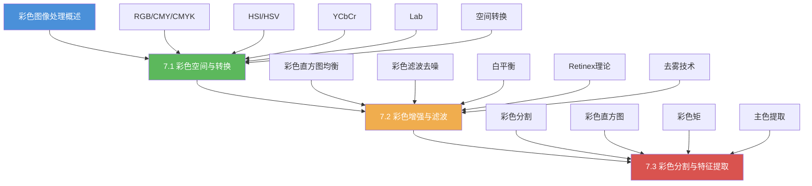

# 第7章 彩色图像处理 — 导航总览

## 一、章节学习路线图

## 二、核心知识结构

| 知识点 | 重要程度 | 考查频率 | 关联章节 |
|--------|:--------:|:--------:|----------|
| RGB/HSI/HSV 空间转换 | ★★★★★ | 极高 | 第3章 像素运算 |
| Histogram Equalization for Color | ★★★★☆ | 高 | 第3章 直方图处理 |
| Retinex 理论 | ★★★★☆ | 高 | 第5章 图像增强 |
| 彩色直方图特征 | ★★★★☆ | 高 | 第6章 图像分割 |
| 白平衡 | ★★★☆☆ | 中 | 光照模型 |
| 去雾算法（DCP） | ★★★★☆ | 高 | 暗通道先验 |
| GrabCut 彩色分割 | ★★★☆☆ | 中 | 6.3 图论分割 |

## 三、章节导航链接

### 7.1 彩色空间与转换
- [[7.1 彩色空间与转换#RGB 空间|RGB 空间]]
- [[7.1 彩色空间与转换#CMY/CMYK 空间|CMY/CMYK 空间]]
- [[7.1 彩色空间与转换#HSI/HSV 空间|HSI/HSV 空间]]
- [[7.1 彩色空间与转换#YCbCr 空间|YCbCr 空间]]
- [[7.1 彩色空间与转换#Lab 空间|Lab 空间]]
- [[7.1 彩色空间与转换#空间转换实现|空间转换 OpenCV 实现]]

### 7.2 彩色增强与滤波
- [[7.2 彩色增强与滤波#彩色直方图均衡|彩色直方图均衡]]
- [[7.2 彩色增强与滤波#彩色滤波与去噪|彩色滤波与去噪]]
- [[7.2 彩色增强与滤波#白平衡|白平衡]]
- [[7.2 彩色增强与滤波#Retinex 理论|Retinex 理论]]
- [[7.2 彩色增强与滤波#去雾技术|去雾技术]]

### 7.3 彩色分割与特征提取
- [[7.3 彩色分割与特征提取#基于彩色的分割|基于彩色的分割]]
- [[7.3 彩色分割与特征提取#彩色直方图|彩色直方图]]
- [[7.3 彩色分割与特征提取#彩色矩|彩色矩]]
- [[7.3 彩色分割与特征提取#主色提取|主色提取]]

## 四、考研核心考点速记

### 高频考点
1. **RGB 与 HSI 的转换公式**：必须能写出转换矩阵和反变换
2. **Retinex 理论的核心思想**：图像 = 照度 × 反射率，估计照度后分离反射率
3. **直方图均衡化在彩色图像上的应用**：为什么不能直接对 RGB 三通道分别均衡
4. **彩色直方图 vs 灰度直方图**：彩色直方图保留色度信息，具有旋转不变性
5. **暗通道先验（DCP）去雾**：核心观察和透射率公式

### 易混淆辨析
| 概念 | 区别 |
|------|------|
| RGB vs HSI | RGB 适合显示，HSI 适合处理和分割 |
| HSV vs HSB | 基本相同，只是明度/亮度的计算方式不同 |
| YCbCr vs Lab | YCbCr 是视频压缩标准，Lab 是感知均匀空间 |
| 直方图均衡 vs Retinex | 前者基于统计，后者基于视网膜视觉模型 |
| 白平衡 vs 去雾 | 前者校正色偏，后者去除大气散射影响 |

## 五、自测题清单

### 基础题
1. 为什么在图像处理中常用 HSI 空间而不是 RGB 空间？
2. 简述 Retinex 理论的基本原理，并说明 SSR 和 MSR 的区别。
3. RGB 直方图均衡化能否直接对三个通道分别处理？为什么？
4. 彩色直方图的定义是什么？它具有哪些不变性？

### 应用题
5. 对一幅偏色的照片，如何用白平衡算法校正？写出步骤。
6. 设计一个基于 Lab 空间的肤色检测算法。
7. 简述暗通道先验去雾算法的完整流程。
8. 如何用彩色直方图特征进行图像检索？

### 计算题
9. 给出 RGB 到 HSI 的转换公式，并对 $(R=200, G=100, B=50)$ 计算 HSI 值。
10. 对一幅 RGB 图像，说明各通道直方图均衡化后可能出现什么问题，以及如何在 HSI 空间中正确实现彩色直方图均衡化。

## 六、学习建议

1. **理论先行**：阅读冈萨雷斯教材第6章彩色图像处理
2. **动手验证**：用 OpenCV 实现各种空间转换，对比转换效果
3. **算法实现**：手写 Retinex、白平衡、DCP 去雾算法
4. **对比分析**：在不同空间上对同一图像进行增强，对比效果
5. **综合实战**：实现一个基于彩色特征的图像检索系统

## 七、公式速查表

| 转换 | 核心公式 |
|------|----------|
| RGB → HSI | $H = \theta$ 或 $360^\circ - \theta$，$S = 1 - \frac{3\min(R,G,B)}{R+G+B}$，$I = \frac{R+G+B}{3}$ |
| RGB → YCbCr | $\begin{bmatrix}Y\\Cb\\Cr\end{bmatrix} = \begin{bmatrix}0.299&0.587&0.114\\-0.169&-0.331&0.500\\0.500&-0.419&-0.081\end{bmatrix}\begin{bmatrix}R\\G\\B\end{bmatrix}$ |
| RGB → Lab | 通过 XYZ 空间间接转换 |
| Retinex | $\log R = \log I - \log L$ |
| DCP 透射率 | $t(x) = 1 - \omega \cdot \min_{y \in \Omega(x)}\left(\min_{c \in \{r,g,b\}} \frac{I^c(y)}{A^c}\right)$ |