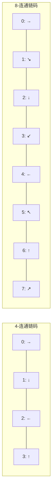
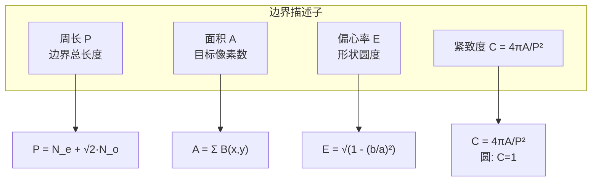
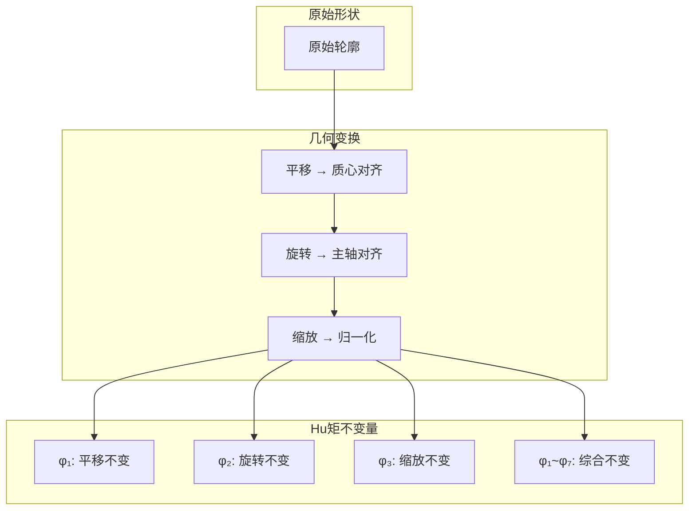
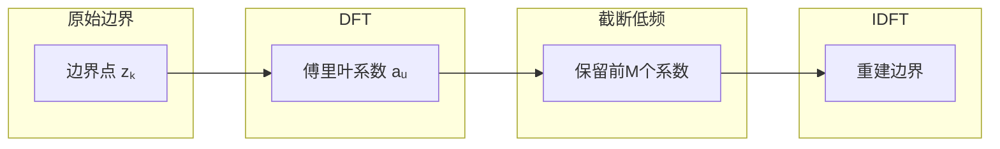
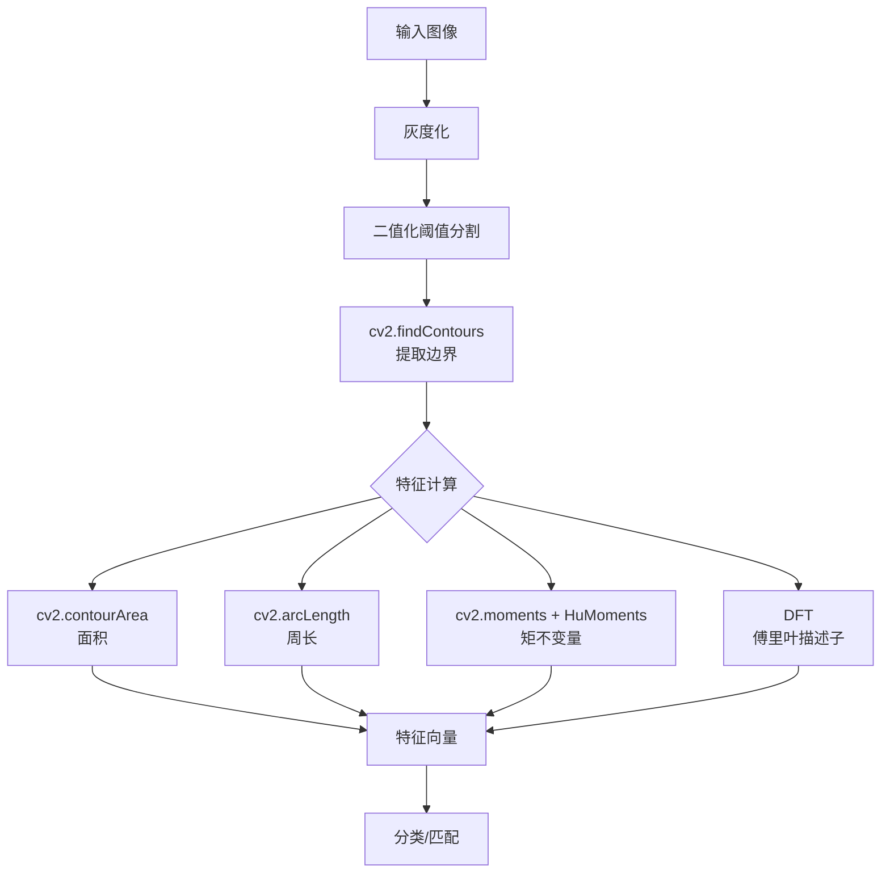

# 8.1 形状与轮廓特征

## 📋 本节大纲

- [链码表示](#链码表示)
- [边界描述子](#边界描述子)
- [矩不变量 (Hu矩)](#矩不变量-hu矩)
- [傅里叶描述子](#傅里叶描述子)
- [OpenCV 实战](#opencv-实战)
- [本节小结](#本节小结)

---

## 链码表示

### Freeman链码

Freeman链码是一种经典的边界表示方法，通过编码边界点之间的方向来描述形状。

### 方向编码

在4-连通或8-连通网格中，对相邻边界点的方向进行编码：



### 归一化链码

链码依赖起点位置。为实现平移不变性，引入**归一化链码**：

1. 选择链码序列中最小的十进制数作为起点
2. 对于闭合边界，链码的起点可以任意选择

```python
import numpy as np

def freeman_chain_code(binary_image):
    """
    从二值图像生成 Freeman 链码
    Args:
        binary_image: 二值图像 (H, W), 目标像素为 255
    Returns:
        chain: Freeman 链码列表
    """
    from skimage.measure import find_contours
    contours = find_contours(binary_image, 0.5)

    if len(contours) == 0:
        return []

    contour = contours[0]
    chain = []

    directions = [(1, 0), (1, 1), (0, 1), (-1, 1),
                  (-1, 0), (-1, -1), (0, -1), (1, -1)]

    for i in range(len(contour) - 1):
        dx = contour[i + 1][0] - contour[i][0]
        dy = contour[i + 1][1] - contour[i][1]
        for code, (ddx, ddy) in enumerate(directions):
            if abs(dx - ddx) < 1e-6 and abs(dy - ddy) < 1e-6:
                chain.append(code)
                break

    return chain


def normalize_chain_code(chain):
    """归一化链码：旋转起点使最小数值在前"""
    if not chain:
        return chain
    n = len(chain)
    min_idx = 0
    min_val = float('inf')
    for i in range(n):
        val = sum(chain[j] * (8 ** (n - 1 - j)) for j in range(n))
        if val < min_val:
            min_val = val
            min_idx = i
    return chain[min_idx:] + chain[:min_idx]
```

---

## 边界描述子

### 周长 (Perimeter)

周长是边界点之间距离的总和。对于8-连通边界：

$$
P = N_e + \sqrt{2} \cdot N_o
$$

其中 $N_e$ 为偶数链码数量（水平/垂直步长），$N_o$ 为奇数链码数量（对角步长）。

### 面积 (Area)

面积可通过边界像素数或像素计数估算：

$$
A = \sum_{x=0}^{M-1} \sum_{y=0}^{N-1} B(x,y)
$$

其中 $B(x,y)$ 为二值目标掩膜。

### 偏心率 (Eccentricity)

偏心率描述形状偏离圆形的程度：

$$
\text{Eccentricity} = \sqrt{1 - \left(\frac{b}{a}\right)^2}
$$

其中 $a$ 和 $b$ 分别为长半轴和短半轴。等效地，可使用二阶矩计算：

$$
\text{Eccentricity} = \frac{(\eta_{20} - \eta_{02})^2 + 4\eta_{11}^2}{(\eta_{20} + \eta_{02})^2}
$$

### 边界描述子汇总



---

## 矩不变量 (Hu矩)

### 矩的定义

**几何矩 (Geometric Moment)**：

$$
m_{pq} = \sum_{x=0}^{M-1} \sum_{y=0}^{N-1} x^p y^q f(x,y)
$$

**中心矩 (Central Moment)**：

$$
\mu_{pq} = \sum_{x=0}^{M-1} \sum_{y=0}^{N-1} (x - \bar{x})^p (y - \bar{y})^q f(x,y)
$$

其中 $\bar{x} = m_{10}/m_{00}$，$\bar{y} = m_{01}/m_{00}$ 为质心坐标。

**归一化中心矩**：

$$
\eta_{pq} = \frac{\mu_{pq}}{m_{00}^{(p+q)/2 + 1}}
$$

### Hu矩的7个不变量

Hu (1962) 提出了7个不变矩，对**平移、旋转、缩放**具有不变性：

$$
\begin{aligned}
\phi_1 &= \eta_{20} + \eta_{02} \\
\phi_2 &= (\eta_{20} - \eta_{02})^2 + 4\eta_{11}^2 \\
\phi_3 &= (\eta_{30} - 3\eta_{12})^2 + (3\eta_{21} - \eta_{03})^2 \\
\phi_4 &= (\eta_{30} + \eta_{12})^2 + (\eta_{21} + \eta_{03})^2 \\
\phi_5 &= (\eta_{30} - 3\eta_{12})(\eta_{30} + \eta_{12})[(\eta_{30} + \eta_{12})^2 - 3(\eta_{21} + \eta_{03})^2] \\
&\quad + (3\eta_{21} - \eta_{03})(\eta_{21} + \eta_{03})[3(\eta_{30} + \eta_{12})^2 - (\eta_{21} + \eta_{03})^2] \\
\phi_6 &= (\eta_{20} - \eta_{02})[(\eta_{30} + \eta_{12})^2 - (\eta_{21} + \eta_{03})^2] \\
&\quad + 4\eta_{11}(\eta_{30} + \eta_{12})(\eta_{21} + \eta_{03}) \\
\phi_7 &= (3\eta_{21} - \eta_{03})(\eta_{30} + \eta_{12})[(\eta_{30} + \eta_{12})^2 - 3(\eta_{21} + \eta_{03})^2] \\
&\quad - (\eta_{30} - 3\eta_{12})(\eta_{21} + \eta_{03})[3(\eta_{30} + \eta_{12})^2 - (\eta_{21} + \eta_{03})^2]
\end{aligned}
$$

### 不变性图示



### Hu矩的实现

```python
import cv2
import numpy as np

def compute_hu_moments(binary_image):
    """
    计算 Hu 矩不变量
    Args:
        binary_image: 二值图像 (uint8, 单通道)
    Returns:
        hu_moments: 7个 Hu 矩 (log变换后)
    """
    moments = cv2.moments(binary_image)
    hu_moments = cv2.HuMoments(moments).flatten()

    log_hu = -np.sign(hu_moments) * np.log10(np.abs(hu_moments) + 1e-10)
    return log_hu


def match_shapes_hu(image1, image2, threshold=0.9):
    """
    使用 Hu 矩进行形状匹配
    Args:
        image1, image2: 待匹配的二值图像
        threshold: 相似度阈值
    Returns:
        similarity: 相似度 (0~1, 越大越相似)
    """
    hu1 = compute_hu_moments(image1)
    hu2 = compute_hu_moments(image2)

    diff = np.abs(hu1 - hu2)
    max_diff = np.max(np.abs(hu1)) + np.max(np.abs(hu2)) + 1e-10
    similarity = 1.0 - np.mean(diff) / max_diff

    return similarity
```

---

## 傅里叶描述子

### 基本原理

将边界表示为**复数序列**，然后对其进行离散傅里叶变换（DFT）。设边界点为 $(x_k, y_k)$：

$$
z_k = x_k + j \cdot y_k, \quad k = 0, 1, \ldots, N-1
$$

$$
a_u = \frac{1}{N} \sum_{k=0}^{N-1} z_k \cdot e^{-j2\pi uk/N}
$$

### 傅里叶描述子的不变性

| 变换类型 | 对描述子的影响 | 不变性处理 |
|---------|--------------|-----------|
| 平移 | $a_0$ 改变 | 丢弃 $a_0$ |
| 旋转 | 所有系数乘 $e^{j\theta}$ | 使用系数的幅度谱 |
| 缩放 | 所有系数乘常数 | 对非零系数归一化 |
| 起点变换 | 相位改变 | 使用直流系数比值 |

### 傅里叶描述子的重建



### 傅里叶描述子实现

```python
import numpy as np

def fourier_descriptor(binary_image, num_coeffs=32):
    """
    计算傅里叶描述子
    Args:
        binary_image: 二值图像
        num_coeffs: 保留的低频系数数量
    Returns:
        descriptor: 归一化的傅里叶描述子
    """
    contours, _ = cv2.findContours(
        binary_image, cv2.RETR_EXTERNAL, cv2.CHAIN_APPROX_NONE
    )
    contour = contours[0].squeeze()

    complex_sequence = contour[:, 0].astype(float) + \
                       1j * contour[:, 1].astype(float)

    spectrum = np.fft.fft(complex_sequence)

    descriptor = spectrum[1:num_coeffs + 1]

    magnitude = np.abs(descriptor)
    descriptor_normalized = descriptor / (magnitude[0] + 1e-10)

    return descriptor_normalized


def reconstruct_from_descriptor(descriptor, num_points=128):
    """
    从傅里叶描述子重建边界
    Args:
        descriptor: 傅里叶描述子 (不含a₀)
        num_points: 重建点数
    Returns:
        points: 重建的边界点
    """
    N = num_points
    full_spectrum = np.zeros(N, dtype=complex)
    full_spectrum[1:len(descriptor) + 1] = descriptor
    full_spectrum[-len(descriptor):] = np.conj(descriptor[::-1])

    reconstructed = np.fft.ifft(full_spectrum)
    points = np.column_stack([reconstructed.real, reconstructed.imag])

    return points
```

---

## OpenCV 实战

### 轮廓检测与属性计算

```python
import cv2
import numpy as np
import matplotlib.pyplot as plt

def analyze_contours(image_path):
    """
    完整的轮廓分析流程
    """
    image = cv2.imread(image_path)
    gray = cv2.cvtColor(image, cv2.COLOR_BGR2GRAY)

    _, binary = cv2.threshold(
        gray, 127, 255, cv2.THRESH_BINARY
    )

    contours, hierarchy = cv2.findContours(
        binary, cv2.RETR_EXTERNAL, cv2.CHAIN_APPROX_SIMPLE
    )

    results = []
    for i, contour in enumerate(contours):
        area = cv2.contourArea(contour)
        perimeter = cv2.arcLength(contour, closed=True)
        x, y, w, h = cv2.boundingRect(contour)
        aspect_ratio = float(w) / h if h > 0 else 0

        hull = cv2.convexHull(contour)
        hull_area = cv2.contourArea(hull)
        solidity = float(area) / hull_area if hull_area > 0 else 0

        moments = cv2.moments(contour)
        hu_moments = cv2.HuMoments(moments).flatten()

        log_hu = -np.sign(hu_moments) * np.log10(
            np.abs(hu_moments) + 1e-10
        )

        results.append({
            'index': i,
            'area': area,
            'perimeter': perimeter,
            'aspect_ratio': aspect_ratio,
            'solidity': solidity,
            'hu_moments': log_hu
        })

    return results, contours


def draw_contours_analysis(image, contours, results):
    """
    在图像上绘制分析结果
    """
    output = image.copy()
    for i, contour in enumerate(contours):
        x, y, w, h = cv2.boundingRect(contour)
        cv2.rectangle(output, (x, y), (x + w, y + h), (0, 255, 0), 2)
        cv2.putText(
            output, f"#{i}: S={results[i]['solidity']:.2f}",
            (x, y - 5), cv2.FONT_HERSHEY_SIMPLEX,
            0.5, (0, 0, 255), 1
        )
    return output
```

### 形状匹配示例

```python
def shape_matching_demo():
    """
    形状匹配完整示例
    """
    img1 = np.zeros((200, 200), dtype=np.uint8)
    cv2.rectangle(img1, (30, 30), (170, 170), 255, -1)

    img2 = np.zeros((200, 200), dtype=np.uint8)
    cv2.circle(img2, (100, 100), 70, 255, -1)

    img3 = np.zeros((200, 200), dtype=np.uint8)
    triangle = np.array([[100, 30], [170, 170], [30, 170]], dtype=np.int32)
    cv2.fillPoly(img3, [triangle], 255)

    shapes = [
        ('矩形', img1),
        ('圆形', img2),
        ('三角形', img3)
    ]

    for i, (name_a, img_a) in enumerate(shapes):
        for j, (name_b, img_b) in enumerate(shapes):
            if i >= j:
                continue
            sim = match_shapes_hu(img_a, img_b)
            print(f"{name_a} vs {name_b}: 相似度 = {sim:.4f}")

    results = []
    for name, img in shapes:
        r, c = cv2.connectedComponents(img)
        results.append((name, r))

    return shapes
```

### 完整特征提取管线



---

## 本节小结

### 知识要点

1. **链码**：用方向编码描述边界，归一化后具有平移不变性
2. **边界描述子**：周长、面积、偏心率、紧致度
3. **Hu矩**：7个由归一化中心矩组合的不变量，具有平移/旋转/缩放不变性
4. **傅里叶描述子**：对边界复数序列做DFT，低频系数描述形状，高频描述细节

### 公式汇总

| 公式 | 表达式 | 含义 |
|------|--------|------|
| 几何矩 | $m_{pq} = \sum x^p y^q f(x,y)$ | 形状分布统计量 |
| 中心矩 | $\mu_{pq} = \sum (x-\bar{x})^p (y-\bar{y})^q f(x,y)$ | 平移不变 |
| 归一化矩 | $\eta_{pq} = \mu_{pq} / m_{00}^{(p+q)/2+1}$ | 缩放不变 |
| 傅里叶系数 | $a_u = \frac{1}{N}\sum z_k e^{-j2\pi uk/N}$ | 边界频谱 |

### 课后练习

1. 对一幅二值图像提取归一化链码，验证其对平移的不变性
2. 实现基于Hu矩的形状检索系统，对100个形状计算特征并匹配
3. 使用傅里叶描述子实现字符识别，比较不同截断系数M对重建质量的影响
4. 编程实现：对同一图像的旋转、缩放版本，验证Hu矩的不变性