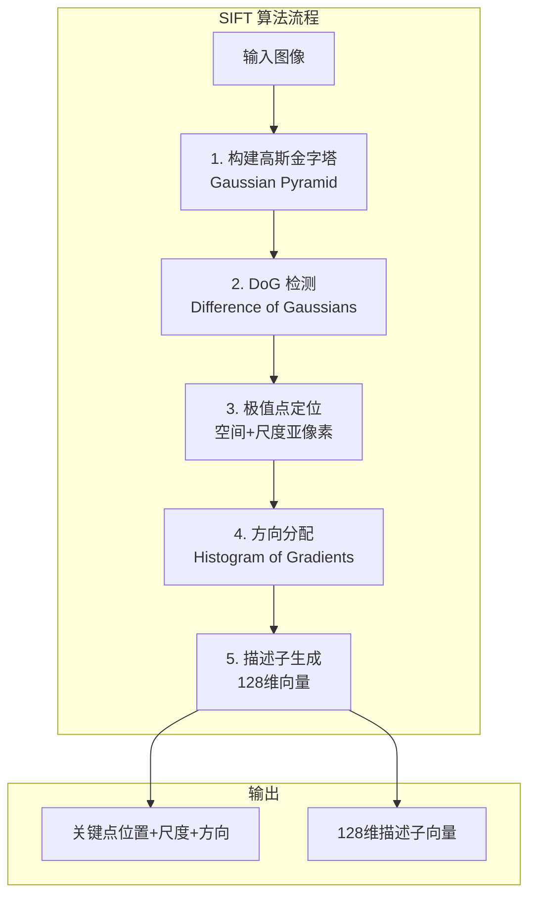
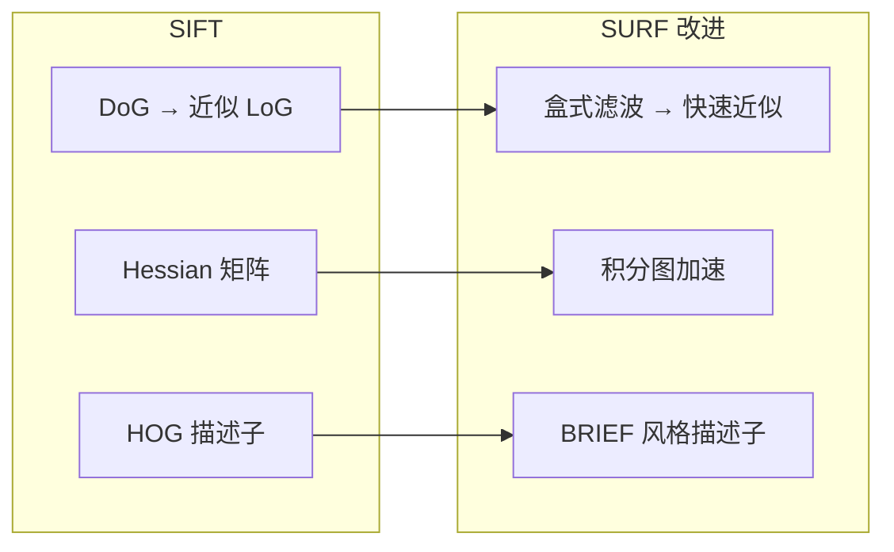
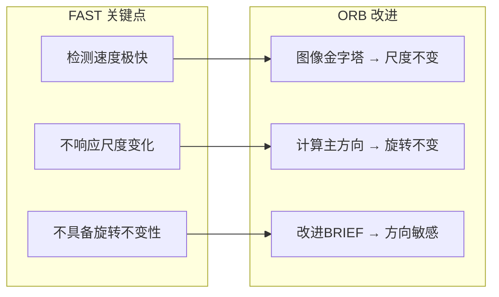
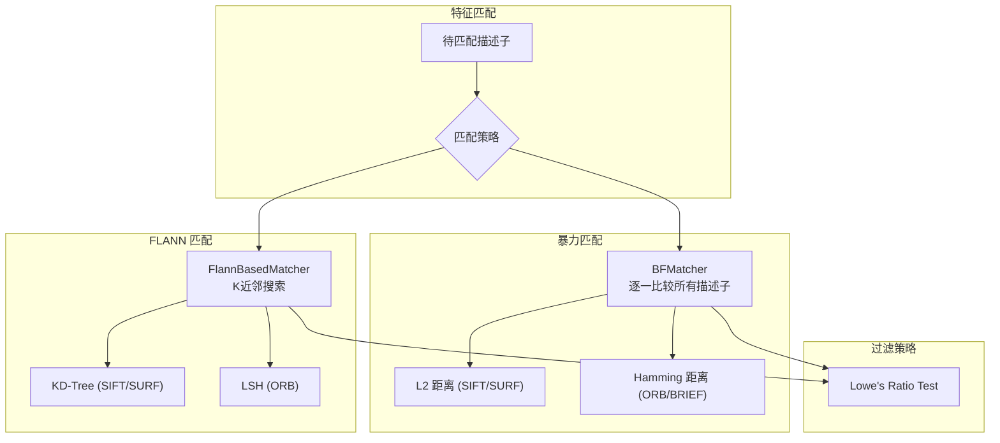
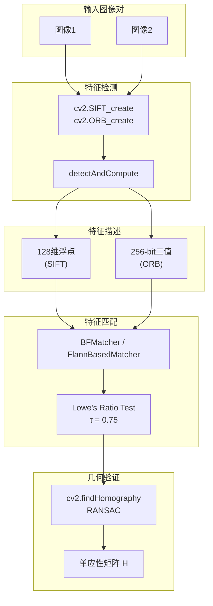

# 8.2 局部特征描述子

## 📋 本节大纲

- [SIFT 尺度不变特征变换](#sift-尺度不变特征变换)
- [SURF 快速鲁棒特征](#surf-快速鲁棒特征)
- [ORB 方向保持快速特征](#orb-方向保持快速特征)
- [特征匹配](#特征匹配)
- [OpenCV 实战](#opencv-实战)
- [本节小结](#本节小结)

---

## SIFT 尺度不变特征变换

### SIFT 算法流程



### 1. 构建高斯金字塔

对输入图像进行多次高斯模糊，形成金字塔结构：

$$
L(x,y,\sigma) = G(x,y,\sigma) * I(x,y)
$$

其中高斯核函数：

$$
G(x,y,\sigma) = \frac{1}{2\pi\sigma^2} e^{-(x^2+y^2)/(2\sigma^2)}
$$

SIFT中使用4组(octave)，每组6层的金字塔。尺度变化：

$$
\sigma(s) = \sigma_0 \cdot k^s, \quad k = 2^{1/S}
$$

SIFT默认 $S=3$，$\sigma_0 = 0.5$。

### 2. DoG 关键点检测

相邻尺度的高斯差分：

$$
D(x,y,\sigma) = L(x,y,k\sigma) - L(x,y,\sigma)
$$

在DoG尺度空间中，每个像素与其 **26个邻居**（3×3×3邻域）比较检测极值点。

**海森矩阵剔除边缘响应**：

$$
\frac{\text{Tr}(H)^2}{\text{Det}(H)} < \frac{(r+1)^2}{r}
$$

SIFT中 $r=10$。

### 3. 方向分配

在关键点邻域内计算梯度方向直方图（36 bins），峰值作为主方向，超过80%的峰值作为辅助方向。

### 4. 描述子生成

将关键点邻域旋转至主方向，划分为 4×4 子区域，每个子区域计算8方向梯度直方图：

$$
4 \times 4 \times 8 = 128 \text{ 维描述子}
$$

### SIFT 代码实现

```python
import cv2
import numpy as np

def sift_demo(image_path):
    """
    SIFT 特征提取完整示例
    """
    image = cv2.imread(image_path)
    gray = cv2.cvtColor(image, cv2.COLOR_BGR2GRAY)

    sift = cv2.SIFT_create(
        nfeatures=0,
        n-octave-layers=3,
        contrastThreshold=0.04,
        edgeThreshold=10,
        sigma=1.6
    )

    keypoints, descriptors = sift.detectAndCompute(gray, None)

    output = cv2.drawKeypoints(
        image, keypoints, None,
        flags=cv2.DRAW_MATCHES_FLAGS_DRAW_RICH_KEYPOINTS
    )

    print(f"检测到关键点数量: {len(keypoints)}")
    print(f"描述子维度: {descriptors.shape if descriptors is not None else 0}")

    for i, kp in enumerate(keypoints[:5]):
        print(f"  关键点{i}: 位置({kp.pt[0]:.1f}, {kp.pt[1]:.1f}), "
              f"尺度σ={kp.size:.2f}, 方向={kp.angle:.1f}°")

    return output, keypoints, descriptors
```

---

## SURF 快速鲁棒特征

### SURF 改进点

SURF (Speeded-Up Robust Features) 是SIFT的加速版本：



### SURF 关键步骤

1. **Hessian矩阵近似**：使用盒式滤波器（Box Filter）替代高斯差分
2. **积分图加速**：计算任意矩形区域的和只需4次查表
3. **描述子简化**：用Haar小波响应生成64维（或128维）描述子

**积分图**：

$$
I_{ii}(x,y) = \sum_{i=0}^{x}\sum_{j=0}^{y} I(i,j)
$$

**盒式滤波器响应**：

$$
\text{Det}(H)_{approx} = D_{xx}D_{yy} - (0.9D_{xy})^2
$$

### SURF 实现

```python
def surf_demo(image_path):
    """
    SURF 特征提取示例
    注意：OpenCV 4.x 需使用 xfeatures2d 或切换到 AKAZE
    """
    image = cv2.imread(image_path)
    gray = cv2.cvtColor(image, cv2.COLOR_BGR2GRAY)

    try:
        surf = cv2.SURF_create(hessianThreshold=400)
    except AttributeError:
        surf = cv2.AKAZE_create()
        print("SURF 不可用，使用 AKAZE 替代")

    keypoints, descriptors = surf.detectAndCompute(gray, None)

    output = cv2.drawKeypoints(
        image, keypoints, None,
        flags=cv2.DRAW_MATCHES_FLAGS_DRAW_RICH_KEYPOINTS
    )

    return output, keypoints, descriptors
```

---

## ORB 方向保持快速特征

### ORB 设计思想

ORB (Oriented FAST and Rotated BRIEF) 结合了FAST关键点检测器和BRIEF描述子：



### FAST 关键点检测

FAST检测角点：比较候选像素与其周围16个像素（半径3的圆）。

判别准则：若存在 $N$ 个连续像素（通常 $N=12$）均大于或均小于中心像素 $I_c$ 加/减阈值 $t$，则该点为角点。

$$
|I_x - I_c| > t
$$

### BRIEF 描述子

BRIEF (Binary Robust Independent Elementary Features) 是二值描述子：

1. 在关键点邻域随机选取像素对 $(p_i, q_i)$
2. 比较灰度值：若 $I(p_i) < I(q_i)$，则对应bit=1，否则bit=0
3. 生成256-bit（32字节）的二进制描述子

### ORB 完整流程

1. 使用FAST在图像金字塔各层检测关键点
2. 计算关键点的主方向（利用图像矩）：

$$
\theta = \arctan2(m_{01}, m_{10})
$$

3. 根据主方向旋转BRIEF描述子的像素对，生成具有旋转不变性的二值描述子

### ORB 实现

```python
def orb_demo(image_path):
    """
    ORB 特征提取示例
    """
    image = cv2.imread(image_path)
    gray = cv2.cvtColor(image, cv2.COLOR_BGR2GRAY)

    orb = cv2.ORB_create(
        nfeatures=500,
        scaleFactor=1.2,
        nlevels=8,
        edgeThreshold=15,
        firstLevel=0,
        WTA_K=2,
        scoreType=cv2.ORB_HARRIS_SCORE,
        patchSize=31,
        fastThreshold=20
    )

    keypoints, descriptors = orb.detectAndCompute(gray, None)

    output = cv2.drawKeypoints(
        image, keypoints, None,
        color=(0, 255, 0),
        flags=0
    )

    print(f"ORB 关键点数量: {len(keypoints)}")
    print(f"描述子类型: {descriptors.dtype}")
    print(f"描述子长度: {descriptors.shape[1] if descriptors is not None else 0} bits")

    return output, keypoints, descriptors
```

---

## 特征匹配

### 匹配方法



### Lowe's Ratio Test

为排除误匹配，使用最近邻与次近邻的距离比：

$$
\frac{d(m_1)}{d(m_2)} < \tau, \quad \tau = 0.75
$$

### 暴力匹配

```python
def brute_force_match(desc1, desc2, cross_check=False):
    """
    暴力匹配 (Brute-Force Matching)
    """
    if desc1.dtype == np.uint8:
        matcher = cv2.BFMatcher(cv2.NORM_HAMMING, crossCheck=cross_check)
    else:
        matcher = cv2.BFMatcher(cv2.NORM_L2, crossCheck=cross_check)

    matches = matcher.match(desc1, desc2)
    return matches


def knn_match_with_ratio_test(desc1, desc2, ratio_thresh=0.75):
    """
    KNN 匹配 + Lowe's Ratio Test
    """
    if desc1.dtype == np.uint8:
        matcher = cv2.BFMatcher(cv2.NORM_HAMMING)
    else:
        matcher = cv2.BFMatcher(cv2.NORM_L2)

    knn_matches = matcher.knnMatch(desc1, desc2, k=2)

    good_matches = []
    for m, n in knn_matches:
        if m.distance < ratio_thresh * n.distance:
            good_matches.append(m)

    return good_matches
```

### FLANN 匹配

```python
def flann_match(desc1, desc2, is_binary=False):
    """
    FLANN 基于快速近邻匹配
    """
    if is_binary:
        FLANN_INDEX_LSH = 6
        index_params = dict(
            algorithm=FLANN_INDEX_LSH,
            table_number=6,
            key_size=12,
            multi_probe_level=1
        )
    else:
        FLANN_INDEX_KDTREE = 1
        index_params = dict(algorithm=FLANN_INDEX_KDTREE, trees=5)

    search_params = dict(checks=100)

    flann = cv2.FlannBasedMatcher(index_params, search_params)
    knn_matches = flann.knnMatch(desc1, desc2, k=2)

    good_matches = []
    for m, n in knn_matches:
        if m.distance < 0.75 * n.distance:
            good_matches.append(m)

    return good_matches
```

### 特征匹配完整示例

```python
def feature_matching_demo(img1_path, img2_path):
    """
    完整的特征匹配流程
    """
    img1 = cv2.imread(img1_path)
    img2 = cv2.imread(img2_path)
    gray1 = cv2.cvtColor(img1, cv2.COLOR_BGR2GRAY)
    gray2 = cv2.cvtColor(img2, cv2.COLOR_BGR2GRAY)

    sift = cv2.SIFT_create()
    kp1, desc1 = sift.detectAndCompute(gray1, None)
    kp2, desc2 = sift.detectAndCompute(gray2, None)

    good_matches = knn_match_with_ratio_test(desc1, desc2, 0.75)

    src_pts = np.float32([kp1[m.queryIdx].pt for m in good_matches]).reshape(-1, 1, 2)
    dst_pts = np.float32([kp2[m.trainIdx].pt for m in good_matches]).reshape(-1, 1, 2)

    M, mask = cv2.findHomography(src_pts, dst_pts, cv2.RANSAC, 5.0)

    matches_mask = mask.ravel().tolist() if mask is not None else []

    draw_params = dict(
        matchColor=(0, 255, 0),
        singlePointColor=None,
        matchesMask=matches_mask,
        flags=2
    )

    result = cv2.drawMatches(img1, kp1, img2, kp2, good_matches, None, **draw_params)

    print(f"原始匹配数: {len(good_matches)}")
    print(f"RANSAC 后内点数: {sum(matches_mask)}")

    return result, M
```

---

## OpenCV 实战

### 三种特征对比

```python
import time

def compare_feature_descriptors(image_path):
    """
    对比 SIFT / SURF / ORB 的性能
    """
    image = cv2.imread(image_path)
    gray = cv2.cvtColor(image, cv2.COLOR_BGR2GRAY)

    results = {}

    # SIFT
    t0 = time.time()
    sift = cv2.SIFT_create()
    kp_sift, desc_sift = sift.detectAndCompute(gray, None)
    t_sift = time.time() - t0
    results['SIFT'] = {
        'time': t_sift,
        'keypoints': len(kp_sift),
        'descriptor_dim': desc_sift.shape[1] if desc_sift is not None else 0
    }

    # ORB
    t0 = time.time()
    orb = cv2.ORB_create()
    kp_orb, desc_orb = orb.detectAndCompute(gray, None)
    t_orb = time.time() - t0
    results['ORB'] = {
        'time': t_orb,
        'keypoints': len(kp_orb),
        'descriptor_dim': desc_orb.shape[1] if desc_orb is not None else 0
    }

    # AKAZE
    t0 = time.time()
    akaze = cv2.AKAZE_create()
    kp_akaze, desc_akaze = akaze.detectAndCompute(gray, None)
    t_akaze = time.time() - t0
    results['AKAZE'] = {
        'time': t_akaze,
        'keypoints': len(kp_akaze),
        'descriptor_dim': desc_akaze.shape[1] if desc_akaze is not None else 0
    }

    for name, info in results.items():
        print(f"{name}: 耗时={info['time']*1000:.1f}ms, "
              f"关键点={info['keypoints']}, "
              f"描述子维度={info['descriptor_dim']}")

    return results
```

### 图像拼接实战

```python
def image_stitch(img1_path, img2_path):
    """
    基于 ORB 的图像拼接
    """
    img1 = cv2.imread(img1_path)
    img2 = cv2.imread(img2_path)
    gray1 = cv2.cvtColor(img1, cv2.COLOR_BGR2GRAY)
    gray2 = cv2.cvtColor(img2, cv2.COLOR_BGR2GRAY)

    orb = cv2.ORB_create(nfeatures=2000)
    kp1, desc1 = orb.detectAndCompute(gray1, None)
    kp2, desc2 = orb.detectAndCompute(gray2, None)

    matcher = cv2.BFMatcher(cv2.NORM_HAMMING, crossCheck=False)
    knn_matches = matcher.knnMatch(desc1, desc2, k=2)

    good = [m for m, n in knn_matches if m.distance < 0.7 * n.distance]

    src_pts = np.float32([kp1[m.queryIdx].pt for m in good]).reshape(-1, 1, 2)
    dst_pts = np.float32([kp2[m.trainIdx].pt for m in good]).reshape(-1, 1, 2)

    H, mask = cv2.findHomography(dst_pts, src_pts, cv2.RANSAC, 5.0)

    h1, w1 = img1.shape[:2]
    h2, w2 = img2.shape[:2]

    canvas_w = w1 + w2
    canvas_h = max(h1, h2)
    canvas = np.zeros((canvas_h, canvas_w, 3), dtype=np.uint8)
    canvas[:h1, :w1] = img1

    warped = cv2.warpPerspective(
        img2, H, (canvas_w, canvas_h),
        flags=cv2.INTER_LINEAR
    )
    mask_warped = cv2.warpPerspective(
        np.ones((h2, w2), dtype=np.uint8), H,
        (canvas_w, canvas_h)
    )

    mask1 = (canvas[:, :, 0] > 0) | (canvas[:, :, 1] > 0) | (canvas[:, :, 2] > 0)
    mask2 = mask_warped.astype(bool)
    overlap = mask1 & mask2

    mask2_clean = mask2.copy()
    mask2_clean[overlap] = False

    result = canvas.copy()
    result[mask2_clean] = warped[mask2_clean]

    return result
```

### 特征提取与匹配管线



---

## 本节小结

### 算法对比

| 属性 | SIFT | SURF | ORB |
|------|------|------|-----|
| **速度** | 慢 | 中 | 快 |
| **尺度不变** | ✓ | ✓ | ✓（金字塔） |
| **旋转不变** | ✓ | ✓ | ✓ |
| **描述子维度** | 128 (浮点) | 64/128 (浮点) | 256 (二值) |
| **匹配距离** | L2 | L2 | Hamming |
| **专利** | 有(已过期) | 有(已过期) | 无 |
| **适用场景** | 通用视觉 | 实时应用 | 实时/嵌入式 |

### 核心公式

| 公式 | 表达式 | 说明 |
|------|--------|------|
| 高斯函数 | $G(x,y,\sigma) = \frac{1}{2\pi\sigma^2}e^{-(x^2+y^2)/(2\sigma^2)}$ | 尺度空间核 |
| DoG | $D = L(x,y,k\sigma) - L(x,y,\sigma)$ | 相邻尺度差分 |
| Hessian | $H = \begin{bmatrix}\frac{\partial^2 L}{\partial x^2} & \frac{\partial^2 L}{\partial x\partial y}\\\frac{\partial^2 L}{\partial x\partial y} & \frac{\partial^2 L}{\partial y^2}\end{bmatrix}$ | 边缘检测 |
| FAST角点 | $|I_x - I_c| > t$ | 16邻域比较 |
| BRIEF描述子 | $\sum_{i=1}^{n} 2^{i-1} \cdot \mathbb{1}(I(p_i) < I(q_i))$ | 二值串 |
| Ratio Test | $d(m_1) / d(m_2) < 0.75$ | 匹配过滤 |

### 课后练习

1. 编程对比SIFT与ORB在图像匹配任务上的速度和精度差异
2. 使用FLANN实现SIFT特征匹配，并与暴力匹配对比运行时间
3. 实现基于特征匹配的目标检测：在一幅大图像中找到模板图像的位置
4. 进阶：使用SIFT+RANSAC实现图像拼接（全景图）