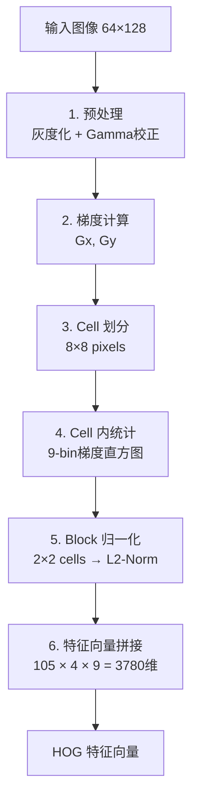
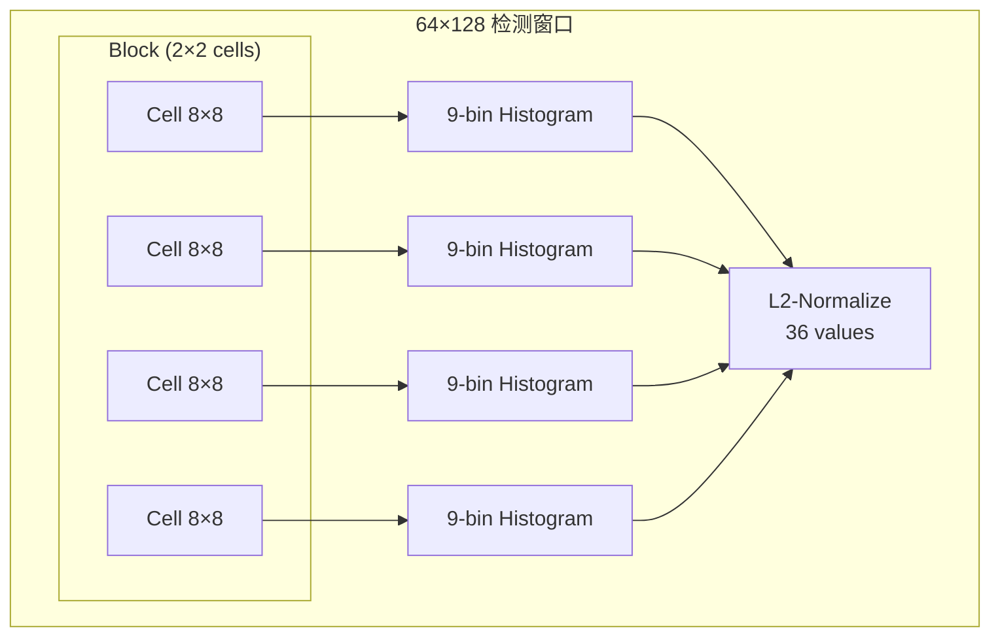
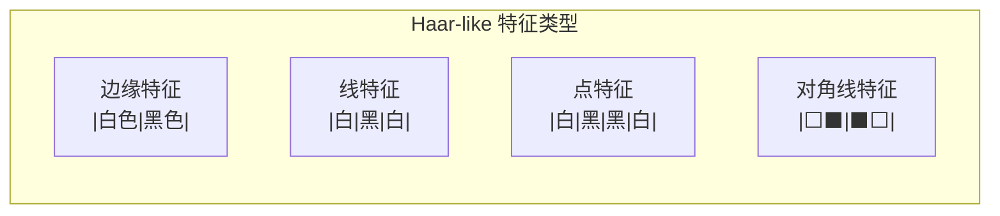
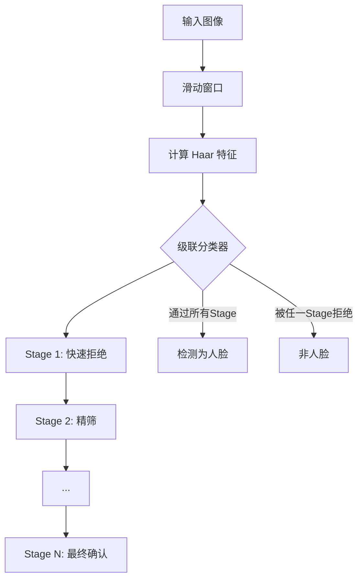
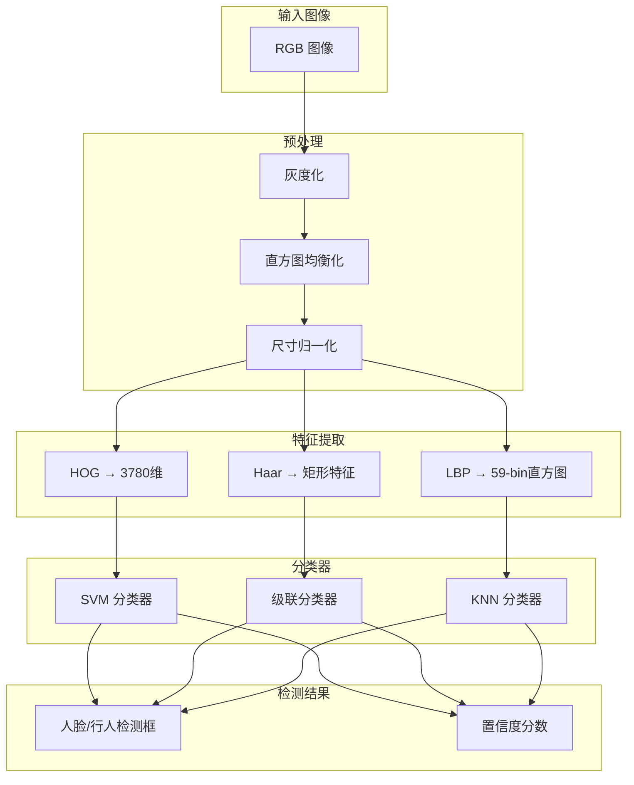

# 8.3 经典特征与HOG

## 📋 本节大纲

- [HOG 方向梯度直方图](#hog-方向梯度直方图)
- [LBP 局部二值模式](#lbp-局部二值模式)
- [Haar-like 特征](#haar-like-特征)
- [人脸检测实战](#人脸检测实战)
- [OpenCV 综合实战](#opencv-综合实战)
- [本节小结](#本节小结)

---

## HOG 方向梯度直方图

### HOG 基本原理

HOG (Histogram of Oriented Gradients) 由Dalal和Triggs (2005) 提出，用于**行人检测**。核心思想：物体的外形和局部外观可以用梯度方向的分布来描述。

### HOG 计算流程



### 1. 梯度计算

在每个像素点计算水平和垂直梯度：

$$
G_x = I(x+1, y) - I(x-1, y)
$$

$$
G_y = I(x, y+1) - I(x, y-1)
$$

梯度幅值和方向：

$$
G = \sqrt{G_x^2 + G_y^2}
$$

$$
\theta = \arctan\left(\frac{G_y}{G_x}\right)
$$

### 2. Cell 直方图

将图像划分为 8×8 的cell，在每个cell内统计梯度方向直方图（9 bins，0°~180°）：

$$
\text{hist}[k] = \sum_{(x,y)\in cell} G(x,y) \cdot w(\theta(x,y) - \theta_k)
$$

其中 $w$ 为三线性插值权重。

### 3. Block 归一化

相邻2×2个cell组成一个block，对block内的36个值进行归一化：

$$
\text{normalized} = \frac{v}{\sqrt{\|v\|_2^2 + \epsilon^2}}
$$

HOG特征向量的维度：

$$
\left(\frac{64}{8} - 1\right) \times \left(\frac{128}{8} - 1\right) \times 4 \times 9 = 7 \times 15 \times 36 = 3780
$$

### HOG 特征可视化



### HOG 实现

```python
import cv2
import numpy as np
from skimage.feature import hog
from skimage import exposure

def compute_hog_features(image, visualize=False):
    """
    计算 HOG 特征
    Args:
        image: 输入图像 (H, W) 或 (H, W, 3)
        visualize: 是否返回可视化图像
    Returns:
        hog_features: HOG 特征向量 (3780维 for 64×128)
        hog_image: 可视化图像 (可选)
    """
    gray = cv2.cvtColor(image, cv2.COLOR_BGR2GRAY) if len(image.shape) == 3 else image

    hog_features, hog_image = hog(
        gray,
        orientations=9,
        pixels_per_cell=(8, 8),
        cells_per_block=(2, 2),
        visualize=True,
        block_norm='L2-Hys'
    )

    hog_image_rescaled = exposure.rescale_intensity(
        hog_image,
        in_range=(0, 10)
    )

    return hog_features, hog_image_rescaled


def pedestrian_detection_with_hog(image):
    """
    使用 HOG + SVM 进行行人检测 (OpenCV 内置)
    """
    hog = cv2.HOGDescriptor()
    hog.setSVMDetector(cv2.HOGDescriptor_getDefaultPeopleDetector())

    rects, weights = hog.detectMultiScale(
        image,
        winStride=(4, 4),
        padding=(8, 8),
        scale=1.05
    )

    for (x, y, w, h), weight in zip(rects, weights):
        cv2.rectangle(image, (x, y), (x + w, y + h), (0, 255, 0), 2)
        cv2.putText(
            image, f"{weight:.2f}",
            (x, y - 5),
            cv2.FONT_HERSHEY_SIMPLEX,
            0.5, (0, 255, 0), 1
        )

    return image, len(rects)
```

---

## LBP 局部二值模式

### LBP 基本原理

LBP (Local Binary Pattern) 是一种有效的纹理描述算子，由Ojala等人提出。

### 原始 LBP

在 3×3 邻域内，比较中心像素与周围8个像素的灰度值：

$$
\text{LBP}_{P,R}(x_c, y_c) = \sum_{p=0}^{P-1} s(g_p - g_c) \cdot 2^p
$$

$$
s(x) = \begin{cases} 1, & x \geq 0 \\ 0, & x < 0 \end{cases}
$$

其中 $g_c$ 为中心像素灰度，$g_p$ 为邻域像素灰度，$P=8$，$R=1$。

### 均匀模式 LBP

均匀模式 (Uniform Pattern)：二值串中跳变次数（0→1 或 1→0）不超过2次。

8邻域下，共有 **58种均匀模式**，加上2种非均匀模式 = **59种**。

```mermaid
graph LR
    subgraph "3×3 邻域"
        P7[左上] - P0[上] - P1[右上]
        P6[左] - GC[中心] - P2[右]
        P5[左下] - P4[下] - P3[右下]
    end

    subgraph "LBP编码"
        P7 --> B7[bit7]
        P0 --> B0[bit0]
        P1 --> B1[bit1]
        P2 --> B2[bit2]
        P3 --> B3[bit3]
        P4 --> B4[bit4]
        P5 --> B5[bit5]
        P6 --> B6[bit6]
    end

    GC -- "gₚ ≥ g꜀?" --> B7
    GC -- "gₚ ≥ g꜀?" --> B0
    GC -- "gₚ ≥ g꜀?" --> B1
    GC -- "gₚ ≥ g꜀?" --> B2
    GC -- "gₚ ≥ g꜀?" --> B3
    GC -- "gₚ ≥ g꜀?" --> B4
    GC -- "gₚ ≥ g꜀?" --> B5
    GC -- "gₚ ≥ g꜀?" --> B6
```

### 旋转不变 LBP

旋转不变LBP通过旋转二值串使最小二进制值作为编码：

$$
\text{LBP}_{P,R}^{ri} = \min(\text{ROR}(\text{LBP}_{P,R}, i)), \quad i = 0, 1, \ldots, P-1)
$$

### LBP 实现

```python
def compute_lbp(image, n_points=8, radius=1, method='uniform'):
    """
    计算 LBP 特征
    Args:
        image: 输入灰度图像
        n_points: 邻域采样点数
        radius: 邻域半径
        method: 'default' / 'uniform' / 'ror' / 'var'
    Returns:
        lbp_image: LBP 编码图像
    """
    gray = cv2.cvtColor(image, cv2.COLOR_BGR2GRAY) if len(image.shape) == 3 else image

    lbp = np.zeros_like(gray)

    for i in range(radius, gray.shape[0] - radius):
        for j in range(radius, gray.shape[1] - radius):
            center = gray[i, j]
            code = 0
            for k in range(n_points):
                angle = 2 * np.pi * k / n_points
                x = i + radius * np.cos(angle)
                y = j + radius * np.sin(angle)

                x_int = int(round(x))
                y_int = int(round(y))

                if 0 <= x_int < gray.shape[0] and 0 <= y_int < gray.shape[1]:
                    if gray[x_int, y_int] >= center:
                        code |= (1 << k)

            lbp[i, j] = code

    return lbp


def compute_lbp_histogram(image, cell_size=(8, 8), n_points=8, radius=1):
    """
    计算多尺度 LBP 直方图特征
    """
    gray = cv2.cvtColor(image, cv2.COLOR_BGR2GRAY) if len(image.shape) == 3 else image
    h, w = gray.shape

    lbp_img = compute_lbp(gray, n_points, radius)

    histograms = []
    for i in range(0, h - cell_size[0], cell_size[0]):
        for j in range(0, w - cell_size[1], cell_size[1]):
            cell = lbp_img[i:i+cell_size[0], j:j+cell_size[1]]
            hist, _ = np.histogram(
                cell.flatten(),
                bins=256,
                range=(0, 256)
            )
            histograms.append(hist)

    return np.concatenate(histograms)


def lbp_face_demo(image_path):
    """
    LBP 人脸识别特征提取演示
    """
    image = cv2.imread(image_path, cv2.IMREAD_GRAYSCALE)

    lbp_img = compute_lbp(image, n_points=8, radius=1)

    hist = compute_lbp_histogram(image, cell_size=(16, 16))

    print(f"LBP 直方图维度: {hist.shape[0]}")
    print(f"LBP 编码范围: [{lbp_img.min()}, {lbp_img.max()}]")

    return lbp_img, hist
```

---

## Haar-like 特征

### Haar-like 特征基础

Haar-like特征使用矩形区域的像素和之差来描述图像局部特征。

### 基本矩形特征



### 特征计算

$$
\text{feature} = \sum_{i \in \text{white}} w_i \cdot \text{Sum}(R_i) - \sum_{j \in \text{black}} w_j \cdot \text{Sum}(R_j)
$$

利用**积分图**加速矩形区域求和：

$$
\text{Sum}(R) = I_{ii}(x_2, y_2) - I_{ii}(x_1-1, y_2) - I_{ii}(x_2, y_1-1) + I_{ii}(x_1-1, y_1-1)
$$

### 积分图

积分图 (Integral Image) 定义：

$$
I_{ii}(x,y) = \sum_{i=0}^{x}\sum_{j=0}^{y} I(i,j)
$$

计算递推：

$$
I_{ii}(x,y) = I(x,y) + I_{ii}(x-1,y) + I_{ii}(x,y-1) - I_{ii}(x-1,y-1)
$$

### Haar 特征实现

```python
def compute_integral_image(image):
    """
    计算积分图
    """
    if len(image.shape) == 3:
        gray = cv2.cvtColor(image, cv2.COLOR_BGR2GRAY)
    else:
        gray = image.astype(np.float64)

    integral = cv2.integral(gray)

    return integral


def haar_like_feature(integral, x, y, w, h, feature_type='edge'):
    """
    计算 Haar-like 矩形特征
    Args:
        integral: 积分图
        x, y: 左上角坐标
        w, h: 宽高
        feature_type: 'edge' / 'line' / 'center' / 'diagonal'
    Returns:
        feature_value: 特征值
    """
    ii = integral

    def rect_sum(ii, x1, y1, x2, y2):
        return (ii[y2, x2] - ii[y1-1, x2] -
                ii[y2, x1-1] + ii[y1-1, x1-1])

    if feature_type == 'edge':
        half_w = w // 2
        left = rect_sum(ii, x+1, y+1, x+half_w, y+h)
        right = rect_sum(ii, x+half_w+1, y+1, x+w, y+h)
        return left - right

    elif feature_type == 'line':
        third_w = w // 3
        left = rect_sum(ii, x+1, y+1, x+third_w, y+h)
        mid = rect_sum(ii, x+third_w+1, y+1, x+2*third_w, y+h)
        right = rect_sum(ii, x+2*third_w+1, y+1, x+w, y+h)
        return left - 2*mid + right

    elif feature_type == 'center':
        half_w, half_h = w // 2, h // 2
        outer = rect_sum(ii, x+1, y+1, x+w, y+h)
        inner = rect_sum(ii, x+half_w//2+1, y+half_h//2+1,
                         x+w-half_w//2, y+h-half_h//2)
        return outer - 2*inner

    elif feature_type == 'diagonal':
        half_w, half_h = w // 2, h // 2
        tl = rect_sum(ii, x+1, y+1, x+half_w, y+half_h)
        br = rect_sum(ii, x+half_w+1, y+half_h+1, x+w, y+h)
        tr = rect_sum(ii, x+half_w+1, y+1, x+w, y+half_h)
        bl = rect_sum(ii, x+1, y+half_h+1, x+half_w, y+h)
        return (tl + br) - (tr + bl)

    return 0
```

---

## 人脸检测实战

### Haar 级联分类器

OpenCV提供了预训练的Haar级联分类器：



### Haar 级联检测

```python
def detect_faces_haar(image_path, scale_factor=1.1, min_neighbors=5):
    """
    使用 Haar 级联分类器进行人脸检测
    """
    image = cv2.imread(image_path)
    gray = cv2.cvtColor(image, cv2.COLOR_BGR2GRAY)

    face_cascade = cv2.CascadeClassifier(
        cv2.data.haarcascades + 'haarcascade_frontalface_default.xml'
    )
    eye_cascade = cv2.CascadeClassifier(
        cv2.data.haarcascades + 'haarcascade_eye.xml'
    )

    faces = face_cascade.detectMultiScale(
        gray,
        scaleFactor=scale_factor,
        minNeighbors=min_neighbors,
        minSize=(30, 30),
        flags=cv2.CASCADE_SCALE_IMAGE
    )

    for (x, y, w, h) in faces:
        cv2.rectangle(image, (x, y), (x + w, y + h), (255, 0, 0), 2)

        roi_gray = gray[y:y+h, x:x+w]
        roi_color = image[y:y+h, x:x+w]

        eyes = eye_cascade.detectMultiScale(roi_gray, scaleFactor=1.1, minNeighbors=5)
        for (ex, ey, ew, eh) in eyes:
            cv2.rectangle(roi_color, (ex, ey), (ex+ew, ey+eh), (0, 255, 0), 2)

    return image, len(faces)
```

### HOG + SVM 人脸检测

```python
def face_detection_hog_svm(image_path):
    """
    使用 HOG + 自定义 SVM 进行人脸检测
    """
    image = cv2.imread(image_path)
    gray = cv2.cvtColor(image, cv2.COLOR_BGR2GRAY)

    hog = cv2.HOGDescriptor(
        (64, 64),
        (16, 16),
        (8, 8),
        (8, 8),
        9
    )

    win_svm = cv2.ml.SVM_load("svm_face_detector.yml")

    step_size = (8, 8)
    window_size = (64, 64)

    detections = []
    for y in range(0, gray.shape[0] - window_size[0], step_size[0]):
        for x in range(0, gray.shape[1] - window_size[1], step_size[1]):
            window = gray[y:y+window_size[0], x:x+window_size[1]]

            hog_feat = hog.compute(window).flatten()
            hog_feat = hog_feat.reshape(1, -1).astype(np.float32)

            _, result = win_svm.predict(hog_feat)
            if result[0][0] == 1:
                detections.append((x, y, window_size[0], window_size[1]))

    for (x, y, w, h) in detections:
        cv2.rectangle(image, (x, y), (x+w, y+h), (0, 0, 255), 2)

    return image, len(detections)
```

### 多尺度检测与NMS

```python
def multi_scale_detection(image, detector_fn, scales=None):
    """
    多尺度检测 + 非极大值抑制 (NMS)
    """
    if scales is None:
        scales = [1.0, 0.9, 0.8, 0.7, 0.6]

    all_detections = []

    for scale in scales:
        scaled = cv2.resize(
            image, None, fx=scale, fy=scale,
            interpolation=cv2.INTER_AREA
        )
        detections = detector_fn(scaled)

        for (x, y, w, h) in detections:
            all_detections.append((
                x / scale, y / scale,
                w / scale, h / scale
            ))

    keep = nms(all_detections, overlap_thresh=0.3)
    final_detections = [all_detections[i] for i in keep]

    return final_detections


def nms(boxes, overlap_thresh=0.3):
    """
    非极大值抑制 (Non-Maximum Suppression)
    """
    if len(boxes) == 0:
        return []

    x1 = np.array([b[0] for b in boxes])
    y1 = np.array([b[1] for b in boxes])
    x2 = np.array([b[0] + b[2] for b in boxes])
    y2 = np.array([b[1] + b[3] for b in boxes])

    area = (x2 - x1) * (y2 - y1)
    order = area.argsort()[::-1]

    keep = []
    while order.size > 0:
        i = order[0]
        keep.append(i)

        xx1 = np.maximum(x1[i], x1[order[1:]])
        yy1 = np.maximum(y1[i], y1[order[1:]])
        xx2 = np.minimum(x2[i], x2[order[1:]])
        yy2 = np.minimum(y2[i], y2[order[1:]])

        w = np.maximum(0.0, xx2 - xx1)
        h = np.maximum(0.0, yy2 - yy1)
        overlap = w * h / (area[i] + area[order[1:]] - w * h)

        inds = np.where(overlap <= overlap_thresh)[0]
        order = order[inds + 1]

    return keep
```

---

## OpenCV 综合实战

### 特征提取综合管线



### 人脸检测完整示例

```python
def full_face_detection_pipeline(image_path, save_path=None):
    """
    完整的人脸检测管线
    """
    image = cv2.imread(image_path)
    result = image.copy()
    gray = cv2.cvtColor(image, cv2.COLOR_BGR2GRAY)

    gray = cv2.equalizeHist(gray)

    haar_cascade = cv2.CascadeClassifier(
        cv2.data.haarcascades + 'haarcascade_frontalface_default.xml'
    )

    faces_haar = haar_cascade.detectMultiScale(
        gray, scaleFactor=1.1, minNeighbors=5,
        minSize=(30, 30), flags=cv2.CASCADE_SCALE_IMAGE
    )

    hog = cv2.HOGDescriptor()
    hog.setSVMDetector(cv2.HOGDescriptor_getDefaultPeopleDetector())

    rects_hog, weights = hog.detectMultiScale(
        image, winStride=(4, 4),
        padding=(8, 8), scale=1.05
    )

    for (x, y, w, h) in faces_haar:
        cv2.rectangle(result, (x, y), (x+w, y+h), (0, 255, 0), 2)
        cv2.putText(result, 'Haar', (x, y-10),
                    cv2.FONT_HERSHEY_SIMPLEX, 0.6, (0, 255, 0), 2)

    for (x, y, w, h), w_val in zip(rects_hog, weights):
        cv2.rectangle(result, (x, y), (x+w, y+h), (0, 0, 255), 2)
        cv2.putText(result, f'HOG:{w_val:.2f}', (x, y+h+20),
                    cv2.FONT_HERSHEY_SIMPLEX, 0.6, (0, 0, 255), 2)

    if save_path:
        cv2.imwrite(save_path, result)

    return result, {
        'haar_faces': len(faces_haar),
        'hog_pedestrians': len(rects_hog)
    }
```

### 特征提取性能对比

```python
def compare_descriptors(image_path):
    """
    对比 HOG / LBP / Haar 的特征特性
    """
    image = cv2.imread(image_path)
    gray = cv2.cvtColor(image, cv2.COLOR_BGR2GRAY)
    h, w = gray.shape

    hog_feat, hog_img = compute_hog_features(image, visualize=True)
    print(f"HOG: 特征维度={len(hog_feat)}, 计算完成")

    lbp_img = compute_lbp(gray, n_points=8, radius=1)
    lbp_hist = compute_lbp_histogram(gray, cell_size=(16, 16))
    print(f"LBP: 直方图维度={len(lbp_hist)}, 计算完成")

    integral = compute_integral_image(gray)
    haar_val = haar_like_feature(integral, 10, 10, 50, 30, 'edge')
    print(f"Haar edge特征值: {haar_val:.2f}")

    return {
        'hog': (hog_feat, hog_img),
        'lbp': (lbp_img, lbp_hist),
        'haar': haar_val
    }
```

---

## 本节小结

### 特征对比

| 属性 | HOG | LBP | Haar-like |
|------|-----|-----|-----------|
| **描述目标** | 形状/轮廓 | 纹理 | 边缘/线 |
| **特征类型** | 梯度方向直方图 | 二值编码直方图 | 矩形区域差分 |
| **维度** | 3780 (64×128) | 59×N_cells | 可变 |
| **不变性** | 光照(局部) | 单调灰度变换 | 尺度(多级) |
| **计算速度** | 中 | 快 | 极快(积分图) |
| **典型应用** | 行人检测 | 人脸识别/纹理分类 | 人脸检测 |

### 核心公式

| 算子 | 核心公式 |
|------|---------|
| HOG梯度 | $G = \sqrt{G_x^2 + G_y^2}$, $\theta = \arctan(G_y/G_x)$ |
| HOG归一化 | $v_{norm} = v / \sqrt{\|v\|_2^2 + \epsilon^2}$ |
| LBP | $LBP = \sum s(g_p - g_c) 2^p$ |
| LBP均匀模式 | 跳变次数 ≤ 2 的二值串 |
| Haar积分图 | $I_{ii}(x,y) = \sum_{i=0}^x\sum_{j=0}^y I(i,j)$ |
| Haar特征 | $f = \sum w_i \cdot \text{Sum}(R_i)$ |

### 课后练习

1. 实现基于HOG的行人检测，测试不同scaleFactor对检测结果的影响
2. 使用LBP特征+SVM实现人脸识别，在FERET子集上评估准确率
3. 编程实现Haar-like特征的积分图加速计算
4. 对比Haar级联和HOG+SVM在人脸检测上的速度和精度差异
5. 进阶：使用OpenCV的`cv2.CascadeClassifier`训练自定义的Haar分类器