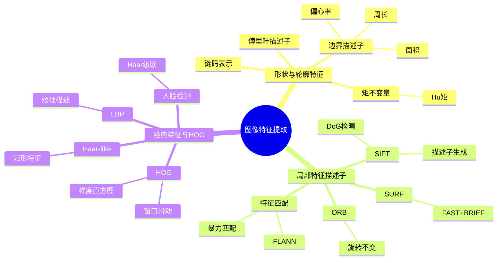

# 第8章 图像特征提取 — 思维导图与导航

## 📑 章节导航

| 节次 | 主题 | 核心知识点 |
|------|------|-----------|
| [8.1 形状与轮廓特征](#81-形状与轮廓特征) | 基于轮廓的特征描述 | 链码、边界描述子、矩不变量、傅里叶描述子 |
| [8.2 局部特征描述子](#82-局部特征描述子) | 关键点与局部描述 | SIFT、SURF、ORB、特征匹配 |
| [8.3 经典特征与HOG](#83-经典特征与hog) | 密集采样特征 | HOG、LBP、Haar-like、人脸检测 |

## 🗺️ 学习路线图

## 🎯 核心考点

### 高频考点
1. **Hu矩不变量** — 7个矩的物理含义与不变性（平移、旋转、缩放）
2. **SIFT算法流程** — DoG构造 → 极值检测 → 方向分配 → 描述子生成
3. **HOG特征计算** — 梯度计算 → cell统计 → block归一化
4. **LBP纹理描述** — 8邻域编码 + 旋转不变模式
5. **特征匹配** — KNN匹配 + Lowe's ratio test

### 公式速查

| 特征类型 | 核心公式 | 含义 |
|----------|---------|------|
| Hu矩 | $\phi_1 = \eta_{20} + \eta_{02}$ | 二阶中心矩组合 |
| SIFT DoG | $D(x,y,\sigma) = G(x,y,k\sigma) - G(x,y,\sigma)$ | 相邻尺度高斯差 |
| HOG梯度 | $\theta = \arctan\left(\frac{G_y}{G_x}\right)$ | 梯度方向 |
| LBP | $LBP_{P,R} = \sum_{p=0}^{P-1} s(g_p - g_c) 2^p$ | 局部二值模式 |
| 傅里叶描述子 | $a_k = \sum_{n=0}^{N-1} z_n e^{-j2\pi kn/N}$ | 轮廓复数序列DFT |

## 📝 自测题

### 基础题
1. 什么是链码？如何用链码表示一条闭合边界？
2. 区分矩不变量 $\phi_1$ 和 $\phi_2$ 的计算方式及其物理含义。
3. SIFT中DoG检测相比LoG检测有什么优势？

### 应用题
4. 给定一幅二值图像中的字符轮廓，如何用傅里叶描述子实现旋转不变的字符识别？
5. 描述使用HOG + SVM进行行人检测的完整流程。
6. 如何用OpenCV实现基于ORB的图像拼接（image stitching）？

### 考研真题
7. （2023 考研408）证明Hu矩 $\phi_1 = \eta_{20} + \eta_{02}$ 具有旋转不变性。
8. （2022 考研408）描述SIFT描述子的生成步骤，为什么要将描述子归一化？
9. （2021 考研408）说明HOG特征中"cell"和"block"的区别，以及重叠block归一化的作用。

## 🔗 相关章节

- **前置**: [[第7章 图像分割]] — 特征提取的前提是获得目标区域
- **后续**: [[第9章 图像压缩与编码]] — 特征可用于压缩与检索
- **拓展**: [[第10章 图像理解与模式识别]] — 特征用于分类与识别