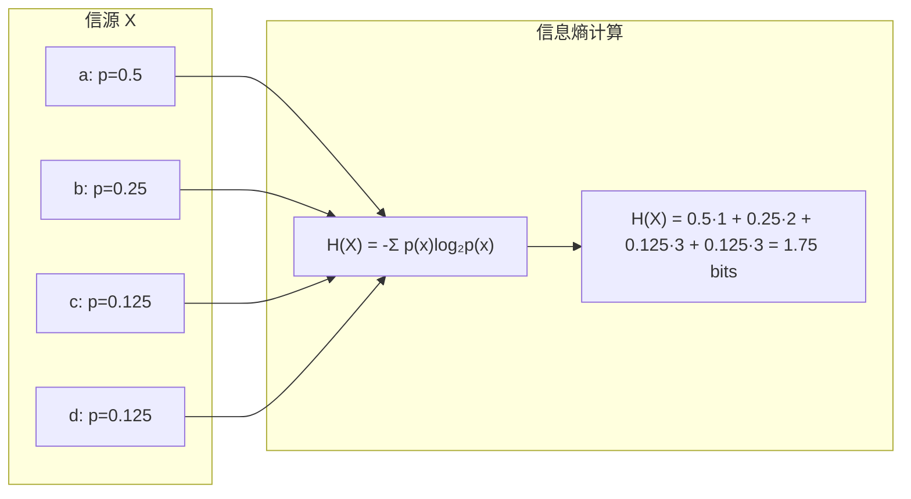
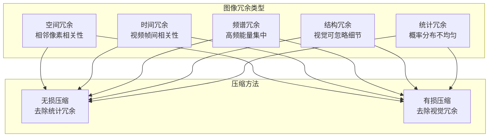
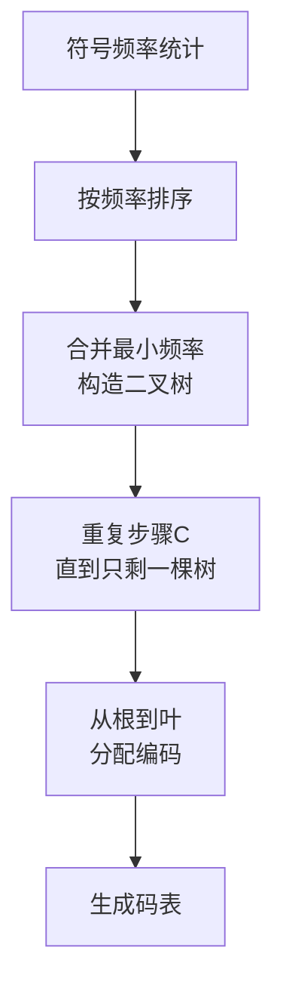
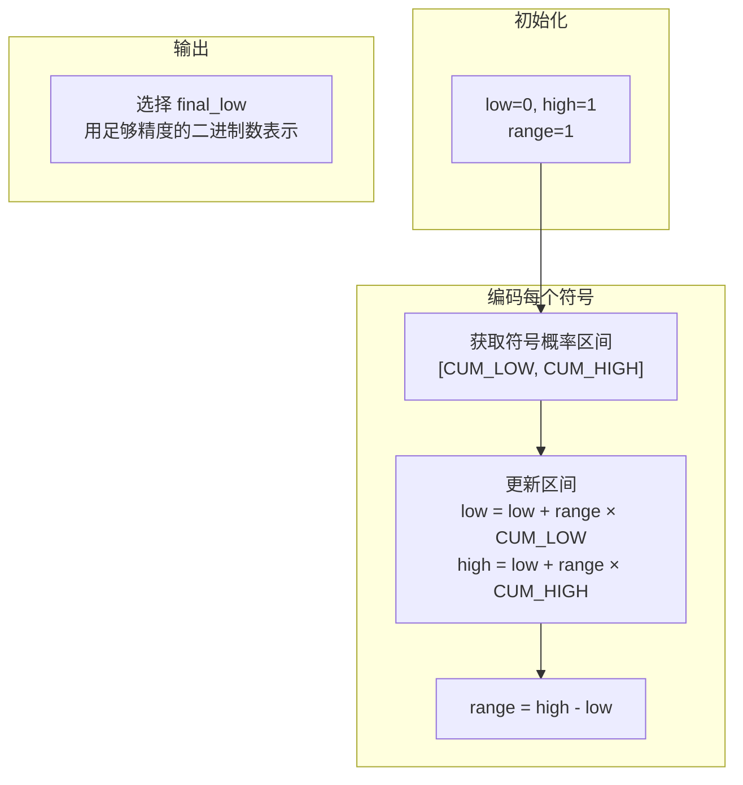
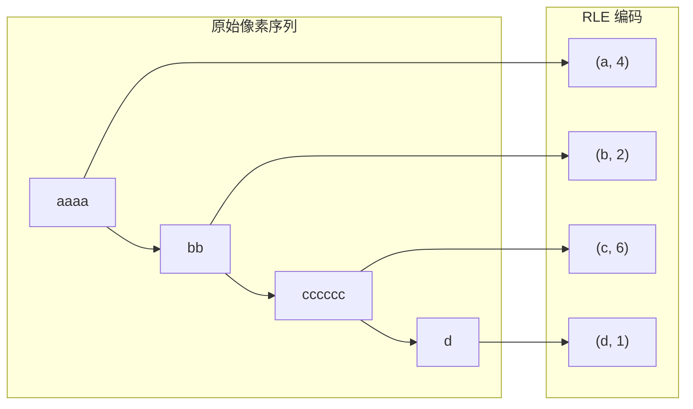
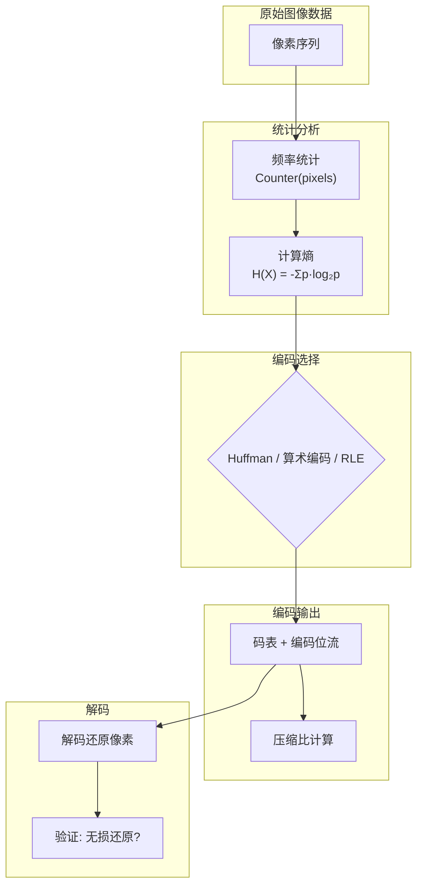

# 9.1 数据压缩基础

## 📋 本节大纲

- [信息论基础](#信息论基础)
- [冗余度与压缩分类](#冗余度与压缩分类)
- [失真度量](#失真度量)
- [Huffman编码](#huffman编码)
- [算术编码](#算术编码)
- [游程编码 RLE](#游程编码-rle)
- [OpenCV 实战](#opencv-实战)
- [本节小结](#本节小结)

---

## 信息论基础

### 信息熵

信息熵衡量信源的平均不确定性：

$$
H(X) = -\sum_{i=1}^{n} p(x_i) \log_2 p(x_i)
$$

其中 $p(x_i)$ 为符号 $x_i$ 出现的概率，$H(X)$ 的单位为 **比特 (bit)**。

### 熵的性质

1. **非负性**：$H(X) \geq 0$
2. **极值性**：等概分布时熵最大，$H(X)_{\max} = \log_2 n$
3. **可加性**：独立信源的联合熵等于各自熵之和



### 平均码长与编码效率

设码字长度为 $l(x_i)$，平均码长为：

$$
\bar{L} = \sum_{i=1}^{n} p(x_i) \cdot l(x_i)
$$

**信源编码定理**：无失真压缩的平均码长下界为熵：

$$
\bar{L} \geq H(X)
$$

**编码效率**：

$$
\eta = \frac{H(X)}{\bar{L}} \times 100\%
$$

### 信息量计算示例

```python
import numpy as np
from collections import Counter

def calculate_entropy(symbols):
    """
    计算信源的信息熵
    Args:
        symbols: 符号序列 (list/array)
    Returns:
        entropy: 信息熵 (bits)
        probs: 各符号的概率
    """
    counter = Counter(symbols)
    total = len(symbols)
    probs = {sym: count / total for sym, count in counter.items()}

    entropy = 0.0
    for p in probs.values():
        if p > 0:
            entropy -= p * np.log2(p)

    return entropy, probs


def image_entropy_analysis(image):
    """
    分析灰度图像的信息熵
    """
    if len(image.shape) == 3:
        gray = cv2.cvtColor(image, cv2.COLOR_BGR2GRAY)
    else:
        gray = image

    pixels = gray.flatten()
    entropy, probs = calculate_entropy(pixels)

    max_entropy = np.log2(len(np.unique(pixels)))

    print(f"图像熵: {entropy:.4f} bits/pixel")
    print(f"最大熵: {max_entropy:.4f} bits/pixel")
    print(f"高效比: {entropy/max_entropy*100:.2f}%")

    return entropy, probs
```

---

## 冗余度与压缩分类

### 图像中的冗余



### 冗余度量化

$$
R = 1 - \frac{C}{C_0}
$$

其中 $C$ 为压缩后码率，$C_0$ 为原始码率。

### 压缩分类

| 类型 | 特点 | 典型算法 | 压缩比 |
|------|------|---------|--------|
| **无损压缩** | 完全还原原图像 | Huffman、算术编码、RLE、LZW | 2:1 ~ 5:1 |
| **有损压缩** | 允许失真 | JPEG、JPEG2000、MP3 | 10:1 ~ 100:1 |
| **Near-lossless** | 极小失真 | 近无损JPEG | 5:1 ~ 10:1 |

---

## 失真度量

### MSE (均方误差)

$$
\text{MSE} = \frac{1}{MN} \sum_{i=0}^{M-1} \sum_{j=0}^{N-1} [I(i,j) - \hat{I}(i,j)]^2
$$

### PSNR (峰值信噪比)

$$
\text{PSNR} = 10 \cdot \log_{10}\left(\frac{MAX^2}{\text{MSE}}\right)
$$

其中 $MAX$ 为像素最大值（8位图像为255）。PSNR的单位为 **分贝 (dB)**。

| PSNR (dB) | 图像质量 |
|-----------|---------|
| > 40 | 几乎无差别 |
| 30 ~ 40 | 细微差别 |
| 20 ~ 30 | 明显差别 |
| < 20 | 严重失真 |

### 其他度量

- **MAE** (平均绝对误差)：$\text{MAE} = \frac{1}{MN}\sum|I - \hat{I}|$
- **SSIM** (结构相似度)：考虑亮度、对比度、结构的综合指标

### 失真度量实现

```python
import cv2
import numpy as np

def compute_metrics(original, compressed):
    """
    计算图像压缩的失真度量
    """
    original = original.astype(np.float64)
    compressed = compressed.astype(np.float64)

    mse = np.mean((original - compressed) ** 2)

    mae = np.mean(np.abs(original - compressed))

    max_val = 255.0
    if mse == 0:
        psnr = float('inf')
    else:
        psnr = 10 * np.log10(max_val ** 2 / mse)

    def ssim(img1, img2):
        C1 = (0.01 * 255) ** 2
        C2 = (0.03 * 255) ** 2

        mu1 = cv2.GaussianBlur(img1, (11, 11), 1.5)
        mu2 = cv2.GaussianBlur(img2, (11, 11), 1.5)

        mu1_sq = mu1 ** 2
        mu2_sq = mu2 ** 2
        mu1_mu2 = mu1 * mu2

        sigma1_sq = cv2.GaussianBlur(img1 ** 2, (11, 11), 1.5) - mu1_sq
        sigma2_sq = cv2.GaussianBlur(img2 ** 2, (11, 11), 1.5) - mu2_sq
        sigma12 = cv2.GaussianBlur(img1 * img2, (11, 11), 1.5) - mu1_mu2

        ssim_map = ((2 * mu1_mu2 + C1) * (2 * sigma12 + C2)) / \
                   ((mu1_sq + mu2_sq + C1) * (sigma1_sq + sigma2_sq + C2))
        return np.mean(ssim_map)

    ssim_val = ssim(original, compressed)

    return {
        'MSE': mse,
        'MAE': mae,
        'PSNR': psnr,
        'SSIM': ssim_val
    }
```

---

## Huffman编码

### 编码思想

Huffman编码是一种**前缀码**，基于符号频率构造最优编码。

### 算法步骤



### 编码示例

设信源符号及频率：

| 符号 | 频率 | 码字 |
|------|------|------|
| a | 0.5 | 0 |
| b | 0.25 | 10 |
| c | 0.125 | 110 |
| d | 0.125 | 111 |

平均码长：$\bar{L} = 0.5 \times 1 + 0.25 \times 2 + 0.125 \times 3 + 0.125 \times 3 = 1.75$ bits

编码效率：$\eta = 1.75 / 1.75 = 100\%$（此例达到熵）

### Huffman编码实现

```python
import heapq
from collections import Counter

class HuffmanNode:
    def __init__(self, symbol=None, freq=0, left=None, right=None):
        self.symbol = symbol
        self.freq = freq
        self.left = left
        self.right = right

    def __lt__(self, other):
        return self.freq < other.freq


def build_huffman_tree(freq_dict):
    """
    构造 Huffman 树
    Args:
        freq_dict: {符号: 频率}
    Returns:
        root: Huffman 树根节点
    """
    heap = [HuffmanNode(symbol=s, freq=f) for s, f in freq_dict.items()]
    heapq.heapify(heap)

    while len(heap) > 1:
        left = heapq.heappop(heap)
        right = heapq.heappop(heap)
        merged = HuffmanNode(
            freq=left.freq + right.freq,
            left=left, right=right
        )
        heapq.heappush(heap, merged)

    return heap[0]


def get_huffman_codes(root):
    """
    从 Huffman 树获取编码表
    """
    codes = {}

    def traverse(node, current_code=""):
        if node is None:
            return
        if node.symbol is not None:
            codes[node.symbol] = current_code if current_code else "0"
            return
        traverse(node.left, current_code + "0")
        traverse(node.right, current_code + "1")

    traverse(root)
    return codes


def huffman_encode(symbols, freq_dict):
    """
    Huffman 编码
    """
    tree = build_huffman_tree(freq_dict)
    codes = get_huffman_codes(tree)

    encoded = "".join(codes[s] for s in symbols)

    avg_length = sum(freq_dict[s] * len(codes[s]) for s in freq_dict)

    return encoded, codes, avg_length


def huffman_decode(encoded, root):
    """
    Huffman 解码
    """
    decoded = []
    node = root

    for bit in encoded:
        if bit == '0':
            node = node.left
        else:
            node = node.right

        if node.symbol is not None:
            decoded.append(node.symbol)
            node = root

    return decoded
```

### 图像 Huffman 压缩示例

```python
def huffman_image_compress(image):
    """
    对灰度图像进行 Huffman 编码压缩
    """
    if len(image.shape) == 3:
        gray = cv2.cvtColor(image, cv2.COLOR_BGR2GRAY)
    else:
        gray = image

    pixels = gray.flatten().tolist()

    counter = Counter(pixels)
    total = len(pixels)
    freq_dict = {px: count / total for px, count in counter.items()}

    tree = build_huffman_tree(freq_dict)
    codes = get_huffman_codes(tree)

    encoded_bits = "".join(codes[px] for px in pixels)

    original_bits = total * 8
    compressed_bits = len(encoded_bits)
    compression_ratio = original_bits / compressed_bits

    avg_code_len = sum(freq_dict[px] * len(codes[px]) for px in freq_dict)
    entropy_val, _ = calculate_entropy(pixels)

    print(f"原始大小: {original_bits} bits = {original_bits/8} bytes")
    print(f"压缩后: {compressed_bits} bits = {compressed_bits/8:.1f} bytes")
    print(f"压缩比: {compression_ratio:.2f}:1")
    print(f"平均码长: {avg_code_len:.4f} bits/pixel")
    print(f"图像熵: {entropy_val:.4f} bits/pixel")

    return {
        'encoded': encoded_bits,
        'tree': tree,
        'codes': codes,
        'compression_ratio': compression_ratio,
        'avg_code_len': avg_code_len
    }
```

---

## 算术编码

### 算术编码思想

算术编码将整个符号序列映射到 $[0, 1)$ 区间的一个子区间，最终用一个实数表示。

### 编码过程



### 算术编码示例

信源：$X = \{a, b, c\}$，概率 $\{0.5, 0.3, 0.2\}$

编码序列："ab"

1. 编码 'a'（区间[0, 0.5]）：low=0, high=0.5
2. 编码 'b'（区间[0.5, 0.8]，映射到[0, 0.5]）：new_low=0+0.5×0.5=0.25, new_high=0+0.5×0.8=0.4
3. 最终输出：0.25~0.4 之间的数，如 0.3 = 0.0100110011...(二进制)

### 算术编码实现

```python
def arithmetic_encode(symbols, freq_dict, precision=32):
    """
    算术编码
    Args:
        symbols: 待编码符号序列
        freq_dict: 符号频率/概率
        precision: 精度(比特数)
    Returns:
        code_float: 编码后的浮点数
    """
    total = sum(freq_dict.values())
    cumulative = {}
    lower = 0.0
    for sym, freq in sorted(freq_dict.items()):
        cumulative[sym] = (lower, lower + freq / total)
        lower += freq / total

    low = 0.0
    high = 1.0

    for sym in symbols:
        sym_low, sym_high = cumulative[sym]
        range_val = high - low
        high = low + range_val * sym_high
        low = low + range_val * sym_low

    code = (low + high) / 2

    code_int = int(code * (2 ** precision))
    code_bits = format(code_int, f'0{precision}b')

    return code_bits, (low, high)


def arithmetic_decode(code_bits, freq_dict, seq_length, precision=32):
    """
    算术解码
    """
    total = sum(freq_dict.values())
    cumulative = {}
    lower = 0.0
    for sym, freq in sorted(freq_dict.items()):
        cumulative[sym] = (lower, lower + freq / total)
        lower += freq / total

    code_val = int(code_bits, 2) / (2 ** precision)

    decoded = []
    low = 0.0
    high = 1.0

    for _ in range(seq_length):
        range_val = high - low
        scaled_code = (code_val - low) / range_val

        for sym, (sym_low, sym_high) in cumulative.items():
            if sym_low <= scaled_code < sym_high:
                decoded.append(sym)
                high = low + range_val * sym_high
                low = low + range_val * sym_low
                break

    return decoded
```

---

## 游程编码 RLE

### RLE 原理

游程编码 (Run-Length Encoding) 利用连续相同像素的相关性。

对序列 "aaabbbcc" → $(a,3)(b,3)(c,2)$

### RLE 实现

```python
def rle_encode(pixels):
    """
    游程编码 (Run-Length Encoding)
    Args:
        pixels: 像素序列
    Returns:
        encoded: [(像素值, 连续个数), ...]
    """
    if not pixels:
        return []

    encoded = []
    current = pixels[0]
    count = 1

    for pixel in pixels[1:]:
        if pixel == current:
            count += 1
        else:
            encoded.append((current, count))
            current = pixel
            count = 1

    encoded.append((current, count))
    return encoded


def rle_decode(encoded):
    """
    游程解码
    """
    decoded = []
    for value, count in encoded:
        decoded.extend([value] * count)
    return decoded


def rle_image_compress(image):
    """
    图像 RLE 压缩
    """
    if len(image.shape) == 3:
        gray = cv2.cvtColor(image, cv2.COLOR_BGR2GRAY)
    else:
        gray = image

    h, w = gray.shape
    pixels = gray.flatten().tolist()

    encoded = rle_encode(pixels)

    original_bits = len(pixels) * 8
    compressed_bits = len(encoded) * (8 + 8)  # 8bit值 + 8bit计数

    compression_ratio = original_bits / compressed_bits

    print(f"原始大小: {original_bits} bits")
    print(f"压缩后: {compressed_bits} bits")
    print(f"压缩比: {compression_ratio:.2f}:1")
    print(f"游程数: {len(encoded)}")

    return {
        'encoded': encoded,
        'compression_ratio': compression_ratio,
        'run_count': len(encoded)
    }
```

### RLE 编码示意



---

## OpenCV 实战

### 图像压缩质量评估

```python
def jpeg_compression_quality(image_path, qualities=None):
    """
    不同 JPEG 质量参数的压缩对比
    """
    if qualities is None:
        qualities = [10, 30, 50, 70, 90, 100]

    image = cv2.imread(image_path)
    if image is None:
        raise FileNotFoundError(f"无法读取图像: {image_path}")

    results = []
    encode_params = [cv2.IMWRITE_JPEG_QUALITY, 95]
    _, buf = cv2.imencode('.jpg', image, encode_params)
    original_size = len(buf)

    for q in qualities:
        encode_params = [cv2.IMWRITE_JPEG_QUALITY, q]
        _, buf = cv2.imencode('.jpg', image, encode_params)

        compressed = cv2.imdecode(buf, cv2.IMREAD_COLOR)

        metrics = compute_metrics(image, compressed)

        ratio = original_size / len(buf)

        results.append({
            'quality': q,
            'size': len(buf),
            'compression_ratio': ratio,
            'MSE': metrics['MSE'],
            'PSNR': metrics['PSNR'],
            'SSIM': metrics['SSIM']
        })

        print(f"Q={q:3d}: 大小={len(buf):6d}B, "
              f"PSNR={metrics['PSNR']:.2f}dB, "
              f"SSIM={metrics['SSIM']:.4f}")

    return results
```

### 熵编码压缩管线



---

## 本节小结

### 核心概念

| 概念 | 定义 | 公式 |
|------|------|------|
| 信息熵 | 信源平均不确定性 | $H(X) = -\sum p(x)\log_2 p(x)$ |
| 平均码长 | 编码的平均比特数 | $\bar{L} = \sum p(x) l(x)$ |
| 信源编码定理 | 平均码长的下界 | $\bar{L} \geq H(X)$ |
| MSE | 均方误差 | $\frac{1}{MN}\sum(I - \hat{I})^2$ |
| PSNR | 峰值信噪比 | $10\log_{10}(255^2/\text{MSE})$ |

### 编码方法对比

| 编码方法 | 类型 | 特点 | 压缩效率 |
|---------|------|------|---------|
| Huffman编码 | 无损 | 基于频率，前缀码 | $\bar{L} < H(X) + 1$ |
| 算术编码 | 无损 | 区间映射，更高效 | 接近 $H(X)$ |
| RLE | 无损 | 利用连续相同值 | 对平滑图像有效 |
| LZW | 无损 | 基于字典 | 通用压缩 |

### 课后练习

1. 对信源 $X = \{a, b, c, d, e\}$，概率 $\{0.4, 0.3, 0.15, 0.1, 0.05\}$，构造Huffman编码并计算平均码长
2. 编程实现对灰度图像的 Huffman 压缩，计算压缩比和编码效率
3. 对同一图像分别使用 Huffman 编码和算术编码，对比压缩性能
4. 使用OpenCV对图像进行不同质量的JPEG压缩，绘制PSNR曲线
5. 证明 Huffman 编码的平均码长满足 $H(X) \leq \bar{L} < H(X) + 1$