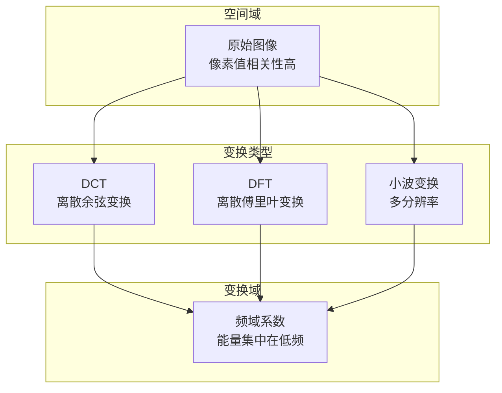
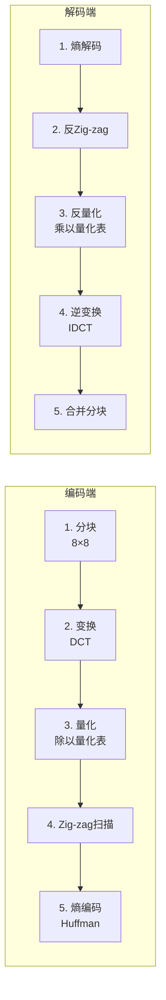
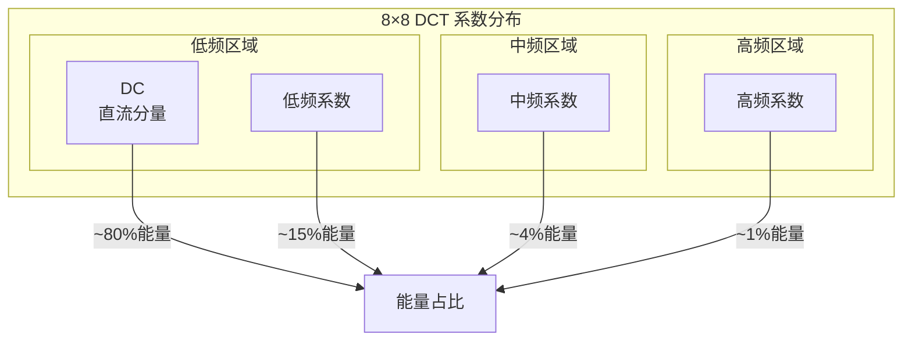
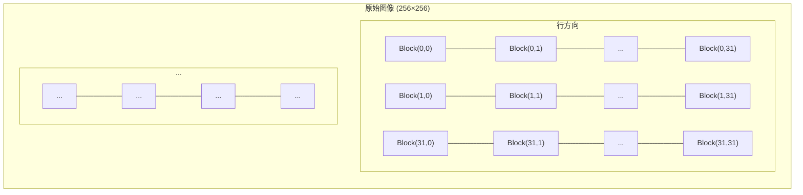
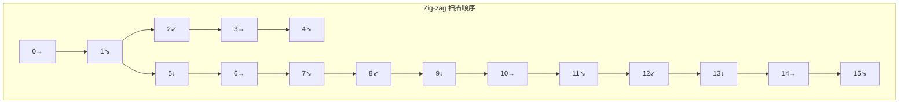

# 9.2 变换编码与DCT

## 📋 本节大纲

- [变换编码范式](#变换编码范式)
- [DCT 离散余弦变换](#dct-离散余弦变换)
- [子图像处理 (8×8分块)](#子图像处理-88分块)
- [量化与反量化](#量化与反量化)
- [Zig-zag 扫描](#zig-zag-扫描)
- [DCT 压缩实现](#dct-压缩实现)
- [本节小结](#本节小结)

---

## 变换编码范式

### 变换编码核心思想

变换编码的核心是将图像从**空间域**变换到**频域**，使能量集中在少数低频系数上，从而实现高效压缩。



### 变换编码流程



---

## DCT 离散余弦变换

### DCT 类型

DCT共有8种类型（DCT-I 到 DCT-VIII），JPEG使用 **DCT-II**。

### 一维 DCT (DCT-II)

$$
C(u) = \sum_{x=0}^{N-1} f(x) \cos\left[\frac{\pi}{N}\left(2x + 1\right)\frac{u}{2}\right]
$$

当 $u=0$ 时，$C(0) = \sum_{x=0}^{N-1} f(x)$（直流分量）。

归一化DCT：

$$
C(u) = \alpha(u) \sum_{x=0}^{N-1} f(x) \cos\left[\frac{\pi}{N}\left(2x + 1\right)\frac{u}{2}\right]
$$

其中：

$$
\alpha(u) = \begin{cases} \sqrt{\frac{1}{2N}}, & u = 0 \\ \sqrt{\frac{2}{N}}, & u \neq 0 \end{cases}
$$

### 二维 DCT

2D-DCT通过 separable 方式（先行后列）计算：

$$
C(u,v) = \sum_{x=0}^{N-1} \sum_{y=0}^{M-1} f(x,y) \cos\left[\frac{\pi}{N}(2x+1)\frac{u}{2}\right] \cos\left[\frac{\pi}{M}(2y+1)\frac{v}{2}\right]
$$

$$
C(u,v) = \alpha(u)\alpha(v) \sum_{x} \sum_{y} f(x,y) \cos\left[\frac{\pi}{N}(2x+1)\frac{u}{2}\right] \cos\left[\frac{\pi}{M}(2y+1)\frac{v}{2}\right]
$$

### DCT 矩阵表示

2D-DCT可以表示为矩阵运算：

$$
C = A \cdot F \cdot A^T
$$

其中 $A$ 为 DCT 基矩阵：

$$
A_{ux} = \alpha(u) \cos\left[\frac{\pi}{N}(2x+1)\frac{u}{2}\right]
$$

### DCT 基矩阵计算

```python
import numpy as np

def dct_matrix(N=8):
    """
    生成 N×N 的 DCT 变换矩阵
    """
    A = np.zeros((N, N))
    for u in range(N):
        for x in range(N):
            if u == 0:
                A[u, x] = np.sqrt(1 / (2 * N))
            else:
                A[u, x] = np.sqrt(2 / N) * np.cos(
                    np.pi / N * (2 * x + 1) * u / 2
                )
    return A


def dct_2d(block):
    """
    二维 DCT (类型II)
    Args:
        block: N×N 图像块
    Returns:
        dct_coeff: DCT 系数矩阵
    """
    A = dct_matrix(block.shape[0])
    dct_coeff = A @ block @ A.T
    return dct_coeff


def idct_2d(dct_coeff):
    """
    二维逆 DCT
    """
    A = dct_matrix(dct_coeff.shape[0])
    block = A.T @ dct_coeff @ A
    return block
```

### DCT 能量集中特性



### DCT 变换示例

```python
# 8×8 图像块 DCT 变换示例
block = np.array([
    [139, 144, 149, 153, 155, 155, 155, 155],
    [144, 151, 153, 156, 159, 156, 156, 156],
    [150, 155, 160, 163, 158, 160, 160, 160],
    [159, 161, 162, 162, 162, 162, 162, 162],
    [159, 161, 162, 162, 162, 162, 162, 162],
    [159, 161, 162, 162, 162, 162, 162, 162],
    [159, 161, 162, 162, 162, 162, 162, 162],
    [159, 161, 162, 162, 162, 162, 162, 162]
], dtype=np.float64)

dct_coeff = dct_2d(block)

reconstructed = idct_2d(dct_coeff)

print("DCT 系数矩阵 (整数近似):")
print(np.round(dct_coeff).astype(int))
print(f"\n重建误差: {np.max(np.abs(block - reconstructed)):.2f}")
```

---

## 子图像处理 (8×8分块)

### 分块策略

JPEG将图像分割为 8×8 的子图像块，对每个块独立进行DCT变换。



### 分块与合并实现

```python
def split_into_blocks(image, block_size=8):
    """
    将图像分割为 block_size×block_size 的块
    """
    h, w = image.shape[:2]
    blocks = []
    positions = []

    for i in range(0, h, block_size):
        for j in range(0, w, block_size):
            block = image[i:i+block_size, j:j+block_size]
            if block.shape[0] == block_size and block.shape[1] == block_size:
                blocks.append(block.astype(np.float64))
                positions.append((i, j))

    return blocks, positions


def merge_blocks(blocks, positions, image_shape, block_size=8):
    """
    将分块合并为完整图像
    """
    h, w = image_shape[:2]
    merged = np.zeros(image_shape, dtype=np.float64)

    for block, (i, j) in zip(blocks, positions):
        merged[i:i+block_size, j:j+block_size] = block

    return merged
```

### 边界处理

当图像尺寸不是8的倍数时，需要对边界进行填充（zero-padding或镜像填充）：

```python
def pad_image_to_multiple(image, block_size=8):
    """
    将图像填充为 block_size 的整数倍
    """
    h, w = image.shape[:2]
    pad_h = (block_size - h % block_size) % block_size
    pad_w = (block_size - w % block_size) % block_size

    if len(image.shape) == 3:
        padded = np.pad(
            image,
            ((0, pad_h), (0, pad_w), (0, 0)),
            mode='constant', constant_values=0
        )
    else:
        padded = np.pad(
            image,
            ((0, pad_h), (0, pad_w)),
            mode='constant', constant_values=0
        )

    return padded, (h, w)


def crop_to_original(image, original_shape):
    """
    裁剪回原始尺寸
    """
    h, w = original_shape[:2]
    return image[:h, :w]
```

---

## 量化与反量化

### 量化原理

量化是DCT压缩中**唯一的有损步骤**。通过将DCT系数除以量化表中的值并取整实现压缩。

$$
Q(u,v) = \text{round}\left(\frac{C(u,v)}{q(u,v)}\right)
$$

$$
\hat{C}(u,v) = Q(u,v) \times q(u,v)
$$

### JPEG 标准量化表

**亮度量化表** (LUMA_QUANT):

```mermaid
graph TD
    subgraph "亮度量化表 (8×8)"
        direction LR
        Q1[16] -- Q2[11] -- Q3[10] -- Q4[16] -- Q5[24] -- Q6[40] -- Q7[51] -- Q8[61]
        Q9[12] -- Q10[12] -- Q11[14] -- Q12[19] -- Q13[26] -- Q14[58] -- Q15[60] -- Q16[55]
        Q17[14] -- Q18[13] -- Q19[16] -- Q20[24] -- Q21[40] -- Q22[57] -- Q23[69] -- Q24[56]
        Q25[14] -- Q26[17] -- Q27[22] -- Q28[29] -- Q29[51] -- Q30[87] -- Q31[80] -- Q32[62]
        Q33[18] -- Q34[22] -- Q35[37] -- Q36[56] -- Q37[68] -- Q38[109] -- Q39[103] -- Q40[77]
        Q41[24] -- Q42[35] -- Q43[55] -- Q44[64] -- Q45[81] -- Q46[104] -- Q47[113] -- Q48[92]
        Q49[49] -- Q50[64] -- Q51[78] -- Q52[87] -- Q53[103] -- Q54[121] -- Q55[120] -- Q56[101]
        Q57[72] -- Q58[92] -- Q59[95] -- Q60[98] -- Q61[112] -- Q62[100] -- Q63[103] -- Q64[99]
    end
```

### 量化表定义

```python
JPEG_LUMA_QUANT = np.array([
    [16, 11, 10, 16, 24, 40, 51, 61],
    [12, 12, 14, 19, 26, 58, 60, 55],
    [14, 13, 16, 24, 40, 57, 69, 56],
    [14, 17, 22, 29, 51, 87, 80, 62],
    [18, 22, 37, 56, 68, 109, 103, 77],
    [24, 35, 55, 64, 81, 104, 113, 92],
    [49, 64, 78, 87, 103, 121, 120, 101],
    [72, 92, 95, 98, 112, 100, 103, 99]
], dtype=np.float64)

JPEG_CHROMA_QUANT = np.array([
    [17, 18, 24, 47, 99, 99, 99, 99],
    [18, 21, 26, 66, 99, 99, 99, 99],
    [24, 26, 56, 99, 99, 99, 99, 99],
    [47, 66, 99, 99, 99, 99, 99, 99],
    [99, 99, 99, 99, 99, 99, 99, 99],
    [99, 99, 99, 99, 99, 99, 99, 99],
    [99, 99, 99, 99, 99, 99, 99, 99],
    [99, 99, 99, 99, 99, 99, 99, 99]
], dtype=np.float64)
```

### 量化实现

```python
def quantize(dct_coeff, quant_table, quality=50):
    """
    量化 DCT 系数
    Args:
        dct_coeff: DCT 系数矩阵 (8×8)
        quant_table: 量化表 (8×8)
        quality: 质量因子 (1~100)
    Returns:
        quantized: 量化后的系数
    """
    if quality < 50:
        scale = 50 / quality
    else:
        scale = 200 - 2 * quality

    scaled_quant = np.round(quant_table * scale / 100).astype(np.float64)
    scaled_quant[scaled_quant == 0] = 1

    quantized = np.round(dct_coeff / scaled_quant).astype(np.int32)
    return quantized, scaled_quant


def dequantize(quantized, scaled_quant):
    """
    反量化
    """
    return quantized.astype(np.float64) * scaled_quant
```

### 量化效果可视化

```mermaid
graph LR
    subgraph "DCT系数 (量化前)"
        C["[120, -5, 3, ...]"]
    end
    subgraph "量化 (÷Q)"
        C --> Q{round(C/Q)}
    end
    subgraph "量化后 (稀疏)"
        Q1["[12, 0, 0, ...]"]
    end
    subgraph "反量化 (×Q)"
        Q1 --> D{×Q}
    end
    subgraph "重建系数 (有损)"
        D1["[160, 0, 0, ...]"]
    end

    C --> |"÷ Q(u,v)"| Q
    Q --> |"稀疏化"| Q1
    Q1 --> |"× Q(u,v)"| D
    D --> |"近似原始"| D1
```

---

## Zig-zag 扫描

### 扫描顺序

Zig-zag扫描将8×8矩阵的系数按照频率从低到高的顺序排列：



### Zig-zag 扫描实现

```python
def zigzag_order(N=8):
    """
    生成 Zig-zag 扫描的索引顺序
    """
    order = []
    for i in range(2 * N - 1):
        if i < N:
            if i % 2 == 0:
                for j in range(i + 1):
                    order.append((i - j, j))
            else:
                for j in range(i + 1):
                    order.append((j, i - j))
        else:
            diag_len = 2 * N - 1 - i
            if i % 2 == 0:
                for j in range(diag_len):
                    row = i - j
                    col = N - 1 - (diag_len - 1 - j)
                    if row < N and col < N:
                        order.append((row, col))
            else:
                for j in range(diag_len):
                    row = N - 1 - (diag_len - 1 - j)
                    col = i - j
                    if row < N and col < N:
                        order.append((row, col))
    return order


def zigzag_scan(matrix):
    """
    Zig-zag 扫描 (矩阵 → 序列)
    """
    N = matrix.shape[0]
    order = zigzag_order(N)
    return [matrix[r, c] for r, c in order]


def inverse_zigzag(sequence, N=8):
    """
    逆 Zig-zag 扫描 (序列 → 矩阵)
    """
    matrix = np.zeros((N, N), dtype=sequence.dtype if isinstance(sequence, np.ndarray) else int)
    order = zigzag_order(N)
    for idx, (r, c) in enumerate(order):
        if idx < len(sequence):
            matrix[r, c] = sequence[idx]
    return matrix
```

### Zig-zag 扫描示意

```
矩阵位置:          Zig-zag 顺序:
(0,0) (0,1) ...    0  1  2  3  4  5  6  7
(1,0) (1,1) ...    1  8  9  10 11 12 13 14
(2,0) (2,1) ...    2  7  16 17 18 19 20 21
...                3  6  15 22 23 24 25 26
                   ...
```

---

## DCT 压缩实现

### 完整 DCT 压缩管线


### 完整压缩实现

```python
import cv2
import numpy as np

class DCTCompressor:
    def __init__(self, quality=50, block_size=8):
        self.quality = quality
        self.block_size = block_size
        self.luma_quant = JPEG_LUMA_QUANT.copy()
        self.chroma_quant = JPEG_CHROMA_QUANT.copy()

    def rgb_to_ycbcr(self, image):
        return cv2.cvtColor(image, cv2.COLOR_RGB2YCrCb)

    def ycbcr_to_rgb(self, image):
        return cv2.cvtColor(image, cv2.COLOR_YCrCb2RGB)

    def chroma_subsample(self, channel):
        h, w = channel.shape
        subsampled = cv2.resize(
            channel, (w // 2, h // 2),
            interpolation=cv2.INTER_AREA
        )
        return subsampled

    def chroma_upsample(self, channel, target_shape):
        h, w = target_shape
        upsampled = cv2.resize(
            channel, (w, h),
            interpolation=cv2.INTER_LINEAR
        )
        return upsampled

    def encode_channel(self, channel):
        h, w = channel.shape
        padded, orig_shape = pad_image_to_multiple(channel, self.block_size)
        blocks, positions = split_into_blocks(padded, self.block_size)

        quantized_blocks = []
        for block in blocks:
            dct_coeff = dct_2d(block)
            quantized, _ = quantize(dct_coeff, self.luma_quant, self.quality)
            quantized_blocks.append(quantized)

        return quantized_blocks, positions, orig_shape

    def decode_channel(self, quantized_blocks, positions, original_shape):
        reconstructed_blocks = []
        for quantized in quantized_blocks:
            dequantized = dequantize(quantized, self.luma_quant)
            block = idct_2d(dequantized)
            reconstructed_blocks.append(np.clip(block, 0, 255))

        merged = merge_blocks(
            reconstructed_blocks, positions,
            (max(p for p, _ in positions) + self.block_size,
             max(p for _, p in positions) + self.block_size),
            self.block_size
        )
        return crop_to_original(merged, original_shape)

    def compress(self, image):
        ycbcr = self.rgb_to_ycbcr(image.astype(np.uint8))

        y_channel = ycbcr[:, :, 0].astype(np.float64)
        cr_channel = ycbcr[:, :, 1].astype(np.float64)
        cb_channel = ycbcr[:, :, 2].astype(np.float64)

        cr_sub = self.chroma_subsample(cr_channel)
        cb_sub = self.chroma_subsample(cb_channel)

        y_encoded, y_positions, y_shape = self.encode_channel(y_channel)
        cr_encoded, cr_positions, cr_shape = self.encode_channel(cr_sub)
        cb_encoded, cb_positions, cb_shape = self.encode_channel(cb_sub)

        return {
            'Y': (y_encoded, y_positions, y_shape),
            'Cr': (cr_encoded, cr_positions, cr_shape),
            'Cb': (cb_encoded, cb_positions, cb_shape),
            'original_shape': image.shape
        }

    def decompress(self, compressed):
        y_enc, y_pos, y_shape = compressed['Y']
        cr_enc, cr_pos, cr_shape = compressed['Cr']
        cb_enc, cb_pos, cb_shape = compressed['Cb']

        y_decoded = self.decode_channel(y_enc, y_pos, y_shape)
        cr_decoded_sub = self.decode_channel(cr_enc, cr_pos, cr_shape)
        cb_decoded_sub = self.decode_channel(cb_enc, cb_pos, cb_shape)

        h, w = compressed['original_shape'][:2]
        cr_decoded = self.chroma_upsample(cr_decoded_sub, (h, w))
        cb_decoded = self.chroma_upsample(cb_decoded_sub, (h, w))

        ycbcr = np.stack([y_decoded, cr_decoded, cb_decoded], axis=2)
        reconstructed = self.ycbcr_to_rgb(ycbcr.astype(np.uint8))

        return reconstructed
```

### DCT 压缩效果评估

```python
def dct_compression_demo(image_path, qualities=None):
    """
    不同质量因子的 DCT 压缩对比
    """
    if qualities is None:
        qualities = [10, 30, 50, 70, 90]

    image = cv2.imread(image_path)
    image_rgb = cv2.cvtColor(image, cv2.COLOR_BGR2RGB)

    results = []
    for q in qualities:
        compressor = DCTCompressor(quality=q)
        compressed = compressor.compress(image_rgb)
        reconstructed = compressor.decompress(compressed)

        metrics = compute_metrics(image_rgb, reconstructed)

        original_size = image_rgb.size * 8
        total_coeffs = sum(
            len(block.flatten())
            for blocks, _, _ in compressed.values()
            if isinstance(blocks, list)
            for block in blocks
        )
        compressed_size = total_coeffs * 4 * 8
        ratio = original_size / compressed_size if compressed_size > 0 else 1

        results.append({
            'quality': q,
            'PSNR': metrics['PSNR'],
            'SSIM': metrics['SSIM'],
            'compression_ratio': ratio
        })

        print(f"Q={q:3d}: PSNR={metrics['PSNR']:.2f}dB, "
              f"SSIM={metrics['SSIM']:.4f}, "
              f"压缩比={ratio:.2f}:1")

    return results
```

### OpenCV 内置 JPEG 压缩

```python
def opencv_jpeg_demo(image_path):
    """
    使用 OpenCV 内置 JPEG 压缩
    """
    image = cv2.imread(image_path)

    for quality in [10, 30, 50, 70, 95, 100]:
        encode_param = [cv2.IMWRITE_JPEG_QUALITY, quality]
        _, encoded = cv2.imencode('.jpg', image, encode_param)
        decoded = cv2.imdecode(encoded, cv2.IMREAD_COLOR)

        metrics = compute_metrics(image, decoded)
        original_bytes = image.nbytes
        compressed_bytes = len(encoded)

        print(f"质量={quality:3d}: "
              f"大小={compressed_bytes:6d}B "
              f"(压缩比={original_bytes/compressed_bytes:.2f}:1), "
              f"PSNR={metrics['PSNR']:.2f}dB")
```

---

## 本节小结

### DCT 核心公式

| 公式 | 表达式 | 说明 |
|------|--------|------|
| 1D-DCT | $C(u) = \alpha(u)\sum f(x)\cos[\frac{\pi}{N}(2x+1)\frac{u}{2}]$ | 一维DCT-II |
| 2D-DCT | $C(u,v) = \alpha(u)\alpha(v)\sum\sum f(x,y)\cos[\frac{\pi}{N}(2x+1)\frac{u}{2}]\cos[\frac{\pi}{M}(2y+1)\frac{v}{2}]$ | 二维DCT |
| 矩阵形式 | $C = AFA^T$ | 矩阵乘法 |
| 量化 | $Q = \text{round}(C / q)$ | 有损压缩 |
| 反量化 | $\hat{C} = Q \times q$ | 恢复近似DCT系数 |

### JPEG 压缩流程

1. **色彩空间变换**：RGB → YCbCr，色度子采样 4:2:0
2. **分块**：将图像分为 8×8 子块
3. **DCT变换**：对每个8×8块做二维DCT
4. **量化**：除以量化表（唯一有损步骤）
5. **Zig-zag扫描**：按频率顺序将2D系数转为1D序列
6. **熵编码**：Huffman编码或算术编码

### 课后练习

1. 手写计算 4×4 图像块的 DCT 系数（使用 DCT-II 公式）
2. 实现完整的 DCT 压缩/解压管线，并与 OpenCV 内置 JPEG 对比
3. 修改量化表（如将所有值减半），观察压缩率和图像质量的变化
4. 实现色彩空间变换 + 色度子采样，并验证其对压缩质量的影响
5. 进阶：在DCT压缩管线中加入 Huffman 熵编码步骤