# 9.3 标准压缩算法

## 📋 本节大纲

- [JPEG 标准](#jpeg-标准)
- [JPEG2000](#jpeg2000)
- [PNG 无损压缩](#png-无损压缩)
- [视频压缩基础](#视频压缩基础)
- [压缩算法对比](#压缩算法对比)
- [OpenCV 实战](#opencv-实战)
- [本节小结](#本节小结)

---

## JPEG 标准

### JPEG 编码流程


### JPEG 解码流程

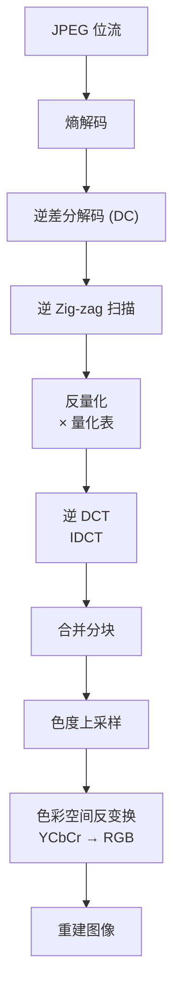

### JPEG 关键技术细节

#### 色彩空间与色度子采样

JPEG使用YCbCr色彩空间，利用人眼对色度不敏感的特性进行色度子采样：

| 采样格式 | Y | Cb | Cr | 压缩比 |
|---------|---|----|----|--------|
| 4:4:4 | 1 | 1 | 1 | 无压缩 |
| 4:2:2 | 2 | 1 | 1 | 2:1 (色度) |
| **4:2:0** | 4 | 1 | 1 | **4:1 (色度)** |
| 4:1:1 | 4 | 1 | 1 | 4:1 (色度) |

4:2:0 是最常用的格式，色度分辨率为亮度的1/4。

#### DC 系数差分编码

每个8×8块有一个DC系数（直流分量），相邻块的DC系数高度相关：

$$
\text{DC}_{\text{diff}} = \text{DC}_i - \text{DC}_{i-1}
$$

对DC差值进行Huffman编码，AC系数使用游程编码+Huffman编码。

#### JPEG 文件结构

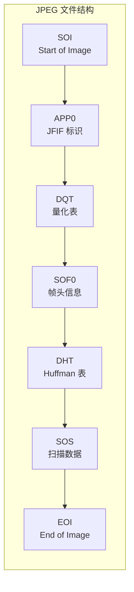

### JPEG 压缩实现

```python
import cv2
import numpy as np

def jpeg_compress(image, quality=75, subsampling='4:2:0'):
    """
    JPEG 压缩 (使用 OpenCV 内置)
    Args:
        image: 输入图像 (BGR, uint8)
        quality: JPEG 质量 (0~100)
        subsampling: 色度采样格式
    Returns:
        compressed_bytes: 压缩后的字节
        compressed_image: 解压后的图像
    """
    encode_params = [cv2.IMWRITE_JPEG_QUALITY, quality]

    if subsampling == '4:4:4':
        encode_params.extend([cv2.IMWRITE_JPEG_CHROMA_SUBSAMPLING, 0])
    elif subsampling == '4:2:2':
        encode_params.extend([cv2.IMWRITE_JPEG_CHROMA_SUBSAMPLING, 1])
    elif subsampling == '4:2:0':
        encode_params.extend([cv2.IMWRITE_JPEG_CHROMA_SUBSAMPLING, 2])

    _, buf = cv2.imencode('.jpg', image, encode_params)
    compressed = cv2.imdecode(buf, cv2.IMREAD_COLOR)

    return buf, compressed


def jpeg_compression_analysis(image_path):
    """
    JPEG 压缩全面分析
    """
    image = cv2.imread(image_path)

    print("=" * 60)
    print("JPEG 压缩分析")
    print("=" * 60)

    for quality in [10, 30, 50, 70, 90, 95, 100]:
        buf, compressed = jpeg_compress(image, quality)

        original_bytes = image.nbytes
        compressed_bytes = len(buf)

        metrics = compute_metrics(image.astype(np.float64), compressed.astype(np.float64))

        print(f"\nQ={quality:3d}:")
        print(f"  文件大小: {compressed_bytes:8d} B "
              f"(压缩比: {original_bytes/compressed_bytes:.2f}:1)")
        print(f"  PSNR: {metrics['PSNR']:.2f} dB")
        print(f"  SSIM: {metrics['SSIM']:.4f}")
        print(f"  MSE:  {metrics['MSE']:.2f}")
```

### JPEG 编码解码示意图

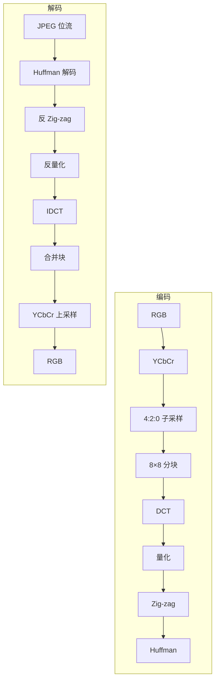

---

## JPEG2000

### JPEG2000 vs JPEG

| 属性 | JPEG | JPEG2000 |
|------|------|----------|
| **变换** | DCT (块状) | DWT (小波) |
| **压缩比** | 10:1 ~ 20:1 | 20:1 ~ 50:1 |
| **块效应** | 有 (方块模糊) | 无 (平滑) |
| **可伸缩性** | 不支持 | 支持分辨率/质量渐进 |
| **ROI** | 不支持 | 支持感兴趣区域编码 |
| **实现复杂度** | 低 | 高 |

### JPEG2000 编码流程

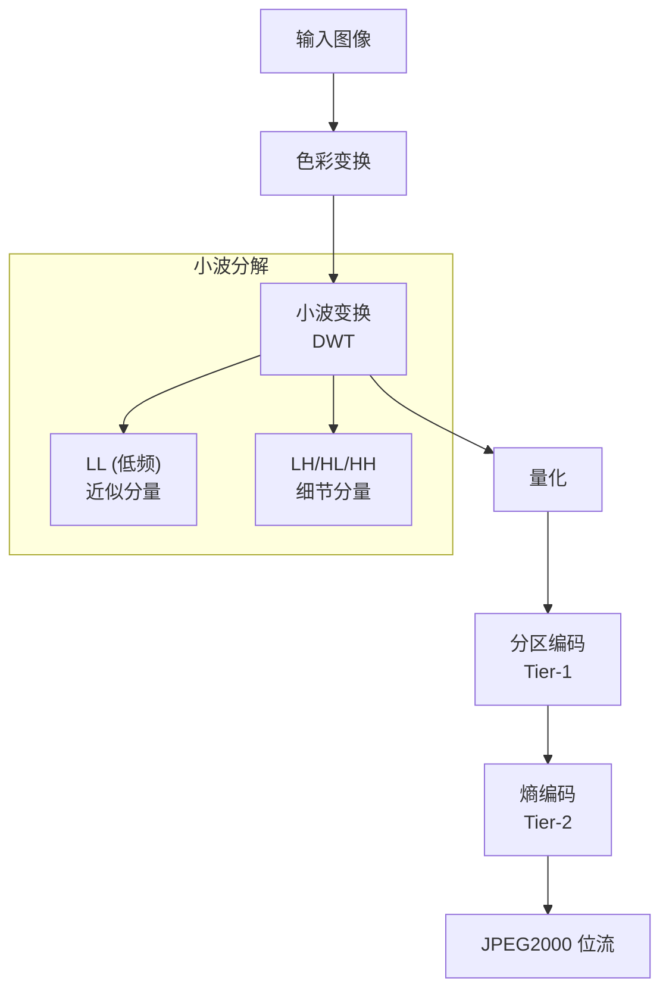

### 小波变换基础

JPEG2000使用 **Daubechies 9/7 小波**（有损）或 **LeGall 5/3 小波**（无损）。

```mermaid
graph TD
    subgraph "小波分解 (二层)"
        direction TB
        subgraph "Level 1"
            LL1["LL₁"] -- LH1["LH₁"]
            HL1["HL₁"] -- HH1["HH₁"]
        end
        subgraph "Level 2"
            LL2["LL₂"] -- LH2["LH₂"]
            HL2["HL₂"] -- HH2["HH₂"]
        end
        LL1 --> LL2
        LL1 --> LH2
        LL1 --> HL2
        LL1 --> HH2
    end
```

### JPEG2000 核心特性

1. **多分辨率表示**：小波变换天然支持多尺度表示
2. **渐进传输**：可以逐步提高图像质量
3. **ROI 编码**：对感兴趣区域使用更高质量编码
4. **差错恢复**：支持鲁棒的传输
5. **无损/有损**：支持从无损到有损的连续调整

### JPEG2000 实现

```python
def jpeg2000_compress(image_path, quality=500):
    """
    JPEG2000 压缩
    Args:
        image_path: 图像路径
        quality: 压缩质量 (0~1000, 值越大质量越高)
    Returns:
        compressed_bytes: 压缩数据
        reconstructed: 解压后的图像
    """
    image = cv2.imread(image_path)

    encode_params = [cv2.IMWRITE_JPEG2000_COMPRESSION_XFACTOR, quality]

    _, buf = cv2.imencode('.jp2', image, encode_params)

    reconstructed = cv2.imdecode(buf, cv2.IMREAD_COLOR)

    original_bytes = image.nbytes
    ratio = original_bytes / len(buf)

    metrics = compute_metrics(image.astype(np.float64), reconstructed.astype(np.float64))

    print(f"JPEG2000 压缩:")
    print(f"  原始大小: {original_bytes} bytes")
    print(f"  压缩后:   {len(buf)} bytes")
    print(f"  压缩比:   {ratio:.2f}:1")
    print(f"  PSNR:     {metrics['PSNR']:.2f} dB")

    return buf, reconstructed
```

---

## PNG 无损压缩

### PNG 设计

PNG (Portable Network Graphics) 是一种**无损**图像压缩格式。

### PNG 核心技术

1. **滤波 (Filtering)**：在压缩前对每行像素进行预测滤波
2. **DEFLATE 压缩**：使用 zlib 压缩算法（LZ77 + Huffman）
3. **自适应调色板**：支持 1/2/4/8/24/32 位色深

### PNG 编码流程

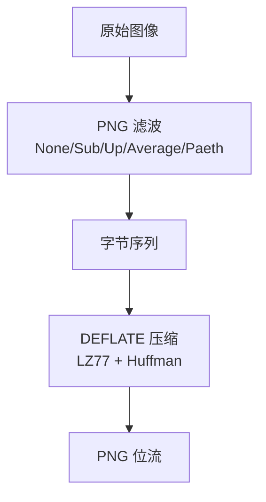

### PNG 滤波器

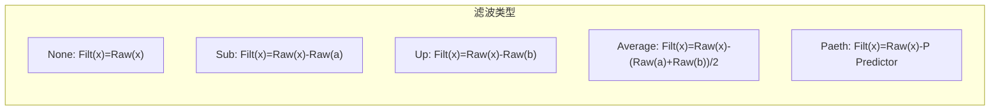

### PNG 压缩示例

```python
def png_compress(image_path, compress_level=9):
    """
    PNG 无损压缩
    Args:
        image_path: 图像路径
        compress_level: 压缩级别 (0~9)
    Returns:
        compressed_bytes: 压缩数据
        reconstructed: 解压后的图像
    """
    image = cv2.imread(image_path)

    encode_params = [cv2.IMWRITE_PNG_COMPRESSION, compress_level]

    _, buf = cv2.imencode('.png', image, encode_params)

    reconstructed = cv2.imdecode(buf, cv2.IMREAD_COLOR)

    original_bytes = image.nbytes
    ratio = original_bytes / len(buf)

    is_lossless = np.array_equal(image, reconstructed)

    print(f"PNG 压缩 (level={compress_level}):")
    print(f"  原始大小: {original_bytes} bytes")
    print(f"  压缩后:   {len(buf)} bytes")
    print(f"  压缩比:   {ratio:.2f}:1")
    print(f"  无损还原: {'是' if is_lossless else '否'}")

    return buf, reconstructed


def compare_png_compression_levels(image_path):
    """
    对比不同 PNG 压缩级别
    """
    image = cv2.imread(image_path)
    original_size = image.nbytes

    for level in range(0, 10):
        encode_params = [cv2.IMWRITE_PNG_COMPRESSION, level]
        _, buf = cv2.imencode('.png', image, encode_params)
        print(f"Level {level}: {len(buf):8d} bytes "
              f"(压缩比 {original_size/len(buf):.2f}:1)")
```

### PNG 文件结构

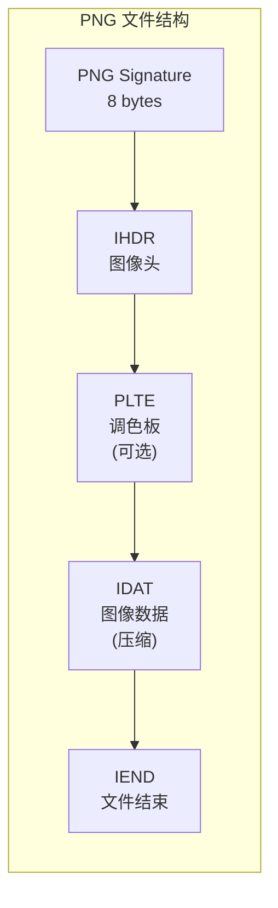

---

## 视频压缩基础

### 视频压缩核心思想

视频由连续帧组成，帧间存在强相关性（时间冗余）。

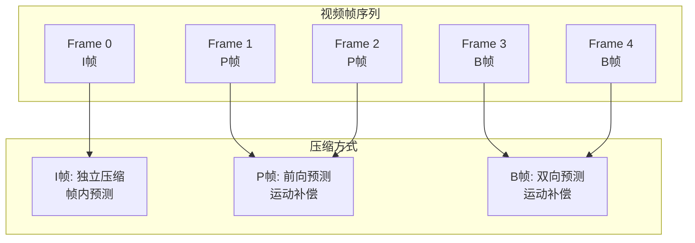

### 运动估计与运动补偿

#### 运动估计

搜索当前帧在参考帧中的最佳匹配块：

$$
\text{motion\_vector} = \arg\min_{(dx,dy)} \sum_{(x,y)\in block} |I_t(x,y) - I_{t-1}(x+dx, y+dy)|
$$

#### 运动补偿

利用运动向量从参考帧预测当前帧：

$$
\hat{I}_t(x,y) = I_{t-1}(x + dx, y + dy)
$$

#### 帧类型

| 帧类型 | 预测方式 | 压缩效率 | 用途 |
|--------|---------|---------|------|
| **I帧** | 独立编码 | 低 | 随机访问、恢复点 |
| **P帧** | 前向预测 | 中 | 依赖前面的I/P帧 |
| **B帧** | 双向预测 | 高 | 依赖前后的I/P帧 |

### H.264 编码

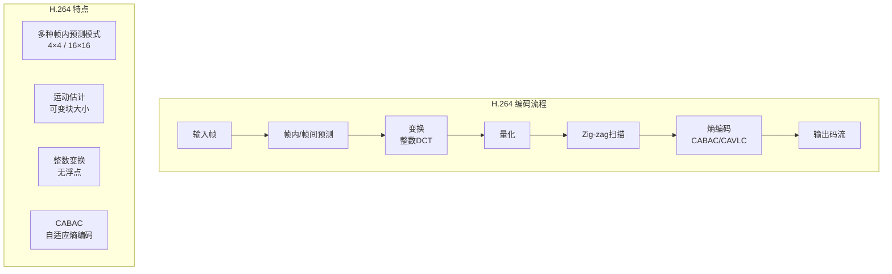

### H.264 vs H.265

| 属性 | H.264 | H.265 (HEVC) |
|------|-------|-------------|
| **块大小** | 4×4 ~ 16×16 | 最大 64×64 (CTU) |
| **变换** | 整数DCT | DCT + DST 自适应 |
| **帧内预测** | 9种模式 | 35种模式 |
| **运动向量** | 1/4像素 | 1/4 + 1/2像素 |
| **压缩效率** | 基准 | 比H.264高50% |
| **计算复杂度** | 中 | 高 |

### 视频压缩实现

```python
def video_frame_compression_demo(video_path):
    """
    视频帧压缩演示
    """
    cap = cv2.VideoCapture(video_path)

    fps = cap.get(cv2.CAP_PROP_FPS)
    frame_count = int(cap.get(cv2.CAP_PROP_FRAME_COUNT))
    width = int(cap.get(cv2.CAP_PROP_FRAME_WIDTH))
    height = int(cap.get(cv2.CAP_PROP_FRAME_HEIGHT))

    print(f"视频信息: {width}×{height}, {fps:.2f}fps, 共{frame_count}帧")

    frame_idx = 0
    compressed_sizes = []

    while True:
        ret, frame = cap.read()
        if not ret:
            break

        encode_params = [cv2.IMWRITE_JPEG_QUALITY, 80]
        _, buf = cv2.imencode('.jpg', frame, encode_params)
        compressed_sizes.append(len(buf))

        if frame_idx == 0:
            print(f"I帧大小: {len(buf)} bytes")
        elif frame_idx == 1:
            print(f"P帧大小: {len(buf)} bytes")

        frame_idx += 1
        if frame_idx >= 100:
            break

    cap.release()

    avg_size = np.mean(compressed_sizes)
    print(f"\n平均每帧大小: {avg_size:.0f} bytes")
    print(f"平均码率: {avg_size * 8 * fps / 1e6:.2f} Mbps")


def motion_estimation_demo():
    """
    运动估计演示 (块匹配)
    """
    prev_frame = np.random.randint(0, 255, (240, 320), dtype=np.uint8)
    curr_frame = np.roll(prev_frame, shift=3, axis=1)

    block_size = 16
    search_range = 8

    h, w = prev_frame.shape
    vectors = []

    for i in range(0, h - block_size, block_size):
        for j in range(0, w - block_size, block_size):
            best_sad = float('inf')
            best_mv = (0, 0)

            for dy in range(-search_range, search_range + 1):
                for dx in range(-search_range, search_range + 1):
                    ref_block = prev_frame[
                        i+dy:i+dy+block_size,
                        j+dx:j+dx+block_size
                    ]
                    curr_block = curr_frame[i:i+block_size, j:j+block_size]

                    sad = np.sum(np.abs(
                        ref_block.astype(int) - curr_block.astype(int)
                    ))

                    if sad < best_sad:
                        best_sad = sad
                        best_mv = (dx, dy)

            vectors.append({
                'position': (i, j),
                'motion_vector': best_mv,
                'sad': best_sad
            })

    print(f"运动估计完成: {len(vectors)} 个块")
    for v in vectors[:5]:
        print(f"  位置{v['position']}: MV={v['motion_vector']}, "
              f"SAD={v['sad']}")

    return vectors
```

---

## 压缩算法对比

### 综合对比表

| 属性 | JPEG | JPEG2000 | PNG | WebP | H.264 | H.265 |
|------|------|----------|-----|------|-------|-------|
| **类型** | 有损 | 有损/无损 | 无损 | 有损/无损 | 有损 | 有损 |
| **变换** | DCT | 小波 | None | 小波 | 整数DCT | DCT/DST |
| **压缩比** | 10:1 | 20:1 | 2:1 | 30:1 | 100:1 | 200:1 |
| **块效应** | 有 | 无 | 无 | 无 | 有 | 小 |
| **支持动画** | 否 | 否 | 是 | 是 | 否 | 否 |
| **渐进** | 否 | 是 | 否 | 否 | 否 | 否 |
| **ROI** | 否 | 是 | 否 | 否 | 否 | 是 |
| **专利** | 公开 | 公开 | 免费 | 免费 | 专利 | 专利 |

### 应用场景

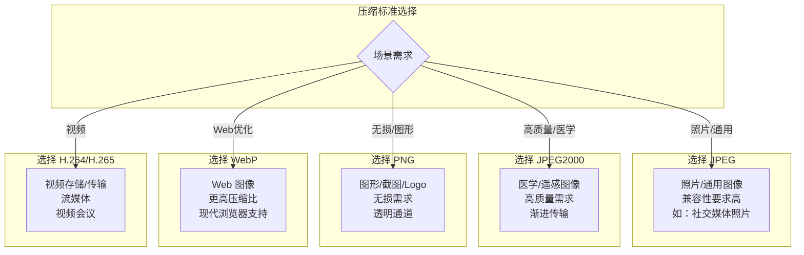

### 压缩比参考

| 压缩标准 | 典型压缩比 | 10MB 原始 → 压缩后 |
|---------|-----------|-------------------|
| JPEG (Q=75) | 10:1 | ~1 MB |
| JPEG (Q=50) | 20:1 | ~500 KB |
| JPEG2000 | 30:1 | ~333 KB |
| PNG | 2:1 | ~5 MB |
| WebP (lossy) | 30:1 | ~333 KB |
| H.264 | 100:1 | ~100 KB |
| H.265 | 200:1 | ~50 KB |

---

## OpenCV 实战

### 多格式压缩对比

```python
def compare_formats(image_path, qualities=None):
    """
    对比多种图像格式的压缩性能
    """
    if qualities is None:
        qualities = [10, 30, 50, 70, 90]

    image = cv2.imread(image_path)
    original_bytes = image.nbytes

    results = {}

    for q in qualities:
        encode_params = [cv2.IMWRITE_JPEG_QUALITY, q]
        _, buf = cv2.imencode('.jpg', image, encode_params)
        decoded = cv2.imdecode(buf, cv2.IMREAD_COLOR)
        metrics = compute_metrics(image.astype(np.float64), decoded.astype(np.float64))
        results[f'JPEG_Q{q}'] = {
            'size': len(buf),
            'ratio': original_bytes / len(buf),
            'PSNR': metrics['PSNR'],
            'SSIM': metrics['SSIM']
        }

    png_params = [cv2.IMWRITE_PNG_COMPRESSION, 9]
    _, png_buf = cv2.imencode('.png', image, png_params)
    png_decoded = cv2.imdecode(png_buf, cv2.IMREAD_COLOR)
    png_metrics = compute_metrics(
        image.astype(np.float64), png_decoded.astype(np.float64)
    )
    results['PNG'] = {
        'size': len(png_buf),
        'ratio': original_bytes / len(png_buf),
        'PSNR': png_metrics['PSNR'],
        'SSIM': png_metrics['SSIM']
    }

    try:
        jp2_params = [cv2.IMWRITE_JPEG2000_COMPRESSION_XFACTOR, 500]
        _, jp2_buf = cv2.imencode('.jp2', image, jp2_params)
        jp2_decoded = cv2.imdecode(jp2_buf, cv2.IMREAD_COLOR)
        jp2_metrics = compute_metrics(
            image.astype(np.float64), jp2_decoded.astype(np.float64)
        )
        results['JPEG2000'] = {
            'size': len(jp2_buf),
            'ratio': original_bytes / len(jp2_buf),
            'PSNR': jp2_metrics['PSNR'],
            'SSIM': jp2_metrics['SSIM']
        }
    except Exception:
        pass

    print("图像格式压缩对比:")
    print("-" * 70)
    print(f"{'格式':<15} {'大小(B)':>10} {'压缩比':>8} {'PSNR(dB)':>10} {'SSIM':>8}")
    print("-" * 70)

    for name, info in results.items():
        print(f"{name:<15} {info['size']:>10} "
              f"{info['ratio']:>7.2f}:1 {info['PSNR']:>10.2f} "
              f"{info['SSIM']:>8.4f}")

    return results
```

### 视频读写演示

```python
def video_codec_demo(input_path, output_path, codec='H264'):
    """
    视频编解码演示
    """
    cap = cv2.VideoCapture(input_path)

    fps = cap.get(cv2.CAP_PROP_FPS)
    width = int(cap.get(cv2.CAP_PROP_FRAME_WIDTH))
    height = int(cap.get(cv2.CAP_PROP_FRAME_HEIGHT))

    fourcc_map = {
        'H264': cv2.VideoWriter_fourcc(*'avc1'),
        'H265': cv2.VideoWriter_fourcc(*'hvc1'),
        'MJPG': cv2.VideoWriter_fourcc(*'MJPG'),
        'XVID': cv2.VideoWriter_fourcc(*'XVID'),
    }

    fourcc = fourcc_map.get(codec, fourcc_map['MJPG'])
    out = cv2.VideoWriter(output_path, fourcc, fps, (width, height))

    frame_count = 0
    while True:
        ret, frame = cap.read()
        if not ret:
            break
        out.write(frame)
        frame_count += 1

    cap.release()
    out.release()

    original_size = os.path.getsize(input_path)
    compressed_size = os.path.getsize(output_path)
    ratio = original_size / compressed_size

    print(f"视频编码 ({codec}):")
    print(f"  帧数: {frame_count}")
    print(f"  原始大小: {original_size:,} bytes")
    print(f"  压缩后:   {compressed_size:,} bytes")
    print(f"  压缩比:   {ratio:.2f}:1")
```

### 压缩标准集成管线

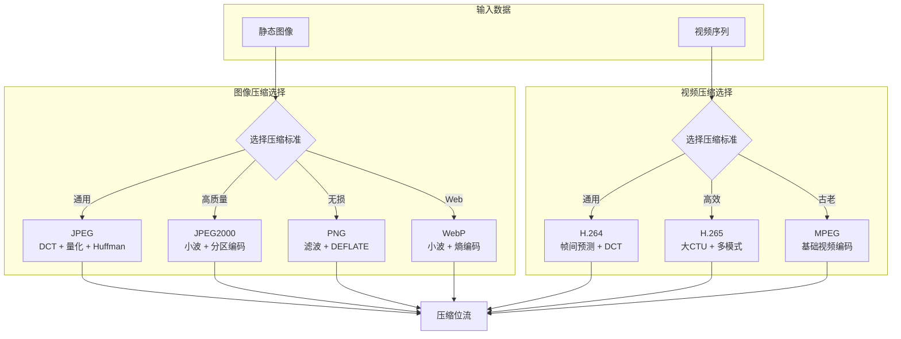

---

## 本节小结

### 标准对比总结

| 标准 | 核心技术 | 压缩比 | 典型应用 |
|------|---------|--------|---------|
| **JPEG** | DCT + 量化 + Huffman | 10:1 ~ 20:1 | 数字照片、互联网图像 |
| **JPEG2000** | 小波变换 + 分区编码 | 20:1 ~ 50:1 | 医学影像、卫星遥感 |
| **PNG** | 滤波 + DEFLATE (无损) | 2:1 ~ 5:1 | 图形、截图、透明图像 |
| **WebP** | 小波 + 熵编码 | 30:1 ~ 50:1 | Web图像优化 |
| **H.264** | 帧间预测 + 整数DCT | 100:1+ | 视频存储、流媒体 |
| **H.265** | 大CTU + 自适应变换 | 200:1+ | 4K/8K视频、VR |

### JPEG 核心流程回顾

1. RGB → YCbCr（色彩解相关）
2. 色度子采样 4:2:0（利用视觉特性）
3. 8×8 分块（便于DCT处理）
4. DCT 变换（能量集中到低频）
5. 量化（有损压缩，唯一失真步骤）
6. Zig-zag 扫描（低频优先）
7. Huffman 熵编码（无损编码）

### 课后练习

1. 使用OpenCV将一幅图像分别保存为JPEG(Q=75)、PNG、JPEG2000格式，对比文件大小和PSNR
2. 实现基于块匹配的运动估计，并验证运动补偿的有效性
3. 编程实现简化版JPEG压缩：DCT + 量化 + Zig-zag + RLE
4. 对比H.264与H.265在相同视频上的压缩效率（使用OpenCV的VideoWriter）
5. 进阶：实现一个简单的图像格式转换器，支持JPEG↔PNG↔JPEG2000互转