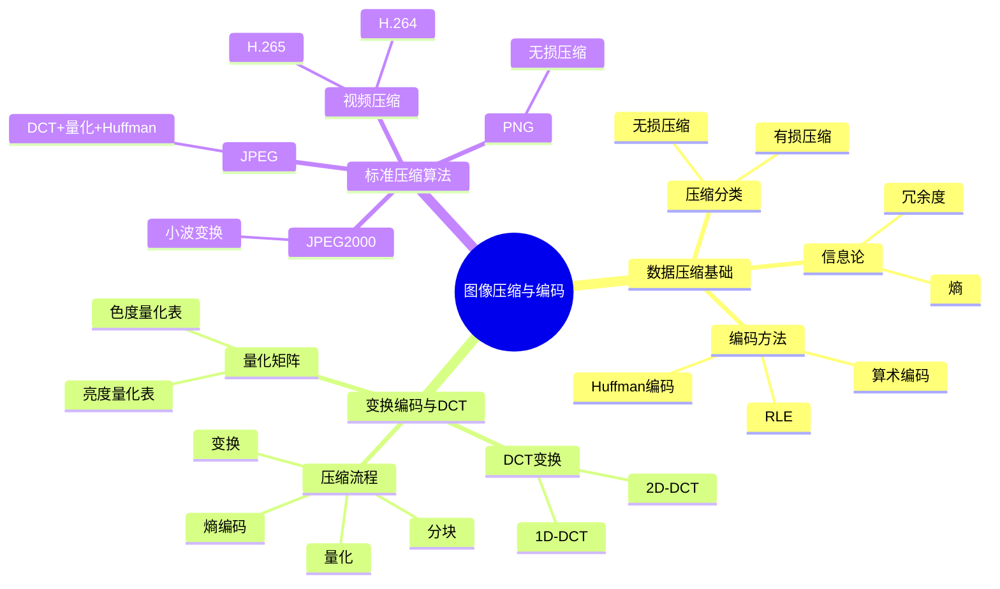

# 第9章 图像压缩与编码 — 思维导图与导航

## 📑 章节导航

| 节次 | 主题 | 核心知识点 |
|------|------|-----------|
| [9.1 数据压缩基础](#91-数据压缩基础) | 信息论与编码理论 | 熵、冗余、失真准则、Huffman编码、算术编码、RLE |
| [9.2 变换编码与DCT](#92-变换编码与dct) | 基于变换的压缩 | DCT公式、8×8分块、量化、Zig-zag扫描 |
| [9.3 标准压缩算法](#93-标准压缩算法) | 工业标准 | JPEG、JPEG2000、PNG、视频压缩 |

## 🗺️ 学习路线图

## 🎯 核心考点

### 高频考点
1. **信息熵计算** — $H(X) = -\sum p(x)\log_2 p(x)$，信源编码定理
2. **DCT变换公式** — 2D-DCT的数学表达式及其性质
3. **JPEG压缩流程** — 分块→DCT→量化→Zig-zag→Huffman
4. **Huffman编码** — 构造方法、平均码长、与熵的关系
5. **MSE与PSNR** — 图像质量评价指标的计算

### 公式速查

| 公式 | 表达式 | 含义 |
|------|--------|------|
| 信息熵 | $H(X) = -\sum p(x)\log_2 p(x)$ | 信源平均信息量 |
| 平均码长 | $\bar{L} = \sum p(x) l(x)$ | 编码平均长度 |
| 信源编码定理 | $\bar{L} \geq H(X)$ | 下界为熵 |
| MSE | $\text{MSE} = \frac{1}{MN}\sum(I - \hat{I})^2$ | 均方误差 |
| PSNR | $\text{PSNR} = 10\log_{10}(MAX^2/\text{MSE})$ | 峰值信噪比 |
| 1D-DCT | $C(u) = \sum f(x)\cos[\frac{(2x+1)u\pi}{2N}]$ | 一维DCT |
| 2D-DCT | $C(u,v) = \sum\sum f(x,y)\cos[\frac{(2x+1)u\pi}{2N}]\cos[\frac{(2y+1)v\pi}{2N}]$ | 二维DCT |

## 📝 自测题

### 基础题
1. 计算信源 $X = \{a, b, c, d\}$，概率分别为 $\{0.5, 0.25, 0.125, 0.125\}$ 的信息熵。
2. 什么是 Huffman 编码？证明其平均码长满足 $H(X) \leq \bar{L} < H(X) + 1$。
3. 描述 JPEG 压缩的完整流程，标注哪些步骤是有损的。

### 应用题
4. 给定一个 8×8 像素块，计算其 2D-DCT 变换系数（手写推导）。
5. 用 Python 实现 Huffman 编码，并对一幅灰度图像进行压缩，计算压缩比。
6. 实现 DCT 压缩：对一幅图像分块 → DCT → 量化 → 反量化 → IDCT，可视化各步骤效果。

### 考研真题
7. （2023 考研408）解释 DCT 变换在图像压缩中的作用，为什么 JPEG 选择 DCT 而不是 FFT？
8. （2022 考研408）描述 JPEG 压缩中量化表的作用及其对压缩质量的影响。
9. （2021 考研408）比较 Huffman 编码与算术编码的异同，哪种编码的压缩效率更高？为什么？

## 🔗 相关章节

- **前置**: [[第8章 图像特征提取]] — 特征可用于压缩
- **后续**: [[第10章 图像理解与模式识别]] — 压缩后的图像用于传输与识别
- **拓展**: [[第11章 图像通信与传输]] — 压缩编码的实际应用场景