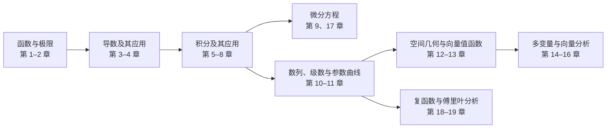

# 托马斯微积分

本 MOC 是《Thomas' Calculus》第 15 版知识笔记的课程级根节点。目录采用“课程 MOC → 章节 MOC → 小节笔记”的三级树形结构；全书从函数、极限和导数出发，依次建立单变量积分、无穷级数、多变量微积分与向量分析，并延伸到微分方程、复函数、傅里叶级数和小波。

> [!abstract] 快速入口
> **单变量基础：** [[数学基础/托马斯微积分/知识点/Chapter 01 Functions/MOC - Chapter 01 Functions|函数]] → [[数学基础/托马斯微积分/知识点/Chapter 02 Limits and Continuity/MOC - Chapter 02 Limits and Continuity|极限与连续]] → [[数学基础/托马斯微积分/知识点/Chapter 03 Derivatives/MOC - Chapter 03 Derivatives|导数]] → [[数学基础/托马斯微积分/知识点/Chapter 05 Integrals/MOC - Chapter 05 Integrals|积分]]
>
> **级数与参数曲线：** [[数学基础/托马斯微积分/知识点/Chapter 10 Infinite Sequences and Series/MOC - Chapter 10 Infinite Sequences and Series|无穷数列与级数]] → [[数学基础/托马斯微积分/知识点/Chapter 11 Parametric Equations and Polar Coordinates/MOC - Chapter 11 Parametric Equations and Polar Coordinates|参数方程与极坐标]]
>
> **多变量与向量分析：** [[数学基础/托马斯微积分/知识点/Chapter 12 Vectors and the Geometry of Space/MOC - Chapter 12 Vectors and the Geometry of Space|空间向量与几何]] → [[数学基础/托马斯微积分/知识点/Chapter 14 Partial Derivatives/MOC - Chapter 14 Partial Derivatives|偏导数]] → [[数学基础/托马斯微积分/知识点/Chapter 15 Multiple Integrals/MOC - Chapter 15 Multiple Integrals|多重积分]] → [[数学基础/托马斯微积分/知识点/Chapter 16 Integrals and Vector Fields/MOC - Chapter 16 Integrals and Vector Fields|向量场积分]]

## 知识主线



## 章节导航

### 一、单变量微积分

1. [[数学基础/托马斯微积分/知识点/Chapter 01 Functions/MOC - Chapter 01 Functions|Chapter 01 Functions]] — 函数、图像、函数变换与三角函数。
2. [[数学基础/托马斯微积分/知识点/Chapter 02 Limits and Continuity/MOC - Chapter 02 Limits and Continuity|Chapter 02 Limits and Continuity]] — 变化率、极限、连续性与精确定义。
3. [[数学基础/托马斯微积分/知识点/Chapter 03 Derivatives/MOC - Chapter 03 Derivatives|Chapter 03 Derivatives]] — 导数定义、求导规则、隐函数与线性化。
4. [[数学基础/托马斯微积分/知识点/Chapter 04 Applications of Derivatives/MOC - Chapter 04 Applications of Derivatives|Chapter 04 Applications of Derivatives]] — 极值、中值定理、曲线分析、优化与相关变化率。
5. [[数学基础/托马斯微积分/知识点/Chapter 05 Integrals/MOC - Chapter 05 Integrals|Chapter 05 Integrals]] — 黎曼和、定积分、微积分基本定理与换元法。
6. [[数学基础/托马斯微积分/知识点/Chapter 06 Applications of Definite Integrals/MOC - Chapter 06 Applications of Definite Integrals|Chapter 06 Applications of Definite Integrals]] — 体积、弧长、旋转曲面、功、流体力与质心。
7. [[数学基础/托马斯微积分/知识点/Chapter 07 Transcendental Functions/MOC - Chapter 07 Transcendental Functions|Chapter 07 Transcendental Functions]] — 反函数、指数与对数、可分离方程、反三角与双曲函数。
8. [[数学基础/托马斯微积分/知识点/Chapter 08 Techniques ofIntegration/MOC - Chapter 08 Techniques ofIntegration|Chapter 08 Techniques of Integration]] — 分部积分、三角积分、部分分式、反常积分与数值积分。
9. [[数学基础/托马斯微积分/知识点/Chapter 09 First-Order Differential Equations/MOC - Chapter 09 First-Order Differential Equations|Chapter 09 First-Order Differential Equations]] — 斜率场、欧拉法、一阶方程模型与线性方程。

### 二、级数、参数曲线与空间几何

10. [[数学基础/托马斯微积分/知识点/Chapter 10 Infinite Sequences and Series/MOC - Chapter 10 Infinite Sequences and Series|Chapter 10 Infinite Sequences and Series]] — 数列、级数收敛判别、幂级数与泰勒级数。
11. [[数学基础/托马斯微积分/知识点/Chapter 11 Parametric Equations and Polar Coordinates/MOC - Chapter 11 Parametric Equations and Polar Coordinates|Chapter 11 Parametric Equations and Polar Coordinates]] — 参数曲线、极坐标曲线及其面积与弧长。
12. [[数学基础/托马斯微积分/知识点/Chapter 12 Vectors and the Geometry of Space/MOC - Chapter 12 Vectors and the Geometry of Space|Chapter 12 Vectors and the Geometry of Space]] — 三维坐标、向量、直线、平面与二次曲面。
13. [[数学基础/托马斯微积分/知识点/Chapter 13 Vector-Valued Functions and Motion in Space/MOC - Chapter 13 Vector-Valued Functions and Motion in Space|Chapter 13 Vector-Valued Functions and Motion in Space]] — 空间曲线、运动、曲率与行星运动。

### 三、多变量微积分与向量分析

14. [[数学基础/托马斯微积分/知识点/Chapter 14 Partial Derivatives/MOC - Chapter 14 Partial Derivatives|Chapter 14 Partial Derivatives]] — 多元函数、偏导数、链式法则、方向导数与约束优化。
15. [[数学基础/托马斯微积分/知识点/Chapter 15 Multiple Integrals/MOC - Chapter 15 Multiple Integrals|Chapter 15 Multiple Integrals]] — 二重、三重积分及直角、柱面和球面坐标变换。
16. [[数学基础/托马斯微积分/知识点/Chapter 16 Integrals and Vector Fields/MOC - Chapter 16 Integrals and Vector Fields|Chapter 16 Integrals and Vector Fields]] — 线积分、曲面积分，以及格林、斯托克斯和散度定理。

### 四、进阶主题

17. [[数学基础/托马斯微积分/知识点/Chapter 17 Second-Order Differential Equations/MOC - Chapter 17 Second-Order Differential Equations|Chapter 17 Second-Order Differential Equations]] — 二阶线性方程、振动、非齐次方程与级数解。
18. [[数学基础/托马斯微积分/知识点/Chapter 18 Complex Functions/MOC - Chapter 18 Complex Functions|Chapter 18 Complex Functions]] — 复数、复函数、复积分、留数与保角映射。
19. [[数学基础/托马斯微积分/知识点/Chapter 19 Fourier Series and Wavelets/MOC - Chapter 19 Fourier Series and Wavelets|Chapter 19 Fourier Series and Wavelets]] — 周期函数、傅里叶级数、正交函数与小波分析。

## 附录与速查

- [[数学基础/托马斯微积分/知识点/Appendix/A/MOC - Appendix A|Appendix A：基础理论补充]] — 实数、数学归纳法、解析几何、极限定理与若干证明。
- [[数学基础/托马斯微积分/知识点/Appendix/B/MOC - Appendix B|Appendix B：多变量补充]] — 行列式、多元函数极值与梯度下降。
- [[数学基础/托马斯微积分/知识点/A Brief Table of Integrals|A Brief Table of Integrals]] — 常用积分公式速查表。

## 全部知识点

以下视图根据现有笔记的 `subject`、`chapter` 和 `section` 属性自动更新；章节导航负责学习结构，此表负责完整检索。

```dataview
TABLE chapter AS "章节", section AS "节"
FROM "数学基础/托马斯微积分/知识点"
WHERE subject = "托马斯微积分" AND type != "MOC"
SORT file.path ASC
```
