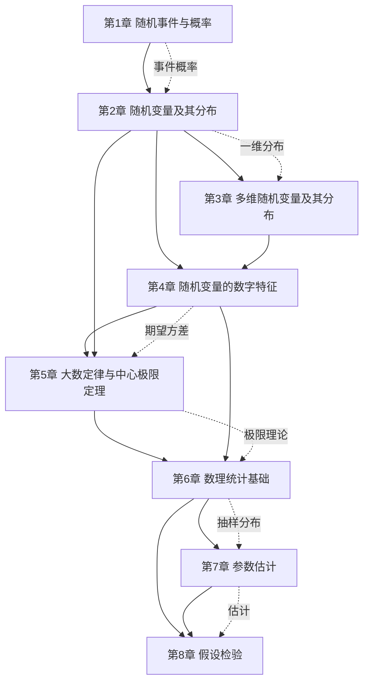

# MOC - 概率论与数理统计B

> [!info] 课程定位
> 概率论与数理统计B 是理工科本科生的公共数学基础课，研究**随机现象的统计规律性**与**基于样本推断总体**的数学方法。它解决的核心问题是：如何用数学语言描述不确定性（概率、分布），如何刻画随机变量的平均行为与波动（期望、方差），如何从有限样本推断未知总体（参数估计、假设检验）。课程分两阶段：**概率论**（第1–5章）建立随机现象的数学模型；**数理统计**（第6–8章）基于样本进行统计推断。本课程是 [[MOC - 高等数学A(1)]]（极限、积分）与 [[MOC - 线性代数A]]（矩阵、协方差矩阵）的下游应用，并为机器学习、信号处理、质量管理等后续课程奠定理论基础。

## 课程摘要

本课程围绕"**事件—变量—分布—特征—极限—样本—估计—检验**"八条主线展开。学生需要掌握：

1. 随机事件与样本空间、事件关系运算、概率的公理化定义与性质、古典概型与几何概型、条件概率与乘法公式、全概率公式与贝叶斯公式、事件独立性；
2. 随机变量定义、离散型分布律与连续型概率密度、分布函数性质、六大常见分布（0-1、二项 $B(n,p)$、泊松 $\Pi(\lambda)$、均匀 $U(a,b)$、指数 $\mathrm{Exp}(\lambda)$、正态 $N(\mu,\sigma^2)$）、随机变量函数的分布；
3. 二维随机变量联合分布、边缘分布、条件分布、独立性、二维随机变量函数的分布（和、商、极值）；
4. 数学期望、方差与标准差、协方差与相关系数、矩与协方差矩阵、常见分布数字特征汇总；
5. 切比雪夫不等式、大数定律（切比雪夫、辛钦、伯努利）、独立同分布中心极限定理、棣莫弗-拉普拉斯定理；
6. 总体与样本、统计量、样本均值与样本方差、三大抽样分布（$\chi^2$、$t$、$F$）、正态总体统计量分布；
7. 点估计（矩估计、极大似然估计）、估计量评价标准（无偏性、有效性、一致性）、区间估计基本概念、正态总体均值与方差的区间估计；
8. 假设检验基本思想、两类错误、显著性水平与拒绝域、正态总体均值检验（$Z$ 检验、$t$ 检验）、方差检验（$\chi^2$ 检验、$F$ 检验）、$P$ 值法。

## 章节结构与依赖关系

> [!note] 章节依赖说明
> 第1章事件与概率是全课程基础，第2章将事件数量化为随机变量。第3章从一维扩展到多维，第4章刻画随机变量的数字特征。第5章的极限定理连接概率论与数理统计——大数定律为频率估计概率提供依据，中心极限定理为正态分布的统计应用铺路。第6章引入样本与抽样分布，是统计推断的数学工具。第7章参数估计与第8章假设检验是统计推断的两大核心方法，互为补充。

## 章节导航

| 章节 | 主题 | 入口 | 关键概念 |
| ---- | ---- | ---- | -------- |
| 第1章 | 随机事件与概率 | [[MOC - 第1章]] | 样本空间、概率公理、古典概型、全概率公式、贝叶斯公式 |
| 第2章 | 随机变量及其分布 | [[MOC - 第2章]] | 分布律、概率密度、分布函数、六大分布、函数分布 |
| 第3章 | 多维随机变量及其分布 | [[MOC - 第3章]] | 联合分布、边缘分布、条件分布、独立性 |
| 第4章 | 随机变量的数字特征 | [[MOC - 第4章]] | 期望、方差、协方差、相关系数、矩 |
| 第5章 | 大数定律与中心极限定理 | [[MOC - 第5章]] | 切比雪夫不等式、大数定律、CLT、棣莫弗-拉普拉斯 |
| 第6章 | 数理统计基础 | [[MOC - 第6章]] | 统计量、$\chi^2$/$t$/$F$ 分布、正态总体抽样分布 |
| 第7章 | 参数估计 | [[MOC - 第7章]] | 矩估计、极大似然估计、无偏有效一致、区间估计 |
| 第8章 | 假设检验 | [[MOC - 第8章]] | 两类错误、拒绝域、$Z$/$t$/$\chi^2$/$F$ 检验、$P$ 值 |

## 分阶段学习目标

> [!example] 概率论基础阶段（第1–2章）
> 建立随机现象的数学描述：掌握样本空间与事件运算，能用概率公理化定义推导概率性质；熟练计算古典概型与几何概型；掌握条件概率、乘法公式、全概率公式与贝叶斯公式解决复杂概率问题；理解随机变量作为样本空间到实数的映射，熟练使用分布律、概率密度与分布函数刻画随机变量。

> [!example] 多维与数字特征阶段（第3–4章）
> 从一维扩展到多维：掌握二维联合分布、边缘分布与条件分布的互推关系，判断随机变量独立性；掌握数学期望的线性性质与方差计算公式，理解协方差与相关系数衡量线性相关程度；熟练查表计算六大常见分布的期望与方差。

> [!example] 极限定理阶段（第5章）
> 理解从概率到统计的桥梁：掌握切比雪夫不等式估计概率上界；区分切比雪夫大数定律（依概率收敛于期望）、辛钦大数定律（独立同分布收敛于期望）、伯努利大数定律（频率收敛于概率）；掌握独立同分布中心极限定理与棣莫弗-拉普拉斯定理，能用正态近似计算复杂概率。

> [!example] 统计推断阶段（第6–8章）
> 掌握基于样本的统计推断方法：理解统计量与抽样分布，熟练使用 $\chi^2$、$t$、$F$ 分布查表；掌握正态总体样本均值与样本方差的分布定理；能用矩估计法与极大似然估计法估计未知参数，评判估计量的无偏性、有效性与一致性；掌握正态总体均值与方差的区间估计；理解假设检验的基本思想与两类错误，能对正态总体参数进行 $Z$、$t$、$\chi^2$、$F$ 检验并理解 $P$ 值法。

## 先修与关联课程

- **先修**：[[MOC - 高等数学A(1)]]（极限、定积分、无穷级数）、[[MOC - 线性代数A]]（矩阵运算、协方差矩阵、正定矩阵）
- **后续**：随机过程（马尔可夫链、泊松过程）、机器学习（贝叶斯推断、最大似然）、信号处理（随机信号分析）、质量管理（统计过程控制）
- 关联延伸：高等数学（二重积分用于二维分布）、线性代数（协方差矩阵的正定性）

## 学习方法建议

> [!tip] 学习要点
> 1. **概念先行**：概率统计概念抽象（如 $\sigma$ 代数、随机变量），务必先理解定义再做题。
> 2. **公式条件**：每个公式都有成立条件（如全概率公式要求 $B_i$ 互斥完备），引用时必须说明。
> 3. **分布图谱**：六大常见分布是核心，建议绘制分布族关系图（二项→泊松近似、正态的普遍性）。
> 4. **数形结合**：概率密度用积分表示，善用图形理解积分区域；分布函数的几何意义是面积。
> 5. **统计思想**：数理统计的本质是"以部分推断整体"，理解估计与检验的对偶关系。
> 6. **典型例题**：每类问题（如贝叶斯公式、极大似然、假设检验）保留1-2个标准例题作为模板。

## 复习与查询入口

- 概率基础速查：[[1.3 概率定义、性质]]、[[1.5 条件概率、乘法公式]]、[[1.6 全概率公式、贝叶斯公式]]、[[1.7 事件独立性]]
- 分布速查：[[2.5 常见分布：0-1、二项、泊松、均匀、指数、正态]]、[[4.5 常见分布数字特征汇总]]
- 多维速查：[[3.1 二维随机变量联合分布]]、[[3.4 随机变量的独立性]]
- 数字特征速查：[[4.1 数学期望定义与性质]]、[[4.2 方差、标准差]]、[[4.3 协方差、相关系数]]
- 极限定理速查：[[5.2 大数定律]]、[[5.3 独立同分布中心极限定理]]、[[5.4 棣莫弗-拉普拉斯定理]]
- 统计推断速查：[[6.3 三大抽样分布：χ²分布、t分布、F分布]]、[[7.2 极大似然估计]]、[[8.3 正态总体均值假设检验（Z检验、t检验）]]
