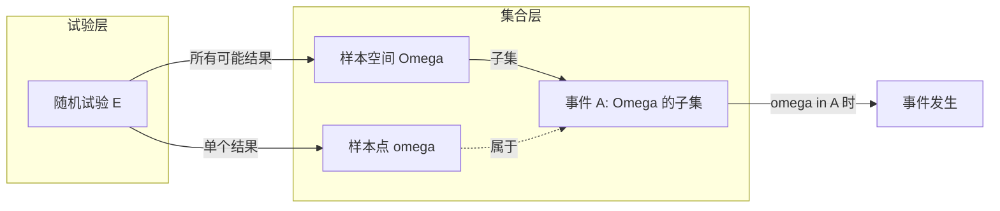

# 1.1 随机事件、样本空间

概率论研究**随机现象**的统计规律性。现实世界中存在两类现象：在一定条件下必然发生或必然不发生的**确定性现象**（如水在标准大气压下加热到 100℃ 沸腾），以及事先无法准确预言结果但大量重复后呈现规律性的**随机现象**（如掷骰子、抽牌、抛硬币）。为对随机现象建立严格的数学模型，第一步是把"一次试验"的可能结果组织成一个集合——这就是**样本空间**；试验中我们关心的各种结果则被抽象为样本空间的子集——这就是**随机事件**。

## 随机试验

> [!definition] 定义 1（随机试验）
> 称一个试验 $E$ 为**随机试验**（random experiment），如果它满足以下三个特征：
>
> 1. **可重复性**：在相同条件下可以重复进行；
> 2. **结果不唯一**：每次试验可能出现不同结果，且试验前不能确定哪一个结果发生；
> 3. **结果集已知**：试验的所有可能结果是明确可知的（结果集合已知，但单次结果未知）。

> [!example] 例 1（掷骰子）
> 抛掷一颗均匀骰子观察朝上面的点数。可重复；可能点数 $1,2,3,4,5,6$；每次试验前不能确定。满足三条特征，是随机试验。

> [!example] 例 2（抽牌）
> 从一副 52 张扑克牌中任取一张观察其花色。可重复；可能花色为黑桃、红桃、方块、梅花；试验前不知是哪一张。是随机试验。

> [!warning] 易错点
> "明天是否下雨"、"某股票明日收盘价"等虽然结果事先未知，但**不能在相同条件下重复**，严格意义下并非随机试验；它们更多是概率统计的**应用对象**而非公理化模型中的试验。教材中"随机试验"特指上述三特征都满足的理想化试验。

## 样本空间与样本点

> [!definition] 定义 2（样本空间与样本点）
> 随机试验 $E$ 的**所有可能结果**组成的集合称为 $E$ 的**样本空间**（sample space），记作 $\Omega$。样本空间中的每一个元素，即试验的每一个基本结果，称为**样本点**（sample point），记作 $\omega$，即
> $$\Omega=\{\omega\mid \omega \text{ 是 } E \text{ 的一个可能结果}\}.$$

样本空间可以是有限集、可列无限集或不可列无限集，这决定了后续概型选择（古典/几何/离散/连续）。

> [!example] 例 3（典型样本空间）
> - $E_1$：掷一颗骰子，$\Omega_1=\{1,2,3,4,5,6\}$（有限集）。
> - $E_2$：记录某电话交换台一小时内接到的呼叫次数，$\Omega_2=\{0,1,2,\dots\}$（可列无限集）。
> - $E_3$：测量某元件寿命 $t$（小时），$\Omega_3=\{t\mid t\geq 0\}=[0,+\infty)$（不可列无限集）。
> - $E_4$：抛一枚硬币观察正反面，$\Omega_4=\{H,T\}$，其中 $H$ 表示正面、$T$ 表示反面。

## 随机事件

> [!definition] 定义 3（随机事件）
> 称样本空间 $\Omega$ 的**子集**为**随机事件**（random event），简称事件，常用大写字母 $A,B,C,\dots$ 表示。当某次试验的结果 $\omega\in A$ 时，称事件 $A$ **发生**；否则称 $A$ **不发生**。

> [!tip] 随机事件的本质
> 事件是**集合**，"事件发生"等价于"试验结果落在该集合内"。这一映射使得我们可以用集合语言和集合运算研究事件，是概率论公理化的基础。

> [!definition] 定义 4（基本事件、复合事件）
> - 由样本空间中**单个样本点**构成的事件 $\{\omega\}$ 称为**基本事件**。
> - 由多个样本点构成的事件称为**复合事件**。

> [!example] 例 4
> 掷骰子试验中：$\{3\}$ 是基本事件"出现 3 点"；$\{2,4,6\}$ 是复合事件"出现偶数点"；$\{1,2,3\}$ 是复合事件"点数不超过 3"。

## 必然事件与不可能事件

> [!definition] 定义 5（必然事件、不可能事件）
> - **必然事件**：样本空间 $\Omega$ 本身作为一个事件，每次试验必发生（因为 $\omega\in\Omega$ 恒成立），故称 $\Omega$ 为必然事件。
> - **不可能事件**：不含任何样本点的事件，即空集 $\varnothing$，每次试验都不发生，称为不可能事件，记作 $\varnothing$。

> [!note] 事件的概率范围
> 在第 1.3 节公理化定义下，必然事件的概率 $P(\Omega)=1$，不可能事件的概率 $P(\varnothing)=0$；但**反之不真**（概率为 0 的事件不一定是不可能事件，详见 [[2.3 连续型随机变量、概率密度]]）。

## 事件与集合的对应关系

## 典型例题

> [!example] 例 5
> 写出下列试验的样本空间，并指出指定事件所含的样本点。
>
> （1）同时抛两枚硬币，观察正反面组合；
> （2）连续掷一颗骰子两次，记录两次点数之和 $S$，事件 $A=\{S \text{ 为素数}\}$。

**解**

（1）$\Omega=\{(H,H),(H,T),(T,H),(T,T)\}$，共 $4$ 个样本点。

（2）$\Omega=\{(i,j)\mid i,j\in\{1,2,3,4,5,6\}\}$，共 $36$ 个样本点。两次点数之和 $S=i+j\in\{2,3,\dots,12\}$。
素数可能值为 $2,3,5,7,11$，故
$$A=\{(1,1),(1,2),(2,1),(1,4),(4,1),(2,3),(3,2),(1,6),(6,1),(2,5),(5,2),(3,4),(4,3),(5,6),(6,5)\}.$$

> [!example] 例 6
> 某人向靶射击直到命中为止，记录其射击次数 $n$。写出样本空间，并描述事件"射击不超过 3 次"。

**解** $\Omega=\{1,2,3,\dots\}=\mathbb{N}^+$（可列无限集）。事件 $A=\{1,2,3\}$。

## 小结

- 随机试验三特征（可重复、结果不唯一、结果集已知）是判断试验是否"随机"的依据。
- 样本空间 $\Omega$ 是所有可能结果的集合；样本点 $\omega$ 是单个结果。
- 随机事件是 $\Omega$ 的子集；基本事件含单个样本点；必然事件为 $\Omega$；不可能事件为 $\varnothing$。
- 用集合语言描述事件是后续事件运算、概率计算的基础。

## 关联

- 上级：[[MOC - 第1章]]
- 下一节：[[1.2 事件关系与运算]]（在样本空间子集基础上定义事件运算）
- 相关：[[1.3 概率定义、性质]]（在事件上定义概率测度）、[[2.1 随机变量定义]]（把样本点映射为实数）
