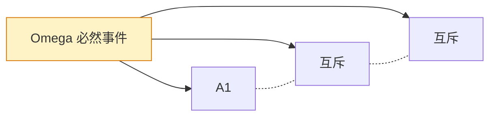
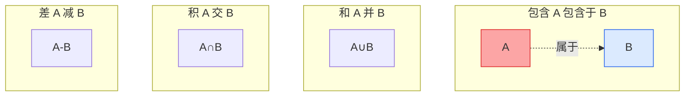

# 1.2 事件关系与运算

随机事件是样本空间 $\Omega$ 的子集，因此事件之间的关系与运算本质上就是**集合的关系与运算**。建立事件运算的目的，是把对"事件是否发生"的语言描述转化为可计算的概率表达式：复杂事件可以分解为简单事件的并、交、差，从而为后续概率的加法公式、乘法公式奠定基础。

## 事件间的关系

设 $A, B\subseteq \Omega$ 为两个事件。

> [!definition] 定义 1（包含与相等）
> - **包含**：若事件 $A$ 发生必导致事件 $B$ 发生（即 $A$ 中每个样本点都属于 $B$），则称 $B$ **包含** $A$，或 $A$ 含于 $B$，记作 $A\subset B$（或 $B\supset A$）。
> - **相等**：若 $A\subset B$ 且 $B\subset A$，则称 $A$ 与 $B$ **相等**，记作 $A=B$。

> [!definition] 定义 2（互斥与对立）
> - **互斥（互不相容）**：若 $A$ 与 $B$ 不能同时发生，即 $AB=\varnothing$，则称 $A$ 与 $B$ 互斥。
> - **对立（互逆）**：若 $A\cup B=\Omega$ 且 $AB=\varnothing$（即 $A,B$ 互斥且其并为必然事件），则称 $A$ 与 $B$ 互为对立事件，记 $B=\bar A$（$A$ 的逆事件或补事件）。

> [!warning] 互斥与对立的区别
> 对立是互斥的特殊情形：**对立必互斥，互斥未必对立**。仅当两互斥事件之并为必然事件 $\Omega$ 时才互为对立。例如掷骰子中 $\{1\}$ 与 $\{2\}$ 互斥但不对立；$\{1\}$ 与 $\{2,3,4,5,6\}$ 对立。

## 事件的运算

> [!definition] 定义 3（和事件、积事件、差事件）
> 设 $A,B\subseteq \Omega$：
> - **和事件** $A\cup B$：$A$ 与 $B$ 至少有一个发生，即
>   $$A\cup B=\{\omega\mid \omega\in A \text{ 或 } \omega\in B\}.$$
> - **积事件** $A\cap B$（简记 $AB$）：$A$ 与 $B$ 同时发生，即
>   $$A\cap B=\{\omega\mid \omega\in A \text{ 且 } \omega\in B\}.$$
> - **差事件** $A-B$：$A$ 发生而 $B$ 不发生，即
>   $$A-B=\{\omega\mid \omega\in A \text{ 且 } \omega\notin B\}=A\bar B.$$

> [!note] $n$ 个事件的和与积
> - 和：$\displaystyle\bigcup_{i=1}^n A_i$ 表示 $A_1,A_2,\dots,A_n$ **至少一个发生**。
> - 积：$\displaystyle\bigcap_{i=1}^n A_i$ 表示 $A_1,A_2,\dots,A_n$ **同时发生**。
> - 可列情形：$\displaystyle\bigcup_{i=1}^\infty A_i$，$\displaystyle\bigcap_{i=1}^\infty A_i$ 类似定义。

## 完备事件组

> [!definition] 定义 4（完备事件组）
> 设 $A_1,A_2,\dots,A_n\subseteq \Omega$，若满足
> 1. 两两互斥：$A_iA_j=\varnothing$（$i\ne j$）；
> 2. 和为 $\Omega$：$\displaystyle\bigcup_{i=1}^n A_i=\Omega$，
>
> 则称 $A_1,A_2,\dots,A_n$ 为样本空间 $\Omega$ 的一个**完备事件组**（划分）。

完备事件组的意义：每次试验必有且只有一个 $A_i$ 发生。它是 [[1.6 全概率公式、贝叶斯公式]] 的前提。

## 文氏图示意

> [!tip] 文氏图使用建议
> 文氏图帮助直观理解事件关系，但**不能替代证明**。推导事件等式时仍需以集合运算律为依据。

## 事件运算律

> [!theorem] 定理 1（事件运算律）
> 对任意事件 $A,B,C\subseteq\Omega$，有：
>
> 1. **交换律**：$A\cup B=B\cup A$，$AB=BA$。
> 2. **结合律**：$(A\cup B)\cup C=A\cup(B\cup C)$，$(AB)C=A(BC)$。
> 3. **分配律**：
>    - $(A\cup B)\cap C=(A\cap C)\cup(B\cap C)$；
>    - $(A\cap B)\cup C=(A\cup C)\cap(B\cup C)$。
> 4. **对偶律（De Morgan 律）**：
>    - $\overline{A\cup B}=\bar A\cap\bar B$；
>    - $\overline{A\cap B}=\bar A\cup\bar B$。

> [!proof] 证明 De Morgan 律（两事件并）
> 对任意 $\omega\in\Omega$：
> $$\omega\in\overline{A\cup B}\iff \omega\notin A\cup B \iff \omega\notin A \text{ 且 } \omega\notin B \iff \omega\in\bar A \text{ 且 } \omega\in\bar B \iff \omega\in\bar A\cap\bar B.$$
> 故 $\overline{A\cup B}=\bar A\cap\bar B$。另一式同理。

> [!note] 对偶律的 $n$ 事件与可列推广
> $$\overline{\bigcup_{i=1}^n A_i}=\bigcap_{i=1}^n \bar A_i,\qquad \overline{\bigcap_{i=1}^n A_i}=\bigcup_{i=1}^n \bar A_i.$$
> 可列情形同样成立（可列 De Morgan 律），后者是 Kolmogorov 公理中可列可加性的基础。

## 常用事件等式

> [!property] 常用化简式
> - $A\cup A=A$，$AA=A$（幂等律）。
> - $A\cup\Omega=\Omega$，$A\Omega=A$。
> - $A\cup\varnothing=A$，$A\varnothing=\varnothing$。
> - $A\cup\bar A=\Omega$，$A\bar A=\varnothing$。
> - $A-B=A-AB=A\bar B$。
> - $A=A\Omega=A(B\cup\bar B)=AB\cup A\bar B$，且 $AB$ 与 $A\bar B$ 互斥。
> - $A\cup B=A\cup(B-AB)=A\cup\bar A B$，且各项互斥。

## 典型例题

> [!example] 例 1（事件表示）
> 设 $A,B,C$ 为三个事件，用 $A,B,C$ 的运算关系表示下列事件：
> （1）$A$ 发生而 $B$ 与 $C$ 都不发生；
> （2）$A,B,C$ 恰有一个发生；
> （3）$A,B,C$ 至少有一个发生；
> （4）$A,B,C$ 都不发生；
> （5）$A,B,C$ 不多于两个发生。

**解**

（1）$A\bar B\bar C$ 或 $A-B\cup C$。

（2）$A\bar B\bar C\cup\bar A B\bar C\cup\bar A\bar B C$。

（3）$A\cup B\cup C$ 或 $\overline{\bar A\bar B\bar C}$（由 De Morgan 律）。

（4）$\bar A\bar B\bar C$ 或 $\overline{A\cup B\cup C}$。

（5）$\overline{ABC}$ 或 $A\cup B\cup C$ 的对立面之补：即"三个都发生"的对立事件。具体地 $\overline{ABC}=\bar A\cup\bar B\cup\bar C$。

> [!example] 例 2（化简）
> 化简 $(A\cup B)(A\cup\bar B)$。

**解**

$$
(A\cup B)(A\cup\bar B)=A\cup(B\bar B)=A\cup\varnothing=A.
$$
依据：分配律 $(A\cup B)(A\cup\bar B)=A\cup(B\bar B)$，再由 $B\bar B=\varnothing$ 得 $A$。

> [!example] 例 3
> 设 $A,B$ 为两事件，证明 $A\cup B-A B=A\bar B\cup\bar A B$（对称差），并解释其概率含义。

**证明**：

$$
A\cup B-AB=(A\cup B)\overline{AB}=(A\cup B)(\bar A\cup\bar B).
$$
用分配律展开：
$$
=A\bar A\cup A\bar B\cup B\bar A\cup B\bar B=A\bar B\cup\bar A B.
$$
其中 $A\bar A=\varnothing$，$B\bar B=\varnothing$ 已舍去。

**含义**：$A\bar B\cup\bar A B$ 表示 $A,B$ 恰好发生一个，即对称差（异或）。其概率 $P(A)+P(B)-2P(AB)$。

## 小结

- 事件关系：包含、相等、互斥、对立（对立 ⟹ 互斥，反之不真）。
- 事件运算：和 $\cup$、积 $\cap$、差 $-$；差可写为 $A\bar B$。
- 完备事件组：两两互斥且并为 $\Omega$，是全概率公式的支柱。
- 四大运算律中 De Morgan 律最常用，能将"至少一个发生"与"都不发生"互相转化。

## 关联

- 上级：[[MOC - 第1章]]
- 上一节：[[1.1 随机事件、样本空间]]（事件 = 子集）
- 下一节：[[1.3 概率定义、性质]]（在事件运算基础上给出概率性质）
- 应用：[[1.6 全概率公式、贝叶斯公式]]（完备事件组）、[[1.7 事件独立性]]（积事件概率的简化）
