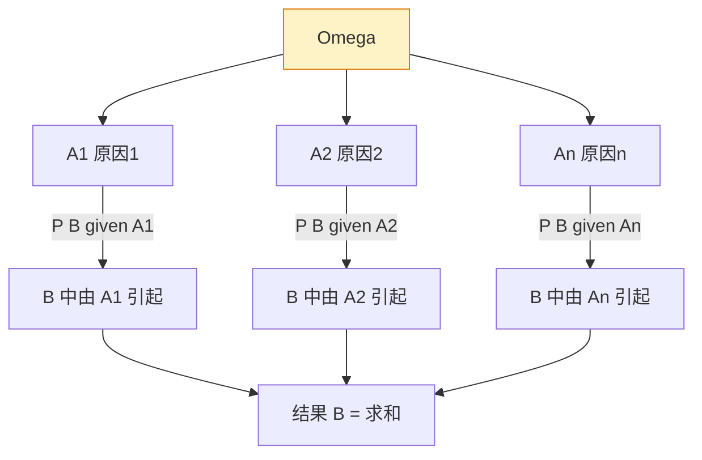

# 1.6 全概率公式、贝叶斯公式

复杂事件 $B$ 的概率往往难以直接计算，但如果能找到一组"原因" $A_1,A_2,\dots,A_n$ 把 $\Omega$ 划分（完备事件组），则 $B$ 可分解为各 $A_iB$ 之和；由可加性与乘法公式即得**全概率公式**。反过来，若已知结果 $B$ 已发生、要追究各原因的贡献，则用**贝叶斯公式**——它把"先验概率"修正为"后验概率"，是统计推断中贝叶斯学派的基石。

## 完备事件组回顾

> [!definition] 定义 1（完备事件组）
> 若事件组 $A_1,A_2,\dots,A_n$ 满足
> 1. 两两互斥：$A_iA_j=\varnothing$（$i\ne j$）；
> 2. 和为 $\Omega$：$\displaystyle\bigcup_{i=1}^n A_i=\Omega$，
>
> 则称之为 $\Omega$ 的一个**完备事件组**（划分）。

> [!note] 几何理解
> 完备事件组把样本空间"切成互不重叠的若干片"，每次试验必有且只有一片 $A_i$ 发生。可视作"原因"的全体可能。

## 全概率公式

> [!theorem] 定理 1（全概率公式）
> 设 $A_1,A_2,\dots,A_n$ 为 $\Omega$ 的一个完备事件组，且 $P(A_i)>0$（$i=1,\dots,n$），则对任意事件 $B\subseteq\Omega$，
> $$P(B)=\sum_{i=1}^n P(A_i)P(B|A_i).$$

> [!proof] 证明
> 因 $\displaystyle\bigcup_{i=1}^n A_i=\Omega$，故
> $$B=B\Omega=B\left(\bigcup_{i=1}^n A_i\right)=\bigcup_{i=1}^n (A_iB).$$
> 由 $A_i$ 两两互斥知 $A_iB$ 也两两互斥（$A_iB\cap A_jB=A_iA_jB=\varnothing$）。由有限可加性：
> $$P(B)=\sum_{i=1}^n P(A_iB).$$
> 再由乘法公式 $P(A_iB)=P(A_i)P(B|A_i)$（$P(A_i)>0$），即得
> $$P(B)=\sum_{i=1}^n P(A_i)P(B|A_i).$$

> [!tip] 全概率公式的直观理解
> 把 $B$ 看作"结果"，$A_i$ 看作互斥的"原因"，则结果的概率等于"各原因发生的概率 × 该原因下结果发生的条件概率"之和。这是"分情况讨论"的数学化。

## 贝叶斯公式

> [!theorem] 定理 2（贝叶斯公式）
> 设 $A_1,A_2,\dots,A_n$ 为 $\Omega$ 的一个完备事件组，$P(A_i)>0$（$i=1,\dots,n$），且 $P(B)>0$，则
> $$P(A_i|B)=\frac{P(A_i)P(B|A_i)}{\sum_{j=1}^n P(A_j)P(B|A_j)},\qquad i=1,2,\dots,n.$$

> [!proof] 证明
> 由条件概率定义 $P(A_i|B)=\dfrac{P(A_iB)}{P(B)}$。分子用乘法公式 $P(A_iB)=P(A_i)P(B|A_i)$；分母用全概率公式 $P(B)=\sum_{j=1}^n P(A_j)P(B|A_j)$，即得。

> [!note] 先验与后验概率
> - **先验概率** $P(A_i)$：在试验前对各"原因" $A_i$ 的概率估计。
> - **后验概率** $P(A_i|B)$：在结果 $B$ 发生后，对原因 $A_i$ 的概率修正。
>
> 贝叶斯公式的本质是"用观测结果修正先验信念"，是**贝叶斯统计**与机器学习中贝叶斯推断的核心。

## 典型应用

> [!example] 例 1（疾病检测）
> 某地区人群中某病患病率为 $0.001$。一种检测方法对患病者呈阳性的概率（灵敏度）为 $0.99$，对健康者呈阳性的概率（误诊率）为 $0.05$。现某人检测为阳性，求他真正患病的概率。

**解**：设 $A=$ "患病"，$\bar A=$ "健康"，$B=$ "检测阳性"。
- $P(A)=0.001$，$P(\bar A)=0.999$；
- $P(B|A)=0.99$，$P(B|\bar A)=0.05$。

由贝叶斯公式：
$$
P(A|B)=\frac{P(A)P(B|A)}{P(A)P(B|A)+P(\bar A)P(B|\bar A)}
=\frac{0.001\times 0.99}{0.001\times 0.99+0.999\times 0.05}
=\frac{0.00099}{0.00099+0.04995}=\frac{0.00099}{0.05094}\approx 0.0194.
$$

**结论**：即便检测为阳性，真正患病的概率仅约 $1.94\%$。原因是患病率极低，误诊人数远超真患者。这说明仅看灵敏度不足以评价检测的有效性。

> [!example] 例 2（次品来源问题）
> 三台机器甲、乙、丙生产同一种零件，产量分别占总量的 $50\%$、$30\%$、$20\%$，其次品率分别为 $1\%$、$2\%$、$4\%$。
> （1）求成品中任取一件为次品的概率；
> （2）已知取到的是次品，求它由丙机器生产的概率。

**解**：设 $A_1,A_2,A_3$ 分别表示甲、乙、丙生产，$B$ 表示取到次品。则 $A_1,A_2,A_3$ 构成完备事件组，且
- $P(A_1)=0.5$，$P(A_2)=0.3$，$P(A_3)=0.2$；
- $P(B|A_1)=0.01$，$P(B|A_2)=0.02$，$P(B|A_3)=0.04$。

（1）由全概率公式：
$$P(B)=0.5\times0.01+0.3\times0.02+0.2\times0.04=0.005+0.006+0.008=0.019.$$

（2）由贝叶斯公式：
$$P(A_3|B)=\frac{P(A_3)P(B|A_3)}{P(B)}=\frac{0.2\times 0.04}{0.019}=\frac{0.008}{0.019}\approx 0.4211.$$

> [!tip] 应用模式
> - 全概率公式：求"结果"概率——把结果按原因分解。
> - 贝叶斯公式：知"结果"反推"原因"——把先验转为后验。
> - 解题关键：明确完备事件组（原因集合），列出 $P(A_i)$ 与 $P(B|A_i)$。

## 小结

- 完备事件组 = 两两互斥 + 并为 $\Omega$，是"原因集合"的数学化。
- 全概率公式：$P(B)=\sum P(A_i)P(B|A_i)$，由可加性 + 乘法公式推出。
- 贝叶斯公式：$P(A_i|B)=\dfrac{P(A_i)P(B|A_i)}{\sum P(A_j)P(B|A_j)}$，由条件概率 + 全概率公式推出。
- 应用：疾病检测、次品溯源、信号检测等"由果溯因"问题。

## 关联

- 上级：[[MOC - 第1章]]
- 上一节：[[1.5 条件概率、乘法公式]]（直接建立在本节之上）
- 下一节：[[1.7 事件独立性]]（独立性是条件概率的退化情形）
- 应用：贝叶斯统计、[[7.2 极大似然估计]]（与贝叶斯估计对比）、机器学习中的朴素贝叶斯分类器
