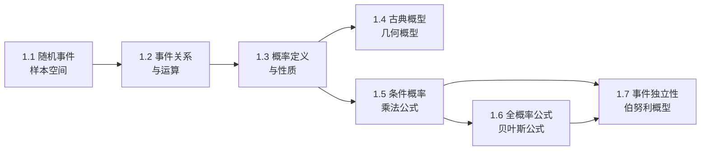

# MOC - 第1章 随机事件与概率

> [!info] 本章定位
> 本章是概率论与数理统计的起点，任务是建立**随机现象的数学描述**。从随机试验出发，将试验结果抽象为样本空间中的样本点，把"事件"建模为样本空间的子集；再以 Kolmogorov 三公理为基石，给出概率的公理化定义并推导其性质；进而研究两类典型概型（古典概型与几何概型）以及条件概率、乘法公式、全概率公式、贝叶斯公式和事件独立性。掌握本章是理解第 2 章随机变量以及后续统计推断的前提。

## 学习路线图

## 知识点导航

| 节 | 主题 | 核心要点 | 入口 |
| -- | ---- | -------- | ---- |
| 1.1 | 随机事件、样本空间 | 随机试验三特征、$\Omega$ 与 $\omega$、基本事件与复合事件 | [[1.1 随机事件、样本空间]] |
| 1.2 | 事件关系与运算 | 包含、和、积、差、互斥、对立、完备事件组、De Morgan 律 | [[1.2 事件关系与运算]] |
| 1.3 | 概率定义、性质 | 频率、Kolmogorov 三公理、加法公式、单调性、补事件公式 | [[1.3 概率定义、性质]] |
| 1.4 | 古典概型、几何概型 | 等可能性、$P(A)=k/n$、测度比、会面问题、Buffon 投针 | [[1.4 古典概型、几何概型]] |
| 1.5 | 条件概率、乘法公式 | $P(B\|A)=P(AB)/P(A)$、乘法公式及其 $n$ 事件推广 | [[1.5 条件概率、乘法公式]] |
| 1.6 | 全概率公式、贝叶斯公式 | 完备事件组、先验与后验概率、因果推断 | [[1.6 全概率公式、贝叶斯公式]] |
| 1.7 | 事件独立性 | $P(AB)=P(A)P(B)$、两两独立 vs 相互独立、$n$ 重伯努利试验 | [[1.7 事件独立性]] |

## 核心考点

> [!warning] 重点掌握
> 1. 随机试验的特征判断，写出指定试验的样本空间，区分基本事件、必然事件与不可能事件。
> 2. 熟练运用事件的并、交、差、对立及 De Morgan 对偶律进行事件化简。
> 3. 用概率公理化定义推导概率性质（加法公式、单调性、$P(A-B)=P(A)-P(AB)$ 等）。
> 4. 古典概型计算（排列组合、摸球、分配、超几何模型）与几何概型测度比计算（会面问题）。
> 5. 条件概率的定义与计算，乘法公式求解不放回抽样问题。
> 6. 全概率公式与贝叶斯公式的应用，特别是先验/后验概率的转换（疾病检测、次品来源）。
> 7. 事件独立性的判定与性质（独立推得四对事件独立）、两两独立与相互独立的区别。
> 8. $n$ 重伯努利试验与二项概率公式 $P\{X=k\}=C_n^k p^k(1-p)^{n-k}$ 的应用。

## 自测题

> [!question] 自测题 1
> 设 $A, B$ 为两事件，$P(A)=0.6$，$P(B)=0.3$，$P(A\bar{B})=0.4$，求 $P(AB)$、$P(\bar{A}B)$ 与 $P(A\|B)$。

> > [!check]- 参考答案
> > 由 $P(A)=P(AB)+P(A\bar{B})$，得 $P(AB)=0.6-0.4=0.2$。
> > 由 $P(B)=P(AB)+P(\bar{A}B)$，得 $P(\bar{A}B)=0.3-0.2=0.1$。
> > $P(A\|B)=\dfrac{P(AB)}{P(B)}=\dfrac{0.2}{0.3}=\dfrac{2}{3}$。

> [!question] 自测题 2
> 某工厂有甲、乙、丙三台机器生产同一种零件，产量分别占总量的 $50\%$、$30\%$、$20\%$，其次品率分别为 $1\%$、$2\%$、$4\%$。现从成品中任取一件为次品，求它由丙机器生产的概率。

> > [!check]- 参考答案
> > 设 $A_i$ 为机器甲、乙、丙生产，$B$ 为取到次品。由贝叶斯公式：
> > $$P(A_3\|B)=\frac{0.20\times 0.04}{0.50\times0.01+0.30\times0.02+0.20\times0.04}=\frac{0.008}{0.005+0.006+0.008}=\frac{0.008}{0.019}\approx 0.421$$

> [!question] 自测题 3
> 甲乙两人约定 7:00—8:00 在某地会面，每人在任一时刻到达等可能，等待 20 分钟后即离开。求两人能会面的概率。

> > [!check]- 参考答案
> > 设到达时刻为 $x,y\in[0,60]$（分钟），会面条件 $|x-y|\le 20$。$\Omega=[0,60]^2$，面积 $3600$；不满足区域为两角三角形，面积 $2\times\frac{1}{2}\times40\times40=1600$。所求 $P=1-\frac{1600}{3600}=\frac{5}{9}$。

> [!question] 自测题 4
> 设 $P(A)=P(B)=P(C)=\frac{1}{3}$，$A,B,C$ 相互独立，求 $A,B,C$ 至少发生一个的概率。

> > [!check]- 参考答案
> > $P(A\cup B\cup C)=1-P(\bar{A})P(\bar{B})P(\bar{C})=1-\left(\frac{2}{3}\right)^3=1-\frac{8}{27}=\frac{19}{27}$。

## 章节导航

- 上一级：[[MOC - 概率论与数理统计B]]
- 下一章：[[MOC - 第2章]]
- 本章习题：[[MOC - 第1章习题]]
