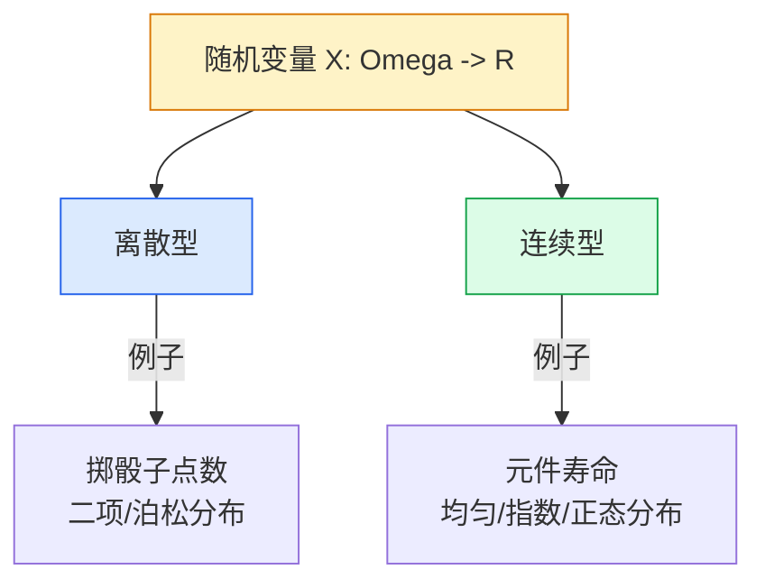

# 2.1 随机变量定义

第 1 章用"事件"描述随机现象，但事件是集合，难以直接参与代数运算与微积分。本节引入**随机变量**——把样本点映射为实数的函数，使随机现象数量化。引入随机变量后，"事件"可表达为 $\{X\le x\}$、$\{a<X\le b\}$ 等不等式形式，从而能用微积分工具系统研究概率。这是概率论从"组合与集合"走向"分析"的关键一步。

## 随机变量的定义

> [!definition] 定义 1（随机变量）
> 设 $\Omega$ 是随机试验 $E$ 的样本空间。若存在映射 $X:\Omega\to\mathbb{R}$，使得对任意实数 $x$，集合 $\{\omega\in\Omega\mid X(\omega)\le x\}$ 都是事件（即属于事件域 $\mathcal{F}$），则称 $X$ 为**随机变量**（random variable, RV）。

> [!note] 定义要点
> - 随机变量是**函数**，其自变量是样本点 $\omega$，因变量是实数。
> - **取值随试验结果而定**：试验前不知 $\omega$，故不知 $X(\omega)$；但 $\omega$ 一旦确定，$X$ 也唯一确定。
> - **可测性条件**：$\{X\le x\}$ 必须是事件，这样 $P\{X\le x\}$ 才有意义。本课程中样本空间结构简单，该条件默认满足。

> [!tip] 记号约定
> - 大写字母 $X,Y,Z$ 表示随机变量；
> - 小写字母 $x,y,z$ 表示实数（取值）；
> - $\{X\le x\}$ 表示事件"随机变量 $X$ 取值不超过 $x$"，即 $\{\omega\mid X(\omega)\le x\}$。

> [!example] 例 1
> 掷一颗骰子，$\Omega=\{1,2,3,4,5,6\}$。定义 $X(\omega)=\omega$，则 $X$ 是"出现的点数"，取值 $\{1,2,3,4,5,6\}$。事件"点数不超过 3"可写为 $\{X\le 3\}$。

> [!example] 例 2
> 抛一枚硬币，$\Omega=\{H,T\}$。定义
> $$X(\omega)=\begin{cases}1,& \omega=H\\0,& \omega=T\end{cases}$$
> 则 $X$ 取值 $\{0,1\}$，事件"出现正面"等价于 $\{X=1\}$。

## 随机变量的分类

根据取值集合的特征，随机变量分为两大类：

> [!definition] 定义 2（离散型与连续型）
> - **离散型随机变量**：$X$ 的所有可能取值为有限个或可列无限个 $x_1,x_2,\dots$。
> - **连续型随机变量**：$X$ 的取值充满某个区间（不可列），且存在非负可积函数 $f(x)$ 使 $P\{X\le x\}=\int_{-\infty}^x f(t)dt$。

> [!warning] 取值连续 ≠ 连续型
> 连续型要求存在概率密度函数 $f(x)$，而非仅"取值连续"。存在一类"奇异型"随机变量（如 Cantor 分布），取值连续但既非离散也非连续。本课程只研究离散型与连续型。

## 随机变量的本质

> [!note] 用数值描述事件
> 随机变量的本质是**用数值描述事件**：把样本空间上的事件转化为实数轴上的集合，从而能用不等式、函数和积分研究随机现象。
>
> - 事件 $\{X\le x\}$、$\{a<X\le b\}$、$\{X>x\}$ 都能用分布函数统一表达（见 [[2.4 分布函数性质]]）。
> - $X$ 的"平均取值"用期望（[[4.1 数学期望定义与性质]]）描述。
> - $X$ 的"波动大小"用方差（[[4.2 方差、标准差]]）描述。

## 典型例题

> [!example] 例 3
> 某人向靶射击一次，记录命中的环数（0—10 环）。写出样本空间和定义随机变量 $X$，并表示事件"至少命中 8 环"。

**解**：$\Omega=\{0,1,2,\dots,10\}$（命中环数）。定义 $X(\omega)=\omega$，则 $X$ 取值 $\{0,1,\dots,10\}$，为离散型随机变量。"至少命中 8 环" = $\{X\ge 8\}=\{X=8\}\cup\{X=9\}\cup\{X=10\}$。

> [!example] 例 4
> 测量某零件长度（厘米），由于误差存在，测量值 $X$ 在 $[9.9,10.1]$ 内取值。定义 $X(\omega)=$ 测量结果，则 $X$ 是连续型随机变量，事件"长度合格（误差不超过 0.05 cm）" = $\{9.95\le X\le 10.05\}$。

## 小结

- 随机变量是 $\Omega\to\mathbb{R}$ 的可测映射，使随机现象数量化。
- 离散型取值为有限或可列集；连续型取值充满区间且存在概率密度。
- 引入随机变量后，事件可用 $\{X\le x\}$、$\{a<X\le b\}$ 等不等式表示。

## 关联

- 上级：[[MOC - 第2章]]
- 上一章：[[1.1 随机事件、样本空间]]（随机变量建立在样本空间之上）
- 下一节：[[2.2 离散型随机变量与分布律]]、[[2.3 连续型随机变量、概率密度]]、[[2.4 分布函数性质]]
- 后续：[[2.5 常见分布：0-1、二项、泊松、均匀、指数、正态]]（具体分布族）、[[4.1 数学期望定义与性质]]（随机变量的数字特征）
