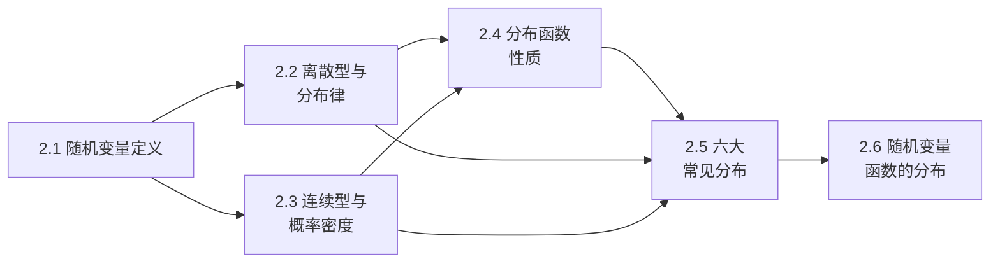

# MOC - 第2章 随机变量及其分布

> [!info] 本章定位
> 第 1 章用"事件"描述随机现象，但事件是集合，难以直接做代数运算和微积分。本章引入**随机变量**——把样本点映射为实数的函数，使随机现象数量化。在此基础上建立两类描述工具：离散型用**分布律**，连续型用**概率密度函数**；统一用**分布函数** $F(x)=P\{X\le x\}$ 刻画。进而研究六大常见分布（0-1、二项、泊松、均匀、指数、正态）以及随机变量函数 $Y=g(X)$ 的分布。本章是从"事件概率"过渡到"统计推断"的关键桥梁。

## 学习路线图

## 知识点导航

| 节 | 主题 | 核心要点 | 入口 |
| -- | ---- | -------- | ---- |
| 2.1 | 随机变量定义 | $X:\Omega\to\mathbb{R}$、离散型 vs 连续型 | [[2.1 随机变量定义]] |
| 2.2 | 离散型与分布律 | $P\{X=x_k\}=p_k$、$p_k\ge0,\sum p_k=1$ | [[2.2 离散型随机变量与分布律]] |
| 2.3 | 连续型与概率密度 | $F(x)=\int_{-\infty}^x f(t)dt$、密度性质 | [[2.3 连续型随机变量、概率密度]] |
| 2.4 | 分布函数性质 | 单调不减、右连续、$F(-\infty)=0,F(+\infty)=1$ | [[2.4 分布函数性质]] |
| 2.5 | 常见分布 | 0-1、二项 $B(n,p)$、泊松 $\Pi(\lambda)$、均匀 $U(a,b)$、指数 $\mathrm{Exp}(\lambda)$、正态 $N(\mu,\sigma^2)$ | [[2.5 常见分布：0-1、二项、泊松、均匀、指数、正态]] |
| 2.6 | 随机变量函数的分布 | 分布函数法、定理 $f_Y(y)=f_X(g^{-1}(y))\|(g^{-1})'(y)\|$ | [[2.6 随机变量函数的分布]] |

## 核心考点

> [!warning] 重点掌握
> 1. 随机变量的定义本质（$\Omega\to\mathbb{R}$ 的映射），区分离散型与连续型。
> 2. 离散型分布律的判定与表示（$p_k\ge 0$、$\sum p_k=1$），由分布律求 $P\{X\in A\}$。
> 3. 连续型概率密度的性质（非负、归一、区间概率为积分、$F'(x)=f(x)$），由密度求分布函数及概率。
> 4. 分布函数的三条性质（单调不减、右连续、极限值），由分布函数求概率 $P\{a<X\le b\}=F(b)-F(a)$。
> 5. 六大常见分布的分布律/密度、参数意义、期望与方差，正态分布的标准化与查表。
> 6. 二项分布与泊松分布的近似关系（$n$ 大 $p$ 小、$np=\lambda$）。
> 7. 指数分布的无记忆性及其应用。
> 8. 用分布函数法求 $Y=g(X)$ 的密度：先求 $F_Y(y)=P\{g(X)\le y\}$，再求导。

## 自测题

> [!question] 自测题 1
> 设随机变量 $X$ 的分布律为 $P\{X=k\}=\dfrac{c}{k(k+1)}$，$k=1,2,\dots$，求常数 $c$。

> > [!check]- 参考答案
> > 由 $\sum_{k=1}^\infty \dfrac{c}{k(k+1)}=1$，而 $\dfrac{1}{k(k+1)}=\dfrac{1}{k}-\dfrac{1}{k+1}$，求和为 $1$（裂项相消），故 $c=1$。

> [!question] 自测题 2
> 设 $X\sim N(2,9)$，求 $P\{X>5\}$ 与 $P\{-1<X<8\}$（用标准正态 $\Phi$ 表示）。

> > [!check]- 参考答案
> > 标准化 $Z=\dfrac{X-2}{3}$。
> > $P\{X>5\}=P\{Z>1\}=1-\Phi(1)$；
> > $P\{-1<X<8\}=P\{-3<Z<2\}=\Phi(2)-\Phi(-1)=\Phi(2)-[1-\Phi(1)]$。

> [!question] 自测题 3
> 设 $X\sim \mathrm{Exp}(\lambda)$（参数 $\lambda=2$），求 $P\{X>1\}$ 与 $P\{X>2\mid X>1\}$，验证无记忆性。

> > [!check]- 参考答案
> > $F(x)=1-e^{-2x}$（$x>0$）。
> > $P\{X>1\}=e^{-2}$；$P\{X>2\mid X>1\}=\dfrac{P\{X>2\}}{P\{X>1\}}=\dfrac{e^{-4}}{e^{-2}}=e^{-2}=P\{X>1\}$，验证无记忆性。

> [!question] 自测题 4
> 设 $X\sim U(0,2)$，求 $Y=X^2$ 的概率密度。

> > [!check]- 参考答案
> > $y\in(0,4)$，$F_Y(y)=P\{X^2\le y\}=P\{X\le\sqrt y\}=\dfrac{\sqrt y}{2}$。
> > $f_Y(y)=F_Y'(y)=\dfrac{1}{4\sqrt y}$，$0<y<4$；其他处 $f_Y(y)=0$。

## 章节导航

- 上一级：[[MOC - 概率论与数理统计B]]
- 上一章：[[MOC - 第1章]]
- 下一章：[[MOC - 第3章]]
- 本章习题：[[MOC - 第2章习题]]
- 下一章习题：[[MOC - 第3章习题]]
