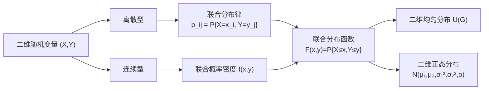

# 3.1 二维随机变量联合分布

本节解决的核心问题：当一次随机试验需要用**两个**数量指标同时描述时（如弹着点的横纵坐标、人的身高与体重），如何用统一的数学工具刻画它们的**联合取值规律**？答案是用二维随机变量及其联合分布。

---

## 一、二维随机变量的定义

> [!definition] 定义｜二维随机变量
> 设 $E$ 是随机试验，样本空间 $\Omega=\{\omega\}$。若对每个 $\omega\in\Omega$，都有确定的实数对 $(X(\omega),Y(\omega))$ 与之对应，则称 $(X,Y)$ 为**二维随机变量**（或二维随机向量）。
>
> 其中 $X=X(\omega)$、$Y=Y(\omega)$ 是定义在同一样本空间上的两个一维随机变量。

> [!tip] 本质理解
> 二维随机变量 $(X,Y)$ 是从样本空间 $\Omega$ 到平面 $\mathbb{R}^2$ 的映射：
> $$(X,Y):\;\Omega\to\mathbb{R}^2,\qquad \omega\mapsto(X(\omega),Y(\omega))$$
> 它把每个试验结果对应到平面上的一个点。

---

## 二、联合分布函数

### 1. 定义

> [!definition] 定义｜联合分布函数
> 设 $(X,Y)$ 为二维随机变量。对任意实数 $x,y$，称
> $$F(x,y)=P\{X\leq x,\,Y\leq y\}$$
> 为 $(X,Y)$ 的**联合分布函数**（简称联合分布）。
>
> $F(x,y)$ 表示 $(X,Y)$ 落在区域 $\{(u,v)\mid u\leq x,\;v\leq y\}$（即左下方无限矩形区域）内的概率。

### 2. 性质

> [!theorem] 定理｜联合分布函数的性质
> 联合分布函数 $F(x,y)$ 具有以下性质：
>
> 1. **非负性与有界性**：$0\leq F(x,y)\leq 1$。
> 2. **单调不减**：对固定的 $y$，$F(x,y)$ 关于 $x$ 单调不减；对固定的 $x$，$F(x,y)$ 关于 $y$ 单调不减。
> 3. **右连续**：$F(x,y)$ 关于 $x$ 和 $y$ 均右连续。
> 4. **边界值**：
>    - $F(-\infty,y)=\lim_{x\to-\infty}F(x,y)=0$；
>    - $F(x,-\infty)=\lim_{y\to-\infty}F(x,y)=0$；
>    - $F(-\infty,-\infty)=0$；
>    - $F(+\infty,+\infty)=1$。
> 5. **矩形概率公式**：对任意 $x_1<x_2$，$y_1<y_2$，
>    $$P\{x_1<X\leq x_2,\;y_1<Y\leq y_2\}=F(x_2,y_2)-F(x_1,y_2)-F(x_2,y_1)+F(x_1,y_1)\geq 0$$

> [!warning] 易错点
> 矩形概率非负性是联合分布函数的**必要条件**，不仅是性质，更是检验一个二元函数能否作为分布函数的判据。若存在某个矩形使上述差值为负，则该函数不是联合分布函数。

---

## 三、二维离散型随机变量

### 1. 联合分布律

> [!definition] 定义｜联合分布律
> 若二维随机变量 $(X,Y)$ 的所有可能取值为**有限或可列**个数对 $(x_i,y_j)$，$i,j=1,2,\ldots$，则称 $(X,Y)$ 为**二维离散型随机变量**。
>
> 称
> $$P\{X=x_i,\,Y=y_j\}=p_{ij},\qquad i,j=1,2,\ldots$$
> 为 $(X,Y)$ 的**联合分布律**。

### 2. 联合分布律的性质

> [!theorem] 性质
> 1. **非负性**：$p_{ij}\geq 0$，对一切 $i,j$。
> 2. **规范性**：$\displaystyle\sum_{i=1}^{\infty}\sum_{j=1}^{\infty}p_{ij}=1$。

联合分布律常用**表格**表示：

|  $X\setminus Y$  | $y_1$ | $y_2$ | $\cdots$ | $y_j$ | $\cdots$ |
|:---:|:---:|:---:|:---:|:---:|:---:|
| $x_1$ | $p_{11}$ | $p_{12}$ | $\cdots$ | $p_{1j}$ | $\cdots$ |
| $x_2$ | $p_{21}$ | $p_{22}$ | $\cdots$ | $p_{2j}$ | $\cdots$ |
| $\vdots$ | $\vdots$ | $\vdots$ | $\ddots$ | $\vdots$ | $\cdots$ |
| $x_i$ | $p_{i1}$ | $p_{i2}$ | $\cdots$ | $p_{ij}$ | $\cdots$ |
| $\vdots$ | $\vdots$ | $\vdots$ | $\cdots$ | $\vdots$ | $\cdots$ |

> [!example] 例1
> 一口袋中有 2 红 3 白球，从中不放回地取两次，每次取一球。令
> $$X=\begin{cases}0,&\text{第一次取白球}\\ 1,&\text{第一次取红球}\end{cases},\quad Y=\begin{cases}0,&\text{第二次取白球}\\ 1,&\text{第二次取红球}\end{cases}$$
> 求 $(X,Y)$ 的联合分布律。

**解**：共 5 球，取两次（不放回），等可能的基本事件总数为 $5\times4=20$。

$$P\{X=0,Y=0\}=\frac{3\times2}{20}=\frac{6}{20}=\frac{3}{10}$$

$$P\{X=0,Y=1\}=\frac{3\times2}{20}=\frac{3}{10}$$

$$P\{X=1,Y=0\}=\frac{2\times3}{20}=\frac{3}{10}$$

$$P\{X=1,Y=1\}=\frac{2\times1}{20}=\frac{1}{10}$$

| $X\setminus Y$ | 0 | 1 |
|:---:|:---:|:---:|
| 0 | $\frac{3}{10}$ | $\frac{3}{10}$ |
| 1 | $\frac{3}{10}$ | $\frac{1}{10}$ |

> [!check] 验证规范性
> $\frac{3}{10}+\frac{3}{10}+\frac{3}{10}+\frac{1}{10}=1$ ✓

---

## 四、二维连续型随机变量

### 1. 联合概率密度

> [!definition] 定义｜联合概率密度
> 设 $(X,Y)$ 的联合分布函数为 $F(x,y)$。若存在非负可积函数 $f(x,y)$，使得对任意 $x,y$，
> $$F(x,y)=\int_{-\infty}^{y}\int_{-\infty}^{x}f(u,v)\,du\,dv$$
> 则称 $(X,Y)$ 为**二维连续型随机变量**，$f(x,y)$ 为 $(X,Y)$ 的**联合概率密度**（简称联合密度）。

### 2. 联合概率密度的性质

> [!theorem] 性质
> 1. **非负性**：$f(x,y)\geq 0$。
> 2. **规范性**：$\displaystyle\iint_{-\infty}^{+\infty}f(x,y)\,dx\,dy=1$。
> 3. **区域概率**：设 $D$ 为 $xOy$ 平面上的区域，则
>    $$P\{(X,Y)\in D\}=\iint_D f(x,y)\,dx\,dy$$
>    即概率等于密度在区域上的二重积分。
> 4. **密度与分布函数的关系**：在 $f(x,y)$ 的连续点处，
>    $$\frac{\partial^2 F}{\partial x\,\partial y}=f(x,y)$$

> [!warning] 连续型的重要推论
> 对连续型 $(X,Y)$，$P\{X=x,Y=y\}=0$（取单点概率为零），因此
> $$P\{X\leq x,Y\leq y\}=P\{X<x,Y<y\}$$
> 严格不等与不严格不等在此等价。

> [!example] 例2
> 设 $(X,Y)$ 的联合密度为
> $$f(x,y)=\begin{cases}kxy,&0<x<2,\;0<y<1\\ 0,&\text{其他}\end{cases}$$
> 求常数 $k$ 及 $P\{X+Y<1\}$。

**解**：

由规范性 $\displaystyle\iint f(x,y)\,dx\,dy=1$：

$$\int_0^1\int_0^2 kxy\,dx\,dy=k\int_0^1 y\left[\frac{x^2}{2}\right]_0^2 dy=k\int_0^1 2y\,dy=k\left[y^2\right]_0^1=k$$

所以 $k=1$。

求 $P\{X+Y<1\}$，积分区域为 $D=\{(x,y)\mid 0<x<2,0<y<1,x+y<1\}$，即 $0<y<1$，$0<x<1-y$：

$$P\{X+Y<1\}=\int_0^1\int_0^{1-y}xy\,dx\,dy=\int_0^1 y\cdot\frac{(1-y)^2}{2}\,dy=\frac{1}{2}\int_0^1 y(1-y)^2\,dy$$

$$=\frac{1}{2}\int_0^1(y-2y^2+y^3)\,dy=\frac{1}{2}\left[\frac{1}{2}-\frac{2}{3}+\frac{1}{4}\right]=\frac{1}{2}\cdot\frac{1}{12}=\frac{1}{12}$$

> [!success] 结果
> $$k=1,\qquad P\{X+Y<1\}=\frac{1}{12}$$

---

## 五、二维均匀分布

> [!definition] 定义｜二维均匀分布
> 设 $G$ 为平面上的有界区域，面积为 $A$。若 $(X,Y)$ 的联合密度为
> $$f(x,y)=\begin{cases}\dfrac{1}{A},&(x,y)\in G\\[6pt] 0,&\text{其他}\end{cases}$$
> 则称 $(X,Y)$ 在区域 $G$ 上服从**二维均匀分布**，记为 $(X,Y)\sim U(G)$。

> [!tip] 几何意义
> 二维均匀分布表示 $(X,Y)$ 在区域 $G$ 内各处取值的"密度"相同，$(X,Y)$ 落入 $G$ 内某子区域 $D$ 的概率等于 $D$ 的面积与 $G$ 的面积之比：
> $$P\{(X,Y)\in D\}=\frac{D\text{ 的面积}}{A}$$

---

## 六、二维正态分布

> [!definition] 定义｜二维正态分布
> 若 $(X,Y)$ 的联合概率密度为
> $$f(x,y)=\frac{1}{2\pi\sigma_1\sigma_2\sqrt{1-\rho^2}}\exp\!\left[-\frac{1}{2(1-\rho^2)}\left(\frac{(x-\mu_1)^2}{\sigma_1^2}-\frac{2\rho(x-\mu_1)(y-\mu_2)}{\sigma_1\sigma_2}+\frac{(y-\mu_2)^2}{\sigma_2^2}\right)\right]$$
> 则称 $(X,Y)$ 服从参数为 $\mu_1,\mu_2,\sigma_1^2,\sigma_2^2,\rho$ 的**二维正态分布**，记为
> $$(X,Y)\sim N(\mu_1,\mu_2,\sigma_1^2,\sigma_2^2,\rho)$$
>
> 其中 $\mu_1,\mu_2\in\mathbb{R}$，$\sigma_1>0$，$\sigma_2>0$，$-1<\rho<1$。

### 参数含义

| 参数 | 含义 | 取值范围 |
|:---:|:---|:---:|
| $\mu_1$ | $X$ 的期望 $E(X)$ | $\mathbb{R}$ |
| $\mu_2$ | $Y$ 的期望 $E(Y)$ | $\mathbb{R}$ |
| $\sigma_1^2$ | $X$ 的方差 $D(X)$ | $>0$ |
| $\sigma_2^2$ | $Y$ 的方差 $D(Y)$ | $>0$ |
| $\rho$ | $X,Y$ 的相关系数 | $(-1,1)$ |

> [!warning] 二维正态的关键性质（预告）
> - 二维正态的边缘分布仍为正态：$X\sim N(\mu_1,\sigma_1^2)$，$Y\sim N(\mu_2,\sigma_2^2)$。
> - $\rho=0 \Leftrightarrow X,Y$ 独立（详见 [[3.4 随机变量的独立性]]）。
>   这是二维正态**特有**的性质——一般情形下不相关不等于独立。

---

## 小结

> [!summary] 本节要点
> 1. 二维随机变量 $(X,Y)$ 是 $\Omega\to\mathbb{R}^2$ 的映射，联合分布函数 $F(x,y)=P\{X\leq x,Y\leq y\}$ 刻画其整体规律。
> 2. 离散型用联合分布律 $p_{ij}$（表格），连续型用联合密度 $f(x,y)$（积分），二者通过分布函数统一。
> 3. 联合密度的四个性质：非负、规范、区域积分求概率、连续点处二阶混合偏导等于密度。
> 4. 二维正态分布有五个参数，其边缘分布仍为正态，且 $\rho=0$ 等价于独立。

## 关联

- **先修**：[[MOC - 第2章]]（一维分布函数、概率密度的推广）
- **后续**：[[3.2 边缘分布]]（从联合提取边缘）、[[3.3 条件分布]]（已知一个求另一个）、[[3.4 随机变量的独立性]]（联合能否分解）
- **应用**：[[4.3 协方差、相关系数]]（协方差需联合分布）、[[3.5 二维随机变量函数的分布]]（卷积需联合密度）
- 本章导航：[[MOC - 第3章]]
