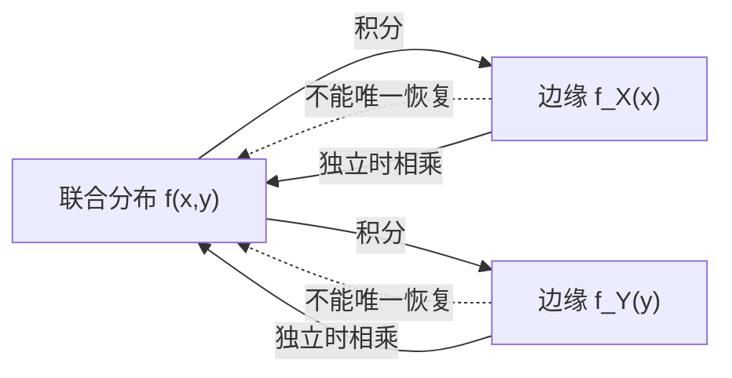

# 3.2 边缘分布

本节解决的核心问题：已知两个随机变量 $(X,Y)$ 的**联合分布**，如何只关注其中一个变量 $X$（或 $Y$）的取值规律？这种从联合分布中"提取"单个变量分布的方法称为求**边缘分布**。

---

## 一、边缘分布函数

> [!definition] 定义｜边缘分布函数
> 设 $(X,Y)$ 的联合分布函数为 $F(x,y)$，则 $X$ 的**边缘分布函数**为
> $$F_X(x)=P\{X\leq x\}=P\{X\leq x,Y<+\infty\}=F(x,+\infty)=\lim_{y\to+\infty}F(x,y)$$
>
> $Y$ 的边缘分布函数为
> $$F_Y(y)=P\{Y\leq y\}=F(+\infty,y)=\lim_{x\to+\infty}F(x,y)$$

> [!tip] 理解
> 边缘分布函数就是把另一个变量"不管"（取 $+\infty$），只看一个变量的累积概率。它就是第2章学到的一维分布函数，只是这里从联合分布中导出。

---

## 二、离散型的边缘分布律

> [!theorem] 定理｜边缘分布律
> 设离散型 $(X,Y)$ 的联合分布律为 $p_{ij}=P\{X=x_i,Y=y_j\}$，则
>
> - $X$ 的边缘分布律：
>   $$P\{X=x_i\}=p_{i\cdot}=\sum_{j=1}^{\infty}p_{ij},\qquad i=1,2,\ldots$$
> - $Y$ 的边缘分布律：
>   $$P\{Y=y_j\}=p_{\cdot j}=\sum_{i=1}^{\infty}p_{ij},\qquad j=1,2,\ldots$$

> [!tip] 表格操作
> 在联合分布律表格中：
> - $p_{i\cdot}$（点号代替求和下标）= 第 $i$ 行所有元素之和，写在右侧"边缘列"；
> - $p_{\cdot j}$ = 第 $j$ 列所有元素之和，写在下方"边缘行"。
>
> "边缘"一词正来源于此——写在表格边缘。

| $X\setminus Y$ | $y_1$ | $\cdots$ | $y_j$ | $\cdots$ | $p_{i\cdot}$（行和） |
|:---:|:---:|:---:|:---:|:---:|:---:|
| $x_1$ | $p_{11}$ | $\cdots$ | $p_{1j}$ | $\cdots$ | $p_{1\cdot}$ |
| $\vdots$ | $\vdots$ | $\ddots$ | $\vdots$ | $\cdots$ | $\vdots$ |
| $x_i$ | $p_{i1}$ | $\cdots$ | $p_{ij}$ | $\cdots$ | $p_{i\cdot}$ |
| $\vdots$ | $\vdots$ | $\cdots$ | $\vdots$ | $\cdots$ | $\vdots$ |
| $p_{\cdot j}$（列和） | $p_{\cdot1}$ | $\cdots$ | $p_{\cdot j}$ | $\cdots$ | $1$ |

---

## 三、连续型的边缘概率密度

> [!theorem] 定理｜边缘概率密度
> 设连续型 $(X,Y)$ 的联合概率密度为 $f(x,y)$，则
>
> - $X$ 的边缘概率密度：
>   $$f_X(x)=\int_{-\infty}^{+\infty}f(x,y)\,dy$$
> - $Y$ 的边缘概率密度：
>   $$f_Y(y)=\int_{-\infty}^{+\infty}f(x,y)\,dx$$

> [!warning] 求边缘密度的积分限
> 积分限不一定是从 $-\infty$ 到 $+\infty$。要根据 $f(x,y)$ 的非零区域确定：对固定的 $x$，$y$ 的取值范围是什么。务必画图确定积分上下限。

---

## 四、典型例题

> [!example] 例1（离散型）
> 设 $(X,Y)$ 的联合分布律为
>
> | $X\setminus Y$ | 0 | 1 | 2 |
> |:---:|:---:|:---:|:---:|
> | 0 | $\frac{1}{12}$ | $\frac{1}{6}$ | $\frac{1}{12}$ |
> | 1 | $\frac{1}{6}$ | $\frac{1}{3}$ | $\frac{1}{6}$ |
>
> 求边缘分布律。

**解**：行求和得 $X$ 的边缘分布律：

| $X$ | 0 | 1 |
|:---:|:---:|:---:|
| $p$ | $\frac{1}{3}$ | $\frac{2}{3}$ |

列求和得 $Y$ 的边缘分布律：

| $Y$ | 0 | 1 | 2 |
|:---:|:---:|:---:|:---:|
| $p$ | $\frac{1}{4}$ | $\frac{1}{2}$ | $\frac{1}{4}$ |

> [!check] 验证
> $\frac{1}{3}+\frac{2}{3}=1$ ✓，$\frac{1}{4}+\frac{1}{2}+\frac{1}{4}=1$ ✓

---

> [!example] 例2（连续型）
> 设 $(X,Y)$ 的联合密度为
> $$f(x,y)=\begin{cases}4xy,&0<x<1,\;0<y<1\\ 0,&\text{其他}\end{cases}$$
> 求边缘密度 $f_X(x)$、$f_Y(y)$。

**解**：

当 $0<x<1$ 时：

$$f_X(x)=\int_{-\infty}^{+\infty}f(x,y)\,dy=\int_0^1 4xy\,dy=4x\left[\frac{y^2}{2}\right]_0^1=2x$$

当 $x\leq 0$ 或 $x\geq 1$ 时 $f_X(x)=0$。故

$$f_X(x)=\begin{cases}2x,&0<x<1\\ 0,&\text{其他}\end{cases}$$

同理（由对称性）：

$$f_Y(y)=\begin{cases}2y,&0<y<1\\ 0,&\text{其他}\end{cases}$$

> [!success] 结果
> $f_X(x)=2x\;(0<x<1)$，$f_Y(y)=2y\;(0<y<1)$，其余为 $0$。

---

## 五、边缘分布不能决定联合分布

> [!warning] 重要结论
> **边缘分布一般不能决定联合分布。**即不同的联合分布可以有相同的边缘分布。
>
> 原因：边缘分布只刻画了单个变量的规律，丢失了变量之间的**相依结构**信息。只有当变量独立时，联合分布才能由边缘分布唯一确定（见 [[3.4 随机变量的独立性]]）。

> [!example] 例3（反例）
> 考虑两组联合密度，它们有相同的边缘密度 $f_X$ 和 $f_Y$：
>
> **第一组**（独立）：$f_1(x,y)=f_X(x)f_Y(y)$
>
> **第二组**（不独立）：$f_2(x,y)\neq f_X(x)f_Y(y)$
>
> 例如取 $f_X(x)=2x$，$f_Y(y)=2y$（$0<x,y<1$）：
>
> - 若 $X,Y$ 独立，则 $f(x,y)=4xy$；
> - 若 $X,Y$ 不独立，可取 $f(x,y)=\frac{3}{2}(x^2+y^2)$（$0<x,y<1$），其边缘密度同为 $f_X(x)=f_Y(x)$ 但不等于 $4xy$。
>
> 两组边缘密度相同，但联合分布不同——说明**边缘不能决定联合**。

---

## 小结

> [!summary] 本节要点
> 1. 边缘分布是从联合分布中"边缘化"掉其他变量得到的单个变量分布。
> 2. 离散型：行求和得 $X$ 边缘，列求和得 $Y$ 边缘。
> 3. 连续型：对另一变量积分得边缘密度，注意根据非零区域确定积分限。
> 4. **边缘分布不能决定联合分布**——联合分布包含相依结构，边缘分布丢失了它。

## 关联

- **先修**：[[3.1 二维随机变量联合分布]]
- **后续**：[[3.3 条件分布]]（已知一个变量取值，求另一个的分布）
- **对比**：[[3.4 随机变量的独立性]]（独立时联合=边缘之积，此时边缘才能决定联合）
- 本章导航：[[MOC - 第3章]]
