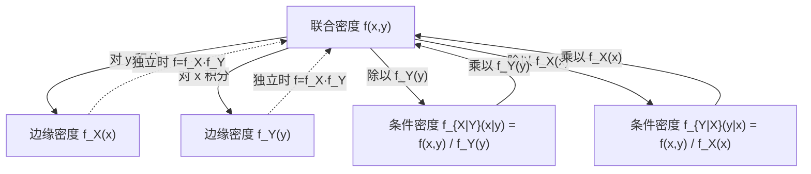

# 3.3 条件分布

本节解决的核心问题：在已知一个随机变量 $Y$ 取某定值 $y$ 的条件下，另一个随机变量 $X$ 的分布是什么？这就是**条件分布**。它是第1章条件概率思想在随机变量层面的推广，是后续理解贝叶斯推断和马尔可夫链的基础。

---

## 一、离散型条件分布律

> [!definition] 定义｜离散型条件分布律
> 设 $(X,Y)$ 为二维离散型随机变量，联合分布律为 $p_{ij}$，$Y$ 的边缘分布律为 $p_{\cdot j}=\sum_i p_{ij}$。
>
> 若 $P\{Y=y_j\}=p_{\cdot j}>0$，则在 $Y=y_j$ 条件下 $X$ 的**条件分布律**为
> $$P\{X=x_i\mid Y=y_j\}=\frac{P\{X=x_i,Y=y_j\}}{P\{Y=y_j\}}=\frac{p_{ij}}{p_{\cdot j}},\qquad i=1,2,\ldots$$
>
> 同理，在 $X=x_i$ 条件下 $Y$ 的条件分布律为
> $$P\{Y=y_j\mid X=x_i\}=\frac{p_{ij}}{p_{i\cdot}},\qquad j=1,2,\ldots$$

> [!warning] 前提条件
> 条件分布律要求分母（边缘概率）严格大于零：$p_{\cdot j}>0$（或 $p_{i\cdot}>0$）。若 $P\{Y=y_j\}=0$，则条件分布无定义。

> [!tip] 理解
> 条件分布律就是把联合分布律的**某一行（或列）**除以该行（列）的**行和（列和）**，使其归一化为一个一维分布律。

---

## 二、连续型条件概率密度

> [!definition] 定义｜连续型条件概率密度
> 设连续型 $(X,Y)$ 的联合密度为 $f(x,y)$，$Y$ 的边缘密度为 $f_Y(y)=\int f(x,y)\,dx$。
>
> 若 $f_Y(y)>0$，则在 $Y=y$ 条件下 $X$ 的**条件概率密度**为
> $$f_{X|Y}(x\mid y)=\frac{f(x,y)}{f_Y(y)}$$
>
> 同理，在 $X=x$ 条件下 $Y$ 的条件概率密度为
> $$f_{Y|X}(y\mid x)=\frac{f(x,y)}{f_X(x)}\qquad(f_X(x)>0)$$

### 条件分布函数

> [!definition] 定义｜条件分布函数
> 在 $Y=y$ 条件下 $X$ 的**条件分布函数**为
> $$F_{X|Y}(x\mid y)=P\{X\leq x\mid Y=y\}=\int_{-\infty}^{x}f_{X|Y}(u\mid y)\,du=\int_{-\infty}^{x}\frac{f(u,y)}{f_Y(y)}\,du$$

> [!warning] 连续型的特殊性
> 对连续型随机变量，$P\{Y=y\}=0$，条件概率 $P\{X\leq x\mid Y=y\}$ 不能直接用 $\frac{P\{X\leq x,Y=y\}}{P\{Y=y\}}$ 定义（分母为零）。上述条件密度是用极限手续定义的，即把 $P\{X\leq x\mid y-\varepsilon<Y\leq y+\varepsilon\}$ 取极限得到。

---

## 三、联合、边缘、条件的关系

> [!tip] 核心关系
> 联合、边缘、条件三者之间的关系可概括为"**联合 = 边缘 × 条件**"：
> $$f(x,y)=f_Y(y)\cdot f_{X|Y}(x\mid y)=f_X(x)\cdot f_{Y|X}(y\mid x)$$
> 这正是全概率公式的连续型推广（贝叶斯公式的密度形式）。

---

## 四、典型例题

> [!example] 例1（离散型）
> 接 [[3.2 边缘分布]] 例1，已知联合分布律
>
> | $X\setminus Y$ | 0 | 1 | 2 |
> |:---:|:---:|:---:|:---:|
> | 0 | $\frac{1}{12}$ | $\frac{1}{6}$ | $\frac{1}{12}$ |
> | 1 | $\frac{1}{6}$ | $\frac{1}{3}$ | $\frac{1}{6}$ |
>
> 求在 $Y=1$ 条件下 $X$ 的条件分布律。

**解**：边缘 $P\{Y=1\}=p_{\cdot 1}=\frac{1}{6}+\frac{1}{3}=\frac{1}{2}$。

$$P\{X=0\mid Y=1\}=\frac{p_{01}}{p_{\cdot 1}}=\frac{\frac{1}{6}}{\frac{1}{2}}=\frac{1}{3}$$

$$P\{X=1\mid Y=1\}=\frac{p_{11}}{p_{\cdot 1}}=\frac{\frac{1}{3}}{\frac{1}{2}}=\frac{2}{3}$$

> [!success] 结果
>
> | $X$ | 0 | 1 |
> |:---:|:---:|:---:|
> | $P\{X\mid Y=1\}$ | $\frac{1}{3}$ | $\frac{2}{3}$ |

> [!check] 验证
> $\frac{1}{3}+\frac{2}{3}=1$ ✓

---

> [!example] 例2（连续型）
> 设 $(X,Y)$ 在区域 $D=\{(x,y)\mid 0<x<1,\;0<y<x\}$ 上服从均匀分布，求条件密度 $f_{Y|X}(y\mid x)$。

**解**：

区域 $D$ 的面积 $A=\frac{1}{2}$，联合密度为

$$f(x,y)=\begin{cases}2,&0<x<1,\;0<y<x\\ 0,&\text{其他}\end{cases}$$

先求边缘密度 $f_X(x)$。当 $0<x<1$ 时：

$$f_X(x)=\int_{-\infty}^{+\infty}f(x,y)\,dy=\int_0^x 2\,dy=2x$$

当 $x\leq0$ 或 $x\geq1$ 时 $f_X(x)=0$。

当 $0<x<1$（此时 $f_X(x)=2x>0$）时，条件密度为

$$f_{Y|X}(y\mid x)=\frac{f(x,y)}{f_X(x)}=\frac{2}{2x}=\frac{1}{x},\qquad 0<y<x$$

> [!success] 结果
> $$f_{Y|X}(y\mid x)=\begin{cases}\dfrac{1}{x},&0<y<x,\;0<x<1\\[6pt] 0,&\text{其他}\end{cases}$$
>
> 这说明在 $X=x$ 条件下，$Y$ 在 $(0,x)$ 上服从均匀分布 $U(0,x)$。

> [!warning] 积分限的确定
> 本题关键在于正确确定联合密度的非零区域 $D$：$0<y<x$。对固定的 $x$，$y$ 从 $0$ 到 $x$。务必画图辅助。

---

## 小结

> [!summary] 本节要点
> 1. 条件分布是条件概率的推广：已知一个变量取定值，求另一个变量的分布。
> 2. 离散型：条件分布律 $=\frac{\text{联合}}{\text{边缘}}$，即 $P\{X=x_i\mid Y=y_j\}=\frac{p_{ij}}{p_{\cdot j}}$。
> 3. 连续型：条件密度 $f_{X|Y}(x\mid y)=\frac{f(x,y)}{f_Y(y)}$，要求 $f_Y(y)>0$。
> 4. 三者关系："联合 = 边缘 × 条件"，即 $f(x,y)=f_Y(y)\cdot f_{X|Y}(x\mid y)$。

## 关联

- **先修**：[[3.2 边缘分布]]（条件分布的分母是边缘分布）、[[3.1 二维随机变量联合分布]]（条件分布的分子是联合分布）
- **后续**：[[3.4 随机变量的独立性]]（独立时条件分布 = 无条件分布）
- **延伸**：贝叶斯公式的密度形式 $f_{Y|X}(y\mid x)=\frac{f_{X|Y}(x\mid y)f_Y(y)}{f_X(x)}$
- 本章导航：[[MOC - 第3章]]
