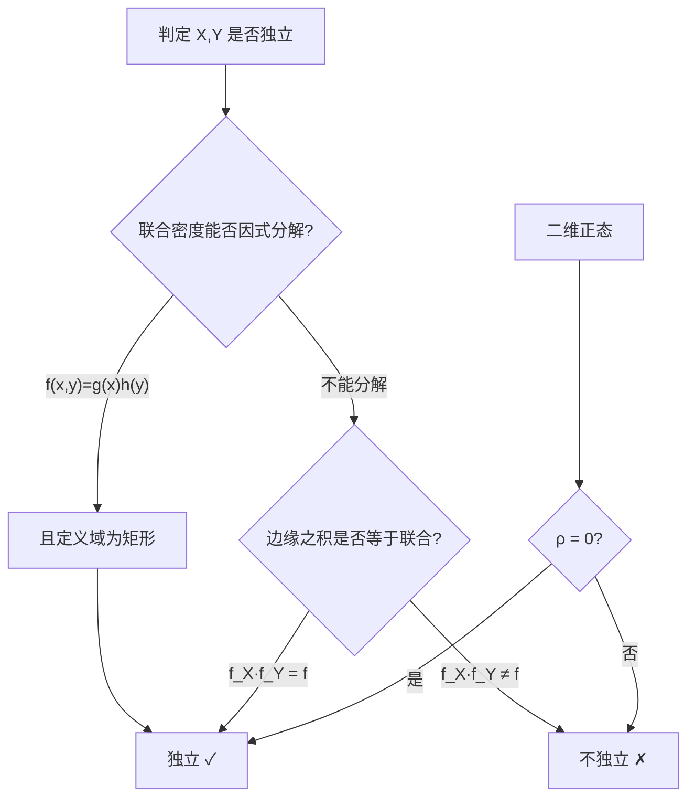

# 3.4 随机变量的独立性

本节解决的核心问题：两个随机变量 $X,Y$ 是否"互不影响"？如果 $Y$ 的取值不改变 $X$ 的分布（反之亦然），则称它们**独立**。独立性是概率论中最重要的一种结构——独立时联合分布可分解为边缘分布之积，使得大量计算得以简化。

---

## 一、独立性的定义

> [!definition] 定义｜随机变量的独立性
> 设 $(X,Y)$ 的联合分布函数为 $F(x,y)$，边缘分布函数为 $F_X(x)$、$F_Y(y)$。若对任意 $x,y$，
> $$F(x,y)=F_X(x)\cdot F_Y(y)$$
> 则称随机变量 $X$ 与 $Y$ **相互独立**（简称独立）。

> [!tip] 概率含义
> 独立意味着事件 $\{X\leq x\}$ 与 $\{Y\leq y\}$ 对任意 $x,y$ 都独立，即
> $$P\{X\leq x,Y\leq y\}=P\{X\leq x\}\cdot P\{Y\leq y\}$$
> 直观上，知道 $Y$ 的取值不改变 $X$ 的任何概率。

---

## 二、离散型独立的充要条件

> [!theorem] 定理｜离散型独立充要条件
> 设 $(X,Y)$ 为离散型，联合分布律 $p_{ij}$，边缘 $p_{i\cdot}$、$p_{\cdot j}$。则 $X,Y$ 独立 $\Leftrightarrow$
> $$p_{ij}=p_{i\cdot}\cdot p_{\cdot j}\quad\text{对一切 }i,j\text{ 成立}$$
>
> 即联合分布律等于边缘分布律之积。

> [!warning] 判定要点
> 必须对**所有** $i,j$ 验证 $p_{ij}=p_{i\cdot}p_{\cdot j}$。只要有一对不成立，就不独立。实际操作中，先求边缘，再逐格检查"联合是否等于行和×列和"。

---

## 三、连续型独立的充要条件

> [!theorem] 定理｜连续型独立充要条件
> 设 $(X,Y)$ 为连续型，联合密度 $f(x,y)$，边缘密度 $f_X(x)$、$f_Y(y)$。则 $X,Y$ 独立 $\Leftrightarrow$
> $$f(x,y)=f_X(x)\cdot f_Y(y)\quad\text{几乎处处成立}$$

> [!tip] 实用判据
> 如果联合密度能因式分解为 $f(x,y)=g(x)\cdot h(y)$（即一个只含 $x$ 的函数乘一个只含 $y$ 的函数），且定义域是矩形区域（$x$ 和 $y$ 的范围互不依赖），则 $X,Y$ 独立。此时 $g,h$ 正比于边缘密度。

> [!example] 例1（独立判定）
> 设 $f(x,y)=\begin{cases}4xy,&0<x<1,0<y<1\\ 0,&\text{其他}\end{cases}$，判断 $X,Y$ 是否独立。

**解**：

由 [[3.2 边缘分布]] 例2 已知 $f_X(x)=2x$（$0<x<1$），$f_Y(y)=2y$（$0<y<1$）。

验证：在 $0<x<1,0<y<1$ 时

$$f_X(x)\cdot f_Y(y)=2x\cdot 2y=4xy=f(x,y)$$

在区域外三者均为零。故 $X,Y$ **独立**。

---

## 四、二维正态独立的充要条件

> [!theorem] 定理｜二维正态独立的充要条件
> 设 $(X,Y)\sim N(\mu_1,\mu_2,\sigma_1^2,\sigma_2^2,\rho)$，则
> $$X,Y\text{ 独立}\quad\Leftrightarrow\quad \rho=0$$

> [!proof] 证明思路
> 当 $\rho=0$ 时，联合密度中的交叉项 $\frac{-2\rho(x-\mu_1)(y-\mu_2)}{\sigma_1\sigma_2}$ 消失，密度可分解为
> $$f(x,y)=\frac{1}{\sqrt{2\pi}\sigma_1}e^{-\frac{(x-\mu_1)^2}{2\sigma_1^2}}\cdot\frac{1}{\sqrt{2\pi}\sigma_2}e^{-\frac{(y-\mu_2)^2}{2\sigma_2^2}}=f_X(x)\cdot f_Y(y)$$
> 故独立。反之，独立则 $f(x,y)=f_X(x)f_Y(y)$ 处处成立，对比密度形式可得 $\rho=0$。

> [!warning] 重要区分
> - **一般情形**：独立 $\Rightarrow$ 不相关（$\rho=0$），但 $\rho=0$ 不一定独立。
> - **二维正态特例**：独立 $\Leftrightarrow \rho=0$（不相关即独立）。
>
> 这是考试高频考点：若已知 $(X,Y)$ 服从二维正态，则 $\rho=0$ 就能推出独立。

---

## 五、独立性的判定方法

> [!tip] 判定步骤
> 1. **看密度结构**：若 $f(x,y)$ 能写为 $g(x)h(y)$ 且定义域是矩形 $\to$ 独立。
> 2. **求边缘比较**：求出 $f_X,f_Y$，检验 $f_X(x)f_Y(y)\stackrel{?}{=}f(x,y)$。
> 3. **正态直接看 $\rho$**：二维正态时 $\rho=0$ 即独立。

---

## 六、$n$ 维随机变量的独立性

> [!definition] 定义｜$n$ 维独立性
> 设 $n$ 维随机变量 $(X_1,X_2,\ldots,X_n)$ 的联合分布函数为 $F(x_1,\ldots,x_n)$，各分量边缘分布为 $F_{X_i}(x_i)$。若对任意 $x_1,\ldots,x_n$，
> $$F(x_1,\ldots,x_n)=\prod_{i=1}^{n}F_{X_i}(x_i)$$
> 则称 $X_1,\ldots,X_n$ **相互独立**。

> [!warning] 两两独立 $\neq$ 相互独立
> $n$ 个变量**两两独立**（任意两个独立）不等于**相互独立**。相互独立要求任意子集的联合分布等于各边缘之积。相互独立蕴含两两独立，反之不然。

> [!example] 例2
> 设 $X,Y$ 独立，$X\sim U(0,1)$，$Y\sim U(0,1)$，求 $P\{X+Y<1\}$。

**解**：由独立性，联合密度 $f(x,y)=f_X(x)f_Y(y)=1$（在 $0<x<1,0<y<1$ 内）。

$$P\{X+Y<1\}=\iint_{x+y<1}1\,dx\,dy=\int_0^1\int_0^{1-x}dy\,dx=\int_0^1(1-x)\,dx=\frac{1}{2}$$

> [!success] 结果
> $$P\{X+Y<1\}=\frac{1}{2}$$

---

## 小结

> [!summary] 本节要点
> 1. 独立的核心：联合 = 边缘之积（分布函数、分布律、密度三种形式）。
> 2. 离散型：$p_{ij}=p_{i\cdot}p_{\cdot j}$ 对所有 $i,j$ 成立。
> 3. 连续型：$f(x,y)=f_X(x)f_Y(y)$ 几乎处处成立；若 $f$ 可因式分解且矩形区域则独立。
> 4. 二维正态：$\rho=0 \Leftrightarrow$ 独立（不相关即独立的唯一特例）。
> 5. 相互独立 $\Rightarrow$ 两两独立，反之不成立。

## 关联

- **先修**：[[3.2 边缘分布]]、[[3.3 条件分布]]（独立时条件分布 = 无条件分布）
- **应用**：[[3.5 二维随机变量函数的分布]]（卷积公式需独立性）、[[4.1 数学期望定义与性质]]（独立时 $E(XY)=E(X)E(Y)$）、[[4.2 方差、标准差]]（独立时 $D(X\pm Y)=D(X)+D(Y)$）
- **延伸**：[[4.3 协方差、相关系数]]（独立 $\Rightarrow$ 不相关，反之一般不成立）
- 本章导航：[[MOC - 第3章]]
