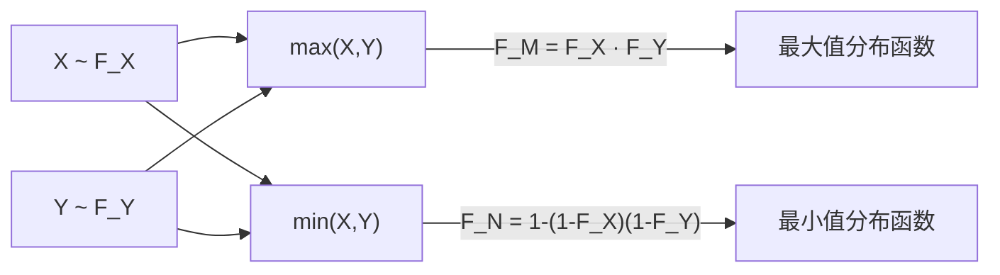

# 3.5 二维随机变量函数的分布

本节解决的核心问题：已知 $(X,Y)$ 的联合分布，如何求 $Z=g(X,Y)$ 的分布？重点掌握四种典型函数：**和** $Z=X+Y$、**商** $Z=X/Y$、**最大值** $\max(X,Y)$、**最小值** $\min(X,Y)$。

---

## 一、$Z=X+Y$ 的分布（卷积公式）

### 1. 一般情形

> [!theorem] 定理｜和的分布（卷积公式）
> 设 $(X,Y)$ 为连续型，联合密度 $f(x,y)$，$Z=X+Y$。则 $Z$ 的概率密度为
> $$f_Z(z)=\int_{-\infty}^{+\infty}f(x,z-x)\,dx$$
>
> 或等价地（换元 $u=z-x$）
> $$f_Z(z)=\int_{-\infty}^{+\infty}f(z-y,y)\,dy$$

> [!proof] 推导
> 先求分布函数：
> $$F_Z(z)=P\{Z\leq z\}=P\{X+Y\leq z\}=\iint_{x+y\leq z}f(x,y)\,dx\,dy$$
> 化为先对 $y$ 积分（$y\leq z-x$）：
> $$F_Z(z)=\int_{-\infty}^{+\infty}\int_{-\infty}^{z-x}f(x,y)\,dy\,dx$$
> 对 $z$ 求导得密度（令 $u=z-x$ 对内层求导）：
> $$f_Z(z)=\int_{-\infty}^{+\infty}f(x,z-x)\,dx$$

### 2. $X,Y$ 独立时的卷积公式

> [!theorem] 定理｜独立和的卷积公式
> 若 $X,Y$ 独立，密度分别为 $f_X(x)$、$f_Y(y)$，则 $Z=X+Y$ 的密度为
> $$\boxed{f_Z(z)=\int_{-\infty}^{+\infty}f_X(x)\cdot f_Y(z-x)\,dx}$$
>
> 此积分称为 $f_X$ 与 $f_Y$ 的**卷积**，记为 $f_X*f_Y$。

> [!warning] 积分限
> 卷积积分限取决于 $f_X$ 和 $f_Y$ 的非零区域交集。要使 $f_X(x)\neq0$ 且 $f_Y(z-x)\neq0$ 同时成立，需解出 $x$ 的范围。务必画图辅助。

---

## 二、正态分布的可加性

> [!theorem] 定理｜正态可加性
> 若 $X\sim N(\mu_1,\sigma_1^2)$，$Y\sim N(\mu_2,\sigma_2^2)$ 且 $X,Y$ **独立**，则
> $$Z=X+Y\sim N(\mu_1+\mu_2,\;\sigma_1^2+\sigma_2^2)$$
>
> 推广：若 $X_i\sim N(\mu_i,\sigma_i^2)$ 且相互独立，$a_i$ 为常数，则
> $$\sum_{i=1}^{n}a_iX_i\sim N\!\left(\sum a_i\mu_i,\;\sum a_i^2\sigma_i^2\right)$$

> [!tip] 理解
> 独立正态变量的线性组合仍是正态变量；均值线性相加，方差按系数平方相加。

> [!example] 例1
> 设 $X\sim N(1,4)$，$Y\sim N(2,9)$ 且独立，求 $Z=X+Y$ 的分布。

**解**：由正态可加性：

$$Z=X+Y\sim N(1+2,\;4+9)=N(3,13)$$

> [!success] 结果
> $$Z\sim N(3,13)$$

---

## 三、$Z=X/Y$ 的分布（商公式）

> [!theorem] 定理｜商的分布
> 设 $(X,Y)$ 连续型，联合密度 $f(x,y)$，$Z=X/Y$（要求 $P\{Y=0\}=0$）。则 $Z$ 的密度为
> $$f_Z(z)=\int_{-\infty}^{+\infty}|y|\cdot f(zy,y)\,dy$$
>
> 若 $X,Y$ 独立：$f_Z(z)=\int_{-\infty}^{+\infty}|y|\cdot f_X(zy)\cdot f_Y(y)\,dy$

> [!proof] 推导
> 变换 $\begin{cases}z=x/y\\ y=y\end{cases}$，逆变换 $\begin{cases}x=zy\\ y=y\end{cases}$，Jacobi 行列式 $|J|=|y|$。由变量变换公式得 $f_Z(z)=\int|y|\cdot f(zy,y)\,dy$。

---

## 四、$\max(X,Y)$ 与 $\min(X,Y)$ 的分布

### 1. 最大值的分布

> [!theorem] 定理｜$\max(X,Y)$ 的分布
> 设 $X,Y$ **独立**，分布函数分别为 $F_X(x)$、$F_Y(y)$。令 $M=\max(X,Y)$，则
> $$F_M(z)=P\{\max(X,Y)\leq z\}=P\{X\leq z,Y\leq z\}=F_X(z)\cdot F_Y(z)$$

> [!proof] 证明
> $\max(X,Y)\leq z$ 等价于 $X\leq z$ **且** $Y\leq z$。由独立性：
> $$P\{X\leq z,Y\leq z\}=P\{X\leq z\}\cdot P\{Y\leq z\}=F_X(z)F_Y(z)$$

### 2. 最小值的分布

> [!theorem] 定理｜$\min(X,Y)$ 的分布
> 设 $X,Y$ **独立**。令 $N=\min(X,Y)$，则
> $$F_N(z)=P\{\min(X,Y)\leq z\}=1-P\{\min(X,Y)>z\}=1-P\{X>z,Y>z\}$$
> $$=1-[1-F_X(z)]\cdot[1-F_Y(z)]$$

### 3. $n$ 个独立同分布的推广

> [!theorem] 推论
> 设 $X_1,\ldots,X_n$ 独立同分布，分布函数 $F(x)$，则
>
> - $M=\max(X_1,\ldots,X_n)$：$F_M(z)=[F(z)]^n$
> - $N=\min(X_1,\ldots,X_n)$：$F_N(z)=1-[1-F(z)]^n$

> [!example] 例2
> 设系统由两个独立同分布元件组成，元件寿命 $T\sim\mathrm{Exp}(\lambda)$，分布函数 $F(t)=1-e^{-\lambda t}$（$t\geq0$）。求：
> (1) 串联系统（$N=\min(T_1,T_2)$）寿命的分布；
> (2) 并联系统（$M=\max(T_1,T_2)$）寿命的分布。

**解**：

(1) 串联系统寿命为 $\min(T_1,T_2)$：

$$F_N(t)=1-[1-F(t)]^2=1-e^{-2\lambda t}\qquad(t\geq0)$$

即 $N\sim\mathrm{Exp}(2\lambda)$，串联使失效率翻倍。

(2) 并联系统寿命为 $\max(T_1,T_2)$：

$$F_M(t)=[F(t)]^2=(1-e^{-\lambda t})^2\qquad(t\geq0)$$

> [!success] 结果
> 串联：$N\sim\mathrm{Exp}(2\lambda)$；并联：$F_M(t)=(1-e^{-\lambda t})^2$。

> [!tip] 可靠性意义
> - 串联系统：任一元件失效则系统失效 $\to\min$，失效率叠加。
> - 并联系统：所有元件失效才系统失效 $\to\max$，可靠性提升。

---

## 五、综合例题

> [!example] 例3（卷积）
> 设 $X,Y$ 独立同服从 $U(0,1)$，求 $Z=X+Y$ 的密度。

**解**：$f_X(x)=f_Y(y)=\begin{cases}1,&0<x<1\\0,&\text{其他}\end{cases}$

$$f_Z(z)=\int_{-\infty}^{+\infty}f_X(x)f_Y(z-x)\,dx$$

需 $0<x<1$ 且 $0<z-x<1$，即 $\max(0,z-1)<x<\min(1,z)$。

- 当 $0<z<1$ 时：$0<x<z$，$f_Z(z)=\int_0^z 1\,dx=z$
- 当 $1\leq z<2$ 时：$z-1<x<1$，$f_Z(z)=\int_{z-1}^1 1\,dx=2-z$

> [!success] 结果
> $$f_Z(z)=\begin{cases}z,&0<z<1\\ 2-z,&1\leq z<2\\ 0,&\text{其他}\end{cases}$$
>
> 这是**三角形分布**（辛普森分布）。

---

## 小结

> [!summary] 本节要点
> 1. 和的分布（卷积）：$f_Z(z)=\int f(x,z-x)\,dx$；独立时 $f_Z(z)=\int f_X(x)f_Y(z-x)\,dx$。
> 2. 正态可加性：独立正态和 $\sim N(\sum\mu_i,\sum\sigma_i^2)$。
> 3. 商的分布：$f_{X/Y}(z)=\int|y|\cdot f(zy,y)\,dy$。
> 4. 极值分布（需独立）：
>    - $\max$：$F_M=F_X\cdot F_Y$（分布函数相乘）
>    - $\min$：$F_N=1-(1-F_X)(1-F_Y)$（"不取值"概率相乘取补）
> 5. $n$ 个独立同分布：$\max$ 的分布函数为 $[F]^n$，$\min$ 为 $1-(1-F)^n$。

## 关联

- **先修**：[[3.4 随机变量的独立性]]（卷积和极值公式需要独立性）、[[3.1 二维随机变量联合分布]]（联合密度）
- **应用**：[[4.1 数学期望定义与性质]]（$E(X+Y)=E(X)+E(Y)$ 不需独立）、[[4.2 方差、标准差]]（$D(X+Y)$ 需独立性）
- **延伸**：[[5.3 独立同分布中心极限定理]]（独立同分布和的渐近正态性）
- 本章导航：[[MOC - 第3章]]
