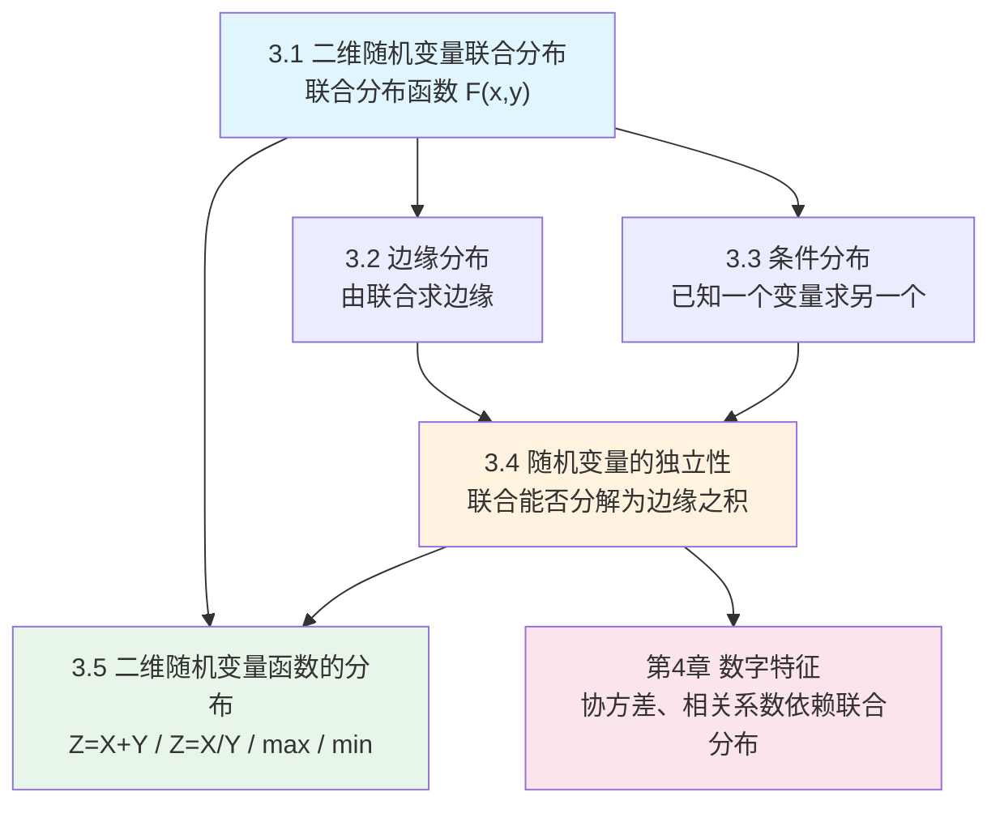

# MOC - 第3章 多维随机变量及其分布

> [!info] 本章定位
> 第2章将单个随机事件数量化为一维随机变量，本章把这一思想扩展到**多维**：用多个随机变量同时描述试验结果，研究它们之间的**联合统计规律**。核心问题是：如何用数学语言同时刻画多个随机变量的取值规律（联合分布），如何从中提取单个变量的规律（边缘分布），如何在已知一个变量取值的条件下描述另一个变量（条件分布），以及多个随机变量之间是否存在统计意义上的相互影响（独立性）。本章是第4章数字特征（期望、方差、协方差）的**直接前提**——协方差、相关系数必须建立在联合分布之上；同时也是第5章极限定理中"独立同分布"假设的基础。

## 学习路线图

## 知识点导航

| 节号 | 主题 | 入口 | 核心概念 | 难度 |
| ---- | ---- | ---- | -------- | ---- |
| 3.1 | 二维随机变量联合分布 | [[3.1 二维随机变量联合分布]] | 联合分布函数 $F(x,y)$、联合分布律、联合概率密度 $f(x,y)$、二维正态分布 | ★★★ |
| 3.2 | 边缘分布 | [[3.2 边缘分布]] | 边缘分布函数、边缘分布律、边缘概率密度、边缘不能决定联合 | ★★ |
| 3.3 | 条件分布 | [[3.3 条件分布]] | 条件分布律、条件概率密度 $f_{X|Y}(x|y)$、条件分布函数 | ★★★ |
| 3.4 | 随机变量的独立性 | [[3.4 随机变量的独立性]] | 独立性定义、独立充要条件、二维正态独立 $\Leftrightarrow \rho=0$、$n$ 维推广 | ★★★ |
| 3.5 | 二维随机变量函数的分布 | [[3.5 二维随机变量函数的分布]] | 卷积公式、正态可加性、商的分布、极值分布 | ★★★★ |

## 核心考点

> [!warning] 本章高频考点（8 点）
> 1. **由联合分布求边缘分布**：离散型对行/列求和，连续型对另一变量积分——必须熟练。
> 2. **由联合分布求条件分布**：注意连续型条件密度要求 $f_Y(y)>0$。
> 3. **独立性判定**：$F(x,y)=F_X(x)F_Y(y)$ 是定义；离散型看 $p_{ij}=p_{i\cdot}p_{\cdot j}$，连续型看 $f(x,y)=f_X(x)f_Y(y)$。
> 4. **二维正态分布**：$\rho=0 \Leftrightarrow X,Y$ 独立（这是唯一"不相关即独立"的情形）。
> 5. **卷积公式**求 $Z=X+Y$ 的密度：$f_Z(z)=\int_{-\infty}^{+\infty}f(x,z-x)\,dx$，独立时 $f_Z(z)=\int f_X(x)f_Y(z-x)\,dx$。
> 6. **正态可加性**：独立正态变量之和仍服从正态分布，均值方差分别相加。
> 7. **极值分布**：$\max$ 的分布函数为各分量分布函数之积；$\min$ 的分布函数为各分量"不取值"概率之积的补。
> 8. **边缘分布不能决定联合分布**：相同的边缘分布可以对应不同的联合分布（除非独立）。

## 自测题

> [!question]- 1. 设 $(X,Y)$ 的联合密度 $f(x,y)$ 在全平面非零，$X$ 的边缘密度 $f_X(x)$ 能否唯一确定 $f(x,y)$？
> 不能。边缘分布只保留单个变量的信息，丢失了变量间的相依结构。只有当 $X,Y$ 独立时 $f(x,y)=f_X(x)f_Y(y)$ 才能由边缘恢复联合分布。可构造反例：两组不同的联合密度有相同的边缘密度。

> [!question]- 2. 二维正态分布 $N(\mu_1,\mu_2,\sigma_1^2,\sigma_2^2,\rho)$ 中，参数 $\rho$ 的含义是什么？$\rho=0$ 意味着什么？
> $\rho$ 是 $X,Y$ 的相关系数，取值范围 $[-1,1]$。对于二维正态分布，$\rho=0 \Leftrightarrow X,Y$ 独立（这是二维正态特有的性质，一般情形不相关不等于独立）。

> [!question]- 3. 已知 $X\sim N(0,1)$，$Y\sim N(0,1)$ 且独立，求 $Z=X+Y$ 的分布。
> 由正态可加性，$Z\sim N(0+0, 1+1)=N(0,2)$。也可用卷积公式验证：$f_Z(z)=\int f_X(x)f_Y(z-x)\,dx$，结果是方差为 $2$ 的正态密度。

> [!question]- 4. 设 $X,Y$ 独立同分布，$F(x)$ 为公共分布函数，求 $\max(X,Y)$ 和 $\min(X,Y)$ 的分布函数。
> $F_{\max}(z)=P\{\max\leq z\}=P\{X\leq z,Y\leq z\}=F(z)^2$；
> $F_{\min}(z)=P\{\min\leq z\}=1-P\{\min>z\}=1-[1-F(z)]^2$。

## 章节导航

- 上一级：[[MOC - 概率论与数理统计B]]
- 上一章：[[MOC - 第2章]]（随机变量及其分布）
- 下一章：[[MOC - 第4章]]（随机变量的数字特征）
- 本章习题：[[MOC - 第3章习题]]
- 下一章习题：[[MOC - 第4章习题]]
