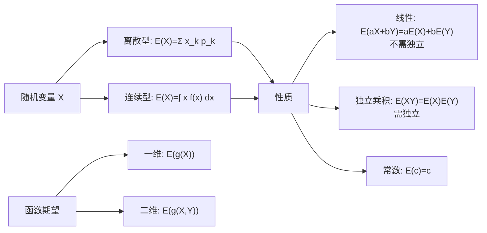

# 4.1 数学期望定义与性质

本节解决的核心问题：如何用一个数字概括随机变量的"平均取值"？这就是**数学期望**（简称期望），它是概率论中最基本的数字特征，是方差、协方差等一切高阶特征的基础。

---

## 一、离散型随机变量的期望

> [!definition] 定义｜离散型期望
> 设离散型 $X$ 的分布律为 $P\{X=x_k\}=p_k$，$k=1,2,\ldots$。若级数
> $$\sum_{k=1}^{\infty}x_k p_k$$
> **绝对收敛**（即 $\sum|x_k|p_k<+\infty$），则称
> $$E(X)=\sum_{k=1}^{\infty}x_k p_k$$
> 为 $X$ 的**数学期望**（简称期望或均值）。

> [!warning] 绝对收敛的要求
> 期望定义要求级数**绝对收敛**，而非仅仅条件收敛。原因是：期望代表"平均值"，不应依赖于取值的排列顺序。绝对收敛保证了任意重排级数仍收敛到同一值。
>
> 若 $\sum|x_k|p_k=+\infty$，则称 $X$ 的期望**不存在**。

> [!tip] 物理意义
> 期望可理解为质点系的**重心**：在 $x_k$ 处放置质量为 $p_k$ 的质点（$\sum p_k=1$），则重心坐标就是 $E(X)=\sum x_k p_k$。

---

## 二、连续型随机变量的期望

> [!definition] 定义｜连续型期望
> 设连续型 $X$ 的概率密度为 $f(x)$。若积分
> $$\int_{-\infty}^{+\infty}x\,f(x)\,dx$$
> **绝对可积**（即 $\int_{-\infty}^{+\infty}|x|\,f(x)\,dx<+\infty$），则称
> $$E(X)=\int_{-\infty}^{+\infty}x\,f(x)\,dx$$
> 为 $X$ 的**数学期望**。

> [!warning] 期望不存在的例子
> 柯西分布 $f(x)=\frac{1}{\pi(1+x^2)}$，$\int_{-\infty}^{+\infty}|x|\cdot\frac{1}{\pi(1+x^2)}\,dx=+\infty$，期望不存在。

---

## 三、随机变量函数的期望

### 1. 一维函数的期望

> [!theorem] 定理｜一维函数的期望
> 设 $Y=g(X)$ 为 $X$ 的函数。
>
> - 若 $X$ 离散型：$E(g(X))=\sum_{k}g(x_k)\,p_k$（绝对收敛时）
> - 若 $X$ 连续型：$E(g(X))=\int_{-\infty}^{+\infty}g(x)\,f(x)\,dx$（绝对可积时）

> [!tip] 重要意义
> 求 $Y=g(X)$ 的期望**不需要**先求 $Y$ 的分布，直接对 $g(X)$ 用 $X$ 的分布加权求和/积分即可。这大大简化了计算。

### 2. 二维函数的期望

> [!theorem] 定理｜二维函数的期望
> 设 $Z=g(X,Y)$ 为 $(X,Y)$ 的函数。
>
> - 若 $(X,Y)$ 离散型：$E(g(X,Y))=\sum_i\sum_j g(x_i,y_j)\,p_{ij}$
> - 若 $(X,Y)$ 连续型：$E(g(X,Y))=\int_{-\infty}^{+\infty}\int_{-\infty}^{+\infty}g(x,y)\,f(x,y)\,dx\,dy$

> [!example] 例1
> 设 $X\sim U(0,1)$，求 $E(X^2)$。

**解**：

$$E(X^2)=\int_{-\infty}^{+\infty}x^2 f(x)\,dx=\int_0^1 x^2\cdot1\,dx=\frac{1}{3}$$

> [!success] 结果
> $E(X^2)=\frac{1}{3}$（无需先求 $X^2$ 的分布）

---

## 四、期望的性质

> [!theorem] 定理｜期望的性质
> 设 $X,Y$ 的期望存在，$a,b,c$ 为常数。
>
> 1. **常数期望**：$E(c)=c$
> 2. **线性性质**：$E(aX+bY)=aE(X)+bE(Y)$（**不需要独立性**）
> 3. **独立乘积**：若 $X,Y$ 独立，则 $E(XY)=E(X)\cdot E(Y)$
> 4. **单调性**：若 $X\leq Y$ a.s.，则 $E(X)\leq E(Y)$

> [!warning] 关键区分
> - $E(X+Y)=E(X)+E(Y)$：**不需要**独立性，对一切 $X,Y$ 成立。
> - $E(XY)=E(X)E(Y)$：**需要**独立性才成立（不独立时一般 $E(XY)\neq E(X)E(Y)$，差值就是协方差）。
>
> 这是最常见的易错点。

> [!proof] 线性性质的推导（连续型）
> $$E(aX+bY)=\iint(ax+by)f(x,y)\,dx\,dy=a\iint xf\,dx\,dy+b\iint yf\,dx\,dy=aE(X)+bE(Y)$$
> 这里利用了积分的线性性，不需要 $X,Y$ 独立。

> [!proof] 独立乘积的推导
> 若 $X,Y$ 独立，$f(x,y)=f_X(x)f_Y(y)$：
> $$E(XY)=\iint xy\,f(x,y)\,dx\,dy=\iint xy\,f_X(x)f_Y(y)\,dx\,dy=\left(\int xf_X\,dx\right)\left(\int yf_Y\,dy\right)=E(X)E(Y)$$

---

## 五、典型例题

> [!example] 例2（离散型期望）
> 设 $X\sim B(n,p)$（二项分布），求 $E(X)$。

**解**：$P\{X=k\}=\binom{n}{k}p^k(1-p)^{n-k}$，$k=0,1,\ldots,n$。

$$E(X)=\sum_{k=0}^n k\binom{n}{k}p^k(1-p)^{n-k}$$

利用 $k\binom{n}{k}=n\binom{n-1}{k-1}$：

$$=np\sum_{k=1}^n\binom{n-1}{k-1}p^{k-1}(1-p)^{n-k}=np[p+(1-p)]^{n-1}=np$$

> [!success] 结果
> $$E(X)=np$$

---

> [!example] 例3（二维函数期望）
> 设 $(X,Y)$ 的联合密度 $f(x,y)=\begin{cases}2,&0<x<1,0<y<x\\0,&\text{其他}\end{cases}$，求 $E(XY)$。

**解**：

$$E(XY)=\iint xy\cdot f\,dx\,dy=\int_0^1\int_0^x xy\cdot2\,dy\,dx=2\int_0^1 x\left[\frac{y^2}{2}\right]_0^x dx=\int_0^1 x^3\,dx=\frac{1}{4}$$

> [!success] 结果
> $E(XY)=\frac{1}{4}$

---

## 小结

> [!summary] 本节要点
> 1. 期望是"加权平均"：离散型求和 $\sum x_k p_k$，连续型积分 $\int xf(x)\,dx$，均要求绝对收敛/可积。
> 2. 函数期望定理：$E(g(X))=\int g(x)f(x)\,dx$，无需先求 $g(X)$ 的分布。
> 3. 线性性质 $E(aX+bY)=aE(X)+bE(Y)$ 不需要独立性；独立乘积 $E(XY)=E(X)E(Y)$ 需要独立性。
> 4. 期望是方差、协方差等一切数字特征的基础。

## 关联

- **先修**：[[3.1 二维随机变量联合分布]]（二维函数期望需要联合密度）、[[MOC - 第2章]]（一维分布）
- **后续**：[[4.2 方差、标准差]]（$D(X)=E\{[X-E(X)]^2\}$）、[[4.3 协方差、相关系数]]（$\mathrm{Cov}=E(XY)-E(X)E(Y)$）
- **应用**：[[4.5 常见分布数字特征汇总]]（六大分布期望推导）、[[5.2 大数定律]]（辛钦大数定律：$\bar{X}\to E(X)$）
- 本章导航：[[MOC - 第4章]]
