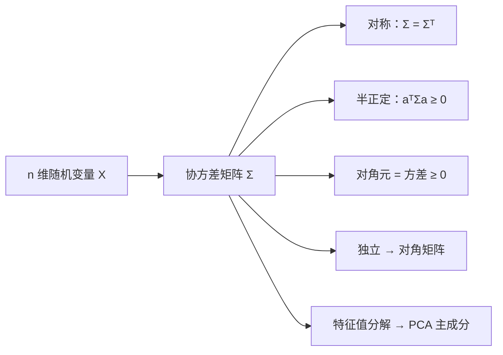

# 4.4 矩、协方差矩阵

本节解决的核心问题：期望和方差是矩的特例。本节引入**矩**的一般概念，将期望（一阶原点矩）和方差（二阶中心矩）统一在"矩"的框架下，并推广到多维情形得到**协方差矩阵**——它在多元统计分析、机器学习（PCA）中是核心工具。

---

## 一、矩的定义

### 1. 原点矩与中心矩

> [!definition] 定义｜原点矩与中心矩
> 设 $X$ 为随机变量，$k$ 为正整数。
>
> - 若 $E(X^k)$ 存在，称 $\mu_k=E(X^k)$ 为 $X$ 的 **$k$ 阶原点矩**。
> - 若 $E\{[X-E(X)]^k\}$ 存在，称 $\nu_k=E\{[X-E(X)]^k\}$ 为 $X$ 的 **$k$ 阶中心矩**。

> [!tip] 与已学概念的关系
> | 矩 | 名称 | 关系 |
> |:---:|:---|:---|
> | 一阶原点矩 $\mu_1$ | 期望 $E(X)$ | $\mu_1=E(X)$ |
> | 二阶中心矩 $\nu_2$ | 方差 $D(X)$ | $\nu_2=D(X)=\mu_2-\mu_1^2$ |
>
> 即期望是一阶原点矩，方差是二阶中心矩——它们都是矩的特例。

### 2. 混合矩与混合中心矩

> [!definition] 定义｜混合矩
> 设 $(X,Y)$ 为二维随机变量，$k,l$ 为非负整数。
>
> - 若 $E(X^k Y^l)$ 存在，称其为 $X,Y$ 的 **$(k+l)$ 阶混合矩**。
> - 若 $E\{[X-E(X)]^k[Y-E(Y)]^l\}$ 存在，称其为 $X,Y$ 的 **$(k+l)$ 阶混合中心矩**。

> [!tip] 协方差的统一
> 协方差 $\mathrm{Cov}(X,Y)=E\{[X-E(X)][Y-E(Y)]\}$ 正是 $(1+1)=2$ 阶混合中心矩。

---

## 二、协方差矩阵

### 1. 定义

> [!definition] 定义｜协方差矩阵
> 设 $n$ 维随机变量 $\mathbf{X}=(X_1,X_2,\ldots,X_n)^T$，各分量的方差 $D(X_i)$ 和协方差 $\mathrm{Cov}(X_i,X_j)$ 都存在。称 $n\times n$ 矩阵
> $$\Sigma=\mathrm{Cov}(\mathbf{X})=\begin{pmatrix}D(X_1) & \mathrm{Cov}(X_1,X_2) & \cdots & \mathrm{Cov}(X_1,X_n)\\ \mathrm{Cov}(X_2,X_1) & D(X_2) & \cdots & \mathrm{Cov}(X_2,X_n)\\ \vdots & \vdots & \ddots & \vdots\\ \mathrm{Cov}(X_n,X_1) & \mathrm{Cov}(X_n,X_2) & \cdots & D(X_n)\end{pmatrix}$$
> 为 $\mathbf{X}$ 的**协方差矩阵**。
>
> 其中第 $(i,j)$ 元素为 $\Sigma_{ij}=\mathrm{Cov}(X_i,X_j)$。

### 2. 性质

> [!theorem] 定理｜协方差矩阵的性质
> 1. **对称性**：$\Sigma=\Sigma^T$（因为 $\mathrm{Cov}(X_i,X_j)=\mathrm{Cov}(X_j,X_i)$）。
> 2. **半正定性**：对任意 $\mathbf{a}\in\mathbb{R}^n$，$\mathbf{a}^T\Sigma\mathbf{a}\geq0$。
> 3. **非负对角元**：$\Sigma_{ii}=D(X_i)\geq0$。
> 4. **独立分量的对角性**：若各分量相互独立，则 $\Sigma$ 为**对角矩阵**。

> [!proof] 半正定性的证明
> 对任意 $\mathbf{a}=(a_1,\ldots,a_n)^T$：
> $$\mathbf{a}^T\Sigma\mathbf{a}=\sum_{i,j}a_i a_j\,\mathrm{Cov}(X_i,X_j)=\mathrm{Cov}\!\left(\sum_i a_iX_i,\sum_j a_jX_j\right)=D\!\left(\sum_i a_iX_i\right)\geq0$$
> 方差非负，故协方差矩阵半正定。

---

## 三、二维协方差矩阵示例

> [!example] 例1
> 设二维随机变量 $(X,Y)$，$D(X)=4$，$D(Y)=9$，$\mathrm{Cov}(X,Y)=3$，写出协方差矩阵并求相关系数。

**解**：

$$\Sigma=\begin{pmatrix}D(X) & \mathrm{Cov}(X,Y)\\ \mathrm{Cov}(X,Y) & D(Y)\end{pmatrix}=\begin{pmatrix}4 & 3\\ 3 & 9\end{pmatrix}$$

验证半正定性：对 $\mathbf{a}=(a,b)^T$，

$$\mathbf{a}^T\Sigma\mathbf{a}=4a^2+6ab+9b^2=4\!\left(a+\frac{3b}{4}\right)^2+9b^2-\frac{9b^2}{4}=4\!\left(a+\frac{3b}{4}\right)^2+\frac{27b^2}{4}\geq0\;\checkmark$$

相关系数：

$$\rho_{XY}=\frac{\mathrm{Cov}(X,Y)}{\sqrt{D(X)D(Y)}}=\frac{3}{\sqrt{4\times9}}=\frac{3}{6}=\frac{1}{2}$$

> [!success] 结果
> $\Sigma=\begin{pmatrix}4&3\\3&9\end{pmatrix}$，$\rho_{XY}=\frac{1}{2}$

---

## 四、协方差矩阵的几何意义

> [!tip] 几何理解
> 协方差矩阵描述了多维随机变量在空间中的"散布形状"：
> - 对角元（方差）描述各方向的**展宽**；
> - 非对角元（协方差）描述各方向间的**相关性倾斜**；
> - 特征向量方向是数据散布的**主轴**，对应特征值是各主轴方向的方差。
>
> 这正是 PCA（主成分分析）的数学基础。

---

## 小结

> [!summary] 本节要点
> 1. $k$ 阶原点矩 $\mu_k=E(X^k)$，$k$ 阶中心矩 $\nu_k=E\{[X-E(X)]^k\}$。
> 2. 期望 = 一阶原点矩，方差 = 二阶中心矩，协方差 = 二阶混合中心矩。
> 3. 协方差矩阵 $\Sigma_{ij}=\mathrm{Cov}(X_i,X_j)$，对称且半正定。
> 4. 各分量独立时协方差矩阵为对角矩阵。
> 5. 协方差矩阵的特征分解是 PCA 的数学基础。

## 关联

- **先修**：[[4.1 数学期望定义与性质]]、[[4.2 方差、标准差]]、[[4.3 协方差、相关系数]]（矩是它们的推广）
- **应用**：[[3.1 二维随机变量联合分布]]（二维正态的协方差矩阵参数）、多元统计分析、机器学习 PCA
- **延伸**：线性代数中的正定矩阵、二次型
- 本章导航：[[MOC - 第4章]]
