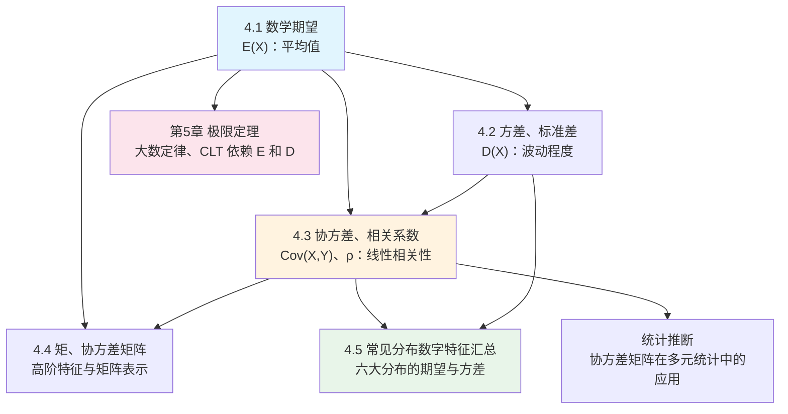

# MOC - 第4章 随机变量的数字特征

> [!info] 本章定位
> 分布函数完整描述了随机变量的取值规律，但在实际应用中，我们往往只需要几个**关键数字**来概括随机变量的核心特征：取值的"平均水平"（期望）和"波动程度"（方差）。本章引入数学期望、方差、协方差与相关系数等**数字特征**，它们把抽象的分布浓缩为可计算、可比较的数值。本章是第3章联合分布的**直接下游**——协方差和相关系数必须依赖联合分布计算；同时又是第5章极限定理的**前提**——大数定律和中心极限定理都以期望和方差为核心参数。

## 学习路线图

## 知识点导航

| 节号 | 主题 | 入口 | 核心概念 | 难度 |
| ---- | ---- | ---- | -------- | ---- |
| 4.1 | 数学期望定义与性质 | [[4.1 数学期望定义与性质]] | 离散/连续期望、函数期望、线性性质、独立乘积 | ★★★ |
| 4.2 | 方差、标准差 | [[4.2 方差、标准差]] | 方差定义、计算公式 $D=E(X^2)-[E(X)]^2$、方差性质、标准化 | ★★★ |
| 4.3 | 协方差、相关系数 | [[4.3 协方差、相关系数]] | $\mathrm{Cov}$ 定义与性质、$\rho_{XY}$、$|\rho|=1$ 线性关系、独立与不相关 | ★★★★ |
| 4.4 | 矩、协方差矩阵 | [[4.4 矩、协方差矩阵]] | 原点矩、中心矩、混合矩、协方差矩阵（对称半正定） | ★★ |
| 4.5 | 常见分布数字特征汇总 | [[4.5 常见分布数字特征汇总]] | 六大分布期望方差表、推导、标准化、查表 | ★★ |

## 核心考点

> [!warning] 本章高频考点（8 点）
> 1. **期望的计算**：离散型求和、连续型积分，务必注意绝对收敛/可积条件。
> 2. **期望的线性性质**：$E(aX+bY)=aE(X)+bE(Y)$ **不需要独立性**；$E(XY)=E(X)E(Y)$ **需要独立性**。
> 3. **方差计算公式**：$D(X)=E(X^2)-[E(X)]^2$ 是最常用的公式，核心考法。
> 4. **方差性质**：$D(aX+b)=a^2D(X)$；独立时 $D(X\pm Y)=D(X)+D(Y)$（注意符号不影响结果！）。
> 5. **协方差计算**：$\mathrm{Cov}(X,Y)=E(XY)-E(X)E(Y)$，由联合分布直接计算。
> 6. **相关系数**：$\rho_{XY}=\frac{\mathrm{Cov}(X,Y)}{\sqrt{D(X)D(Y)}}$，$|\rho|\leq1$，$|\rho|=1 \Leftrightarrow$ 线性关系。
> 7. **独立与不相关**：独立 $\Rightarrow$ 不相关（$\rho=0$）；不相关 $\not\Rightarrow$ 独立；二维正态时二者等价。
> 8. **六大分布的期望与方差**：必须熟记——0-1、二项、泊松、均匀、指数、正态。

## 自测题

> [!question]- 1. $E(X+Y)=E(X)+E(Y)$ 是否需要 $X,Y$ 独立？$E(XY)=E(X)E(Y)$ 呢？
> 期望的线性性质 $E(X+Y)=E(X)+E(Y)$ **不需要**独立性，对任意 $X,Y$ 成立。而 $E(XY)=E(X)E(Y)$ **需要** $X,Y$ 独立才成立。

> [!question]- 2. $D(X-Y)=D(X)+D(Y)$ 是否需要独立性？为什么加减号结果相同？
> 需要独立性。由 $D(X\pm Y)=D(X)+D(Y)\pm2\mathrm{Cov}(X,Y)$，独立时 $\mathrm{Cov}=0$，故 $D(X\pm Y)=D(X)+D(Y)$，加减号结果相同。

> [!question]- 3. 设 $X\sim B(n,p)$，写出 $E(X)$ 和 $D(X)$。
> $E(X)=np$，$D(X)=np(1-p)$。

> [!question]- 4. "不相关"与"独立"的关系是什么？何时二者等价？
> 独立 $\Rightarrow$ 不相关（$\rho=0$），但反之一般不成立。当 $(X,Y)$ 服从**二维正态分布**时，不相关 $\Leftrightarrow$ 独立，二者等价。

## 章节导航

- 上一级：[[MOC - 概率论与数理统计B]]
- 上一章：[[MOC - 第3章]]（多维随机变量及其分布）
- 下一章：[[MOC - 第5章]]（大数定律与中心极限定理）
- 本章习题：[[MOC - 第4章习题]]
- 下一章习题：[[MOC - 第5章习题]]
