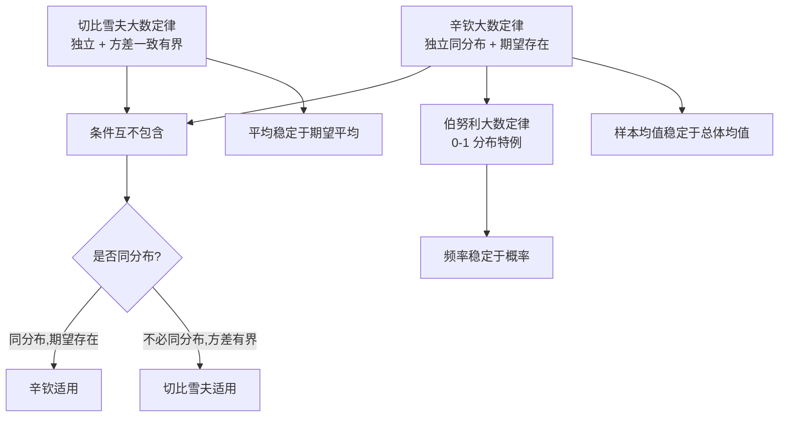

# 5.2 大数定律

> [!info] 本节定位
> 大数定律回答一个根本问题：**为什么"频率稳定于概率"是客观规律而非巧合？为什么可以用样本均值估计总体均值？** 它从数学上严格证明了：当试验次数 $n\to\infty$ 时，独立重复试验的平均结果（算术平均）依概率收敛于其期望。这是 [[MOC - 第7章]]（参数估计）中"用样本矩估计总体矩"的理论依据，也是 [[6.1 总体、样本、统计量]] 中"用 $\bar X$ 估计 $\mu$"的合法性来源。

## 5.2.1 依概率收敛

> [!definition] 依概率收敛
> 设 $\{X_n\}$ 是随机变量序列，$X$ 是随机变量（或常数 $a$）。若对任意 $\epsilon>0$，
> $$\lim_{n\to\infty}P\{|X_n-X|\geq \epsilon\}=0,$$
> 等价地 $\lim_{n\to\infty}P\{|X_n-X|<\epsilon\}=1$，则称 $\{X_n\}$ **依概率收敛于 $X$**，记作
> $$X_n \xrightarrow{P} X.$$
> 当 $X$ 为常数 $a$ 时，记 $X_n \xrightarrow{P} a$。

> [!tip] 与高等数学中极限的对比
> - 数列极限 $x_n\to a$：$\forall\epsilon>0,\exists N,\forall n>N:|x_n-a|<\epsilon$（**必然**成立）。
> - 依概率收敛 $X_n\xrightarrow{P} a$：$\forall\epsilon>0,\lim_{n\to\infty}P\{|X_n-a|<\epsilon\}=1$（**以接近 1 的概率**成立，允许极小概率偏离）。
> 依概率收敛比数列极限弱：随机性使得"几乎一定接近"而非"必然接近"。

> [!warning] 易错点
> 依概率收敛要求"对**任意** $\epsilon>0$"都成立，不能只对某个 $\epsilon$ 成立。证明时要写明 $\forall\epsilon>0$。

## 5.2.2 切比雪夫大数定律

> [!theorem] 切比雪夫大数定律
> 设 $X_1,X_2,\ldots,X_n,\ldots$ 是**相互独立**的随机变量序列，且方差一致有界：存在常数 $C>0$，使 $D(X_i)\leq C$（$\forall i$）。记 $\mu_i=E(X_i)$。则对任意 $\epsilon>0$，
> $$\lim_{n\to\infty}P\left\{\left|\dfrac{1}{n}\sum_{i=1}^n X_i-\dfrac{1}{n}\sum_{i=1}^n \mu_i\right|<\epsilon\right\}=1,$$
> 即 $\dfrac{1}{n}\sum_{i=1}^n X_i-\dfrac{1}{n}\sum_{i=1}^n \mu_i \xrightarrow{P} 0$。

> [!proof]- 证明
> 令 $\bar X_n=\dfrac{1}{n}\sum_{i=1}^n X_i$。由独立性：
> $$E(\bar X_n)=\dfrac{1}{n}\sum_{i=1}^n \mu_i,\qquad D(\bar X_n)=\dfrac{1}{n^2}\sum_{i=1}^n D(X_i)\leq \dfrac{1}{n^2}\cdot nC=\dfrac{C}{n}.$$
> 由 [[5.1 切比雪夫不等式]]，对任意 $\epsilon>0$：
> $$P\left\{\left|\bar X_n-\dfrac{1}{n}\sum_{i=1}^n \mu_i\right|\geq \epsilon\right\}\leq \dfrac{D(\bar X_n)}{\epsilon^2}\leq \dfrac{C}{n\epsilon^2}\xrightarrow[n\to\infty]{}0.$$
> 故 $\bar X_n-\dfrac{1}{n}\sum \mu_i \xrightarrow{P} 0$。

> [!tip] 关键条件
> - **相互独立**（不需要同分布）；
> - **方差一致有界** $D(X_i)\leq C$（不要求方差相同，只要求有共同上界）。

## 5.2.3 辛钦大数定律

> [!theorem] 辛钦大数定律
> 设 $X_1,X_2,\ldots,X_n,\ldots$ 是**独立同分布**的随机变量序列，且期望 $E(X_i)=\mu$ 存在（**不要求方差存在**）。则对任意 $\epsilon>0$，
> $$\lim_{n\to\infty}P\left\{\left|\dfrac{1}{n}\sum_{i=1}^n X_i-\mu\right|<\epsilon\right\}=1,$$
> 即 $\dfrac{1}{n}\sum_{i=1}^n X_i \xrightarrow{P} \mu$。

> [!note] 与切比雪夫大数定律对比
> - 辛钦要求**同分布**，但**不要求方差存在**；
> - 切比雪夫不要求同分布，但要求**方差一致有界**。
> 工程上常遇到"独立同分布但方差可能无穷"的情形（如重尾分布），此时只能用辛钦。

> [!warning] 易错点
> 辛钦大数定律**不要求方差存在**。考试常见陷阱：题目说"独立同分布期望存在"用辛钦；题目说"独立方差有界"用切比雪夫。二者条件互不包含。

## 5.2.4 伯努利大数定律

> [!theorem] 伯努利大数定律
> 设 $n_A$ 为 $n$ 次独立重复试验中事件 $A$ 发生的次数，$p=P(A)$ 为每次试验中 $A$ 发生的概率（$0<p<1$）。则对任意 $\epsilon>0$，
> $$\lim_{n\to\infty}P\left\{\left|\dfrac{n_A}{n}-p\right|<\epsilon\right\}=1,$$
> 即频率 $\dfrac{n_A}{n}\xrightarrow{P} p$。

> [!proof]- 证明（视为辛钦大数定律的特例）
> 引入指示变量 $X_i=\mathbb{1}_{\{第 i 次试验 A 发生\}}$（$i=1,2,\ldots$），则 $X_i$ 独立同分布，取值 $1$（概率 $p$）或 $0$（概率 $1-p$），$E(X_i)=p$。
> 由 $n_A=\sum_{i=1}^n X_i$，应用辛钦大数定律：
> $$\dfrac{n_A}{n}=\dfrac{1}{n}\sum_{i=1}^n X_i \xrightarrow{P} E(X_1)=p.$$

> [!tip] 意义
> 伯努利大数定律是**频率稳定于概率**的严格数学表述。它说明：当重复试验次数足够多时，事件 $A$ 的频率会以接近 1 的概率任意接近其概率 $p$。这正是 [[1.3 概率定义、性质]] 中"概率的统计定义"的合理性的数学依据。

## 5.2.5 三大数定律的关系

| 定律 | 独立性 | 同分布 | 期望 | 方差 | 结论 |
| ---- | ---- | ---- | ---- | ---- | ---- |
| 切比雪夫 | 是 | 否 | 各自存在 | 一致有界 | $\bar X_n-\bar\mu_n\xrightarrow{P}0$ |
| 辛钦 | 是 | 是 | 存在 | 不要求 | $\bar X_n\xrightarrow{P}\mu$ |
| 伯努利 | 是 | 是（0-1） | $p$ | $p(1-p)$ | $n_A/n\xrightarrow{P}p$ |

> [!tip] 选择定律的判断流程
> 1. 是否 0-1 分布频率问题？→ 伯努利。
> 2. 是否独立同分布且只知期望？→ 辛钦。
> 3. 是否独立但不同分布、方差有界？→ 切比雪夫。
> 4. 是否独立同分布且方差存在？→ 辛钦、切比雪夫均可，结论相同。

## 5.2.6 大数定律的意义

> [!example] 例题 5.2.1（判断定律适用性）
> 判断下列情况下用哪个大数定律，并写出结论：
> （1）$X_i$ 独立，$X_i\sim U(0,i)$；是否 $\bar X_n\xrightarrow{P}$ 某值？
> （2）$X_i$ 独立同分布，密度 $f(x)=\dfrac{1}{\pi(1+x^2)}$（标准柯西分布）；是否 $\bar X_n\xrightarrow{P}$ 某值？
>
> **解答**
> （1）$E(X_i)=i/2$，$D(X_i)=i^2/12$，方差无一致上界，切比雪夫不直接适用；不同分布，辛钦不适用。需更高阶条件才能判断（标准课程范围内不保证收敛）。
> （2）柯西分布期望不存在，辛钦不适用；事实上柯西分布的 $\bar X_n$ 仍服从柯西分布，**不收敛**于常数。
>
> 这两例说明大数定律的条件不可随意放宽。

> [!example] 例题 5.2.2（伯努利大数定律应用）
> 掷一枚硬币出现正面的概率 $p=0.5$。用切比雪夫不等式估计 $n$ 至少多大，才能保证 $P\left\{\left|\dfrac{n_A}{n}-0.5\right|<0.01\right\}\geq 0.95$？
>
> **解答** 令 $\bar X_n=n_A/n$，则 $E(\bar X_n)=0.5$，$D(\bar X_n)=\dfrac{0.5\times 0.5}{n}=\dfrac{0.25}{n}$。
> 由切比雪夫不等式（等价形式）：
> $$P\{|\bar X_n-0.5|<0.01\}\geq 1-\dfrac{0.25/n}{0.01^2}=1-\dfrac{2500}{n}.$$
> 要求 $\geq 0.95$，即 $1-\dfrac{2500}{n}\geq 0.95$，解得 $n\geq \dfrac{2500}{0.05}=50000$。
> 故 $n$ 至少为 $50000$（注：切比雪夫上界保守，实际所需 $n$ 远小）。

## 小结

- 依概率收敛 $X_n\xrightarrow{P}a$：$\forall\epsilon>0,\lim P\{|X_n-a|<\epsilon\}=1$。
- 三个大数定律各有适用条件：切比雪夫（独立+方差有界）、辛钦（独立同分布+期望存在）、伯努利（0-1 频率）。
- 大数定律是统计推断的合理性依据：频率$\to$概率、样本均值$\to$总体均值。
- 证明切比雪夫大数定律的核心是 [[5.1 切比雪夫不等式]] 与 $D(\bar X_n)=\sigma^2/n$。

## 关联

- 上游：[[5.1 切比雪夫不等式]]（证明工具）、[[4.1 数学期望定义与性质]]、[[1.3 概率定义、性质]]（统计定义的合理性）
- 下游：[[5.3 独立同分布中心极限定理]]（更强的收敛结论）、[[6.1 总体、样本、统计量]]（样本均值估计）、[[7.3 估计量评价标准]]（一致性）
- 章导航：[[MOC - 第5章]]
