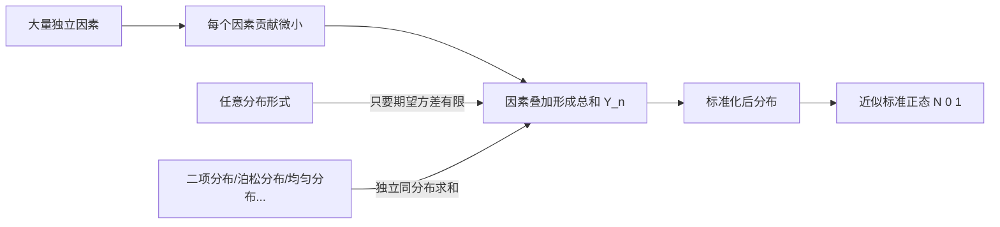

# 5.3 独立同分布中心极限定理

> [!info] 本节定位
> 大数定律只告诉我们"样本均值趋于期望"，但**没说以多快的速度、以什么分布波动**。中心极限定理（Central Limit Theorem, CLT）进一步刻画：**大量独立同分布随机变量之和（标准化后）的分布趋于标准正态分布**。这是正态分布之所以"无处不在"的数学根源，也是 [[6.4 正态总体统计量分布]]、[[7.1 矩估计]]、[[8.3 正态总体均值假设检验（Z检验、t检验）]] 等统计推断方法以正态分布为核心的理论支撑。

## 5.3.1 定理表述

> [!theorem] 独立同分布中心极限定理（林德伯格-列维定理）
> 设 $X_1,X_2,\ldots,X_n,\ldots$ 是**独立同分布**的随机变量序列，且期望 $E(X_i)=\mu$、方差 $D(X_i)=\sigma^2\in(0,+\infty)$ 都存在。记 $Y_n=\sum_{i=1}^n X_i$。则对任意实数 $x$，
> $$\boxed{\,\lim_{n\to\infty}P\left\{\dfrac{Y_n-n\mu}{\sqrt n\,\sigma}\leq x\right\}=\Phi(x)\,}$$
> 其中 $\Phi(x)=\dfrac{1}{\sqrt{2\pi}}\int_{-\infty}^{x}e^{-t^2/2}\,\mathrm dt$ 是标准正态分布函数。

> [!tip] 几点说明
> 1. **标准化量**：$\dfrac{\sum X_i-n\mu}{\sqrt n\,\sigma}$ 的分子是"和减去和的期望"，分母是"和的标准差"。标准化后均值为 $0$、方差为 $1$。
> 2. **均值形式**：等价地，$\dfrac{\bar X_n-\mu}{\sigma/\sqrt n}\xrightarrow{d}N(0,1)$，其中 $\bar X_n=\dfrac{1}{n}\sum X_i$。这是统计推断中**最常用**的形式。
> 3. **依分布收敛**：CLT 给出的是"分布函数收敛"，比 [[5.2 大数定律]]的依概率收敛更强——不仅给位置，还给分布形状。
> 4. **实用近似**：当 $n$ 较大（一般 $n\geq 30$）时即可用正态近似。

## 5.3.2 意义：正态分布的普遍性

> [!tip] 实际意义
> 现实中很多随机现象（测量误差、身高、考试成绩）是大量独立微小因素叠加的结果，因此近似服从正态分布。CLT 为这一经验事实提供了理论解释，也使正态分布成为统计推断的"默认工具"。

## 5.3.3 应用步骤

> [!example] 应用模板
> 用 CLT 近似计算 $P\{a<\sum X_i\leq b\}$ 的步骤：
> 1. **识别 i.i.d.** 确认 $X_i$ 独立同分布，求出 $\mu=E(X_i)$、$\sigma^2=D(X_i)$。
> 2. **构造和** 令 $Y_n=\sum_{i=1}^n X_i$，则 $E(Y_n)=n\mu$，$D(Y_n)=n\sigma^2$。
> 3. **标准化** $\dfrac{Y_n-n\mu}{\sqrt n\,\sigma}\sim\approx N(0,1)$。
> 4. **改写概率** $P\{a<Y_n\leq b\}=P\left\{\dfrac{a-n\mu}{\sqrt n\,\sigma}<\dfrac{Y_n-n\mu}{\sqrt n\,\sigma}\leq \dfrac{b-n\mu}{\sqrt n\,\sigma}\right\}\approx \Phi\!\left(\dfrac{b-n\mu}{\sqrt n\,\sigma}\right)-\Phi\!\left(\dfrac{a-n\mu}{\sqrt n\,\sigma}\right)$。
> 5. **查表** 用标准正态分布表得数值结果。

## 5.3.4 典型例题

> [!example] 例题 5.3.1（计算总和概率）
> 某影院售票处每张票售价 10 元，每天有 $X_i\sim U(0,100)$（元，简化模型）的独立营业收入，共 50 个独立窗口。求当日总收入超过 2700 元的近似概率。
>
> **思路** 50 个 $U(0,100)$ 独立同分布求和，用 CLT。
>
> **解答** 对 $X_i\sim U(0,100)$：$\mu=\dfrac{0+100}{2}=50$，$\sigma^2=\dfrac{(100-0)^2}{12}=\dfrac{10000}{12}=\dfrac{2500}{3}$。
> 总收入 $Y_{50}=\sum_{i=1}^{50}X_i$，$E(Y_{50})=50\times 50=2500$，$D(Y_{50})=50\times \dfrac{2500}{3}=\dfrac{125000}{3}$，$\sqrt{D(Y_{50})}=\sqrt{\dfrac{125000}{3}}\approx 204.12$。
> $$P\{Y_{50}>2700\}=P\left\{\dfrac{Y_{50}-2500}{204.12}>\dfrac{2700-2500}{204.12}\right\}\approx 1-\Phi(0.980)\approx 1-0.8365=0.1635.$$

> [!example] 例题 5.3.2（均值形式）
> 设 $X_i$ 独立同分布，$E(X_i)=3$，$D(X_i)=4$。求 $P\{\bar X_{100}>3.5\}$ 的近似值。
>
> **解答** $\bar X_{100}\sim\approx N\left(3,\dfrac{4}{100}\right)=N(3,0.04)$，标准差 $0.2$。
> $$P\{\bar X_{100}>3.5\}=P\left\{\dfrac{\bar X_{100}-3}{0.2}>\dfrac{3.5-3}{0.2}\right\}=1-\Phi(2.5)\approx 1-0.9938=0.0062.$$

> [!example] 例题 5.3.3（确定样本量）
> 设 $X_i$ 独立同分布，$E(X_i)=\mu$，$D(X_i)=25$。要使 $P\{|\bar X_n-\mu|<1\}\geq 0.95$，求 $n$ 的最小值。
>
> **解答** 由 CLT，$\dfrac{\bar X_n-\mu}{5/\sqrt n}\sim\approx N(0,1)$。
> $$P\{|\bar X_n-\mu|<1\}=P\left\{\left|\dfrac{\bar X_n-\mu}{5/\sqrt n}\right|<\dfrac{\sqrt n}{5}\right\}\approx 2\Phi\!\left(\dfrac{\sqrt n}{5}\right)-1.$$
> 要求 $\geq 0.95$，即 $\Phi\!\left(\dfrac{\sqrt n}{5}\right)\geq 0.975$，查表 $\dfrac{\sqrt n}{5}\geq 1.96$，$\sqrt n\geq 9.8$，$n\geq 96.04$，取 $n\geq 97$。

> [!warning] 易错点
> 1. 区分"和"与"均值"：用 $\sqrt n\sigma$（和）还是 $\sigma/\sqrt n$（均值）作分母。
> 2. $P\{Y_n\leq b\}$ 用 $\Phi$；$P\{Y_n>a\}$ 用 $1-\Phi$。
> 3. CLT 是**近似**，需 $n$ 足够大；不要在 $n<30$ 时滥用。
> 4. $X_i$ 必须独立同分布且方差有限；柯西分布等方差不存在时不能用。

## 小结

- CLT：$\dfrac{\sum X_i-n\mu}{\sqrt n\,\sigma}\xrightarrow{d}N(0,1)$，等价 $\dfrac{\bar X_n-\mu}{\sigma/\sqrt n}\xrightarrow{d}N(0,1)$。
- 意义：大量独立因素叠加近似正态，正态分布普遍性的数学根源。
- 应用流程：识别 i.i.d. → 求 $\mu,\sigma^2$ → 标准化 → 查正态表。
- 与大数定律对比：大数定律给"位置"，CLT 同时给"位置 + 形状"。

## 关联

- 上游：[[5.2 大数定律]]（依概率收敛是依分布收敛的特例）、[[2.5 常见分布：0-1、二项、泊松、均匀、指数、正态]]（正态分布定义）
- 下游：[[5.4 棣莫弗-拉普拉斯定理]]（CLT 在二项分布的特例）、[[6.4 正态总体统计量分布]]、[[7.1 矩估计]]、[[8.3 正态总体均值假设检验（Z检验、t检验）]]
- 章导航：[[MOC - 第5章]]
