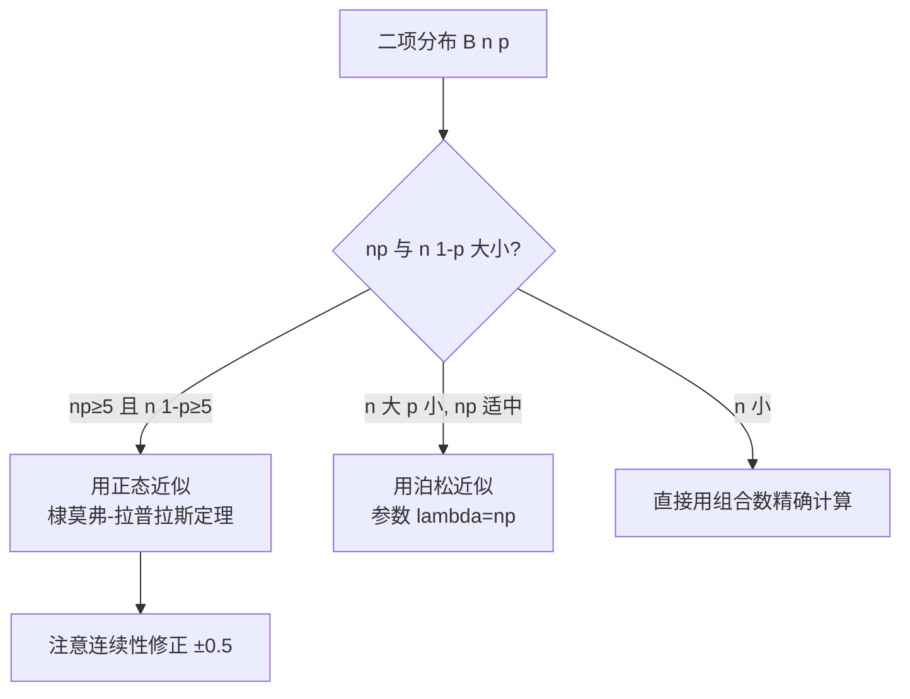

# 5.4 棣莫弗-拉普拉斯定理

> [!info] 本节定位
> 棣莫弗-拉普拉斯定理是 [[5.3 独立同分布中心极限定理]] 在**二项分布情形的特例**，给出二项分布的正态近似方法。它解决的问题是：当 $n$ 很大时，二项分布 $B(n,p)$ 的精确计算（组合数 $C_n^k$）极其繁琐，能否用正态分布近似？答案是肯定的，且近似效果在 $np$ 与 $n(1-p)$ 都不太小时很好。这是历史上**最早**的中心极限定理（棣莫弗 1733 年发现，拉普拉斯 1812 年推广），比一般 CLT 早一个多世纪。

## 5.4.1 定理表述

> [!theorem] 棣莫弗-拉普拉斯定理
> 设 $Y_n\sim B(n,p)$（$n$ 次独立伯努利试验中成功的次数，$0<p<1$）。则对任意实数 $x$，
> $$\boxed{\,\lim_{n\to\infty}P\left\{\dfrac{Y_n-np}{\sqrt{np(1-p)}}\leq x\right\}=\Phi(x)\,}$$
> 其中 $\Phi(x)$ 为标准正态分布函数。等价地，$Y_n\sim\approx N\big(np,\,np(1-p)\big)$。

> [!proof]- 证明（作为 CLT 的特例）
> 令 $X_i=\mathbb{1}_{\{第 i 次成功\}}$，则 $X_i$ 独立同分布，$X_i\sim B(1,p)$，$E(X_i)=p$，$D(X_i)=p(1-p)$。
> 由 $Y_n=\sum_{i=1}^n X_i$ 及 [[5.3 独立同分布中心极限定理]]：
> $$\dfrac{Y_n-np}{\sqrt{n\,p(1-p)}}=\dfrac{\sum X_i-np}{\sqrt n\,\sqrt{p(1-p)}}\xrightarrow{d}N(0,1).$$

> [!tip] 关键参数
> - 二项分布 $B(n,p)$：$E(Y_n)=np$，$D(Y_n)=np(1-p)=npq$（记 $q=1-p$）。
> - 标准化：$\dfrac{Y_n-np}{\sqrt{npq}}\sim\approx N(0,1)$。
> - 近似式：$Y_n\sim\approx N(np,npq)$。

## 5.4.2 正态近似的适用条件

> [!warning] 何时用正态近似
> 二项分布 $B(n,p)$ 可用正态近似当且仅当 **$np\geq 5$ 且 $n(1-p)\geq 5$**（部分教材用 $\geq 10$ 更严格）。
> - 直观理解：要求均值与"反均值"都不太小，分布近似对称、接近正态形状。
> - 当 $p$ 接近 $0$ 或 $1$ 时分布严重偏斜，正态近似失真。

## 5.4.3 连续性修正

> [!definition] 连续性修正
> 二项分布是**离散型**（取整数），正态分布是**连续型**。用连续分布近似离散分布时，每个整数点 $k$ 对应区间 $[k-0.5,k+0.5]$，故概率计算时对端点做 $\pm 0.5$ 修正：
> $$P\{Y_n\leq k\}\approx \Phi\!\left(\dfrac{k+0.5-np}{\sqrt{npq}}\right),$$
> $$P\{Y_n\geq k\}\approx 1-\Phi\!\left(\dfrac{k-0.5-np}{\sqrt{npq}}\right),$$
> $$P\{a\leq Y_n\leq b\}\approx \Phi\!\left(\dfrac{b+0.5-np}{\sqrt{npq}}\right)-\Phi\!\left(\dfrac{a-0.5-np}{\sqrt{npq}}\right).$$

> [!warning] 连续性修正是必考易错点
> - 用正态近似二项分布**必须做 $\pm 0.5$ 修正**，否则误差显著。
> - 修正方向：上端 $+0.5$，下端 $-0.5$（区间端点向外扩 $0.5$）。
> - 严格不等号 $P\{Y_n<k\}$ 等价于 $P\{Y_n\leq k-1\}$，端点要相应调整。

## 5.4.4 典型例题

> [!example] 例题 5.4.1（区间概率）
> 掷一枚均匀硬币 100 次，求正面次数在 40 到 60 之间（含端点）的概率。
>
> **解答** $Y\sim B(100,0.5)$，$np=50$，$npq=100\times 0.5\times 0.5=25$，$\sqrt{npq}=5$。
> 满足 $np=50\geq 5$，$n(1-p)=50\geq 5$，用正态近似并做连续性修正：
> $$P\{40\leq Y\leq 60\}\approx \Phi\!\left(\dfrac{60+0.5-50}{5}\right)-\Phi\!\left(\dfrac{40-0.5-50}{5}\right)=\Phi(2.1)-\Phi(-2.1)=2\Phi(2.1)-1.$$
> 查表 $\Phi(2.1)\approx 0.9821$，故结果 $\approx 2\times 0.9821-1=0.9642$。

> [!example] 例题 5.4.2（单边概率）
> 某工厂产品次品率 $p=0.1$。任取 100 件，求次品数超过 15 件的概率。
>
> **解答** $Y\sim B(100,0.1)$，$np=10$，$npq=100\times 0.1\times 0.9=9$，$\sqrt{npq}=3$。
> $np=10\geq 5$，$n(1-p)=90\geq 5$，用正态近似：
> $$P\{Y>15\}=P\{Y\geq 16\}\approx 1-\Phi\!\left(\dfrac{16-0.5-10}{3}\right)=1-\Phi\!\left(\dfrac{5.5}{3}\right)=1-\Phi(1.833).$$
> 查表 $\Phi(1.83)\approx 0.9664$，结果 $\approx 1-0.9664=0.0336$。

> [!example] 例题 5.4.3（确定 $n$）
> 某次品率 $p=0.2$ 的产品，至少抽检多少件，才能保证次品数不少于 30 件的概率不低于 $0.9$？
>
> **解答** $Y\sim B(n,0.2)$，$np=0.2n$，$npq=0.16n$，$\sqrt{npq}=0.4\sqrt n$。
> 用正态近似：$P\{Y\geq 30\}\approx 1-\Phi\!\left(\dfrac{30-0.5-0.2n}{0.4\sqrt n}\right)\geq 0.9$。
> 即 $\Phi\!\left(\dfrac{29.5-0.2n}{0.4\sqrt n}\right)\leq 0.1$，故 $\dfrac{29.5-0.2n}{0.4\sqrt n}\leq -1.28$。
> 令 $t=\sqrt n$：$29.5-0.2t^2\leq -0.512t$，$0.2t^2-0.512t-29.5\geq 0$。
> 解得 $t\geq \dfrac{0.512+\sqrt{0.512^2+4\times 0.2\times 29.5}}{0.4}\approx \dfrac{0.512+\sqrt{23.86}}{0.4}\approx \dfrac{0.512+4.885}{0.4}\approx 13.49$。
> 故 $n\geq 13.49^2\approx 182.0$，取 $n\geq 183$。

## 5.4.5 与泊松近似的对比

| 近似方法 | 适用条件 | 参数 | 典型场景 |
| ---- | ---- | ---- | ---- |
| 正态近似（棣莫弗-拉普拉斯） | $np\geq 5$ 且 $n(1-p)\geq 5$ | $\mu=np,\sigma^2=npq$ | $n$ 大、$p$ 适中（如 $p\in[0.1,0.9]$） |
| 泊松近似 | $n\geq 20$，$p\leq 0.05$，$np\leq 10$（经验） | $\lambda=np$ | $n$ 大、$p$ 小（稀有事件） |

> [!tip] 选择口诀
> - **$n$ 大 $p$ 小用泊松**（稀有事件，分布右偏）；
> - **$n$ 大 $p$ 适中用正态**（对称分布）；
> - **$n$ 小直接算**（精确组合数）。
> 注意泊松近似是**离散近似离散**，无需连续性修正；正态近似是**连续近似离散**，必须连续性修正。

## 小结

- 棣莫弗-拉普拉斯定理：$Y_n\sim B(n,p)$ 时 $\dfrac{Y_n-np}{\sqrt{npq}}\xrightarrow{d}N(0,1)$，是 CLT 的二项分布特例。
- 适用条件：$np\geq 5$ 且 $n(1-p)\geq 5$。
- 连续性修正：上端 $+0.5$，下端 $-0.5$，**必考易错**。
- 与泊松近似互补：$p$ 适中用正态，$p$ 小用泊松。

## 关联

- 上游：[[5.3 独立同分布中心极限定理]]（一般理论）、[[2.5 常见分布：0-1、二项、泊松、均匀、指数、正态]]（二项分布定义）、[[5.2 大数定律]]（伯努利大数定律保证频率$\to$p）
- 下游：[[6.4 正态总体统计量分布]]、[[8.3 正态总体均值假设检验（Z检验、t检验）]]
- 平行：泊松近似（参见 [[2.5 常见分布：0-1、二项、泊松、均匀、指数、正态]]）
- 章导航：[[MOC - 第5章]]
